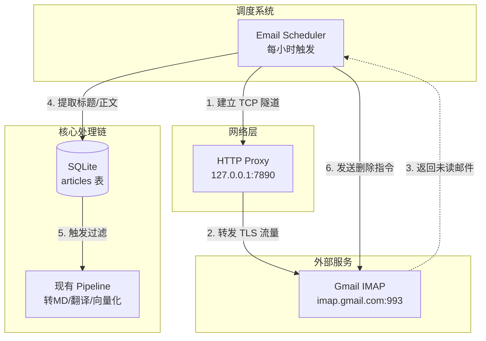

这是一份为您整理的**《LIS-RSS 系统扩展设计文档：Gmail 邮件收集与处理模块》**。文档综合了数据流、代理网络配置、凭证管理以及前端 UI 的完整设计方案。

---

# LIS-RSS 系统扩展设计文档：Gmail 邮件收集模块

## 1. 需求背景与目标

在现有的 RSS、期刊爬虫、关键词爬虫三种信息源基础上，增加**「Gmail 邮件」**作为第四种信息源。
核心业务目标：
1. **定向收集**：通过 IMAP 协议定时抓取 Gmail 中指定发件人（如特定期刊的 Newsletter）的未读邮件。
2. **代理支持**：由于网络环境限制，连接 Gmail 必须通过指定的 HTTP 代理（如 `http://127.0.0.1:7890`）。
3. **阅后即焚**：邮件成功解析并存入系统数据库后，**自动从 Gmail 中彻底删除原邮件**，保持邮箱整洁。
4. **无缝接入**：收集到的邮件内容直接进入现有的 LLM 过滤与处理流水线（转 Markdown → 翻译 → 向量化）。

---

## 2. 系统架构变更

在业务逻辑层新增 `EmailScheduler`，并在网络层增加代理隧道（Proxy Tunnel）。



---

## 3. 数据库设计

### 3.1 新增表 `email_sources`
用于存储用户的邮箱配置及监控规则。

```sql
CREATE TABLE email_sources (
  id INTEGER PRIMARY KEY AUTOINCREMENT,
  user_id INTEGER NOT NULL,
  email_address TEXT NOT NULL,      -- Gmail 账号
  imap_password_encrypted TEXT NOT NULL, -- AES 加密后的应用专用密码
  target_senders TEXT NOT NULL,     -- JSON 数组: ["alert@nature.com", "news@science.org"]
  status TEXT DEFAULT 'active' CHECK (status IN ('active', 'inactive')),
  last_fetched_at DATETIME,
  created_at DATETIME DEFAULT CURRENT_TIMESTAMP,
  FOREIGN KEY (user_id) REFERENCES users ON DELETE CASCADE
);
```

### 3.2 修改表 `articles`
适配邮件类型的数据源。
```sql
-- 1. 增加外键关联
ALTER TABLE articles ADD COLUMN email_source_id INTEGER REFERENCES email_sources(id) ON DELETE CASCADE;

-- 2. 扩展 source_origin 的枚举值
-- 将 CHECK 约束扩展为: CHECK (source_origin IN ('rss', 'journal', 'keyword', 'email'))

-- 3. 字段复用说明：
-- title: 邮件主题 (Subject)
-- url: 邮件的 Message-ID (用于全局防重)
-- content: 邮件的 HTML 正文 (Body)
```

---

## 4. 关键技术实现

### 4.1 凭证管理：应用专用密码 (App Passwords)
**坚决不使用 OAuth 2.0**，以降低开发和用户配置成本。
- **用户侧**：需在 Google 账号中开启两步验证（2FA），并生成一个 16 位的「应用专用密码」。
- **系统侧**：前端提交密码后，后端使用现有的 `utils/crypto.ts` 进行 AES-256 加密后存入数据库。

### 4.2 代理网络穿透 (HTTP Proxy for IMAP)
IMAP 是基于 TCP/TLS 的协议。要让 IMAP 流量走 HTTP 代理，必须使用 HTTP `CONNECT` 方法建立隧道。

**Node.js 代码实现思路**（使用 `http-proxy-agent` 或 `tls` 模块）：
```typescript
import { ImapFlow } from 'imapflow';
import { HttpProxyAgent } from 'http-proxy-agent';
import tls from 'tls';

// 1. 从环境变量读取代理配置
const proxyUrl = process.env.EMAIL_PROXY_URL || 'http://127.0.0.1:7890';

// 2. 建立代理隧道并初始化 IMAP 客户端
async function createProxiedImapClient(email, password) {
  const agent = new HttpProxyAgent(proxyUrl);
  
  return new ImapFlow({
    host: 'imap.gmail.com',
    port: 993,
    secure: true,
    auth: { user: email, pass: password },
    // 注入代理 Agent (具体视 imapflow 库支持的 socket 注入方式而定)
    // 如果 imapflow 不直接支持 agent，可通过 net.connect 经代理建立 socket 后传给 tls.connect
  });
}
```

### 4.3 核心处理流程 (安全删除机制)
**必须遵循“先落库，后删除”的事务原则**，防止数据丢失。

```typescript
for await (const msg of messages) {
  const parsedMail = await simpleParser(msg.source);
  
  try {
    // 1. 尝试落库
    const articleId = await db.articles.insert({
      email_source_id: source.id,
      title: parsedMail.subject,
      title_normalized: generateNormalizedTitle(parsedMail.subject),
      url: parsedMail.messageId, // Message-ID 防重
      content: parsedMail.html || parsedMail.text,
      source_origin: 'email'
    });

    // 2. 落库成功 -> 彻底删除邮件
    await client.messageFlagsAdd(msg.uid, ['\\Deleted']);
    
    // 3. 触发后续 LLM 过滤
    triggerAutoFilter(articleId);

  } catch (err) {
    if (err.code === 'SQLITE_CONSTRAINT_UNIQUE') {
      // 如果是重复邮件，也予以删除，防止堆积
      await client.messageFlagsAdd(msg.uid, ['\\Deleted']);
    } else {
      log.error('落库失败，保留原邮件', err);
    }
  }
}
// 提交删除操作
await client.mailboxClose(); 
```

### 4.4 兼容现有 Pipeline
邮件通常包含臃肿的 HTML（内联 CSS、表格）。这不需要额外开发：
现有的流水线 `Stage 1: Markdown 生成` 会自动调用 `toSimpleMarkdown(article.content)`，使用 Turndown.js 将臃肿的邮件 HTML 完美清洗为纯净的 Markdown，供后续 LLM 翻译和向量化使用。

---

## 5. 前端 UI 设计 (设置页面)

在 `views/settings.ejs` 中新增一个 Tab：**「📧 邮件订阅源」**。

### 5.1 界面布局
1. **源列表区**：展示已配置的 Gmail 账号、状态、上次同步时间。
2. **表单区**：用于添加/编辑邮件源。

### 5.2 表单字段设计

| 字段名 | UI 组件 | 提示/占位符 |
| :--- | :--- | :--- |
| **Gmail 账号** | Input (email) | `example@gmail.com` |
| **应用专用密码**| Input (password) | `16位字母，勿填登录密码` <br>*(附带超链接指向 Google 获取密码教程)* |
| **发件人白名单**| Textarea (多行) | `每行一个邮箱地址，如：`<br>`newsletter@nature.com`<br>`alert@scholar.google.com` |
| **状态** | Toggle Switch | `启用` / `停用` |

### 5.3 关键交互：测试连接 (Test Connection)
- **目的**：防止用户填错密码或代理不通导致后台任务静默失败。
- **逻辑**：在「保存」按钮旁增加「🔌 测试连接」按钮。点击后，前端请求 `/api/email-sources/test`，后端通过代理尝试登录 Gmail。
- **UI 反馈**：成功则显示绿色 Check 标记，失败则弹窗提示具体原因（如网络超时、密码错误）。
- **风险提示**：在表单底部用红色字体标明：⚠️ **警告：系统抓取邮件后将自动从 Gmail 中永久删除原邮件，请确保发件人白名单仅包含通知类邮件！**

---

## 6. 环境与部署配置

需要在系统的 `.env` 文件中新增代理相关的环境变量：

```bash
# --- 新增: 邮件抓取网络代理配置 ---
# 必须配置 HTTP 代理以访问 Gmail IMAP 服务器
EMAIL_PROXY_URL=http://127.0.0.1:7890

# (可选) 邮件抓取并发数
EMAIL_FETCH_CONCURRENT=2
```

## 7. 总结

本设计方案以**最小侵入性**为原则：
1. **鉴权极简**：规避 OAuth，使用 App Password。
2. **网络稳健**：在系统底层注入 HTTP Proxy 隧道解决连通性问题。
3. **逻辑复用**：完全复用现有的 HTML 转 Markdown、LLM 过滤、向量化流水线。
4. **数据安全**：严格执行“落库成功再触发 IMAP `\Deleted`”的逻辑，确保邮件不丢失、不重复、不堆积。