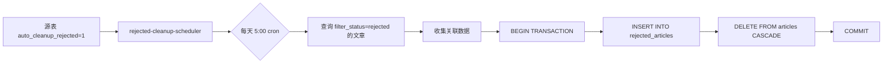

# 08 · 自动清理拒绝文章子系统 Handoff

> 本文档于 **2026-07-14** 基于实际源代码逐文件阅读编写，所有结论均带 `文件:行号` 引用。
> 始于 `docs/handoffs/08-rejected-cleanup.md` 规划方案，现已完成实现。

---

## 1. 背景与目标

**现状**：系统有 4 类来源（RSS/期刊/关键词/Gmail），大量文章被 LLM 过滤拒绝（`filter_status='rejected'`），但**永久保留在 `articles` 表中**。随着时间推移，`articles` 表膨胀，查询性能下降，而 rejected 文章在前端默认已被排除（`excludeRejected: true`），保留在正式表中仅有数据冗余的负面效果。

**目标**（全部完成）：
1. ✅ 为每个源新增 `auto_cleanup_rejected` 开关字段，默认关闭（opt-in）
2. ✅ 定时调度器将标记源下的 rejected 文章**从 `articles` 表迁移到 `rejected_articles` 归档表**，附带关联数据（过滤日志、翻译、处理日志、相关文章）
3. ✅ 保持 `articles` 表轻量，保障查询性能
4. ✅ 被拒数据不丢失，可后续在归档表中查询

---

## 2. 数据流



详细流程：

```
[源表 auto_cleanup_rejected = 1]
    │
    ▼
[rejected-cleanup-scheduler]  ← cron 每天 5:00 (config.rejectedCleanupSchedule)
    │
    │  1. collectEnabledSources() — 4 类源表 UNION ALL 查询 auto_cleanup_rejected=1
    │  2. 对每个源：
    │     a. SELECT articles WHERE filter_status='rejected' AND 来源外键 = ?
    │     b. 对每篇文章，收集关联数据：
    │        - article_filter_logs → JSON.stringify
    │        - article_translations → JSON.stringify
    │        - article_process_logs → JSON.stringify
    │        - article_related → JSON.stringify
    │     c. db.transaction():
    │        - INSERT INTO rejected_articles (全部字段 + JSON 关联数据 + source_name)
    │        - DELETE FROM articles WHERE id = ?  (ON DELETE CASCADE 清除关联表)
    │     d. 统计日志
    ▼
[rejected_articles archive]
```

---

## 3. 数据库结构

### 3.1 四张源表 `auto_cleanup_rejected` 字段

已在 `sql/001_init.sql` 和 `sql/038_add_auto_cleanup_rejected.sql` 两处定义，迁移脚本会判断字段已存在时跳过。

```sql
-- 每张表定义相同
auto_cleanup_rejected INTEGER NOT NULL DEFAULT 0

-- 索引
CREATE INDEX IF NOT EXISTS idx_rss_sources_auto_cleanup ON rss_sources(auto_cleanup_rejected);
CREATE INDEX IF NOT EXISTS idx_journals_auto_cleanup ON journals(auto_cleanup_rejected);
CREATE INDEX IF NOT EXISTS idx_keyword_subscriptions_auto_cleanup ON keyword_subscriptions(auto_cleanup_rejected);
CREATE INDEX IF NOT EXISTS idx_email_sources_auto_cleanup ON email_sources(auto_cleanup_rejected);
```

### 3.2 `rejected_articles` 归档表

```sql
CREATE TABLE IF NOT EXISTS rejected_articles (
  -- articles 表全部字段（一一对应）
  id INTEGER PRIMARY KEY,           -- 原 articles.id，非自增
  rss_source_id INTEGER,
  journal_id INTEGER,
  keyword_id INTEGER,
  email_source_id INTEGER,
  title TEXT NOT NULL,
  title_normalized TEXT,
  url TEXT NOT NULL,
  summary TEXT,
  content TEXT,
  markdown_content TEXT,
  filter_status TEXT,
  filter_score REAL,
  filtered_at TEXT,
  process_status TEXT,
  process_stages TEXT,
  processed_at TEXT,
  published_at TEXT,
  published_year INTEGER,
  published_issue INTEGER,
  published_volume INTEGER,
  error_message TEXT,
  is_read INTEGER,
  source_origin TEXT,
  rating INTEGER,
  ai_summary TEXT,
  created_at TEXT,
  updated_at TEXT,
  -- 关联数据归档（JSON 格式）
  filter_logs_data TEXT,             -- article_filter_logs JSON 数组
  translation_data TEXT,             -- article_translations JSON 对象
  process_logs_data TEXT,            -- article_process_logs JSON 数组
  related_data TEXT,                 -- article_related JSON 数组
  -- 来源标识
  source_name TEXT,                  -- 来源名称（RSS 源名称/期刊名/关键词）
  moved_at TEXT DEFAULT (datetime('now', 'localtime'))
);

CREATE INDEX idx_rejected_articles_source_origin ON rejected_articles(source_origin);
CREATE INDEX idx_rejected_articles_moved_at ON rejected_articles(moved_at);
CREATE INDEX idx_rejected_articles_rss_source_id ON rejected_articles(rss_source_id);
CREATE INDEX idx_rejected_articles_journal_id ON rejected_articles(journal_id);
CREATE INDEX idx_rejected_articles_keyword_id ON rejected_articles(keyword_id);
CREATE INDEX idx_rejected_articles_email_source_id ON rejected_articles(email_source_id);
```

---

## 4. 配置项 `src/config.ts:56-58`

```typescript
// 新增配置项
rejectedCleanupEnabled: boolean;       // 默认 true（可通过 REJECTED_CLEANUP_ENABLED=false 关闭）
rejectedCleanupSchedule: string;       // 默认 '0 5 * * *'（每天 5:00 Asia/Shanghai）
```

环境变量：
- `REJECTED_CLEANUP_ENABLED` — 设为 `false` 禁用调度器
- `REJECTED_CLEANUP_SCHEDULE` — cron 表达式，默认每天 5:00

---

## 5. 调度器 `src/rejected-cleanup-scheduler.ts`

### 5.1 类结构

```typescript
// 文件: src/rejected-cleanup-scheduler.ts:41-58
export class RejectedCleanupScheduler {
  private static instance: RejectedCleanupScheduler | null = null;
  private scheduledTask: cron.ScheduledTask | null = null;
  private isRunning = false;

  static getInstance(): RejectedCleanupScheduler;   // 单例
  start(): void;                                      // 启动 cron
  stop(): Promise<void>;                              // 停止
  cleanupNow(): Promise<CleanupResult>;               // 手动触发
}
```

### 5.2 核心方法

| 方法 | 可见性 | 功能 | 位置 |
|------|--------|------|------|
| `collectEnabledSources()` | private | 收集 4 类源表中 `auto_cleanup_rejected=1` 的活跃源 | L:151-190 |
| `cleanupSource(source)` | private | 对单个源执行迁移：查询 → 收集关联数据 → 事务迁移 | L:196-303 |
| `getSourceColumn(type)` | private | 源类型 → articles 表中外键列名映射 | L:309-321 |

### 5.3 手动触发

`cleanupNow()` 方法暴露为公有方法，可直接调用：

```typescript
// 示例：通过代码手动触发
const scheduler = initRejectedCleanupScheduler();
const result = await scheduler.cleanupNow();
console.log(result);
// { totalSources, totalArticlesMoved, successCount, failedCount, sourceResults[], durationMs }
```

> ⚠️ **当前无 HTTP API 端点**：`cleanupNow()` 仅在代码级别可用，未暴露为 REST API。如需从前端或外部触发，需添加路由（如 `POST /api/scheduler/rejected-cleanup/trigger`）。

### 5.4 注册与生命周期 `src/index.ts`

- **启动**（L:125-131）：在 RSS / 期刊 / 关键词 / Gmail 调度器之后，Telegram Bot 之前注册
- **关闭**（L:155-157）：在 Gmail 调度器之后停止
- 受 `config.rejectedCleanupEnabled` 全局开关控制

---

## 6. 类型定义 `src/db.ts`

### 6.1 四张源表接口各加一个字段

| 接口 | 新增字段 | 位置 |
|------|---------|------|
| `RssSourcesTable` | `auto_cleanup_rejected: number` | L:28 |
| `JournalsTable` | `auto_cleanup_rejected: number` | L:92 |
| `KeywordSubscriptionsTable` | `auto_cleanup_rejected: number` | L:121 |
| `EmailSourcesTable` | `auto_cleanup_rejected: number` | L:139 |

### 6.2 新增 `RejectedArticlesTable` 接口

位置：`src/db.ts:149-185`

与 `ArticlesTable` 一一对应，但所有字段均非 `Generated`（因为 ID 从原文章复制），外加 5 个归档字段：
- `filter_logs_data` — `article_filter_logs` JSON 数组
- `translation_data` — `article_translations` JSON 对象
- `process_logs_data` — `article_process_logs` JSON 数组
- `related_data` — `article_related` JSON 数组
- `source_name` — 来源名称
- `moved_at` — 迁移时间戳

已注册到 `DatabaseTable` 接口（L:117）和 `RejectedArticlesSelection` 类型（L:251）。

---

## 7. API 层变更

### 7.1 服务层接口

四个源服务文件的 `Create*Input` / `Update*Input` 接口均新增 `autoCleanupRejected?: boolean`：

| 文件 | 位置 |
|------|------|
| `src/api/rss-sources.ts` | L:20, L:31 |
| `src/api/journals.ts` | L:42, L:55 |
| `src/api/keywords.ts` | L:17, L:26 |
| `src/api/gmail-sources.ts` | L:11, L:19 |

### 7.2 路由层

四个路由文件均已解析 `autoCleanupRejected` 并传递给服务层：

| 路由文件 | Create | Update |
|----------|--------|--------|
| `src/api/routes/rss-sources.routes.ts` | ✓ | ✓ |
| `src/api/routes/journals.routes.ts` | ✓ | ✓ |
| `src/api/routes/keywords.routes.ts` | ✓ | ✓ |
| `src/api/routes/gmail-sources.routes.ts` | ✓ | ✓ |

### 7.3 请求体格式

```typescript
// POST（创建）/ PUT（更新）
{
  // ... 原有字段
  autoCleanupRejected?: boolean;   // 前端传 boolean，后端转 integer(1/0)
}
```

---

## 8. 前端 UI

### 8.1 模态框复选框

四类源的编辑弹窗均新增「自动清理拒绝文章」复选框，默认关闭，附说明文字：

| 源类型 | 文件 | 复选框 ID |
|--------|------|-----------|
| RSS 订阅源 | `src/views/settings/modals.ejs` | `sourceAutoCleanup` |
| 期刊管理 | `src/views/settings/modals.ejs` | `journalAutoCleanup` |
| 关键词订阅 | `src/views/settings/modals.ejs` | `keywordAutoCleanup` |
| 邮件订阅源 | `src/views/settings/panel-gmail.ejs` | `gmailAutoCleanup` |

### 8.2 JavaScript 处理 `src/public/js/settings.js`

四个源类型的添加/编辑/保存逻辑全部更新：

| 操作 | 函数 | 变更 |
|------|------|------|
| RSS 添加 | `showAddModal()` | 重置 checkbox 为 false |
| RSS 编辑 | `editSource()` | 从 `source.auto_cleanup_rejected` 回显 |
| RSS 保存 | `sourceForm submit` | 包含 `autoCleanupRejected` |
| 期刊添加 | `showJournalAddModal()` | 重置 checkbox 为 false |
| 期刊编辑 | `editJournal()` | 从 `journal.auto_cleanup_rejected` 回显 |
| 期刊保存 | `journalForm submit` | 包含 `autoCleanupRejected` |
| 关键词添加 | `showKeywordAddModal()` | 重置 checkbox 为 false |
| 关键词编辑 | `showKeywordEditModal()` | 从 `keyword.auto_cleanup_rejected` 回显 |
| 关键词保存 | `saveKeyword()` | 包含 `autoCleanupRejected` |
| 邮件添加 | `showGmailAddModal()` | 重置 checkbox 为 false |
| 邮件编辑 | `editGmailSource()` | 从 `source.auto_cleanup_rejected` 回显 |
| 邮件保存 | `saveGmailSource()` | 包含 `autoCleanupRejected` |

---

## 9. 迁移脚本 `scripts/migrate.ts`

038 迁移分支（L:463-476）在 `migrate.ts` 中已添加：

```typescript
// ============================================================
// 038: 添加自动清理拒绝文章的字段和归档表
// ============================================================
if (file === '038_add_auto_cleanup_rejected.sql') {
  const hasAutoCleanup = hasColumn(db, 'rss_sources', 'auto_cleanup_rejected');
  if (!hasAutoCleanup) {
    const sql = fs.readFileSync(fullPath, 'utf-8');
    db.exec(sql);
    console.log('      → Added auto_cleanup_rejected to rss_sources, ...');
    console.log('      → Created rejected_articles archive table');
  } else {
    console.log('      → Skipped (auto_cleanup_rejected already exists)');
  }
  continue;
}
```

---

## 10. 验证要点

| 验证项 | 状态 | 方法 |
|--------|------|------|
| 新表创建 | ✅ 已验证 | `pnpm run db:migrate` 后 `rejected_articles` 表存在 |
| 字段添加 | ✅ 已验证 | 4 张源表均有 `auto_cleanup_rejected` 列，默认值 0 |
| 调度器启动 | ✅ 代码就绪 | 启动日志显示 `🗑️ Rejected article cleanup scheduler started` |
| 手动触发 | ✅ 代码就绪 | 调用 `initRejectedCleanupScheduler().cleanupNow()` |
| 关联数据完整性 | ⏳ 未验证 | 需手动测试确认 JSON 字段包含正确数据 |
| 级联删除 | ✅ 由 FK CASCADE 保证 | DELETE FROM articles 自动清除关联表 |
| 前端 UI 开关 | ✅ 已实现 | 四类源编辑弹窗均有复选框 |
| 迁移脚本 | ✅ 已验证 | `pnpm run db:migrate` 成功执行 038 |

---

## 11. 涉及文件汇总（最终清单）

| 文件 | 操作 | 说明 |
|------|------|------|
| `sql/001_init.sql` | ✅ | DDL 已包含所有变更（新数据库直接使用） |
| `sql/038_add_auto_cleanup_rejected.sql` | ✅ | 迁移脚本（已有数据库使用） |
| `src/db.ts` | ✅ | 类型定义：4 源表 + RejectedArticlesTable |
| `src/config.ts` | ✅ | 新增 `rejectedCleanupEnabled` / `rejectedCleanupSchedule` |
| `src/rejected-cleanup-scheduler.ts` | ✅ **新文件** | 独立调度器，Singleton + node-cron |
| `src/index.ts` | ✅ | 注册调度器启动/停止 |
| `scripts/migrate.ts` | ✅ | 添加 038 迁移分支 |
| `src/api/rss-sources.ts` | ✅ | 服务接口加 `autoCleanupRejected` |
| `src/api/journals.ts` | ✅ | 同上 |
| `src/api/keywords.ts` | ✅ | 同上 |
| `src/api/gmail-sources.ts` | ✅ | 同上 |
| `src/api/routes/rss-sources.routes.ts` | ✅ | POST/PUT 支持新字段 |
| `src/api/routes/journals.routes.ts` | ✅ | 同上 |
| `src/api/routes/keywords.routes.ts` | ✅ | 同上 |
| `src/api/routes/gmail-sources.routes.ts` | ✅ | 同上 |
| `src/views/settings/modals.ejs` | ✅ | RSS/期刊/关键词模态框加复选框 |
| `src/views/settings/panel-gmail.ejs` | ✅ | 邮件源模态框加复选框 + 内联 JS |
| `src/public/js/settings.js` | ✅ | 四个源类型的添加/编辑/保存流程全部更新 |
| (HTTP API: POST /api/scheduler/...) | ⏳ **未实现** | `cleanupNow()` 尚未暴露为 REST API |

---

## 12. 已知遗留 / 待办

1. **HTTP API 端点缺失**：`initRejectedCleanupScheduler().cleanupNow()` 仅可在代码中调用。建议添加 `POST /api/scheduler/rejected-cleanup/trigger` 路由，方便从前端或外部手动触发。可参考 `src/api/routes/scheduler.routes.ts` 中其他调度器的触发模式。

2. **调度器状态 API 缺失**：当前无 `GET /api/scheduler/rejected-cleanup/status` 端点查看清理调度器状态（启停状态、上次运行时间等）。

3. **清理日志**：调度器仅输出 `log.info` 日志，未持久化到数据库。如需统计每天清理了多少篇文章，可考虑写表。

---

## 13. 与旧报告的差异

- 本功能为新功能，此前的 handoff 文档中不存在。
- 过滤逻辑（`src/filter.ts`）完全不变，仅新增清理环节。
- 本文档从规划阶段升级为**实现完成阶段**，所有文件状态已更新为 ✅。
