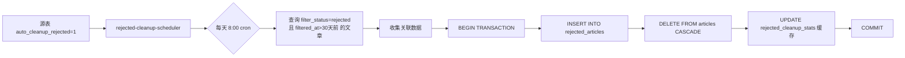

# 08 · 自动清理拒绝文章子系统 Handoff

> 本文档于 **2026-07-14** 基于实际源代码逐文件阅读编写，所有结论均带 `文件:行号` 引用。
> **2026-07-16 更新**：新增 30 天过滤条件，仅迁移 `filtered_at < now - 30 天` 的拒绝文章。
> **2026-07-16 更新 #2**：修复去重漏洞——在 5 个数据源的 `saveArticles` 去重逻辑中追加对 `rejected_articles` 表的查询，防止被清理的拒绝文章再次被当作新文章入库（见 §16）。
> *2026-07-21 更新 #3**：新增第 5 类 Web 爬虫源（`source_origin='web'`），`rejected-cleanup-scheduler` 已扩展为 5 源支持（见 §12）。
> 始于 `docs/handoffs/08-rejected-cleanup.md` 规划方案，现已完成实现。

---

## 1. 背景与目标

**现状**：系统有 5 类来源（RSS/期刊/关键词/Web 爬虫/Gmail），大量文章被 LLM 过滤拒绝（`filter_status='rejected'`），但**永久保留在 `articles` 表中**。随着时间推移，`articles` 表膨胀，查询性能下降，而 rejected 文章在前端默认已被排除（`excludeRejected: true`），保留在正式表中仅有数据冗余的负面效果。

**目标**（全部完成）：
1. ✅ 为每个源新增 `auto_cleanup_rejected` 开关字段，默认关闭（opt-in）
2. ✅ 定时调度器将标记源下的 rejected 文章**从 `articles` 表迁移到 `rejected_articles` 归档表**，附带关联数据（过滤日志、翻译、处理日志、相关文章）
3. ✅ 仅迁移 **30 天以前** 被拒绝的文章，30 天内拒绝记录暂留主表，避免误操作后无法恢复
4. ✅ 保持 `articles` 表轻量，保障查询性能
5. ✅ 被拒数据不丢失，可后续在归档表中查询

---

## 2. 数据流



详细流程：

```
[源表 auto_cleanup_rejected = 1]
    │
    ▼
[rejected-cleanup-scheduler]  ← cron 每天 8:00 (config.rejectedCleanupSchedule)
    │
    │  1. collectEnabledSources() — 5 类源表（含 web_sources）UNION ALL 查询 auto_cleanup_rejected=1
    │  2. 对每个源：
    │     a. SELECT articles WHERE filter_status='rejected' AND 来源外键 = ?
    │         AND filtered_at < (now - 30天)  ← 仅迁移30天以前的拒绝文章
    │     b. 对每篇文章，收集关联数据：
    │        - article_filter_logs → JSON.stringify
    │        - article_translations → JSON.stringify
    │        - article_process_logs → JSON.stringify
    │        - article_related → JSON.stringify
    │     c. db.transaction():
    │        - INSERT INTO rejected_articles (全部字段 + JSON 关联数据 + source_name)
    │        - DELETE FROM articles WHERE id = ?  (ON DELETE CASCADE 清除关联表)
    │        - INSERT ... ON CONFLICT DO UPDATE rejected_cleanup_stats
    │     d. 统计日志
    ▼
[rejected_articles archive]  ← 同时更新 rejected_cleanup_stats 缓存
                                          │
                                          ▼
                                 [首页统计 GET /api/articles/stats]
                                 加回缓存值 → todayNew / passRate 准确
```

---

## 3. 数据库结构

### 3.1 五张源表 `auto_cleanup_rejected` 字段

已在 `sql/001_init.sql`、`sql/038_add_auto_cleanup_rejected.sql` 和 `sql/041_add_web_sources.sql` 中定义，迁移脚本会判断字段已存在时跳过。

```sql
-- 每张表定义相同
auto_cleanup_rejected INTEGER NOT NULL DEFAULT 0

-- 索引
CREATE INDEX IF NOT EXISTS idx_rss_sources_auto_cleanup ON rss_sources(auto_cleanup_rejected);
CREATE INDEX IF NOT EXISTS idx_journals_auto_cleanup ON journals(auto_cleanup_rejected);
CREATE INDEX IF NOT EXISTS idx_keyword_subscriptions_auto_cleanup ON keyword_subscriptions(auto_cleanup_rejected);
CREATE INDEX IF NOT EXISTS idx_email_sources_auto_cleanup ON email_sources(auto_cleanup_rejected);
CREATE INDEX IF NOT EXISTS idx_web_sources_auto_cleanup ON web_sources(auto_cleanup_rejected);
```

### 3.2 `rejected_articles` 归档表

```sql
CREATE TABLE IF NOT EXISTS rejected_articles (
  -- articles 表全部字段（一一对应）
  id INTEGER PRIMARY KEY,           -- 原 articles.id，非自增
  rss_source_id INTEGER,
  journal_id INTEGER,
  keyword_id INTEGER,
  email_source_id INTEGER,
  web_source_id INTEGER,
  title TEXT NOT NULL,
  title_normalized TEXT,
  url TEXT NOT NULL,
  summary TEXT,
  content TEXT,
  markdown_content TEXT,
  filter_status TEXT,
  filter_score REAL,
  filtered_at TEXT,
  process_status TEXT,
  process_stages TEXT,
  processed_at TEXT,
  published_at TEXT,
  published_year INTEGER,
  published_issue INTEGER,
  published_volume INTEGER,
  error_message TEXT,
  is_read INTEGER,
  source_origin TEXT,
  rating INTEGER,
  ai_summary TEXT,
  created_at TEXT,
  updated_at TEXT,
  -- 关联数据归档（JSON 格式）
  filter_logs_data TEXT,             -- article_filter_logs JSON 数组
  translation_data TEXT,             -- article_translations JSON 对象
  process_logs_data TEXT,            -- article_process_logs JSON 数组
  related_data TEXT,                 -- article_related JSON 数组
  -- 来源标识
  source_name TEXT,                  -- 来源名称（RSS 源名称/期刊名/关键词）
  moved_at TEXT DEFAULT (datetime('now', 'localtime'))
);

CREATE INDEX idx_rejected_articles_source_origin ON rejected_articles(source_origin);
CREATE INDEX idx_rejected_articles_moved_at ON rejected_articles(moved_at);
CREATE INDEX idx_rejected_articles_rss_source_id ON rejected_articles(rss_source_id);
CREATE INDEX idx_rejected_articles_journal_id ON rejected_articles(journal_id);
CREATE INDEX idx_rejected_articles_keyword_id ON rejected_articles(keyword_id);
CREATE INDEX idx_rejected_articles_email_source_id ON rejected_articles(email_source_id);
CREATE INDEX idx_rejected_articles_web_source_id ON rejected_articles(web_source_id);
```

### 3.3 `rejected_cleanup_stats` 统计缓存表

位置：`sql/001_init.sql:598-607`、`sql/039_add_rejected_cleanup_stats.sql`

当清理移除了 rejected 文章后，首页统计会因缺少被移除的文章而失真。该缓存表在清理事务中**原子性地累加计数器**，首页统计时加上缓存值来补偿。

```sql
CREATE TABLE IF NOT EXISTS rejected_cleanup_stats (
  user_id INTEGER NOT NULL,
  article_date TEXT NOT NULL,       -- created_at 的 UTC 日期部分 YYYY-MM-DD
  rejected_count INTEGER NOT NULL DEFAULT 0,
  completed_rejected_count INTEGER NOT NULL DEFAULT 0,  -- 其中 process_status='completed' 的数量
  PRIMARY KEY (user_id, article_date)
);
```

- `rejected_count`：每次清理成功移走一篇文章，在同一个事务内 `INSERT ... ON CONFLICT DO UPDATE SET rejected_count = rejected_count + 1`
- `completed_rejected_count`：仅当被清理文章的 `process_status = 'completed'` 时同步递增，用于补偿首页「已完成」统计
- 容量极小（每用户每天一行），查询 O(log n)，无 JOIN

---

## 4. 配置项 `src/config.ts:56-58`

```typescript
// 新增配置项
rejectedCleanupEnabled: boolean;       // 默认 true（可通过 REJECTED_CLEANUP_ENABLED=false 关闭）
rejectedCleanupSchedule: string;       // 默认 '0 8 * * *'（每天 8:00 Asia/Shanghai）
```

环境变量：
- `REJECTED_CLEANUP_ENABLED` — 设为 `false` 禁用调度器
- `REJECTED_CLEANUP_SCHEDULE` — cron 表达式，默认每天 8:00

---

## 5. 调度器 `src/rejected-cleanup-scheduler.ts`

### 5.1 类结构

```typescript
// 文件: src/rejected-cleanup-scheduler.ts
export class RejectedCleanupScheduler extends BaseScheduler {  // 2026-07-14 起继承 BaseScheduler
  private static instance: RejectedCleanupScheduler | null = null;

  static getInstance(): RejectedCleanupScheduler;   // 单例
  // start() / stop() 由 BaseScheduler 提供（cron 校验 + 生命周期 + pollWhile 等待）
  cleanupNow(): Promise<CleanupResult>;               // 手动触发（保留为公有方法）
}
```

> **近期重构（2026-07-14）**：`RejectedCleanupScheduler` 已改为 `extends BaseScheduler`（`src/utils/base-scheduler.ts`），与 RSS / 期刊 / 关键词 / Web 爬虫 / Gmail / 每日总结 / 洞察 / 相关文章共 9 个调度器统一基类。`scheduledTask` / `isRunning` 字段及 `start()` / `stop()` / cron 校验逻辑由基类提供，子类只需实现 `schedulerName` / `cronSchedule` / `run()`。文件:行号引用（如 L:41-58、L:151-190）为重构前的快照，实际以符号名为准。

### 5.2 核心方法

| 方法 | 可见性 | 功能 | 位置 |
|------|--------|------|------|
| `collectEnabledSources()` | private | 收集 5 类源表（含 web_sources）中 `auto_cleanup_rejected=1` 的活跃源 | L:151-190 |
| `cleanupSource(source)` | private | 对单个源执行迁移：查询 → 收集关联数据 → 事务迁移（含 `rejected_cleanup_stats` INCREMENT）。查询时加 `filtered_at < 30天前` 条件，保留近期拒绝数据在主表。 | L:196-303 |
| `getSourceColumn(type)` | private | 源类型 → articles 表中外键列名映射 | L:309-321 |

### 5.3 手动触发

`cleanupNow()` 方法暴露为公有方法，可直接调用：

```typescript
// 示例：通过代码手动触发
const scheduler = initRejectedCleanupScheduler();
const result = await scheduler.cleanupNow();
console.log(result);
// { totalSources, totalArticlesMoved, successCount, failedCount, sourceResults[], durationMs }
```

对应的 HTTP API 端点已实现：
- **`POST /api/scheduler/rejected-cleanup/trigger`** ─ 需要认证（`requireAuth`），可从前端或外部触发
- 定义在 `src/api/routes/scheduler.routes.ts:51-71`，在 `src/api/routes.ts:9` 挂载
- 请求体：无（直接触发）
- 返回值：`{ success, totalSources, totalArticlesMoved, successCount, failedCount, durationMs, results[] }`
- 注意：该端点为**全局操作**，会清理所有开启了 `auto_cleanup_rejected=1` 的用户源（与 `POST /api/rss-sources/fetch-all` 模式一致）

### 5.4 注册与生命周期 `src/index.ts`

- **启动**（L:125-131）：在 RSS / 期刊 / 关键词 / 每日总结 / 洞察 / 拒绝清理调度器之后，**Web 爬虫 / Gmail / Telegram Bot** 之前注册
- **关闭**（L:155-157）：在 Web 爬虫 / Gmail 调度器之后停止
- 受 `config.rejectedCleanupEnabled` 全局开关控制

---

## 6. 类型定义 `src/db.ts`

### 6.1 四张源表接口各加一个字段

| 接口 | 新增字段 | 位置 |
|------|---------|------|
| `RssSourcesTable` | `auto_cleanup_rejected: number` | L:28 |
| `JournalsTable` | `auto_cleanup_rejected: number` | L:92 |
| `KeywordSubscriptionsTable` | `auto_cleanup_rejected: number` | L:121 |
| `WebSourcesTable` | `auto_cleanup_rejected: number` | `src/db.ts:WebSourcesTable` |

### 6.2 新增 `RejectedArticlesTable` 接口

位置：`src/db.ts:149-185`

与 `ArticlesTable` 一一对应，但所有字段均非 `Generated`（因为 ID 从原文章复制），外加 5 个归档字段：
- `filter_logs_data` — `article_filter_logs` JSON 数组
- `translation_data` — `article_translations` JSON 对象
- `process_logs_data` — `article_process_logs` JSON 数组
- `related_data` — `article_related` JSON 数组
- `source_name` — 来源名称
- `moved_at` — 迁移时间戳

已注册到 `DatabaseTable` 接口（L:117）和 `RejectedArticlesSelection` 类型（L:251）。

### 6.3 新增 `RejectedCleanupStatsTable` 接口

位置：`src/db.ts:376-381`

```typescript
export interface RejectedCleanupStatsTable {
  user_id: number;
  article_date: string;
  rejected_count: number;
  completed_rejected_count: number;
}
```

已注册到 `DatabaseTable` 接口（L:52）作为 `rejected_cleanup_stats`。

---

## 7. API 层变更

### 7.1 服务层接口

四个源服务文件的 `Create*Input` / `Update*Input` 接口均新增 `autoCleanupRejected?: boolean`：

| 文件 | 位置 |
|------|------|
| `src/api/rss-sources.ts` | L:20, L:31 |
| `src/api/journals.ts` | L:42, L:55 |
| `src/api/keywords.ts` | L:17, L:26 |
| `src/api/gmail-sources.ts` | L:11, L:19 |

### 7.2 路由层

四个路由文件均已解析 `autoCleanupRejected` 并传递给服务层：

| 路由文件 | Create | Update |
|----------|--------|--------|
| `src/api/routes/rss-sources.routes.ts` | ✓ | ✓ |
| `src/api/routes/journals.routes.ts` | ✓ | ✓ |
| `src/api/routes/keywords.routes.ts` | ✓ | ✓ |
| `src/api/routes/gmail-sources.routes.ts` | ✓ | ✓ |

### 7.3 请求体格式

```typescript
// POST（创建）/ PUT（更新）
{
  // ... 原有字段
  autoCleanupRejected?: boolean;   // 前端传 boolean，后端转 integer(1/0)
}
```

---

## 8. 前端 UI

### 8.1 模态框复选框

四类源的编辑弹窗均新增「自动清理拒绝文章」复选框，默认关闭，附说明文字：

| 源类型 | 文件 | 复选框 ID |
|--------|------|-----------|
| RSS 订阅源 | `src/views/settings/modals.ejs` | `sourceAutoCleanup` |
| 期刊管理 | `src/views/settings/modals.ejs` | `journalAutoCleanup` |
| 关键词订阅 | `src/views/settings/modals.ejs` | `keywordAutoCleanup` |
| 邮件订阅源 | `src/views/settings/panel-gmail.ejs` | `gmailAutoCleanup` |

### 8.2 JavaScript 处理 `src/public/js/settings.js`

四个源类型的添加/编辑/保存逻辑全部更新：

| 操作 | 函数 | 变更 |
|------|------|------|
| RSS 添加 | `showAddModal()` | 重置 checkbox 为 false |
| RSS 编辑 | `editSource()` | 从 `source.auto_cleanup_rejected` 回显 |
| RSS 保存 | `sourceForm submit` | 包含 `autoCleanupRejected` |
| 期刊添加 | `showJournalAddModal()` | 重置 checkbox 为 false |
| 期刊编辑 | `editJournal()` | 从 `journal.auto_cleanup_rejected` 回显 |
| 期刊保存 | `journalForm submit` | 包含 `autoCleanupRejected` |
| 关键词添加 | `showKeywordAddModal()` | 重置 checkbox 为 false |
| 关键词编辑 | `showKeywordEditModal()` | 从 `keyword.auto_cleanup_rejected` 回显 |
| 关键词保存 | `saveKeyword()` | 包含 `autoCleanupRejected` |
| 邮件添加 | `showGmailAddModal()` | 重置 checkbox 为 false |
| 邮件编辑 | `editGmailSource()` | 从 `source.auto_cleanup_rejected` 回显 |
| 邮件保存 | `saveGmailSource()` | 包含 `autoCleanupRejected` |

---

## 9. 首页统计集成 `src/api/routes/articles.routes.ts`

### 9.1 问题

清理将 `filter_status='rejected'` 的文章从 `articles` 物理删除到 `rejected_articles`，而首页统计只查 `articles` 表，导致：
- **今日新增**（`todayNew`）：移走的 rejected 文章不再计入，数量偏少
- **通过率**（`passRate`）：`passed / (passed + rejected)` 分母变小，通过率虚高

### 9.2 解决方案

在清理事务中原子性地累加 `rejected_cleanup_stats` 缓存，首页统计时加上缓存值：

**清理侧**（`src/rejected-cleanup-scheduler.ts:261-277`，在 INSERT + DELETE 之后）：
```typescript
const isCompleted = article.process_status === 'completed';
await sql`
  INSERT INTO rejected_cleanup_stats (user_id, article_date, rejected_count, completed_rejected_count)
  VALUES (${source.userId}, ${articleDate}, 1, ${isCompleted ? 1 : 0})
  ON CONFLICT(user_id, article_date) DO UPDATE SET
    rejected_count = rejected_cleanup_stats.rejected_count + 1,
    completed_rejected_count = rejected_cleanup_stats.completed_rejected_count + ${isCompleted ? 1 : 0}
`.execute(trx);
```

**统计侧**（`src/api/routes/articles.routes.ts:264-282`）：
- `todayNew = articles_count_today + COALESCE(today_cached_rejected, 0)`
- `passRate = passed / (passed + rejected_in_articles + total_cached_rejected)`
- `analyzed = articles_completed + total_cached_completed_rejected`
- 通过 `rejected_cleanup_stats` 表的 `user_id` 字段分组 SUM 查询，仅 1 次 COUNT + 1 次 SUM，无 JOIN，性能开销可忽略。

### 9.3 Bug 修复：`analyzed`（已完成）统计补偿

**发现的问题**：清理 rejected 文章时，如果被清理的文章有 `process_status = 'completed'`，它们被删除后首页的「已完成」统计会不准确地减少，而通过率却因为已补偿而保持不变，形成不一致。

**修复**（commit `1fb952f7` 之后的补丁）：
1. `rejected_cleanup_stats` 表新增 `completed_rejected_count` 字段
2. 清理时检查每篇文章的 `process_status`，仅当 `=== 'completed'` 时才递增 `completed_rejected_count`
3. 首页统计响应中 `analyzed = articles_completed + total_cached_completed_rejected`

这样「已完成」统计在清理前后保持不变，与今日新增/通过率的行为一致。

---

## 10. 迁移脚本 `scripts/migrate.ts`

### 10.1 038 迁移

038 迁移分支（L:463-476）在 `migrate.ts` 中已添加：

```typescript
// ============================================================
// 038: 添加自动清理拒绝文章的字段和归档表
// ============================================================
if (file === '038_add_auto_cleanup_rejected.sql') {
  const hasAutoCleanup = hasColumn(db, 'rss_sources', 'auto_cleanup_rejected');
  if (!hasAutoCleanup) {
    const sql = fs.readFileSync(fullPath, 'utf-8');
    db.exec(sql);
    console.log('      → Added auto_cleanup_rejected to rss_sources, ...');
    console.log('      → Created rejected_articles archive table');
  } else {
    console.log('      → Skipped (auto_cleanup_rejected already exists)');
  }
  continue;
}
```

### 10.2 039 迁移

位置：`scripts/migrate.ts:864-879`、`sql/039_add_rejected_cleanup_stats.sql`

```typescript
if (file === '039_add_rejected_cleanup_stats.sql') {
  const hasCacheTable = hasTable(db, 'rejected_cleanup_stats');
  if (!hasCacheTable) {
    const sql = fs.readFileSync(fullPath, 'utf-8');
    db.exec(sql);
    console.log('      → Created rejected_cleanup_stats cache table');
  } else {
    console.log('      → Skipped (rejected_cleanup_stats already exists)');
  }
  continue;
}
```

### 10.3 040 迁移

位置：`scripts/migrate.ts:884-893`、`sql/040_add_rejected_cleanup_completed_count.sql`

```typescript
if (file === '040_add_rejected_cleanup_completed_count.sql') {
  const hasCompletedCount = hasColumn(db, 'rejected_cleanup_stats', 'completed_rejected_count');
  if (!hasCompletedCount) {
    const sql = fs.readFileSync(fullPath, 'utf-8');
    db.exec(sql);
    console.log('      → Added completed_rejected_count column to rejected_cleanup_stats');
  } else {
    console.log('      → Skipped (completed_rejected_count already exists)');
  }
  continue;
}
```

---

## 11. 验证要点

| 验证项 | 状态 | 方法 |
|--------|------|------|
| 新表创建 | ✅ 已验证 | `pnpm run db:migrate` 后 `rejected_articles` 表存在 |
| 字段添加 | ✅ 已验证 | 4 张源表均有 `auto_cleanup_rejected` 列，默认值 0 |
| 调度器启动 | ✅ 代码就绪 | 启动日志显示 `🗑️ Rejected article cleanup scheduler started` |
| 手动触发 | ✅ 代码就绪 | 调用 `initRejectedCleanupScheduler().cleanupNow()` |
| 关联数据完整性 | ⏳ 未验证 | 需手动测试确认 JSON 字段包含正确数据 |
| 级联删除 | ✅ 由 FK CASCADE 保证 | DELETE FROM articles 自动清除关联表 |
| 前端 UI 开关 | ✅ 已实现 | 四类源编辑弹窗均有复选框 |
| 迁移脚本 | ✅ 已验证 | `pnpm run db:migrate` 成功执行 038 + 039 + 040 |
| 统计缓存表创建 | ✅ 已验证 | `pnpm run db:migrate` 后 `rejected_cleanup_stats` 表存在 |
| 缓存原子性 | ✅ 代码保证 | 缓存更新与 DELETE 在同一事务中，不会出现遗漏 |
| 首页统计补偿 | ✅ 代码就绪 | `todayNew` / `passRate` / `analyzed` 均已补偿 |
| 性能影响 | ✅ 无 | 缓存表每用户每日期一行，查询 O(log n)，无 JOIN |
| `completed_rejected_count` 字段 | ✅ 已验证 | `pnpm run db:migrate` 后 040 迁移执行成功 |
| `analyzed` 清理后不变 | ✅ 代码就绪 | 统计响应中加上 `totalCachedCompletedRejected` |

---

## 12. 涉及文件汇总（最终清单）

| 文件 | 操作 | 说明 |
|------|------|------|
| `sql/001_init.sql` | ✅ | DDL 已包含所有变更（新数据库直接使用） |
| `sql/038_add_auto_cleanup_rejected.sql` | ✅ | 迁移脚本（已有数据库使用） |
| `sql/039_add_rejected_cleanup_stats.sql` | ✅ | **新文件**，统计缓存表迁移 |
| `src/db.ts` | ✅ | 类型定义：4 源表 + RejectedArticlesTable + RejectedCleanupStatsTable |
| `src/config.ts` | ✅ | 新增 `rejectedCleanupEnabled` / `rejectedCleanupSchedule` |
| `src/rejected-cleanup-scheduler.ts` | ✅ | 独立调度器，事务内更新 `rejected_cleanup_stats` 缓存 |
| `src/index.ts` | ✅ | 注册调度器启动/停止 |
| `scripts/migrate.ts` | ✅ | 添加 038 + 039 迁移分支 |
| `src/api/rss-sources.ts` | ✅ | 服务接口加 `autoCleanupRejected` |
| `src/api/journals.ts` | ✅ | 同上 |
| `src/api/keywords.ts` | ✅ | 同上 |
| `src/api/gmail-sources.ts` | ✅ | 同上 |
| `src/api/routes/rss-sources.routes.ts` | ✅ | POST/PUT 支持新字段 |
| `src/api/routes/journals.routes.ts` | ✅ | 同上 |
| `src/api/routes/keywords.routes.ts` | ✅ | 同上 |
| `src/api/routes/gmail-sources.routes.ts` | ✅ | 同上 |
| `src/api/routes/web-sources.routes.ts` | ✅ | 同上 |
| `src/api/routes/articles.routes.ts` | ✅ | 首页统计加上 `rejected_cleanup_stats` 缓存值 |
| `src/views/settings/modals.ejs` | ✅ | RSS/期刊/关键词模态框加复选框 |
| `src/views/settings/panel-gmail.ejs` | ✅ | 邮件源模态框加复选框 + 内联 JS |
| `src/public/js/settings.js` | ✅ | 四个源类型的添加/编辑/保存流程全部更新 |
| `src/api/routes/scheduler.routes.ts` | ✅ | 新增 `POST /api/scheduler/rejected-cleanup/trigger` HTTP 端点 |
| `sql/040_add_rejected_cleanup_completed_count.sql` | ✅ | **新文件**，为 `rejected_cleanup_stats` 增加 `completed_rejected_count` 列 |
| `src/api/articles.ts` | ✅ 2026-07-16 | RSS saveArticles 追加 rejected_articles 标题去重（见 §16） |
| `src/journal-scheduler.ts` | ✅ 2026-07-16 | Journal saveArticles 追加 rejected_articles 标题去重（见 §16） |
| `src/api/keywords.ts` | ✅ 2026-07-16 | Keyword saveArticles 追加 rejected_articles URL+标题双重去重（见 §16） |
| `src/gmail/email-processor.ts` | ✅ 2026-07-16 | Gmail processEmailSource 追加 rejected_articles 标题去重（见 §16） |
| `src/web-scheduler.ts` | ✅ 2026-07-21 | Web 爬虫 saveArticles 追加 rejected_articles 标题去重（见 §16） |

---

## 13. 已知遗留 / 待办

1. **调度器状态 API 缺失**：当前无 `GET /api/scheduler/rejected-cleanup/status` 端点查看清理调度器状态（启停状态、上次运行时间等）。

2. **清理日志**：调度器仅输出 `log.info` 日志，未持久化到数据库。当前已通过 `rejected_cleanup_stats` 表记录了每用户每天的清理数量，供首页统计补偿使用。如需更详细的单次清理报告（如按来源分布），仍需额外持久化。

---

## 14. 与旧报告的差异

- 本功能为新功能，此前的 handoff 文档中不存在。
- 过滤逻辑（`src/filter.ts`）完全不变，仅新增清理环节。
- 本文档从规划阶段升级为**实现完成阶段**，所有文件状态已更新为 ✅。

## 15. 近期重构差异（2026-07-14，基于代码审查实施计划）

- **`RejectedCleanupScheduler` 基类化**：改为 `extends BaseScheduler`，与全项目 9 个调度器统一生命周期（见 §5.1）。`start()` / `stop()` / cron 校验不再各自维护。
- **新增 Web 爬虫源支持**（2026-07-21）：`collectEnabledSources()` 增加 `web_sources` 查询，`getSourceColumn()` 增加 `'web' → 'web_source_id'` 分支。

---

## 16. Bug 修复：被清理文章再次抓取时去重失效（2026-07-16）

### 16.1 问题

自动清理将 `filter_status='rejected'` 的文章从 `articles` 表物理删除到 `rejected_articles` 归档表。但五个来源（RSS / 期刊 / 关键词 / Web 爬虫 / Gmail）的 `saveArticles` 去重逻辑只查询 `articles` 表，**不查 `rejected_articles` 归档表**。

于是出现循环：

```
1. RSS 抓取 → 文章 A 入库 (articles)
2. LLM 过滤拒绝 → filter_status='rejected'
3. 30天后 auto-cleanup → 文章 A 从 articles DELETE，移到 rejected_articles
4. 下一次 RSS 抓取 → 文章 A 又出现了
5. 去重检查 title_normalized 只查 articles → 找不到 → 作为新文章重新插入
6. LLM 再次过滤 → 再次拒绝 → 浪费 LLM API 调用
7. 30天后又被清理 → 循环往复
```

### 16.2 修复

在五个来源的 `saveArticles`/`processEmailSource` 中，在原有的 `articles` 去重检查之后，追加对 `rejected_articles` 表的查询。如果 `title_normalized`（或 `url`）在归档表中已存在，则跳过该文章。

| 数据源 | 源文件 | 新增检查 |
|--------|--------|---------|
| RSS | `src/api/articles.ts:saveArticles` | `title_normalized` → `rejected_articles` |
| 期刊 | `src/journal-scheduler.ts:saveArticles` | `title_normalized` → `rejected_articles` |
| 关键词 | `src/api/keywords.ts:saveArticles` | `url` + `title_normalized` → `rejected_articles` |
| Web 爬虫 | `src/web-scheduler.ts:saveArticles` | `title_normalized` → `rejected_articles` + `url` → articles |
| Gmail | `src/gmail/email-processor.ts:processEmailSource` | `title_normalized` → `rejected_articles` |

### 16.3 关键细节

- **查询模式**：与 `articles` 检查完全一致，使用 `db.selectFrom('rejected_articles').where('title_normalized', '=', ?).select('id').executeTakeFirst()`
- **日志级别**：`log.debug`，与现有去重日志风格一致
- **关键词多查了一层 URL**：关键词源现有 URL 预查逻辑，也额外查了 `rejected_articles.url`，比其他源更严格
- **类型安全**：`RejectedArticlesTable` 接口（`src/db.ts:336-371`）完整包含 `url` 和 `title_normalized` 字段
- **性能**：每次去重多一次 SQLite 本地查询，字段有索引，开销可忽略

### 16.4 涉及文件

| 文件 | 操作 | 说明 |
|------|------|------|
| `src/api/articles.ts` | ✅ 修改 | RSS saveArticles 追加 rejected_articles 标题去重 |
| `src/journal-scheduler.ts` | ✅ 修改 | Journal saveArticles 追加 rejected_articles 标题去重 |
| `src/api/keywords.ts` | ✅ 修改 | Keyword saveArticles 追加 rejected_articles URL+标题双重去重 |
| `src/web-scheduler.ts` | ✅ 2026-07-21 | Web 爬虫 saveArticles 追加 rejected_articles 标题去重 |
| `src/gmail/email-processor.ts` | ✅ 修改 | Gmail processEmailSource 追加 rejected_articles 标题去重 |

### 16.5 验证要点

| 验证项 | 状态 | 方法 |
|--------|------|------|
| 被清理文章重新抓取时被跳过 | ✅ 代码就绪 | 模拟：insert → reject → cleanup → re-fetch → 确认 skip |
| 类型检查 | ✅ 通过 | `npx tsc --noEmit` 无错误 |
| 不影响现有未清理文章的入库 | ✅ 逻辑保证 | 仅当 `title_normalized` 在 `articles` 中不存在时才查 `rejected_articles` |
