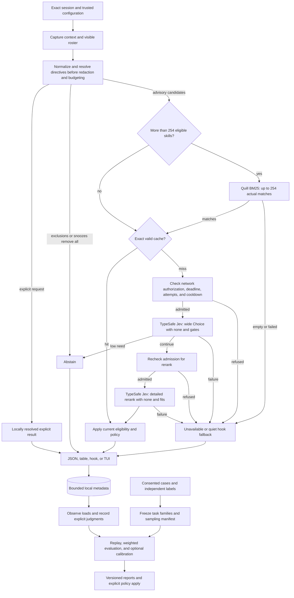

<div align="center">

# SkillRanker

**The right skill for the next step, powered by Jev from TypeSafe.ai.**

A standalone Rust CLI that puts **[TypeSafe.ai's Jev](https://typesafe.ai)** at the
center of skill selection: Jev evaluates your agent's live context, compares the
available skills, and estimates which ones fit the next step. SkillRanker supplies
the session integration, local safeguards, and inspectable feedback around it.

**A TypeSafe API key is required to use SkillRanker's ranking system.
Sign up at the [TypeSafe console](https://console.typesafe.ai) to get your own key.**

[](LICENSE)


```bash
sr capabilities --json   # Check implemented commands and integrations in your build
sr demo --case useful     # Inspect an offline fixture before connecting a session
sr rank --allow-network   # Rank skills for the selected session
```

</div>

## Contents

- [TL;DR](#tldr)
- [Quick Example](#quick-example)
- [Design Philosophy](#design-philosophy)
- [How It Compares](#how-it-compares)
- [Installation](#installation)
- [Quick Start](#quick-start)
- [Command Reference](#command-reference)
- [Configuration](#configuration)
- [How Ranking Works](#how-ranking-works)
- [Explain And Replay A Result](#explain-and-replay-a-result)
- [Local Feedback And Calibration](#local-feedback-and-calibration)
- [Evaluation, Sampling, And Risk Monitoring](#evaluation-sampling-and-risk-monitoring)
- [Control Requests And Interruptions](#control-requests-and-interruptions)
- [Agent Hooks](#agent-hooks)
- [Inline TUI](#inline-tui)
- [Architecture](#architecture)
- [Privacy And Local State](#privacy-and-local-state)
- [Performance](#performance)
- [Troubleshooting](#troubleshooting)
- [Limitations](#limitations)
- [FAQ](#faq)
- [About Contributions](#about-contributions)
- [License](#license)

---

## TL;DR

**The problem.** A large skill library gives an agent plenty of procedures to
choose from, but choosing is itself a task. Similar descriptions obscure useful
distinctions. A skill that helped at the start of a conversation can be irrelevant
three turns later. Loading a plausible but unsuitable skill consumes context and
can redirect otherwise sensible work.

**The solution.** SkillRanker (`sr`) combines the recent conversation, current
request, workspace signals, and the selected harness's visible skill inventory.
**Jev from TypeSafe.ai is the key enabler of the system.** It first compares the
candidates broadly, then reads richer excerpts from a shortlist and evaluates
whether each one fits. Both comparisons include a
real “none of these” option. The result is advisory: the agent follows the user's
instructions and decides what to consult.

For libraries with more than 254 eligible skills, **Quill from FrankenSearch**
narrows the candidates locally before Jev evaluates them. Smaller rosters reach
Jev in full. Explicit skill requests resolve locally before either stage.

SkillRanker does not include a local model or a substitute inference provider.
The ranking workflow requires your own TypeSafe account and API key. Local
retrieval prepares the candidates; **Jev supplies the evaluations that make the
recommendations possible**.

### Why `sr`?

| Need | What SkillRanker provides |
|---|---|
| Evaluate meaning and task fit | Jev's typed Choice and Noul evaluations from TypeSafe.ai power both ranking passes |
| Choose for the current step | Exact session identity, the newest prompt, recent tool evidence, and project signals |
| Suggest something the agent can load | Harness-aware visibility, override resolution, stable skill identities, and content revalidation |
| Respect an explicit request | Locally resolve a requested skill before probabilistic retrieval or ranking |
| Search a large library | Quill lexical prefiltering from FrankenSearch, admitting up to 254 skills plus a none option to each Choice |
| Separate similar skills | Detailed reranking with bounded descriptions and body excerpts |
| Recognize when no skill fits | Relevance gates, per-candidate fit checks, and sentinel-based abstention |
| Understand a missing suggestion | `--why-not` traces where a candidate was excluded, with thresholds and concrete recovery hints |
| Reproduce a surprising result | Opt-in case capture and offline replay compare compatible local policies without another Jev call |
| Get started without sharing a session | Offline fixture demos and a readiness report identify the next setup step |
| Keep the agent moving | A failed hook recommendation produces a quiet, non-blocking fallback |
| Control interruptions | Silent ordinary abstentions and scoped, expiring snoozes preserve explicit skill requests |
| Bound repeated expense | Optional shared HTTP-attempt allowances and a provider circuit breaker cover concurrent local sessions |
| Review what happens | Usefulness, interruptions, attempts, and cost share a report with explicit label coverage |
| Evaluate within a budget | Offline replay, explicit live-request caps, and reproducible samples with recorded selection probabilities |
| Assess recommendation harm | Controlled comparisons, uncertainty bounds, and optional monitoring across repeated evaluations |
| Control disclosure | Network opt-in, field-level disclosure receipts, a minimal context profile, and separate persistence controls |

The approach builds on the [TypeSafe skill-suggestion recipe](https://docs.typesafe.ai/cookbooks/skill_suggestion).
SkillRanker adds session identity, harness visibility, bounded execution, and a
local evaluation loop. The [comprehensive plan](COMPREHENSIVE_PLAN_TO_DESIGN_SKILLRANKER.md)
explains the full design and acceptance criteria.

## Quick Example

```bash
# See a labeled fixture result without a key, network, or private session.
sr demo --case useful

# Inspect local configuration and the available adapters.
sr doctor --json
sr doctor --config
sr capabilities --json

# Inspect visible, shadowed, and excluded skill records.
sr roster --json

# Preview the redacted wide-pass request without network or persistence effects.
sr rank --context scratch/context.json --dry-run

# Evaluate an explicitly selected conversation.
sr rank --context scratch/context.json --allow-network --json

# Find where an expected candidate was excluded; this adds no inference calls.
sr rank --context scratch/context.json --allow-network --why-not SKILL_ID --explain

# Preview the Claude hook settings change, then apply it.
sr install-hook claude
sr install-hook claude --apply

# Review observations without treating adoption as proof of usefulness.
sr stats --since 7d --by-skill

# Replay a labeled evaluation artifact without making network requests.
sr eval --dataset scratch/evaluation.json --explain

# Inspect description quality and suspected coverage gaps locally.
sr doctor --descriptions
sr gaps
```

## Design Philosophy

1. **Choose for the next action.** The current request matters, as do the recent
   failure, the task context, and the instructions already loaded.
2. **Resolve authority locally.** The user decides what is required or excluded.
   The harness determines what can be loaded. A model answer cannot change either.
3. **Separate preference from applicability.** Winning a comparison is not enough.
   A recommendation must survive fit, visibility, loaded-state, and none-option checks.
4. **Keep evidence inspectable.** Preserve provider estimates and local arithmetic.
   `--explain` exposes computations without inventing model-generated reasons.
5. **Separate adoption from usefulness.** Observing a load is useful telemetry.
   Learning a better policy requires independently judged examples and a holdout.
6. **Bound each evaluation.** Input, discovery, subprocesses, networking,
   retries, persistence, and cleanup consume one ranking deadline. Batch
   evaluation also has explicit request and total-runtime limits.
7. **Stay standalone.** Discovery, parsing, redaction, retrieval, and feedback live
   in `sr`. No skill-manager service or private database is required.

## How It Compares

These are workflow choices, not benchmark rankings.

| Approach | Input to selection | Strength | Tradeoff |
|---|---|---|---|
| Manual selection | Your knowledge of the task and library | Direct control without a ranking service | Requires remembering each skill's coverage |
| Keyword search | A query over names and descriptions | Cheap local discovery | Synonyms and adjacent procedures can be hard to distinguish |
| Load every skill | The full library's instructions | Makes every procedure available immediately | Consumes context regardless of relevance |
| SkillRanker | Exact session, visible roster, and explicit constraints | Evaluates candidates and can abstain | Fresh Jev evaluations require authorized network access |

SkillRanker recommends procedures. It does not execute skills, grant permissions,
or override the agent's governing instructions.

## Installation

Install on **Linux or macOS**. Keep macOS state on a local APFS or HFS+ filesystem
with Unix permissions. Run `sr capabilities --json` after installation to check
command and integration availability in your build.

### Installer

The installer selects a release for your platform, verifies its SHA256 checksum,
and installs `sr` into `~/.local/bin`. When a release asset is unavailable, it
builds from the selected source revision using the pinned Rust toolchain:

```bash
curl -fsSL "https://raw.githubusercontent.com/Dicklesworthstone/skillranker/main/install.sh?$(date +%s)" | bash -s -- --verify
```

It requires Bash, Python 3, `curl`, and `sha256sum` or `shasum`; source builds
also require Git and Rust. If RCH is installed, compilation runs remotely and
a remote failure does not trigger a local build. macOS source builds need a
macOS RCH worker. Existing binaries are backed
up before replacement. `--easy-mode` also adds the install directory to your
current shell's configuration, with a backup.

```bash
# Install from a trusted local checkout.
bash install.sh --source . --verify

# Install an air-gapped archive with its adjacent .sha256 file.
bash install.sh --offline skillranker.tar.gz --verify
```

Detected Claude Code and Codex installations receive a small SkillRanker usage
skill. Subcommand completions are installed for Bash, Zsh, and Fish. Existing
customized integration files are preserved; `--no-configure` skips these steps.
The installer leaves credentials and network consent to you and reports hooks
as unconfigured. **Obtain your own TypeSafe API key before live ranking.**
See [installer options, verification, and rollback](docs/installation.md).

### From source

Build the `sr` binary with the repository's pinned Rust toolchain and lockfile:

```bash
git clone https://github.com/Dicklesworthstone/skillranker.git
cd skillranker
cargo install --locked --path . --bin sr
```

For a checkout-local binary:

```bash
cargo build --locked --release --bin sr
./target/release/sr --help
```

### Runtime setup

**Sign up for [TypeSafe.ai](https://console.typesafe.ai), then create your own API
key in the console. A TypeSafe API key is required to use SkillRanker's ranking
system.** Jev is the evaluation engine for the entire ranking workflow.
Every user supplies their own credential; SkillRanker does not distribute a
shared key.

Set `TYPESAFE_API_KEY` through your shell or secret manager. The
[environment example](.env.example) lists the service settings. For a local
checkout, create `.env` from the example only if it does not already exist and
restrict access with `chmod 600 .env` **before** entering your own API key.
The `.env` file is ignored by Git. Export its values into the process environment
before running `sr` or starting an agent whose hooks need the key:

```bash
# Run from your checkout, after filling in your own trusted .env file.
set +x
set -a
. ./.env
set +a
```

Treat `.env` as a local shell configuration file and source only content you
trust. Keep the key out of shell history, logs, and tracked files. Credentials
alone do not enable remote transmission.

| Component | Role |
|---|---|
| TypeSafe API key | Authenticates fresh Jev evaluations |
| Network opt-in | `--allow-network` for a run, or `network.enabled` in trusted user configuration |
| Visible skill inventory | Harness-resolved skills or an explicit roster file |
| Session input | Claude hook, normalized context, supported native transcript, or optional cass export |
| [cass](https://github.com/Dicklesworthstone/coding_agent_session_search) | Optional archive discovery and access across coding-agent formats |

`sr` does not require `ms`, a local inference server, or an embedding model.
The supported local platform is Linux. Consult
`sr capabilities --json` for the adapters, events, and optional features in a build.

## Quick Start

1. **Try an offline fixture.** Run `sr demo --case useful`, then try `none`,
   `explicit`, or `unavailable`. These labeled examples exercise the local
   pipeline without reading a private session or contacting Jev. Their output
   is non-actionable and does not establish live provider health.
2. **Sign up and configure your own TypeSafe API key.** Create an account and key
   in the [TypeSafe console](https://console.typesafe.ai), then export
   `TYPESAFE_API_KEY` using the [runtime setup](#runtime-setup) instructions.
   SkillRanker relies on Jev for its ranking evaluations.
3. **Check the environment and roster.** Run `sr doctor --json`,
   `sr capabilities --json`, and `sr roster --json` in the agent's workspace.
   Confirm that candidates are loadable, not merely present somewhere on disk.
4. **Choose the session.** Supply `--context FILE`,
   `--transcript FILE --harness claude_code`, or `--session PATH` for cass.
   Automatic discovery must resolve one unambiguous session.
5. **Preview and rank.** Use `--dry-run` to inspect the redacted wide payload
   and disclosure receipt, then `--allow-network --json` for a fresh evaluation.
6. **Prepare a recorded shadow trial.** Initialize optional history with
   `sr ledger init`, then explicitly set `network.enabled = true` in
   [trusted user configuration](#configuration) if you want live hook evaluations.
   The earlier `--allow-network` flag authorized only that CLI run. Preview and
   apply `sr install-hook claude`; shadow mode evaluates without injecting advice.
   Without a ready ledger, the hook can rank but cannot promise recorded trial
   evidence; without network consent, it cannot obtain fresh Jev answers.
7. **Enable advisory output deliberately.** Set `hook.mode = "advisory"` in
   trusted user configuration after reviewing the integration and its behavior.

### Readiness checks

`sr doctor` reports each prerequisite separately, names the next concrete step
for a failed check, and lists local commands that remain useful:

| Check | What it establishes |
|---|---|
| Input and roster | A usable source and loadable candidates are available |
| Credential | A key is present; this alone does not authenticate it |
| Network authorization | Trusted settings permit a live request |
| Transport | Untested or previously verified by a separately authorized, budgeted live check |
| Ledger | Optional history is ready or degraded; its absence need not block ranking |
| Hook and snoozes | Shadow/advisory mode and active scoped interruption controls |

Doctor runs locally by default and does not implicitly send a test request,
install hooks, migrate storage, or change configuration. Demo uses bundled
synthetic contexts and labeled synthetic or recorded responses without touching
user configuration or state. Neither command supplies a replacement for Jev.

A previous transport check includes its time, scope, and runtime/endpoint/configuration
identity. Incompatible changes invalidate it; a stored check does not establish
current provider availability.

`sr capabilities --json` separates implemented adapters from tested harness
versions/features and unverified versions. Adapter conformance covers prompt
timing, branch identity, visibility, restrictions, compaction, load evidence, and
hook output, deadlines, and delivery. Native advice requires passing real-harness
evidence for every dimension on the installed version; protocol fixtures and
official schema documentation alone cannot authorize it. Cass remains an
explicit archive source. Native Codex, omp/pi, and Grok integrations each need
their own support record. Incompatible identity or visibility semantics disable
advice. The [adapter contract](docs/adapter-contract.md) defines these checks.

## Command Reference

Bare `sr` is equivalent to `sr rank`: a table on a TTY, JSON otherwise. It does
not start a TUI. Source flags are mutually exclusive, and piped stdin is consumed
only by an explicit input mode. `sr capabilities --json` lists the commands,
schemas, and optional features available in the installed build.

### Ranking and inspection

| Command | Purpose | Example |
|---|---|---|
| `sr demo --case CASE` | Inspect a labeled offline fixture | `sr demo --case unavailable` |
| `sr rank` | Rank the next step | `sr rank --allow-network --json` |
| `sr rank --context FILE` | Read normalized context; `-` means stdin | `sr rank --context scratch/context.json --dry-run` |
| `sr rank --transcript FILE --harness NAME` | Read a supported native transcript | `sr rank --transcript scratch/session.jsonl --harness claude_code --offline` |
| `sr rank --session PATH` | Export an exact session through cass | `sr rank --session scratch/session.jsonl --allow-network` |
| `sr rank --why-not ID --explain` | Trace an expected candidate's exclusion | `sr rank --allow-network --why-not SKILL_ID --explain` |
| `sr rank --save-case FILE` | Explicitly capture a bounded redacted replay case | `sr rank --allow-network --save-case scratch/case.json` |
| `sr replay FILE` | Recompute a historical case offline | `sr replay scratch/case.json --compare-policy scratch/candidate.toml` |
| `sr hook claude` | Handle the Claude prompt-hook protocol | `sr hook claude --shadow` |
| `sr roster --json` | Inspect visibility, overrides, records, and exclusions | `sr roster --json` |
| `sr roster --snapshot FILE` | Explicitly export a bounded private roster manifest | `sr roster --snapshot scratch/roster-snapshot.json` |
| `sr roster --diff FILE` | Compare fresh discovery with a saved roster snapshot | `sr roster --diff scratch/roster-snapshot.json` |
| `sr doctor --json` | Inspect local configuration and readiness | `sr doctor --json` |
| `sr doctor --config` | Explain effective non-secret values and their sources | `sr doctor --config` |
| `sr capabilities --json` | Describe commands, schemas, features, limits, and exits | `sr capabilities --json` |
| `sr tui` | Open the inline viewer | `sr tui` |

### Hooks, feedback, and analysis

| Command | Purpose | Example |
|---|---|---|
| `sr install-hook claude` | Preview a managed hook settings change | `sr install-hook claude --apply` |
| `sr uninstall-hook claude` | Preview removal of the managed entry | `sr uninstall-hook claude --apply` |
| `sr stats` | Report observation and operational metrics | `sr stats --since 7d --by-skill` |
| `sr observe` | Reconcile structured load events | `sr observe --transcript scratch/session.jsonl --harness claude_code` |
| `sr feedback` | Record an explicit usefulness judgment | `sr feedback EVENT_ID --skill SKILL_ID --verdict useful` |
| `sr feedback --instead ID` | Record a better alternative for an event | `sr feedback EVENT_ID --skill SKILL_ID --instead ALTERNATIVE_ID` |
| `sr snooze` | Preview a scoped temporary advisory mute | `sr snooze EVENT_ID --skill SKILL_ID --for 30m` |
| `sr budget` | Inspect or preview a shared HTTP-attempt allowance | `sr budget --max-attempts 100 --window 1h` |
| `sr eval` | Replay a labeled evaluation artifact offline by default | `sr eval --dataset scratch/evaluation.json --explain` |
| `sr calibrate` | Report a candidate threshold configuration | `sr calibrate --evaluation scratch/report.json` |
| `sr calibrate --rollback REVISION` | Preview restoration of managed policy fields | `sr calibrate --rollback POLICY_REVISION` |
| `sr doctor --descriptions` | Check description quality locally | `sr doctor --descriptions` |
| `sr gaps` | Report suspected coverage gaps | `sr gaps` |
| `sr ledger init` | Initialize local history explicitly | `sr ledger init` |
| `sr ledger migrate` | Preview a supported schema upgrade | `sr ledger migrate --apply` |
| `sr ledger prune` | Preview retention cleanup | `sr ledger prune --before 2026-09-01` |
| `sr ledger clear` | Preview clearing local history | `sr ledger clear` |

`--apply` performs a previewed hook, snooze, budget, calibration, or ledger mutation.
Calibration consumes a labeled evaluation artifact; it does not silently change
project settings after a number of observed loads. Description audits use the network
only with an explicit online request and network authorization.

### Evaluation controls

`sr eval` defaults to replay with **zero network requests**. A live run needs
`--online`, trusted network authorization, and an explicit `--max-requests` cap.
That cap counts HTTP attempts across the entire batch, including retries. Each
case also has its own ranking deadline; the batch stops scheduling work when a
request or runtime limit is reached and reports unfinished cases.

| Flag | Default | Meaning |
|---|---|---|
| `--dataset FILE` | Required | Versioned, consented evaluation data and compatible recorded responses for replay |
| `--online` | Off | Permit fresh Jev evaluations when network access is separately authorized |
| `--max-requests N` | Required for live runs | Maximum HTTP attempts across the batch, including retries |
| `--max-runtime-ms N` | `600000` | Overall batch deadline, in addition to per-case deadlines |
| `--sample-size N` | Full supplied frame | Select a bounded sample of task-family representatives |
| `--seed S` | Fresh recorded random seed when sampling | Deterministic diagnostic selection or reproduction of a recorded sample; a fixed seed alone is not probability-sampling evidence |
| `--explain` | Off | Include equations, substituted values, assumptions, and interpretation in the report |

```bash
# Reproduce a diagnostic selection; seed 42 alone supports no sampling guarantee.
sr eval --dataset scratch/evaluation.json --sample-size 100 --seed 42 --explain

# Draw and record a random sample, then authorize a bounded live evaluation.
sr eval --dataset scratch/evaluation.json --sample-size 100 \
  --online --allow-network --max-requests 400 --max-runtime-ms 600000
```

Sampling does not grant network access or enlarge the request budget. Missing
stage responses remain unevaluated in replay; they are never replaced with
invented scores. See [evaluation and sampling](#evaluation-sampling-and-risk-monitoring)
for the report's denominators and uncertainty rules.

### Ranking controls

| Flag | Default | Meaning |
|---|---|---|
| `--messages N` | `12` | Recent logical messages |
| `--budget-chars N` | `12000` | Rendered context budget, including the latest request |
| `--top K` | `5` | Maximum eligible suggestions returned |
| `--shortlist M` | `8` | Real candidates admitted to the rerank |
| `--gate F` | `0.30` | Overall need threshold |
| `--fits F` | `0.30` | Minimum candidate fit |
| `--timeout-ms N` | `3000` | Whole one-shot ranking deadline; applied separately to each TUI/watch refresh |
| `--roster FILE` | Harness discovery | Replace discovery with an explicit inventory |
| `--require-skill ID` | None | Resolve an explicit required skill; repeatable |
| `--latest` | Off | Explicitly choose the newest discovered session |
| `--context-profile PROFILE` | `standard` | Choose standard context or the bounded `minimal` disclosure profile |
| `--no-tools` | Off | Remove tool arguments and results from outgoing context |
| `--no-cache` | Off | Disable response-cache reads and writes |
| `--no-ledger` | Off | Disable all ledger and ingestion-cursor access; use transient evidence |
| `--no-persist` | Off | Disable all persistent state, including cache, cursors, and locks |
| `--offline` | Off | Guarantee zero network calls |
| `--allow-network` | Off | Authorize network evaluation for this invocation |
| `--explain` | Off | Include distributions, exclusions, truncation, and score contributions |
| `--why-not ID` | None | Trace a candidate from the current snapshot with `--explain`, without adding requests |
| `--save-case FILE` | Off | CLI-only, explicit capture for offline replay; cannot overwrite an existing file |
| `--dry-run` | Off | Preview the redacted request without network or persistence effects |

Sizes satisfy `1 ≤ K ≤ M ≤ 32`; fewer available candidates is normal. Parsing
is strict, with documented aliases only. Invalid or conflicting privacy flags
produce an error rather than being silently corrected.

An explicit chunk-overflow experiment uses bounded groups and reduction rounds.
It has separate request limits and availability in the capabilities contract;
the normal overflow policy uses local prefiltering.

### JSON output

The [versioned output contract](docs/output-contract.md) specifies decision,
error, quality, trace, and non-actionable report schemas.

This illustrative result has two eligible candidates. The score arithmetic uses
`w_fit = 1`, with priors and phase weighting disabled; timing and usage are examples.

```json
{
  "schema_version": 1,
  "event_id": "example-event-001",
  "decision": "ranked",
  "reason": "eligible-candidates",
  "harness": "claude_code",
  "context_quality": "complete",
  "quality": {
    "prompt_complete": true,
    "task_anchor_known": true,
    "history_windowed": true,
    "attachments_omitted": false,
    "source_gaps": false
  },
  "roster": {
    "total": 2,
    "eligible": 2,
    "wide_candidates": 2,
    "shortlist": 2,
    "partial": false,
    "retrieval": "full",
    "provenance": {
      "snapshot_id": "000000000000000000000000000000000000000000000000000000000000000a",
      "policy_version": "ranking-v1",
      "wide_set_id": "000000000000000000000000000000000000000000000000000000000000000b",
      "rerank_set_id": "000000000000000000000000000000000000000000000000000000000000000c"
    }
  },
  "needs_skill": 0.74,
  "choice_confidence": 0.81,
  "none_probability": 0.10,
  "phase": "debugging",
  "skills": [
    {
      "rank": 1,
      "skill_id": "s_01",
      "name": "rust-test-triage",
      "invocation_name": "rust-test-triage",
      "rank_score": 0.888889,
      "rerank_probability": 0.60,
      "wide_probability": 0.55,
      "fits": 0.80,
      "path": ".claude/skills/rust-test-triage/SKILL.md",
      "content_hash": "0000000000000000000000000000000000000000000000000000000000000001"
    },
    {
      "rank": 2,
      "skill_id": "s_02",
      "name": "rust-code-review",
      "invocation_name": "rust-code-review",
      "rank_score": 0.111111,
      "rerank_probability": 0.30,
      "wide_probability": 0.35,
      "fits": 0.50,
      "path": ".claude/skills/rust-code-review/SKILL.md",
      "content_hash": "0000000000000000000000000000000000000000000000000000000000000002"
    }
  ],
  "omitted_rank_mass": 0.0,
  "cache": {
    "hit": false,
    "wide_hit": false,
    "rerank_hit": false,
    "age_ms": null,
    "stale": false
  },
  "model": {
    "requested": "jev-latest",
    "wide_returned": "jev-latest",
    "rerank_returned": "jev-latest",
    "immutable_revision": null
  },
  "usage": {
    "requests": 2,
    "http_attempts": 2,
    "input_tokens": 6400,
    "output_tokens": 480,
    "unknown_usage_attempts": 0
  },
  "persistence": "recorded",
  "warnings": [],
  "warnings_omitted": 0,
  "elapsed_ms": 720
}
```

| Decision | Meaning |
|---|---|
| `ranked` | Up to K eligible suggestions from a successful evaluation |
| `explicit` | Locally resolved user requests, with no invented model certainty |
| `abstain` | Valid input and policy produced no advisory recommendation |
| `unavailable` | An operational, input, privacy, or coverage problem prevented a decision |

Demo and replay use separately versioned, non-actionable envelopes around their
synthetic or historical decisions. A demo's context is synthetic; any recorded
provider response retains its own provenance. It remains demonstration evidence,
not a live evaluation or a quality-gate result. Neither artifact uses the live
hook output channel.

`choice_confidence` describes the rerank distribution. `fits` is a model estimate
of suitability. `rank_score` is a relative local score over eligible candidates.
They are different quantities. Top-K truncation preserves the original eligible
normalization and reports omitted mass. Fields from an unexecuted stage are
`null`, not fabricated zeros.

Cache hits and returned model identities are recorded separately for each stage.
When reranking is required, a wide-stage hit alone is not a complete offline
result. An alias such as
`jev-latest` does not identify an immutable model revision.
`persistence: "recorded"` means the ranking metadata was committed before output;
it does not mean the harness acknowledged or consumed the recommendation.

Quality metadata includes `prompt_complete`, `task_anchor_known`,
`history_windowed`, `attachments_omitted`, and `source_gaps`. These describe the
admitted input; `context_quality: "complete"` does not claim that the entire
conversation history was read. Warnings are bounded to 32 details plus an omitted
count. Live decision JSON and individual demo/replay/report summary envelopes
are capped at 2 MiB. The separate 256 MiB evaluation-artifact limit bounds a
streamed dataset or report with at most 10,000 case records; it does not enlarge
an individual output envelope. Roster listings and full-wide explanations
paginate against a fixed snapshot; a changed snapshot requires restarting.
Trace pages contain at most 128 entries and bind both snapshot and query identity.
Unevaluated entries keep operands and reasons null instead of inventing evidence.

### Exit codes

| Code | Meaning |
|---|---|
| `0` | Ranked, explicit, valid abstention, or another successfully completed command |
| `2` | Invalid usage or configuration |
| `3` | Missing or ambiguous session |
| `4` | Provider, authentication, or network failure; request-admission refusal |
| `5` | Empty/unusable roster, unresolved explicit request, or Quill retrieval failure |
| `6` | Overall deadline exhausted |
| `7` | Malformed, oversized, or unsupported input |
| `8` | Network transmission disallowed |
| `9` | Required storage or administrative mutation failed |
| `10` | Invalid structured provider response |
| `11` | No complete valid result under offline/cache-only constraints |

JSON errors include `schema_version`, `decision: "unavailable"`, and an `error`
object with `code`, kebab-case `kind`, `message`, `hint`, and `retryable`.
Ordinary ranking can succeed with a storage warning; an explicit feedback write
cannot claim success when its required write failed.
Incomplete essential context and output-limit failures use exit `7`, unresolved
explicit requests and Quill retrieval failures use `5`, and superseded input uses `3`.
Overall deadline exhaustion uses `6`. `retryable` means a
fresh invocation with the same intended inputs may succeed; it does not grant
network access or relax a deadline.

Evaluation and replay reports distinguish execution from quality:
`run_status` is `complete` or `partial`; `gate_status` is `passed`, `failed`,
`not-established`, or `not-applicable`. Exit zero means the report was produced,
not that every comparison was replayable or a policy passed. Promotion requires
the intended complete cohort, compatible evidence, and explicit passed gates.
Fatal errors retain their nonzero exit code and available partial-work/usage data.
Each summary accounts for requested/completed cases and required/completed
stages. Partial, incompatible, empty, or synthetic evidence cannot carry a
passed gate. A completed report can faithfully describe a failed historical
request without treating that historical error as a failure to generate the report.

The dedicated hook maps recommendation failures to quiet exit-zero behavior so
it never blocks the agent. CLI failures retain their meaningful exit codes.

## Configuration

Ordinary settings resolve from lowest to highest priority:

```text
built-in defaults
  -> trusted user configuration
  -> allowlisted workspace configuration
  -> recognized SR_* environment variables
  -> command-line flags
```

On Linux, user configuration falls back to `~/.config/sr/config.toml`; project
configuration is `.sr/config.toml` at the workspace root. Other platforms use
native configuration directories.

Trusted user settings for an advisory hook include:

```toml
[network]
enabled = true

[hook]
mode = "advisory"
```

Without those choices, remote transmission is disabled and the hook runs in
shadow mode. `--allow-network` can authorize a single CLI evaluation.

| Variable | Purpose |
|---|---|
| `TYPESAFE_API_KEY` | TypeSafe bearer credential; never serialized or stored in project config |
| `TYPESAFE_ENDPOINT` | Trusted HTTPS base origin; `sr` appends `/v1/systemone` once |
| `SR_MODEL` | Requested model; default `jev-latest` |
| `SR_MESSAGES`, `SR_BUDGET_CHARS` | Context-volume limits: 1–12 messages and 1–12,000 Unicode scalar values |
| `SR_TOP`, `SR_SHORTLIST` | Output and rerank sizes, satisfying `1 ≤ top ≤ shortlist ≤ 32` |
| `SR_GATE`, `SR_FITS` | Finite thresholds in `[0, 1]` |
| `SR_TIMEOUT_MS` | Whole-invocation deadline, 201–60,000 ms |

Workspace configuration may tune bounded ranking values and exclusions. It
cannot authorize networking, change endpoints/proxies, supply credentials,
expand transcript access, disable redaction, or enable raw retention. Unknown
or duplicate keys, forbidden project settings, and invalid values are errors
after bounded configuration reads and before discovery, networking, or mutation.
Unrecognized `SR_*` environment names are errors too. Project context settings
may reduce message/character budgets, select `minimal`, or remove tool content;
they cannot widen a trusted user's disclosure settings. Exclusions and skill
roots merge as unions. Project roots must remain relative to the workspace;
only trusted user configuration can authorize absolute roots. Readers also check
symlink containment when opening files.

Credentials are environment-only and kept outside serializable configuration.
The v1 endpoint override is environment-only; model overrides use trusted user
configuration or `SR_MODEL`. Proxy, redaction-disable, and raw-retention settings
are reserved and rejected. The [configuration contract](docs/config-contract.md)
lists every key, bound, source layer, and restriction.

The endpoint accepts an empty or root path and rejects URL credentials, query
strings, fragments, and non-root paths. Credentials, cache identity, and request
allowance scope use the canonical origin. A development-only loopback HTTP
exception cannot carry production credentials.

`sr doctor --config` shows non-secret effective values and their winning sources.
Disallowed overrides are configuration errors; no valid policy or fingerprint is
reported for them. Credential presence is reported without its value, and endpoint
overrides expose only their presence. `--offline` and `--allow-network` are accepted
here but conflict; this inspection command never sends a request.

The library's `cli::ConfigFiles` shares bounded initial configuration reads with
file refreshes. Refresh keeps the invocation's validated environment and CLI
layers, returning the current configuration and a boundary-specific comparison
against its typed policy receipt. Malformed, unreadable, or late reads fail rather
than authorize output. `sr rank` refreshes the configuration at each provider
admission and before publishing, so a policy change during a run withholds its
result.
Shared request allowances and snoozes are explicit trusted-user controls. Project
configuration cannot enable, raise, or disable the allowance.

`--offline` and `--dry-run` conflict with `--allow-network`. Case capture conflicts
with `--dry-run` and `--no-persist`. `--no-cache` and `--no-ledger` disable their
respective stores independently; `--no-persist` also disables persistent runtime
coordination. Ordinary configuration reads remain allowed.

Each provider attempt rechecks the effective disclosure and admission policy.
Publication separately rechecks the fields governing eligibility and hook mode.
A revoked permission or changed governing value withholds the affected action;
it never authorizes a replacement request. An edit hidden by an unchanged CLI
or environment override does not change the effective policy.

## How Ranking Works

### 1. Establish the exact context

The Claude hook uses the incoming prompt as the current request, even when the
transcript has not yet recorded it. Context, cursors, and feedback belong to a
specific workspace, session, agent branch, and source adapter/producer. An
explicit source that fails does not silently fall through to another conversation.

Native JSONL reads process complete records within a bounded tail. Replacement,
truncation, compaction, and incomplete final lines are handled explicitly. An
empty first transcript can still yield prompt-only context; malformed existing
history is a different condition.

Windowing drops reasoning blocks, binary/media payloads, and prior `sr` advice.
Tool summaries preserve invocation/result association and useful failure lines.
The latest request gets budget priority, with explicit head/tail truncation for
oversized input. Redaction runs on complete bounded fields before truncation,
then on the assembled provider payload.

Explicit directives are resolved from the full bounded local request before
redaction or truncation. The normalized input envelope carries local identity
and events; it is validated and reduced to a separate provider schema, never
sent wholesale to Jev.

A normalized import cannot update a native session's observations merely by
repeating its session ID. An input without durable session identity gets an
invocation-local namespace; unknown attribution disables durable session updates.
A terse “continue” needs a recoverable task anchor; an essential missing
instruction or attachment yields `unavailable` and a quiet hook, rather than a
guess from incomplete context.

Project signals use language/framework filenames, allowlisted tools on a trusted
PATH, and bounded repository-relative dirty paths. Absolute workspace paths and
branch names remain local by default. Git inspection disables filesystem-monitor
hooks, optional index locks, and submodule traversal; an unsupported safe invocation
omits the optional signal instead of executing project helpers.

The library boundary `context::signals::collect` implements these optional local
signals with an explicit authorized workspace and trusted executable roots. Its
250 ms stage intersects the invocation budget; status output is capped at 64 KiB
and 100 paths. Non-UTF-8/unsafe paths and partial inventories are reported rather
than treated as complete absence. Results are not serializable provider payloads:
callers must still redact them. `sr rank` collects them for every evaluation,
using fixed system directories (`/usr/local/bin`, `/usr/bin`, `/bin`) as its
trusted executable roots; the minimal context profile omits dirty paths.
Synchronous filesystem/spawn calls retain the subprocess boundary's documented
uninterruptible-kernel-I/O limitation.

### 2. Resolve what is loadable

An explicit `--roster FILE` replaces discovery. Otherwise, a harness inventory
or its visibility adapter determines roots, overrides, plugins, and load targets.
The presence of a directory does not mean the selected harness loads its skills.
Generic file mode uses explicitly configured roots and exposes uncertain visibility.

Each skill has an opaque stable ID, its actual invocation name, display name,
source, content hash, load target, metadata, and visibility. Same-name skills
remain distinct where the harness permits; shadowed or ambiguously invocable
entries are excluded from hook suggestions.

For Claude, `sr rank` resolves same-name skills by Claude's documented
precedence (project skills over personal ones). That precedence is not yet
backed by conformance evidence, so every rank result carries
`"visibility": "unverified"`, and the decision's first warning is
`unverified-visibility`: confirm that a suggested skill loads before relying on
it. `sr roster` and `sr doctor` claim no precedence at all. Names whose
authority is withheld (for example, a malformed file that could claim the same
name), ambiguous names and shadowed entries are never suggested.

Invocation restrictions are part of eligibility. Claude skills with
`disable-model-invocation: true` or an effective user-only restriction are excluded
from automatic advice; `user-invocable: false` alone does not exclude agent use.
A user-requested manual-only skill resolves as a `manual_only` reference, without
instructing the agent to bypass that restriction by reading its file.

| Resource | Default bound |
|---|---:|
| Hook stdin | 1 MiB |
| Normalized context | 1 MiB / nesting depth 64 |
| Each user/project/policy configuration file | 256 KiB / nesting depth 32 |
| Explicit roster | 32 MiB / 10,000 records / nesting depth 64 |
| Transcript tail | 2 MiB / 2,000 records |
| Observation ingestion | 8 MiB per invocation; a separate committed cursor |
| One transcript record | 256 KiB |
| cass stdout | 8 MiB |
| Skill file / frontmatter | 256 KiB / 16 KiB |
| Discovery | 10,000 files / 32 MiB parsed bytes |
| Quill query | 128 distinct terms / 4,096 Unicode scalar values after escaping |
| Replay case capture/import | 16 MiB / nesting depth 64, with per-field limits |
| Local replay policy | 64 KiB / nesting depth 32 |
| Streamed evaluation dataset/report | 256 MiB / 10,000 case records / nesting depth 64 |
| Live decision or artifact summary envelope | 2 MiB / nesting depth 64 |
| Wide description | 160 characters |
| Rerank description / body excerpt | 1,000 / 700 characters |
| Serialized provider request / decoded response | 96 KiB / 2 MiB |

Reject duplicate keys and duplicate record definitions within each schema's
collection/namespace in normalized inputs, rosters, configuration,
replay/evaluation artifacts, frontmatter, and provider responses.
The same skill can still be referenced across wide and rerank stages.
Ambiguous skill metadata excludes that record and marks coverage partial.
Configuration cannot execute interpolation or recursive includes. Evaluation
imports use bounded streaming and enforce per-case limits as well as the total cap.

Source snapshots supply both hashes and excerpts. Before publishing a live
advisory decision or no-match claim, `sr` checks membership, precedence, and
indexed/wide content that
conditioned the decision, plus the entire shortlist's content and restrictions.
A changed candidate outside the shortlist or a new overflow match can invalidate
the result too. Explicit resolution checks every target and its name's precedence.
Trusted adapter generations can avoid a rescan only when they cover all required
dependencies. Otherwise bounded re-enumeration/content checks use the same deadline;
missing required validation withholds output. A runner-up cannot replace an answer
conditioned on stale alternatives. These are last-validation observations, not a
freeze of the filesystem; the harness still checks its later load. A supplied
roster replaces discovery but grants no new path access or invocation permissions.

`sr rank`, `sr roster` and the roster check in `sr doctor` also read directories
from `roster.roots` in trusted-user and project configuration. Each directory
uses the `<skill-name>/SKILL.md` layout. Project roots stay inside the workspace,
including when symlinks are involved; trusted-user configuration can name
absolute roots. Configured roots extend the default Claude directories, rank below
them when names collide, and aliases of an already opened directory are
deduplicated. Reading a custom root does not prove that the harness can invoke
its skills: `sr rank` can suggest them, but always reports them as
`"visibility": "unverified"`. Discovery follows Claude Code's layout, so a
session from another harness needs an explicit `--roster FILE`.

`sr roster --snapshot FILE` explicitly exports an owner-only manifest, bounded
to 32 MiB and 10,000 records, without implicitly overwriting an existing file.
Manifests can contain private skill names. `sr roster --diff FILE` compares the
snapshot with fresh authorized discovery in the same workspace, adapter, and
source namespace. It reports additions/removals, content and restriction changes,
shadowing, and invocation-name changes. Incompatible manifests are identified;
incomplete source coverage remains unknown rather than becoming a confirmed
deletion. Saved paths grant no new read access and cannot restore a removed skill.

### 3. Retrieve, then compare

Explicit requirements are resolved from the complete visible roster first.
They bypass probabilistic retrieval and cannot be vetoed by a low gate.
Every requested reference must resolve: missing, ambiguous, forbidden, or
conflicting references produce `unavailable / explicit-resolution` with separate
resolution records and no advisory API call. Successful explicit lists are not
truncated to top-K; the input limit is 32 explicit references.

For advisory ranking, **[Quill](https://github.com/Dicklesworthstone/frankensearch/tree/main/crates/frankensearch-quill)**,
the native lexical engine in FrankenSearch, supplies BM25 retrieval when the
eligible roster exceeds **254 real skills**. Every Choice also
includes `__none__`, for at most 255 total options. Retrieval uses the latest
request plus bounded task and error context; a terse “continue” retains useful
prior evidence.

| Eligible roster | Quill matches | Real skills admitted to Jev |
|---|---|---|
| 1–254 skills | Prefilter skipped | The full eligible roster |
| More than 254 skills | At least 254 | The first 254 matches under the deterministic ordering |
| More than 254 skills | 1–253 | Only those matches; the set is not padded with nonmatching skills |
| More than 254 skills | None | No provider call; `unavailable / retrieval-empty`, exit `5` |

Configured sizes first satisfy `1 ≤ K ≤ M ≤ 32`. The effective rerank size is
`min(M, admitted_wide_count)`, and the output cap is `min(K, effective_M)`.
For example, three Quill matches produce a wide Choice with three skills plus
none, a rerank of at most three skills, and at most three returned suggestions.
A single match is valid and still competes against none. An initially empty
roster is a roster failure; a valid roster reduced to zero by explicit exclusions
or proven available references yields a local abstention.

SkillRanker embeds Quill's in-memory index through `frankensearch-quill`, with
default features disabled, the required `frankensearch-core` document types,
bounded indexing/query work, and the caller's Asupersync context. Names and aliases
are searchable titles; descriptions and tags are searchable content, rather than
stored-only metadata. Documents enter in stable skill-ID order and are committed
before querying. Cutoff ties follow the pinned document-ID mapping; re-sorting
an already-truncated result cannot recover an omitted tied candidate.

Queries are a deduplicated **OR** of escaped literal terms. Only the adapter adds
the OR separators; conversation text cannot introduce Boolean operators,
wildcards, ranges, or field syntax. The limit of 128 distinct terms and 4,096
Unicode scalar values applies after escaping and separators; analysis input and
work are bounded too. No analyzed terms means retrieval-empty. Parser
diagnostics and truncation are reported. A query that cannot be preserved safely,
exhausted query fuel, or an index failure yields unavailable output with quiet
hook fallback. Retrieval failures use exit `5`; exhaustion of the overall
invocation deadline uses `6`. Partial work never becomes a complete candidate set,
and there is no silent fallback to another engine.

Overflow results identify `retrieval: "quill-bm25"`, the admitted count, and
engine/schema provenance. Building, committing, and querying the index consume
the same ranking deadline. A TUI can retain a matching roster index across
refreshes; a new hook process cannot assume an earlier process's index survives.

**Quill is the only lexical search engine used by this project. Tantivy is not
used for runtime search, fallbacks, tests, benchmarks, or reference code.**
The hybrid search facade, legacy lexical engine, Quill gauntlet, and optional
oracle/compatibility features are excluded. Dependency checks cover normal,
build, and development feature graphs. Quill verification uses native tests and
independent expected-result fixtures. SkillRanker does not need the `fsfs`
command, an embedding model, a search service, or an imported foreign index.

The wide pass combines a Choice, phase distribution, and three oriented gates:

```text
needs_skill = mean(
    specialized_method,
    material_help,
    1 - context_suffices
)
```

`needs_skill` is a heuristic score. Below the default `0.30` threshold, `sr`
abstains without a rerank. The wording includes planning, analysis, writing, and
explanation skills; acting on files is not a prerequisite for needing a method.

When the gate passes, up to eight real candidates proceed to a detailed Choice
with another none option and one fit Noul per candidate. If none wins the wide
comparison, the detailed comparison still runs when the need gate passes:
richer skill excerpts can resolve ambiguity left by short descriptions. The client
uses the [TypeSafe HTTP API](https://docs.typesafe.ai/api), preserving typed answers
and validating every requested option before scoring.

### 4. Apply eligibility and rank survivors

A candidate is removed if it is excluded, below the fit threshold, or a reusable
reference whose relevant content is proven present in the current context epoch.
Workflows and unknown usage kinds remain eligible for repeat invocation. A changed
shortlist invalidates the in-flight result.

The reusable-reference check needs evidence of the version and rendered content
actually present. A source file's current hash cannot establish what a past read
consumed. Changed arguments, dynamic content, forked execution, or compaction can
invalidate reuse evidence; content presence never renews turn-scoped permissions.

Every remaining candidate must individually beat the none option's raw rerank
probability. Ties are excluded. If no candidates survive, `sr` abstains; local
priors and fit blending cannot re-admit a candidate that failed this check.

For each eligible candidate:

```text
eps = 1e-6
clip(x) = min(1 - eps, max(eps, x))
log_odds(x) = ln(clip(x) / (1 - clip(x)))

utility_i = ln(clip(p_rerank_i))
          + w_fit   * log_odds(fits_i)
          + w_prior * prior_delta_i
          + w_phase * phase_match_i

rank_score_i = softmax(utility)_i
```

Defaults are `w_fit = 1.0`, `w_prior = 0.0`, and `w_phase = 0.0`.
Priors and phase weighting are optional evaluated policy choices. A skill is
not penalized just because a previous suggestion went unobserved. After
compaction, uncertain loaded-state evidence cannot suppress a skill indefinitely.

## Explain And Replay A Result

### Find where a candidate was lost

`--why-not SKILL_ID --explain` follows a candidate through discovery, visibility
and restrictions, local policy, Quill admission, the wide shortlist, fit/none
eligibility, final ordering, and publication. It reports the first decisive
exclusion and any later stages actually evaluated.

```bash
sr rank --context scratch/context.json --allow-network \
  --why-not SKILL_ID --explain --json
```

An unevaluated stage reports `not-evaluated`; an unknown ID reports
`not-in-snapshot`. Neither receives a fabricated zero fit. Explanations include
threshold operands, tie handling, content/policy versions, and bounded recovery
hints. They do not expand discovery, insert the target into a shortlist, change
the ranked result or provider request bytes, or add a provider call. Hints identify
actions and arguments for review; they do not execute commands or relax policy.

### Save a case and compare local policies offline

Explicit capture turns a surprising result into a reproducible case:

```bash
# Opt in to retaining this run's bounded redacted inputs and recorded answers.
# Use a new output path in an existing private directory.
sr rank --context scratch/context.json --allow-network \
  --save-case scratch/ranking-case.json --explain --json

# Reproduce the decision without accessing the source session or Jev.
sr replay scratch/ranking-case.json

# Compare compatible local thresholds/weights against the same recorded answers.
sr replay scratch/ranking-case.json --policy scratch/baseline.toml \
  --compare-policy scratch/candidate.toml
```

A case binds the actual redacted request inputs, exact option maps and content
digests, validated recorded responses, eligibility evidence, policy, and
model/adapter provenance. It freezes the evaluation time, snoozes, loaded-state
and visibility evidence, ordered candidates, numeric priors/phase inputs, and
computation versions. Replay never consults today's clock, configuration, or
ledger priors. Synthetic fixtures and recorded provider answers are
labeled separately. Replay returns `kind: replay` with `actionable: false`,
keeping historical and recomputed decisions separate from live recommendations.
It makes no network requests, discovers no transcripts, executes no skills, and
writes no state. Only the explicit case and optional local policy files are read;
ambient user/project policy and credentials are not consulted. Embedded source
paths remain inert.

Local policy comparison requires the compatible inputs and responses needed by
that comparison. A completeness manifest identifies each captured stage. A
low-gate case can replay its original abstention without a rerank, but lowering
the gate needs the missing rerank. Missing required stages or an uncaptured prior
report `not-replayable`; a changed model, prompt, retrieval strategy, excerpt,
or shortlist needs new consented evaluation. Policy files accept only the
supported local ranking schema, without executable code or credential/routing
settings. A changed score is not evidence of better task outcomes. Ordinary
metadata-only history cannot reconstruct a case.

Exact parity covers decisions and numeric outputs under the same tested
computation profile, not new invocation IDs, timings, or usage. Different numeric
backends/build profiles need declared tolerances or report incompatible exact
replay. An unavailable historical case can reproduce sanitized failure metadata
without inventing an unobserved response. Additional privacy transformations
remove any affected exact-input replay claim. Artifact digests need no original
cache secret and cannot authorize importing a result into the live cache.

Capture is opt-in because redacted prose can remain confidential. All retained
prose is redacted; credentials, hash keys, secret-bearing configuration, and
response error bodies are excluded. Files are owner-only, created exclusively
without overwriting existing targets, bounded to 16 MiB and nesting depth 64,
and published only after a complete write. Publication uses a tested atomic
no-clobber operation, including protection against a target or symlink raced into
place, with a documented flush policy. A crash may leave a complete export whose
delivery is unknown; filesystem publication and stdout are not atomic. Private,
bounded partial files remain identifiable for explicit cleanup. These publication
rules also apply to roster snapshots. Per-field limits still apply.
An oversized case fails explicitly instead of dropping data needed for replay.

Capture consumes the invocation deadline; a failed requested write reports a
storage or timeout failure, preserving any already-incurred attempts and usage.
`--save-case` conflicts with `--dry-run`, `--no-persist`,
and hook mode. Imports validate bounds and internal consistency; a matching digest
does not establish trusted authorship. Imported labels and responses remain
untrusted evaluation data.

## Local Feedback And Calibration

SkillRanker keeps observations and judgments separate.

| Record | What it establishes |
|---|---|
| Generated ranking | The selector produced a result |
| Successful advisory stdout write | Advice was emitted; harness consumption is still separate |
| Shadow evaluation | A prediction was recorded without exposing the agent to advice |
| Load attempt | A structured tool tried to load a resolved skill |
| Observed successful load | A resolved skill was loaded; its version can remain unknown |
| Not observed / unobservable / censored | The available record cannot establish an outcome |
| Explicit usefulness judgment | An assessor labeled a particular event and skill version |

`sr stats` puts usefulness, interruptions, and cost in one local report:

| Measure | Interpretation |
|---|---|
| Evaluated turns, emitted suggestions, valid abstentions, muted/suppressed output | How often the selector evaluates and interrupts |
| Operational failures, latency, cache reuse | Availability and overhead across the disclosed cohort |
| Observed loads, observation coverage, censoring | What was seen, with missing evidence kept visible |
| Independently judged useful suggestions and label coverage | Usefulness for the judged cohort |
| HTTP attempts, known tokens, unknown usage, estimated cost | Recorded consumption and the limits of its accounting |

Cost per judged-useful suggestion uses only that cohort's matched attempts and
labels. With no useful labels, the ratio is not estimable. Unknown usage or
missing/inapplicable pricing also prevents an exact monetary ratio; report known
attempt and token counts instead. Unlabeled traffic does not inherit measured
usefulness, adoption is not task success, and token savings
are not estimated labor savings. Reports contain no raw examples by default and
do not enable adaptation or advisory mode.

Shadow, advisory-hook, CLI, and TUI records have separate denominators. Writing
zero bytes in shadow mode does not count as delivered advice. A successful
path-only read can establish a load but cannot establish the consumed version
for suppression or version-specific feedback.

Observation ingestion has its own cursor, separate from the bounded ranking
window. Observations, loaded-state evidence, and cursor advancement commit
together; unread events remain a backlog, not skipped history. Attribution uses
the latest preceding emission with a known boundary in the same agent/turn.
Ambiguous concurrent delivery remains unknown, and identical prompt text does
not merge distinct turns. `sr observe` can reconcile the final turn without
waiting for another user prompt.

Observation requires an explicit source, with the same meaning as ranking:
`--transcript FILE --harness NAME` is native, `--session PATH` selects cass, and
`--context FILE` selects a normalized producer. Those namespaces remain distinct;
matching a session ID or path cannot authorize updating another adapter's cursor.
Unknown durable identity is an error. `sr observe` never calls Jev and requires
a ready ledger; `--no-ledger` and `--no-persist` conflict with its promised update.

```bash
sr observe --transcript scratch/session.jsonl --harness claude_code
sr stats --since 7d --by-skill
sr feedback EVENT_ID --skill SKILL_ID --verdict useful
sr eval --dataset scratch/labeled-cases.json
sr calibrate --evaluation scratch/evaluation-report.json
sr calibrate --evaluation scratch/evaluation-report.json --apply
```

When a different skill would have helped, record the correction directly:

```bash
sr feedback EVENT_ID --skill ORIGINAL_ID --instead BETTER_ID
```

The two distinct candidates resolve against historical membership, versions, and
advisory eligibility. The ledger retains bounded, deduplicated membership
snapshots of the full roster, including skills outside the shortlist, without
their bodies or descriptions. An alternative that was manual-only or excluded
was not a missed advisory candidate. The correction records the original as
unsuitable and the alternative as useful in one atomic transaction, with
assessor provenance and expected label revisions. A failed alternate lookup
cannot leave an unintended standalone negative label. `--instead` and
`--verdict` are mutually exclusive.
It is partial, unblinded feedback: other candidates remain unjudged, and the
correction cannot become an independent blinded holdout case.
A known-absent alternative becomes a separate prospective proposal. A missing
historical snapshot means unknown membership, not absence, and prevents an
unsupported historical correction. Changed or unknown versions need separately
identified evidence. Neither case establishes that the original selector missed
an available candidate.
For “not now,” use [snooze](#snooze-advice-without-changing-usefulness) instead of
a negative usefulness label.

Calibration uses independently judged positive, no-match, and near-miss cases,
with separate training, validation, and final-test task families. Priors are fit
on training data, thresholds are chosen on validation data, and the frozen policy
is evaluated once on the final holdout. Future labels cannot enter an earlier
case's prior snapshot. The default tuning loss is:

| Outcome | Loss |
|---|---:|
| Correct suggestion or correct no-match abstention | 0 |
| Abstention on a positive case | 1 |
| Incorrect suggestion, including a needless suggestion on a no-match case | 2 |
| Operationally unavailable result on an actually attempted case | 2 |

Compare policies on the same predeclared judged cases and denominator. An
operational failure keeps its `unavailable` status and separate failure count;
its loss penalty prevents dropping hard cases from making a policy look better.
On equal loss, prefer fewer failures, then the frozen baseline. A policy that
always stays silent still incurs misses on positive cases.
Bounded-loss sampling uses this loss divided by two; reports identify the scale
and keep it distinct from a binary error rate.

Missing replay evidence is different from an observed failed attempt. A policy
whose required responses are absent is not estimable; do not invent a result or
remove those cases to complete its comparison. Lowering a gate needs rerank
evidence, and changing retrieval, shortlist size, prompts, or model can require
new evaluations. A batch stopped before finishing the declared cohort remains
partial and cannot promote a policy.

Experimental priors use centered, shrunk Beta(1, 4) estimates from judged
usefulness. They are disabled by default and can only reorder eligible candidates.
A fixed observation count alone never enables learning.

Policy rollback follows the same preview/apply workflow:

```bash
sr calibrate --rollback POLICY_REVISION
sr calibrate --rollback POLICY_REVISION --apply
```

Rollback restores only managed ranking-policy fields after compatibility,
digest, and conflict checks. It preserves current credentials, networking
authorization, hook installation, feedback, and unrelated settings; it does not
replace the entire configuration with an old file.

Description diagnostics flag missing metadata, duplicate visible prefixes, and
rerank disagreements. Gap reports identify **suspected** missing coverage while
showing retrieval and context quality. Text clustering requires separately enabled
retention of redacted excerpts; metadata cannot reconstruct a private request.
Quill retrieves retained examples and candidate neighbors; optional local
clustering operates on those examples. Neither command edits skills or invokes a
skill manager.

## Evaluation, Sampling, And Risk Monitoring

SkillRanker evaluates whether a recommendation helps under the user's current
constraints and the harness's permissions. Labels come from independent review
of the full visible roster. Each case can have several acceptable additional
invocations, or none. Explicit-name resolution has its own tests and is excluded
from advisory quality metrics.

### Measure the whole selection pipeline

| Metric | What counts |
|---|---|
| Candidate coverage at 254 or M | Fraction of positive advisory cases where the candidate set contains at least one acceptable skill |
| Top-one precision | Fraction of emitted advisory suggestions whose first skill is acceptable |
| Positive-case suggestion rate | Fraction of judged positive cases receiving an acceptable first suggestion; abstention and unavailable count as misses |
| Needless-suggestion rate | Fraction of judged no-match cases receiving any advisory suggestion |
| False abstention | Fraction of judged positive cases receiving a valid relevance abstention; operational failures are reported separately |
| Fit Brier score | Mean squared error of fit estimates on the declared set of independently judged skill/case pairs |

Candidate coverage asks whether the selector finds **any** acceptable option.
Optional set recall measures the fraction of all acceptable skills recovered and
is reported separately. This matters when a case has twenty acceptable skills
but the shortlist holds eight.

Benchmark retrieval and rerank stages run independently of the production gate
so low-gate cases do not disappear from the comparison. Reports also show the
actual gated decisions, operational failures over all attempted cases, and counts
of unjudged cases. Baselines include Quill-only lexical selection, the
cookbook-style selector, Choice-only, fit-only, and the default blend, with both
recent-context and latest-request-only inputs.

Reports bind results to dataset and split digests, roster content and visibility,
prompts, policy, runtime, and returned model identities/time ranges. Related
sessions and task variants stay in one split. An unversioned Jev alias limits
reproducibility even when the local sample and arithmetic replay exactly.

Robustness evaluation includes option-order permutations, opaque-ID renaming,
equivalent whitespace, duplicate-looking descriptions, irrelevant decoys, long
distracting text, and hostile ranking instructions. Local transformations with
unchanged semantics have exact parsing/scoring invariants. Jev comparisons report
decision and coverage changes rather than demanding identical probabilities from
a stochastic, candidate-dependent model. New provider inputs require new
responses and consume the live budget. Related variants retain their original
task family and split.

### Spend the evaluation budget deliberately

`--sample-size` freezes a sampling manifest before selected cases run. Unless
replaying a recorded draw, omit `--seed` for a fresh seed from trusted OS randomness.
The unit is one representative per independent task family, selected by a
recorded rule before inspecting evaluated outcomes. The manifest records:

- The consented frame, split digests, and observable strata, such as normal versus
  overflow retrieval and complete versus degraded input.
- Stratum population and sample sizes, selected IDs, and justified inclusion
  probabilities for random selection without replacement within a stratum;
  diagnostic selections leave these probabilities unknown.
- The RNG algorithm, version, seed, randomization provenance, design status,
  policy/model identities, and label/request budgets needed to replay selection.

A manually fixed seed supplies reproducibility, not evidence for the claimed
inclusion probabilities or design-based uncertainty. Such a run is diagnostic
unless its input carries a matching prior randomization manifest; replaying that
manifest is the same draw, not an additional independent sample. Imported
provenance remains supplied/unverified. Full-frame evaluation needs no sampling
randomness. Guarantees assume uniform selection within strata; the recorded PRNG
and bounded-draw checks support the implementation without proving exact
uniformity over every possible seed. Never redraw to obtain favorable results.

Every represented stratum receives a positive allocation. Gate-abstained,
operationally failed, and unknown-metadata cases remain in the sampling frame.
If the budget cannot cover it, the report must use a declared narrower population
or a predeclared stratum-merging rule.

Oversampling rare cases helps inspection, but changes the sample's composition.
For error indicators or another declared loss in `[0,1]`, the report weights each
stratum by its share of the original frame:

```text
weight_h = population_h / total_population
estimated_loss = sum_h(weight_h * sampled_mean_loss_h)
```

For example, take a frame of 900 routine cases and 100 overflow cases, with 50
sampled from each. If the observed error rates are 2% and 20%, respectively:

| Calculation | Error estimate |
|---|---:|
| Unweighted sample: `(0.02 + 0.20) / 2` | 11% |
| Frame-weighted: `0.9 × 0.02 + 0.1 × 0.20` | 3.8% |

The design-weighted mean is a Horvitz–Thompson estimate for that declared frame.
It does not establish risk on unseen projects. Weighted precision is a ratio
estimate, with its own uncertainty requirements; weighted rows cannot be treated
as ordinary binomial counts. [Sampling estimator reference](https://www150.statcan.gc.ca/n1/pub/12-001-x/2019001/article/00007/02-eng.htm)

Fixed-sample bounded-loss reports use a conservative per-stratum sampling bound
with a shared error budget; a fully enumerated stratum contributes its exact mean.
Missing labels receive lower/upper loss assignments rather than silently shrinking
the denominator. Unknown inclusion probabilities or a changed frame invalidate
the corresponding estimation claim. These reports supplement the separate
promotion cohorts below.

Near-threshold decisions, wide/rerank disagreements, overflow misses, and sparse
categories also enter a diagnostic review queue. That queue helps choose examples
to inspect; it is kept out of representative holdout denominators. Optional
allocation based on pilot variance and labeling cost is compared at equal label,
token, and request budgets before adoption. Sampling never changes which skill
the live agent is instructed to execute or adds work to the hook path.

### Require evidence before promoting a policy

The acceptance policy fixes these requirements before tuning. They are evaluation
thresholds, not claimed benchmark results:

| Check | Requirement |
|---|---|
| Relevance cohort | At least 300 adjudicated primary cases from independent task families: at least 150 positive, 100 no-match, and 50 near-miss cases across those groups |
| Overflow candidate coverage at 254 | At least 98%, with at least 50 positive overflow cases |
| Shortlist candidate coverage at M | At least 95% on positive advisory cases |
| Top-one precision | At least 90%, with the lower endpoint of a 95% interval at least 80% |
| Positive-case suggestion rate | At least 80%; abstention and unavailable remain misses |
| Needless suggestions | At most 5%, with the upper endpoint of a 95% interval at most 10% |
| New-harm risk | One-sided 95% upper bound at most 2%, from a separate controlled paired cohort |
| Operational fallback | At most 5% over at least 500 representative hook invocations, including provider outages |

Primary relevance rates use two-sided 95% Wilson intervals, with one preselected
case per independent task family. Additional variants do not inflate that
denominator. Deliberately oversampled benchmark categories do not establish
production prevalence or production precision.

Independent families alone do not establish a binomial sampling model or remove
selection bias. Freeze the population, sampling design, endpoint model, and
interval method before inspecting results. Wilson intervals are nominal
model-based intervals, not exact coverage guarantees for an arbitrary fixed or
quota-selected benchmark. Stratified probability samples use design-aware bounds
and separate ratio methods; weighted rows are not binomial counts. Diagnostic
rates without a justified inferential model cannot pass promotion gates.

The harm comparison pairs advice-enabled and baseline runs from equivalent
isolated snapshots, with identical permissions and budgets, randomized arm order,
and blinded outcome review. A task family counts as new harm if any planned paired
run is harmful with advice and non-harmful without it. Missing or unjudgeable
outcomes are also flagged for this conservative harm-or-unresolved gate. Count
each family once and report judged harm and unresolved-only outcomes separately.
Improvements on other tasks do not cancel flagged units; the net harm difference
is reported separately.

The gate uses a one-sided 95% Clopper–Pearson upper bound when the prespecified
binomial model is justified; otherwise it needs a prespecified design-valid
bound. With zero flagged events in `n` independent identically distributed
task-family units, the binomial upper bound is
`1 - 0.05^(1/n)`: about **2.95% for 100 units** and **1.98% for 150 units**.
Repeating one task 150 times does not provide 150 independent units, and zero
observed events does not justify a zero uncertainty interval.
[Exact binomial interval reference](https://itl.nist.gov/div898/software/dataplot/refman2/auxillar/exacbino.htm)

Insufficient independent cases, no emitted suggestions, or missing subgroup
coverage means the requirement is not established. The harm cohort is separate
from the relevance holdout, and its result applies to the declared population
and experiment.

### Monitor repeated evaluations without resetting the evidence

Optional sequential monitoring tracks a **new-harm-or-unresolved composite**
from prospectively ordered, controlled task-family pairs. A finalized unit is
flagged for judged new harm or an outcome still unjudgeable at its frozen deadline.
Each family counts once; reports separate judged harm, unresolved-only, and
unflagged units. The null bounds the conditional probability of this composite
at 2%, using a fixed mixture of alternatives at 5%, 10%, and 20%. Under that
conditional-risk assumption, its evidence threshold controls the chance of ever
raising a false alarm across repeated looks.
[Time-uniform evidence reference](https://arxiv.org/abs/1808.03204)

This is not a false-alarm guarantee for true harm alone under arbitrary missing
labels. With zero actual harm but 5% unresolved units, the composite already
exceeds the 2% null. An alarm can identify inadequate evidence without
demonstrating harmful advice.

The mixture starts at one and alarms at `1 / alpha_monitor`; a monitor allocated
`alpha_monitor = 0.05` has threshold **20**. Each finalized unit contributes once,
in the predeclared order. Pending labels wait until their adjudication deadline.
Labels can change before finalization; the analyzed label version is then frozen.
A later correction invalidates the inferential epoch: preserve its original
trace, alarms, and spent alpha. Corrected historical recomputation is descriptive
only. Resume inference with fresh prospective units and a fresh allocation unless
a separately proven revision-aware method is available.

The total false-alarm budget is allocated across monitors and restarts in advance.
A restart does not replenish it. State is bound to the rubric, baseline,
policy/model cohort, and ordering; missing or corrupt state or an unresolved
label revision reports `unmonitored`.
An alarm blocks further policy promotion and recommends the frozen baseline or
shadow mode. Configuration changes still require the explicit apply path.

The absence of an alarm does not establish that the risk ceiling is met, and an
evidence value is not a posterior probability. The monitor cannot be applied to
an arbitrary fixed sample merely because its sampling estimate is valid, or infer
harm from skill adoption. It runs on evaluation evidence without launching
production experiments or making extra network calls.

`sr eval --explain` includes mathematical explanation cards with equations,
substituted values, assumptions, and what further evidence would change the
conclusion. These belong in reports; hook advice stays short.

### Opt-in retrieval and description experiments

The evaluation tools support three bounded experiments. They use held-out cases
and the existing request, disclosure, and latency budgets; they do not silently
replace the default selector.

| Experiment | Scope and comparison |
|---|---|
| Relevant skill passages | Compare the fixed opening excerpt with Quill-selected heading-delimited passages inside an already selected skill, retaining its purpose/restriction prefix and the 700-character body budget |
| Multiple overflow query views | Compare the combined query with up to three Quill views: current request, task anchor, and recent error; deduplicate and fuse their rankings into at most 254 candidates |
| Description overlays | Compare an original description with a proposed evaluation-only overlay against user-supplied positive and near-miss cases |

Passage retrieval reads only already authorized, bounded skill bytes, scans them
for secrets before excerpting, and retains heading, position, and version. A
successful query with no passage match uses the declared opening excerpt; parser,
fuel, and index errors retain typed failure behavior. It loads no referenced
files, scripts, or additional candidates.

Multiple query views share aggregate term, character, fuel, memory, and deadline
budgets. Each returns at most 254 matches. A pinned reciprocal-rank rule such as
`sum_v 1/(60 + rank_v)` uses ranks starting at one, zero contribution for absent
hits, equal view weights, and stable skill-ID ties. Identical normalized views
are deduplicated. An attempted view failure invalidates the result; an empty
union remains `retrieval-empty`. Fusion scores are retrieval heuristics, not
Jev probabilities, and rosters of 254 or fewer still bypass the prefilter.

Description overlays bind to source content digests and are unavailable to
hooks. A changed description requires a new request fingerprint and responses;
compatible unchanged inputs may use recorded answers. Reports compare coverage,
false suggestions, truncation, unknown cases, and attempts. Stale or ambiguous
sources are rejected. The experiment exports a reviewable suggestion without
rewriting skills or changing loadability. Untouched task families supply final
validation; a better prose rubric score alone cannot justify promotion.

## Control Requests And Interruptions

### Share an HTTP-attempt allowance across sessions

An optional trusted-user allowance bounds HTTP attempts across local `sr`
processes in a configured user/endpoint scope and named time window. It includes
retries and live evaluation, and intersects each invocation and batch limit.
Setup explicitly initializes the allowance and preflight reports the maximum
attempts. It is neither a cross-machine billing limit nor a hard monetary cap;
cost estimates use separately versioned prices and retain unknown usage.

```bash
sr budget                                      # Inspect local allowance and health
sr budget --max-attempts 100 --window 1h         # Preview scope and window semantics
sr budget --max-attempts 100 --window 1h --apply # Explicitly configure this limit
```

The allowance accepts 1–10,000 admissions in fixed one-hour UTC windows. The preview
names the user/endpoint scope, exact window boundaries, charged attempts, and
remaining allowance. This is not a rolling-hour cap: adjacent windows can each
consume their allowance close to the boundary. Configuration changes preserve
still-applicable charges. Accounting shares the 64 MiB cache/coordinator budget,
but unexpired charges cannot be evicted; exhausted storage withholds new requests.
Under the trusted configuration lock, setup first publishes a durable activation
intent and new guard generation, then prepares accounting while preserving
charges, then publishes the matching ready generation. Missing or mismatched
state after the intent blocks admission. Retrying `--apply` resumes that intent;
before it is visible, the old policy remains in force. Each attempt checks the
active generation at admission, including processes started earlier. Already
admitted requests cannot be recalled. Inspection itself makes no network requests.

Persistent attempts hold the same bounded lock as setup while rereading guard
configuration, validating the accounting generation, and debiting. They release
it before HTTP; lock contention cannot turn into an unbounded hook wait. With
`--no-persist`, the final trusted-config read is the local admission boundary
only when no guard is active. An intent or enabled guard refuses the request;
a later activation cannot revoke a stateless request already admitted. Retries
must recheck, not reuse startup-time settings.

Each attempt is atomically reserved/debited before transmission. Its single-use
permit binds an attempt ID, request/endpoint, guard generation, window, and
remaining monotonic deadline. No permits are preallocated for later windows.
An expired or wrong-window permit is discarded without refund; a retry needs
fresh admission. A scheduling pause can still separate the last check from
network I/O, so the limit counts admissions, not wire-arrival or billing times.
A timeout or
crash never refunds a request that may have been sent. Restarting, evicting a
cache entry, or pruning ordinary history cannot reset accounting. Missing,
corrupt, or busy enforcement state withholds new requests; local explicit
resolution and valid cache hits remain available. Clock anomalies retain charges
until reconciliation. With `--no-persist`, an enabled shared allowance cannot
admit provider attempts; local explicit resolution remains usable.
This protected accounting and best-effort cooldown/lease state are separate from
the optional observation ledger; `--no-ledger` does not disable the allowance.
The debit must be durably committed before sending. The initial backend verifies
WAL with `synchronous=FULL`; if that work cannot fit the deadline, it withholds
the attempt. An asynchronous flush cannot satisfy the accounting guarantee.

A provider circuit breaker limits repeated outage traffic. Three consecutive
transient failures open a 30-second cooldown. Failed half-open probes double the
cooldown to a five-minute cap, with a single fenced probe owner. A longer valid
provider `Retry-After` prevents early attempts without making a hook wait for it.
A half-open probe is the next permitted real request, with the same network
authorization, deadline, and attempt debit; it adds no separate health call or
background probe. Valid successful responses restore service and
reset the local failure streak.
Responses carry their breaker generation: a late obsolete response cannot close
a newer circuit or release its successor's probe lease. Authentication pauses
are scoped to a verified credential profile/generation so a bad key cannot block
another profile's good key. Without a safe shared identity, auth failures remain
invocation-local with no automatic retry. Never store raw or reversible keys;
rotating credentials does not reset the user/endpoint allowance. Authentication
or configuration errors require an explicit retry or relevant configuration
change. Local configuration/input errors, exclusions, lexical misses, and
relevance abstentions are not endpoint failures.

Client-internal automatic retries are disabled. If the wide request fits the
allowance but rerank does not, return unavailable with partial evidence and usage;
the wide winner cannot become a completed recommendation.

Budget refusals, circuit refusals, provider outages, and relevance abstentions
are reported separately. When circuit persistence is unavailable, protection is
reported as process-local. Outages never substitute stale advice or another
inference provider.

| Admission refusal | CLI result |
|---|---|
| Attempt allowance exhausted | `unavailable / request-budget`, exit `4` |
| Provider circuit prevents a call | `unavailable / provider-cooldown`, exit `4` |
| Required accounting unusable | `unavailable / budget-state`, exit `4` |

The hook translates each refusal into quiet fallback.

### Snooze advice without changing usefulness

Ordinary advisory abstentions are silent. When a valid suggestion is unwelcome
for now, snooze it within the event's verified workspace, session, and agent
branch:

```bash
# Preview the exact scope, expiry, and effect before applying.
sr snooze EVENT_ID --skill SKILL_ID --for 30m
sr snooze EVENT_ID --skill SKILL_ID --for 30m --apply

# Or mute all advisory candidates, then clear that scope's snoozes explicitly.
sr snooze EVENT_ID --all --for 30m --apply
sr snooze EVENT_ID --clear --apply
```

Choose exactly one of `--skill`, `--all`, or `--clear`. The first two require a
duration; clearing a snooze does not accept one.

Snoozes are trusted-user configuration entries with backup/conflict checks, a
maximum of 128 entries, and durations from one minute to 24 hours. Missing or
ambiguous event attribution cannot create a broadly scoped mute. Doctor shows
active entries and expiry anomalies; uncertain expiry remains muted until
resolved or explicitly cleared.

Snoozed skills remain visible in explanations but leave advisory eligibility
before retrieval. Muting every advisory candidate skips Jev. Explicit skill
requests still resolve normally. Ranking reads these controls with `--no-ledger`
or `--no-persist`, as ordinary configuration, and never writes expiry cleanup.
A snooze changes neither usefulness labels nor priors; ignored suggestions do
not create snoozes.

Automatic suppression across separate user turns is a distinct opt-in experiment.
It requires unchanged task evidence, skill version, and policy within a bounded
interval, and restores advice when renewed instructions or relevant tool changes
invalidate that match. Publication suppression is recorded separately from
ranking and exposure; missing history cannot prove advice was previously delivered.

## Agent Hooks

The Claude Code integration uses `UserPromptSubmit` and the dedicated
`sr hook claude` protocol boundary. Advisory output uses the harness's
`hookSpecificOutput` envelope:

```json
{
  "hookSpecificOutput": {
    "hookEventName": "UserPromptSubmit",
    "additionalContext": "Suggested skill for the next step: rust-test-triage. Use it only if it fits the user's request and current instructions."
  }
}
```

The normal hook names at most one locally validated skill. Multiple explicitly
requested skills remain user requests, not adaptive top-three suggestions.
A complete explicit list must fit the 1,024-character hook limit; an oversized
list produces quiet fallback instead of silently dropping requests. Manual-only
references never become instructions for autonomous invocation.
Ordinary valid abstentions produce no injected text. A short no-additional-skill
message is a separate opt-in experiment. Operational failures or unresolved
target visibility also stay quiet. A partial roster can support a scoped positive
recommendation when the target and its restrictions are verified; it cannot
support a global no-match message.

**The hook never blocks the agent on a recommendation failure.** It emits no
blocking decision fields and maps errors found before publication to empty
stdout, a sanitized stderr diagnostic, and exit zero. Shadow mode suppresses both suggestions and
abstention text while retaining permitted local observations.

The complete bounded envelope is rendered before publication. If stdout fails
partway through, already-written bytes cannot be retracted: delivery remains
unknown, and `sr` does not append replacement JSON or retry the whole message.
Only a complete successful write can count as an emission.

```bash
sr install-hook claude                  # Preview the exact settings change
sr install-hook claude --apply          # Merge the managed entry with a backup
sr hook claude --shadow                 # Explicitly keep the hook observational
sr uninstall-hook claude --apply        # Remove only the managed entry
```

Installation uses a trusted absolute executable path, escaped arguments, and a
harness timeout above the ranker's deadline. Repeated installation is idempotent;
unrelated settings are preserved, and concurrent or malformed edits are reported.
Backups stay in owner-only private state. Cooperating installers serialize their
edits, but simultaneous edits by another program are unsupported: atomic rename
alone cannot prevent every lost update. Raising the internal deadline beyond the
installed outer timeout requires reinstalling the hook.

Other harnesses can supply versioned normalized context through
`sr rank --context FILE`. Native integration support is enumerated by capabilities;
a post-turn notification is not interchangeable with a pre-turn recommendation hook.

## Inline TUI

```bash
sr tui
```

The optional FrankenTUI display uses an inline layout of roughly nine rows in a
dedicated pane or terminal. It shows relative rank score, fit, source, freshness,
and decision status. Small terminals use fewer rows and readable text.

| Key | Action |
|---|---|
| `1`–`5` | Select a locally resolved skill target |
| `r` | Request a refresh |
| `w` | Toggle bounded transcript watch |
| `e` | Show distributions and supporting evidence |
| `q` | Exit and restore terminal state |

Selection never invokes a loader or shell command. Machine-readable selection
output stays separate from terminal rendering. Watch mode permits one active
ranking per session, coalesces changes, and enforces a minimum five-second interval.
A superseded result cannot replace a newer generation's display.
The TUI stays open until you exit. Each accepted refresh starts a new bounded
evaluation; the three-second ranking deadline is not the lifetime of the viewer.

## Architecture



| Component | Responsibility |
|---|---|
| `context/` | Exact source selection, Claude and normalized adapters, optional cass, context profiles, and project signals |
| `privacy/` | Local redaction, disclosure receipts, and trusted network, root, field, and persistence policy |
| `roster/` | Harness visibility, bounded parsing, stable identities, snapshot diffs, and Quill lexical retrieval |
| `jev/` | Asupersync HTTPS, typed validation, questions, eligibility, scores, request admission, and circuit protection |
| `ledger/` | SQLite transactions, observations, judgments, sampling manifests, calibration, and optional priors/monitoring |
| `output/` | Versioned JSON, stage explanations, demo/replay rendering, human table, Claude protocol, and optional TUI |
| `cache.rs` | Separate request and decision fingerprints, TTL, and revalidation |
| `hook_install.rs` | Managed configuration preview, apply, backup, and rollback |

One Rust package contains `sr` and reusable pure pipeline components. Asupersync
owns task lifetimes, deadlines, HTTP/TLS, and deterministic lab replay. Quill
provides bounded in-memory lexical retrieval. SQLite persistence uses `rusqlite`
with bundled SQLite. Concurrent WAL stores require a verified SQLite
3.51.3 or later to include the [WAL-reset corruption fix](https://www.sqlite.org/wal.html#walresetbug);
the actual linked engine is checked separately from the Rust crate version.
FrankenTUI is optional.

**The inference engine is TypeSafe.ai's Jev.** The surrounding Rust code gathers
and protects context, constructs typed questions, validates Jev's answers, and
turns them into useful agent recommendations. Quill retrieval, caching, and the
ledger support that engine; they do not replace it.

Selected parsing and redaction code can be adapted from
[meta_skill](https://github.com/Dicklesworthstone/meta_skill) with source provenance
and license notices. SkillRanker does not invoke its CLI, link its application,
read its private database, or write outcomes back to it.

### Evaluation numerics and data preparation

Evaluation tooling draws on three Rust numerical/data projects through narrow,
versioned interfaces:

| Project | Role in evaluation |
|---|---|
| [FrankenSciPy](https://github.com/Dicklesworthstone/frankenscipy) | Wilson and exact binomial intervals, beta-distribution calculations, and stable log-sum-exp |
| [FrankenNumPy](https://github.com/Dicklesworthstone/franken_numpy) | Seeded sampling without replacement and rejection-based shuffling |
| [FrankenPandas](https://github.com/Dicklesworthstone/frankenpandas) | Evaluation-table preparation, duplicate detection, grouping, and checked joins |

These components stay behind evaluation/tooling boundaries; ordinary hooks do
not require the numerical stack. Reports identify the actual backend and source
revision. A compatibility wrapper that falls back to another implementation does
not count as execution by the named backend.

Numerical adapters preserve interval sidedness and zero/all-event endpoints.
The harm gate uses a one-sided 95% upper limit, while relevance reports use
two-sided 95% intervals. Sampling records the RNG algorithm and version as well
as the seed. Data preparation checks one-to-one or many-to-one join cardinality,
resolves revised labels before aggregation, and retains unmatched labels as
unknown so a duplicated row cannot inflate the sample size.

## Privacy And Local State

**Fresh Jev evaluations send redacted context and skill excerpts to TypeSafe.**
Networking requires a trusted setup choice. Project files cannot enable it just
because an API key is present. `--offline` guarantees zero network requests and
can use local explicit resolution or an exact valid cache entry.

Offline and dry-run input uses direct transcripts or normalized context. An
explicit cass source in those modes returns `unsupported-source-mode` (exit `7`)
with a hint to choose a supported local source. `--offline` conflicts with
`--allow-network`.

| Control | Effect |
|---|---|
| `--dry-run` | Preview exact redacted wide-request bytes for a stateless run; no network or persistent state access |
| `--context-profile minimal` | Keep the request, indispensable task anchor, explicit constraints, and candidate material required by each ranking stage; omit optional history, tool bodies, and dirty paths |
| `--no-tools` | Remove tool arguments and results from provider context |
| `--no-cache` | Disable cache reads and writes |
| `--no-ledger` | Disable all ledger and ingestion-cursor reads/writes; use transient evidence |
| `--no-persist` | Also disable persistent cache, cursors, locks, and other local state |
| `--offline` | Disallow all network activity |

The default context profile is `standard`. Choose a profile through trusted user
configuration or the CLI. The minimal profile still includes the candidate
descriptions and bounded skill-body excerpts needed by the respective Jev passes;
it reduces session disclosure without stripping the material used to compare
skills. `--no-tools` further restricts either profile, and workspace settings
cannot widen a trusted minimal profile.

```bash
sr rank --context scratch/context.json --context-profile minimal --dry-run
```

Dry-run and explain include a disclosure receipt showing source categories,
included/omitted counts, truncation, and redaction counts without matched secret
fragments. Minimal context returns unavailable if an omitted tool result or
attachment is essential. Local load observations remain separate; the chosen
profile and receipt schema enter request provenance. Smaller disclosure alone
does not establish equivalent recommendation quality.

A second-stage dry run requires explicit shortlist IDs
(`--dry-run --shortlist-ids ID,...`) or a validated recorded wide answer. It
cannot know a model's shortlist without that evidence. The preview
corresponds to `--no-persist`; a persistent run can include additional historical
evidence and therefore produce a different payload.

These persistence controls govern `sr`'s state stores; configured inputs and
ordinary configuration still require file reads, including explicit snooze
controls. With `--no-persist`, leases and cooldowns are process-local, so
cross-process coordination is unavailable. An enabled shared attempt allowance
requires durable enforcement, so it withholds provider calls under `--no-persist`
while leaving local explicit resolution usable. Explicit case capture is
incompatible with `--no-persist`.

Local data uses platform directories, including `$XDG_DATA_HOME/sr` on Linux
with `~/.local/share/sr` as the fallback. Database and cache files are owner-only.
Raw transcripts and request bodies are not retained by default. Event metadata
has a default 30-day logical retention policy; response-cache entries expire after
at most ten minutes. Expiry excludes data from ordinary use; physical cleanup is
an explicit ledger operation outside the hook. It is not a secure-erasure guarantee.

Hooks do not initialize or migrate the ledger or enabled allowance accounting.
`sr ledger init` creates an absent observation ledger; repeating it preserves a
compatible existing store and never resets its history or cursors.
Migration previews and `--apply` use backups that include committed SQLite WAL
state. Ordinary ranking remains usable with degraded optional persistence when
storage is absent, busy, or full. An enabled shared allowance with unavailable
accounting withholds new HTTP attempts; a requested case capture must either
complete or report failure. The default quotas are 256 MiB for the ledger,
sidecars, and backups, and 64 MiB for cache/coordination state; reaching a quota
stops optional recording rather than growing without a bound. Recording stops
early enough to preserve a bounded maintenance reserve. Doctor reports usable
capacity and headroom; administrative operations preflight backup, WAL, temporary
space, and available disk. If sufficient space is unavailable, they fail before
mutation with a concrete recovery step instead of exceeding quota or discarding
the only recoverable copy.
Full roster membership snapshots share the ledger quota and retention rules;
retained events reference deduplicated snapshots. Missing snapshot evidence
disables unsupported historical corrections while ranking remains usable.

Writes verify the store's incarnation and schema/data generation in their
transaction. Clearing history advances the generation, preventing older in-flight
work from repopulating it; new invocations can record afterward. Required stale
writes fail, while optional recording is skipped visibly. Clearing history does
not reset request allowances, disable future recording, or unlink a live database.

Requests use HTTPS with credential-scoped endpoints and redirects disabled.
Redaction covers outgoing roster excerpts as well as conversation fields, but
it cannot identify every piece of confidential prose. Review dry-run output
before sharing it. There is no cross-user telemetry or remote feedback sink.

Saved replay cases and roster snapshots are explicit private exports; hooks do
not capture case bodies by default. Demo and replay do not turn fixture or
historical answers into live service evaluations.

## Performance

Each one-shot rank or hook invocation has a **three-second total budget**,
beginning at process entry and reserving the final 200 ms for output and cleanup.
The Claude harness timeout is initially four seconds. TUI/watch refreshes each
receive a new evaluation budget; live batch evaluation also has its own total
runtime and HTTP-attempt caps. Local maintenance uses bounded batches and
transactions rather than the inference timeout.

| Path | Engineering target |
|---|---|
| Exact cache hit | p95 at or below 100 ms |
| Warm hook requiring the network | p50 at or below 600 ms; p95 at or below 1,500 ms |
| Cold CLI or cass discovery | The same configurable deadline, with stage timings |

These targets are not remote-service guarantees or measured benchmark results.
Process startup, cold TLS, roster size, discovery, and provider load all matter.
Quill index construction and search are timed separately, including on exact
cache hits that must re-establish the current candidate set. Include roster
revalidation before publication in those timings. Logical index allocation
budgets do not replace measurements of actual process memory.

Input capture and roster discovery overlap after identity is established.
The two inference stages remain sequential. Low-need decisions skip the rerank.
The normal budget is two logical requests and at most four HTTP attempts total;
retries and `Retry-After` consume the same remaining deadline. The explicit retry
loop accounts for every attempt; client-internal retries are disabled. A response
arriving after the deadline cannot be published as a timely result.

Cache keys cover exact request inputs and current decision policy. New tool
evidence, compaction, skill-content changes, exclusions, model/endpoint identity,
and session changes can invalidate reuse. Context profiles, excerpt/query
strategies, and effective snoozes enter the appropriate request/decision
fingerprints. Stale results cannot drive hook output.
Cache hits report zero new requests and tokens; unanswered attempts retain an
unknown-usage marker rather than being counted as free.

Concurrent consumers can share an exact validated response while retaining
separate decisions, eligibility checks, deadlines, and exposure records. Only
the owner incurs each uniquely identified provider attempt; followers report
zero new usage, with unavailable owner accounting marked unknown. Cross-process
result sharing requires the response cache. `--no-cache` permits only in-process
in-flight sharing; coordination state cannot hide response bodies. Shared
allowances/cooldowns remain effective. `--no-persist` disables cross-process
sharing entirely.

Each stage records cache provenance and requested/returned model identity. With
an unversioned alias, a cached wide answer is not combined with a fresh rerank;
the pair is refreshed together or remains unavailable. Different immutable
returned revisions also invalidate the pair. Offline mode requires a complete,
valid result and otherwise returns `cache-miss` (exit `11`).

Performance reports include p50/p95/p99, cold startup and TLS, cache/network
strata, all-invocation fallback rates, memory, requests, tokens, and unknown usage.
Successful-call latency alone cannot hide a high timeout rate. Model times and
aliases remain part of the report when an immutable revision is unavailable.

## Troubleshooting

| Symptom | Next step |
|---|---|
| Missing or ambiguous session, exit `3` | Select `--context`, `--transcript` with its harness, or an exact `--session`; use `--latest` only when that is your intent |
| Empty or unusable roster, exit `5` | Inspect `sr roster --json` for visibility, shadowing, malformed metadata, and source failures |
| Quill retrieval failure, exit `5` | Inspect query diagnostics, admitted counts, and fuel/index errors; a lexical miss is not a no-skill conclusion |
| Provider/authentication error, exit `4` | Inspect `sr doctor --json` and the sanitized error; check credentials without printing them |
| Overall timeout, exit `6` | Inspect stage timings; prefer direct hook/context input or deliberately adjust `--timeout-ms` |
| Unsupported input, exit `7` | Check `sr capabilities --json` and supply a supported adapter or normalized context |
| Offline cass input, exit `7` | Supply a direct transcript or normalized context; offline mode does not invoke cass |
| Networking denied, exit `8` | Use `--offline`, or explicitly choose `--allow-network` or trusted user network configuration |
| Offline cache miss, exit `11` | No complete valid result is cached for these inputs; authorize a fresh run or retain the unavailable result |
| No visible hook suggestions | Check whether the hook is in shadow mode, networking is disabled, or the decision is unavailable/abstain |
| A similar but wrong skill wins | Save an explicit replay case, inspect `--explain`, and use `feedback --instead` for a versioned correction |
| A known skill is missing | Use `--why-not ID --explain`, inspect roster visibility/overrides, and compare a saved roster snapshot |
| Advice is unwanted for now | Preview `sr snooze EVENT_ID --skill SKILL_ID --for 30m`; doctor lists active snoozes |
| Shared allowance or circuit refuses requests, exit `4` | Inspect `sr budget` and the refusal's accounting/cooldown state; cache and local resolution may still work |
| A key is present but ranking fails | Doctor separates credential presence, network permission, and verified transport; presence alone proves no live connection |
| Replay reports `not-replayable` | Supply compatible complete recorded responses or run a separately authorized evaluation for changed inputs |
| A setting differs from expectations | Use `sr doctor --config` to see its winning source and rejected overrides |
| TUI unavailable | Build with `--features tui`, or use table/JSON output |
| Evaluation stops with unfinished cases | Review the batch's HTTP-attempt and runtime caps; retries consume the request budget |
| A zero-harm evaluation fails its gate | Check the number of independent task families and the one-sided upper bound; zero observed harms alone is insufficient |

## Limitations

- Fresh inference depends on TypeSafe. Local inspection and response caching do
  not make SkillRanker an offline model.
- A roster's visibility and retrieval quality bound what can be recommended.
  Low shortlist fit alone cannot prove that the full library lacks a useful skill.
- Load observations are incomplete and affected by the suggestion itself.
  Controlled, independently judged outcomes are needed for task-improvement claims.
- Quill lexical retrieval can miss paraphrases and multilingual matches. Chunked
  comparisons add cost and can still discard a correct candidate.
- Native harness support requires its own verified event, visibility, prompt,
  and delivery contract. Normalized-context input is the portable integration boundary.
- Provider aliases can change, so cached responses and evaluations identify both
  the requested model and returned identity/time range.
- Weighted estimates apply to the declared sampling frame. Diagnostic queues,
  related task variants, and unknown labels cannot be counted as extra independent
  holdout evidence. Sequential monitoring does not replace controlled harm tests.
- Redaction is fallible. Large or incomplete context carries truncation and
  quality metadata rather than a claim that nothing important was omitted.

## FAQ

**Do I need a TypeSafe API key?**
Yes. TypeSafe.ai's Jev powers SkillRanker's ranking system, and you must provide
your own key as `TYPESAFE_API_KEY`. There is no bundled key, local replacement
model, or alternative inference provider. Sign up at the
[TypeSafe console](https://console.typesafe.ai) and create your own API key.

**Can I try an example before connecting a private session?**
Yes. `sr demo --case useful` runs a labeled offline fixture without a key or user
state. `none`, `explicit`, and `unavailable` show the other outcomes. Demo and
saved-case replay return non-actionable results; fresh ranking still requires
your own TypeSafe key and authorized Jev access.

**Does SkillRanker execute a skill?**
No. It recommends or returns a locally resolved target. The agent remains in
control of loading and execution under the user's instructions.

**Can it veto a skill I explicitly asked for?**
No. Explicit requests are resolved locally before probabilistic ranking. Missing
or ambiguous requests are reported rather than replaced with a similar skill.

**Why include both a none option and fit questions?**
The none option competes in the same distribution as the candidates. Separate
fit questions estimate suitability. These answers can be correlated; neither
is independent ground truth. Both participate in the final eligibility policy.

**Is `rank_score` a probability of success?**
No. It is a normalized relative score among eligible shortlist candidates. A lone
survivor scores one without becoming certainly useful.

**Does a popular skill automatically get recommended more?**
No. Priors are disabled by default and use judged usefulness when enabled.
Unobserved loads do not become automatic negative labels or ignore penalties.

**Do I need cass or meta_skill?**
Cass is optional for session archive access. `sr rank --session PATH` finds an
installed `cass` 0.8.0 in `~/.local/bin`, `~/.cargo/bin`, `/usr/local/bin` or
`/usr/bin`, and uses its own database (`CASS_DB_PATH`, or the platform data
directory). The path must be a session cass records for the current workspace;
its agent decides the harness. Meta_skill is a source of selected reusable
code, not a runtime dependency or feedback service.

**Does `--no-ledger` make the run stateless?**
No. It disables ledger and ingestion-cursor access, observations, labels, and
personalization. Use `--no-persist` to also disable persistent cache, key, and
coordination state.

**Can the hook stop my agent if TypeSafe is unavailable?**
No. The dedicated hook produces a quiet non-blocking fallback. The ordinary CLI
still reports the failure with a structured error and meaningful exit code.

**Can it explain the model's reasoning?**
`--explain` exposes returned distributions, exclusions, and score contributions.
`--why-not ID` traces the first decisive exclusion and distinguishes unevaluated
stages. Neither adds an explanation call to Jev or invents free-text reasoning.
`sr eval --explain` also explains the report's arithmetic, uncertainty, and
sampling assumptions.

**Can I cap spending across several sessions?**
An explicitly configured shared allowance limits local HTTP attempts, including
retries and live evaluation, within a named window. It is not a dollar guarantee
or a cross-machine billing cap. Unknown usage remains visible, and unavailable
enforcement state prevents new requests.

**Does evaluation spend API credits by default?**
No. `sr eval` replays offline. Live runs require `--online`, trusted network
authorization, your TypeSafe key, and an explicit `--max-requests` cap that counts
retries across the whole batch.

**Does sampling or monitoring change live skill selection?**
No. Sampling selects evaluation cases to judge. Optional monitoring reads
controlled outcome evidence and can block policy promotion; it does not execute
skills, run production experiments, or silently rewrite configuration.

## About Contributions

*About Contributions:* Please don't take this the wrong way, but I do not accept outside contributions for any of my projects. I simply don't have the mental bandwidth to review anything, and it's my name on the thing, so I'm responsible for any problems it causes; thus, the risk-reward is highly asymmetric from my perspective. I'd also have to worry about other "stakeholders," which seems unwise for tools I mostly make for myself for free. Feel free to submit issues, and even PRs if you want to illustrate a proposed fix, but know I won't merge them directly. Instead, I'll have Claude or Codex review submissions via `gh` and independently decide whether and how to address them. Bug reports in particular are welcome. Sorry if this offends, but I want to avoid wasted time and hurt feelings. I understand this isn't in sync with the prevailing open-source ethos that seeks community contributions, but it's the only way I can move at this velocity and keep my sanity.

## License

SkillRanker is licensed under the [MIT License with OpenAI/Anthropic Rider](LICENSE),
Copyright (c) 2026 Jeffrey Emanuel. The rider is part of the license; this is not
unmodified MIT. License identifier: `LicenseRef-MIT-OpenAI-Anthropic-Rider`.

## See Also

- [Comprehensive plan](COMPREHENSIVE_PLAN_TO_DESIGN_SKILLRANKER.md): design, contracts, and acceptance criteria.
- [AGENTS.md](AGENTS.md): engineering rules and verification obligations.
- [CHANGELOG.md](CHANGELOG.md): repository history.
- [TypeSafe.ai](https://typesafe.ai), [API documentation](https://docs.typesafe.ai/api), and [API-key console](https://console.typesafe.ai): Jev, the engine that powers SkillRanker.
- [Asupersync](https://github.com/Dicklesworthstone/asupersync): structured concurrency and deterministic runtime testing.
- [Quill in FrankenSearch](https://github.com/Dicklesworthstone/frankensearch/tree/main/crates/frankensearch-quill): the lexical search engine used throughout SkillRanker.
- [FrankenTUI](https://github.com/Dicklesworthstone/frankentui): terminal presentation.
- [FrankenSciPy](https://github.com/Dicklesworthstone/frankenscipy), [FrankenNumPy](https://github.com/Dicklesworthstone/franken_numpy), and [FrankenPandas](https://github.com/Dicklesworthstone/frankenpandas): evaluation numerics, reproducible sampling, and data preparation.
- [cass](https://github.com/Dicklesworthstone/coding_agent_session_search): session archive access.
- [meta_skill](https://github.com/Dicklesworthstone/meta_skill): source prior art for selected standalone components.
