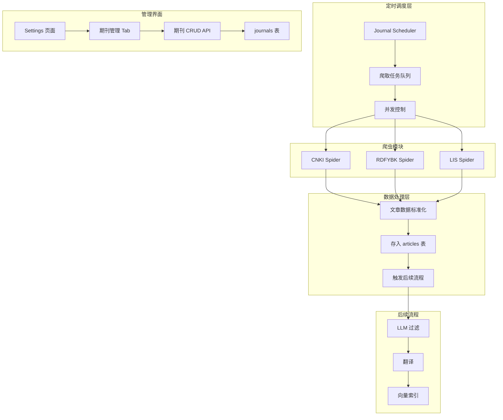

# 期刊网页定时爬取功能设计方案

## 1. 需求概述

在现有 RSS 订阅系统基础上，新增期刊网页定时爬取功能：
- 每周六凌晨定时爬取指定期刊网站的文章信息
- 支持三种期刊来源：CNKI 系列、人大报刊系列、独立网站系列
- 爬取的文章存入 `articles` 表，触发相同的后续流程（过滤、翻译、向量索引）
- 支持页面管理期刊配置（增删改）

## 2. 系统架构



## 3. 数据库设计

### 3.1 期刊表 - journals

存储待爬取期刊的基本信息。

```sql
CREATE TABLE IF NOT EXISTS journals (
  id INTEGER PRIMARY KEY AUTOINCREMENT,
  user_id INTEGER NOT NULL,
  name TEXT NOT NULL,                    -- 期刊名称
  source_type TEXT NOT NULL CHECK(source_type IN ('cnki', 'rdfybk', 'lis')),  -- 期刊来源类型
  source_url TEXT,                       -- 期刊 URL 或导航页 URL
  journal_code TEXT,                     -- 期刊代码（人大报刊专用）
  publication_cycle TEXT NOT NULL,       -- 发行周期：monthly/bimonthly/semimonthly/quarterly
  issues_per_year INTEGER NOT NULL,      -- 每年期数
  volume_offset INTEGER DEFAULT 1956,     -- 卷号计算偏移量: volume = year - volume_offset
  last_year INTEGER,                     -- 上次爬取年份
  last_issue INTEGER,                    -- 上次爬取期号
  last_volume INTEGER,                   -- 上次爬取卷号（LIS期刊使用）
  status TEXT DEFAULT 'active' CHECK(status IN ('active', 'inactive')),
  created_at DATETIME DEFAULT CURRENT_TIMESTAMP,
  updated_at DATETIME DEFAULT CURRENT_TIMESTAMP,
  FOREIGN KEY (user_id) REFERENCES users(id) ON DELETE CASCADE
);

CREATE INDEX IF NOT EXISTS idx_journals_user_id ON journals(user_id);
CREATE INDEX IF NOT EXISTS idx_journals_status ON journals(status);
CREATE INDEX IF NOT EXISTS idx_journals_source_type ON journals(source_type);
```

> **注意**：
> - `volume_offset` 字段用于 LIS 期刊卷号计算（如 2026 - 1956 = 70 卷）
> - 人大报刊使用 `journal_code` 而非 `source_url`

### 3.2 爬取记录表 - journal_crawl_logs

记录每次爬取的详细信息，用于追踪和排错。

```sql
CREATE TABLE IF NOT EXISTS journal_crawl_logs (
  id INTEGER PRIMARY KEY AUTOINCREMENT,
  journal_id INTEGER NOT NULL,
  crawl_year INTEGER NOT NULL,           -- 爬取年份
  crawl_issue INTEGER NOT NULL,          -- 爬取期号
  articles_count INTEGER DEFAULT 0,      -- 爬取文章数
  new_articles_count INTEGER DEFAULT 0,  -- 新增文章数
  status TEXT NOT NULL CHECK(status IN ('success', 'failed', 'partial')),
  error_message TEXT,
  duration_ms INTEGER,                   -- 爬取耗时（毫秒）
  created_at DATETIME DEFAULT CURRENT_TIMESTAMP,
  FOREIGN KEY (journal_id) REFERENCES journals(id) ON DELETE CASCADE
);

CREATE INDEX IF NOT EXISTS idx_journal_crawl_logs_journal_id ON journal_crawl_logs(journal_id);
CREATE INDEX IF NOT EXISTS idx_journal_crawl_logs_created_at ON journal_crawl_logs(created_at);
```

### 3.3 数据库类型定义更新

在 [`src/db.ts`](src/db.ts) 中新增表类型定义：

```typescript
export interface JournalsTable {
  id: number;
  user_id: number;
  name: string;
  source_type: 'cnki' | 'rdfybk' | 'lis';
  source_url: string | null;
  journal_code: string | null;
  publication_cycle: string;
  issues_per_year: number;
  volume_offset: number;          // 卷号计算偏移量
  last_year: number | null;
  last_issue: number | null;
  last_volume: number | null;     // 上次爬取卷号
  status: 'active' | 'inactive';
  created_at: string;
  updated_at: string;
}

export interface JournalCrawlLogsTable {
  id: number;
  journal_id: number;
  crawl_year: number;
  crawl_issue: number;
  crawl_volume: number | null;    // 爬取卷号（LIS期刊使用）
  articles_count: number;
  new_articles_count: number;
  status: 'success' | 'failed' | 'partial';
  error_message: string | null;
  duration_ms: number | null;
  created_at: string;
}
```

### 3.4 articles 表区分来源

现有 `articles` 表通过 `rss_source_id` 字段关联 `rss_sources` 表。期刊爬取的文章没有对应的 RSS 来源，需要区分：

**方案**：新增 `source_origin` 字段区分文章来源

```sql
-- 新增迁移脚本
ALTER TABLE articles ADD COLUMN source_origin TEXT DEFAULT 'rss' CHECK(source_origin IN ('rss', 'journal'));
ALTER TABLE articles ADD COLUMN journal_id INTEGER REFERENCES journals(id);
```

```typescript
// 更新类型定义
export interface ArticlesTable {
  // ... 现有字段
  rss_source_id: number | null;    // RSS来源（期刊文章为 null）
  source_origin: 'rss' | 'journal'; // 文章来源
  journal_id: number | null;        // 期刊ID（RSS文章为 null）
}
```

**数据写入逻辑**：
- RSS 文章：`rss_source_id` 有值，`source_origin = 'rss'`，`journal_id = null`
- 期刊文章：`rss_source_id = null`，`source_origin = 'journal'`，`journal_id` 有值

## 4. 目录结构设计

```
src/
├── spiders/                           # 爬虫模块（新增）
│   ├── index.ts                       # 导出入口
│   ├── types.ts                       # 类型定义
│   ├── base-spider.ts                 # 爬虫基类
│   ├── cnki-spider.ts                 # CNKI 期刊爬虫
│   ├── rdfybk-spider.ts               # 人大报刊爬虫
│   ├── lis-spider.ts                  # 图书情报工作爬虫
│   └── utils.ts                       # 工具函数
├── journal-scheduler.ts               # 期刊爬取调度器（新增）
├── api/
│   ├── journals.ts                    # 期刊管理服务（新增）
│   └── routes/
│       └── journals.routes.ts         # 期刊管理路由（新增）
└── db.ts                              # 数据库（更新类型）
```

## 5. 爬虫模块设计

### 5.1 架构选择：Python 子进程调用

考虑到现有 Python 爬虫代码（cnki_spider.py ~1000行、rdfybk_spider.py ~740行、lis_spider.py ~830行）已经过测试和验证，包含复杂的反爬策略处理，建议采用 **Node.js 调用 Python 子进程** 的方案：

```
┌─────────────────────────────────────────────────────────────┐
│                    Node.js 主应用                           │
│  ┌──────────────────┐    ┌────────────────────────────┐  │
│  │ JournalScheduler │───>│ Python 子进程管理器         │  │
│  │ (调度+状态管理)   │    │ (child_process.spawn)     │  │
│  └──────────────────┘    └─────────────┬──────────────┘  │
│                                       │                   │
│                                       ▼                   │
│                              ┌──────────────────────┐     │
│                              │ Python 爬虫脚本     │     │
│                              │ - cnki_spider.py    │     │
│                              │ - rdfybk_spider.py  │     │
│                              │ - lis_spider.py     │     │
│                              └──────────┬───────────┘     │
│                                         │                │
│                                         ▼                │
│                                  输出 JSON 结果           │
└─────────────────────────────────────────────────────────┘
```

**优点**：
- 复用现有 8000+ 行经过测试的 Python 代码
- 快速上线，减少重复开发
- 爬虫与主应用解耦
- 方便后期渐进式迁移

### 5.2 子进程调用封装 - python-spider-runner.ts

```typescript
import { spawn } from 'child_process';
import { logger } from '../logger.js';
import path from 'path';

const log = logger.child({ module: 'python-spider-runner' });

export interface SpiderResult {
  success: boolean;
  articles: CrawledArticle[];
  error?: string;
}

export class PythonSpiderRunner {
  private pythonPath: string;
  private scriptsDir: string;

  constructor() {
    this.pythonPath = process.env.PYTHON_PATH || 'python';
    this.scriptsDir = path.join(process.cwd(), 'docs', '期刊网页定时爬取');
  }

  /**
   * 运行 Python 爬虫
   */
  async runSpider(
    spiderType: 'cnki' | 'rdfybk' | 'lis',
    params: {
      url?: string;
      code?: string;
      year: number;
      issue: number;
    }
  ): Promise<SpiderResult> {
    return new Promise((resolve, reject) => {
      const scriptMap = {
        cnki: 'cnki_spider.py',
        rdfybk: 'rdfybk_spider.py',
        lis: 'lis_spider.py',
      };

      const script = scriptMap[spiderType];
      const args = this.buildArgs(spiderType, params);

      log.info({ script, args }, 'Running Python spider');

      const proc = spawn(this.pythonPath, [script, ...args], {
        cwd: this.scriptsDir,
        stdio: ['pipe', 'pipe', 'pipe'],
      });

      let stdout = '';
      let stderr = '';

      proc.stdout.on('data', (data) => {
        stdout += data.toString();
      });

      proc.stderr.on('data', (data) => {
        stderr += data.toString();
      });

      proc.on('close', (code) => {
        if (code === 0) {
          try {
            // 解析 JSON 输出
            const result = JSON.parse(stdout);
            resolve(result);
          } catch (e) {
            log.error({ stdout, error: e }, 'Failed to parse spider output');
            resolve({ success: false, articles: [], error: 'Failed to parse output' });
          }
        } else {
          log.error({ code, stderr }, 'Python spider failed');
          resolve({ success: false, articles: [], error: stderr || `Process exited with code ${code}` });
        }
      });

      proc.on('error', (err) => {
        log.error({ error: err }, 'Failed to start Python');
        reject(err);
      });
    });
  }

  private buildArgs(type: string, params: any): string[] {
    // 根据爬虫类型构建命令行参数
    switch (type) {
      case 'cnki':
        return ['-u', params.url, '-y', String(params.year), '-i', String(params.issue)];
      case 'rdfybk':
        return ['-j', params.code, '-y', String(params.year), '-i', String(params.issue)];
      case 'lis':
        return ['-y', String(params.year), '-i', String(params.issue)];
      default:
        return [];
    }
  }
}
```

### 5.3 类型定义 - types.ts

```typescript
/**
 * 期刊来源类型
 */
export type JournalSourceType = 'cnki' | 'rdfybk' | 'lis';

/**
 * 发行周期
 */
export type PublicationCycle = 'monthly' | 'bimonthly' | 'semimonthly' | 'quarterly';

/**
 * 爬取结果
 */
export interface CrawlResult {
  success: boolean;
  articles: CrawledArticle[];
  error?: string;
}

/**
 * 爬取的文章数据
 */
export interface CrawledArticle {
  title: string;
  url: string;
  author?: string;
  abstract?: string;
  keywords?: string[];
  publishedYear: number;
  publishedIssue: number;
  pages?: string;
  doi?: string;
}

/**
 * 爬虫配置
 */
export interface SpiderConfig {
  journalInterval: number;        // 期刊间隔（毫秒）
  journalIntervalRandom: number;  // 随机化范围（毫秒）
  requestDelay: number;           // 请求间隔（毫秒）
  requestDelayRandom: number;     // 请求随机化范围（毫秒）
  timeout: number;                // 超时时间（毫秒）
  maxRetries: number;             // 最大重试次数
}
```

## 6. 调度器设计

### 6.1 调度时间协调

| 调度任务 | 默认时间 | 说明 |
|---------|---------|------|
| Journal 爬取 | 0 20 * * 6 | 每周六晚上 20:00 |

**注意**：两个调度器不能同时运行，需要互斥锁机制。

### 6.2 JournalScheduler

参考现有 [`RSSScheduler`](src/rss-scheduler.ts) 的设计模式：

```typescript
export class JournalScheduler {
  private static instance: JournalScheduler | null = null;
  private scheduledTask: cron.ScheduledTask | null = null;
  private isRunning: boolean = false;
  private isRSSRunning: boolean = false;  // RSS 调度器运行状态

  /**
   * 启动定时任务
   * 默认每周六晚上 20:00 执行（避开 RSS 爬取高峰）
   */
  start(): void {
    this.scheduledTask = cron.schedule(
      '0 20 * * 6',  // 每周六晚上 20:00
      () => this.runScheduledCrawl(),
      { timezone: 'Asia/Shanghai' }
    );
  }

  /**
   * 执行爬取任务
   */
  private async runScheduledCrawl(): Promise<void> {
    // 检查 RSS 调度器是否正在运行
    if (this.isRSSRunning) {
      log.warn('RSS scheduler is running, skip journal crawl');
      return;
    }

    // 1. 获取所有活跃期刊
    // 2. 计算需要爬取的期号（基于上次爬取记录）
    // 3. 按顺序执行爬取（带间隔）
    // 4. 保存文章到 articles 表
    // 5. 触发后续流程
  }

  /**
   * 手动触发爬取
   */
  async crawlNow(journalId?: number): Promise<CrawlResult[]> {
    // 支持爬取单个期刊或全部期刊
  }
}
```

### 6.2 爬取策略

```typescript
/**
 * 计算需要爬取的期号列表
 */
function calculateIssuesToCrawl(
  journal: Journal,
  currentYear: number,
  currentMonth: number
): Array<{ year: number; issue: number }> {
  const issues: Array<{ year: number; issue: number }> = [];
  
  // 如果从未爬取，只爬取最新一期
  if (!journal.last_year || !journal.last_issue) {
    // 计算当前最新期号
    const latestIssue = estimateLatestIssue(journal, currentYear, currentMonth);
    issues.push(latestIssue);
    return issues;
  }
  
  // 计算从上次爬取到现在的所有未爬期号
  // ... 逻辑实现
  
  return issues;
}
```

### 6.3 间隔控制

为避免触发反爬机制：
- 每个期刊之间间隔 3 分钟（支持随机化 ±30 秒）
- 每篇文章详情请求间隔 5 秒（支持随机化 ±2 秒）
- 支持配置化调整

```typescript
const CRAWL_CONFIG = {
  journalInterval: 180000,       // 期刊间隔 3 分钟
  journalIntervalRandom: 30000,  // 随机化范围 ±30 秒
  requestDelay: 5000,            // 请求间隔 5 秒
  requestDelayRandom: 2000,      // 随机化范围 ±2 秒
  maxRetries: 3,                 // 最大重试次数
  timeout: 30000,                // 超时时间 30 秒
};

/**
 * 获取随机化延迟时间
 * @param base 基础延迟（毫秒）
 * @param random 随机范围（毫秒）
 * @returns 实际延迟时间
 */
function getRandomDelay(base: number, random: number): number {
  const offset = Math.random() * random * 2 - random;  // -random 到 +random
  return Math.max(0, base + offset);
}
```

## 7. API 设计

### 7.1 期刊管理 API

| 方法 | 路径 | 描述 |
|------|------|------|
| GET | `/api/journals` | 获取期刊列表 |
| GET | `/api/journals/:id` | 获取单个期刊详情 |
| POST | `/api/journals` | 新增期刊 |
| PUT | `/api/journals/:id` | 更新期刊配置 |
| DELETE | `/api/journals/:id` | 删除期刊 |
| POST | `/api/journals/:id/crawl` | 手动触发爬取 |
| GET | `/api/journals/:id/logs` | 获取爬取日志 |

### 7.2 请求/响应示例

**新增期刊：**
```typescript
// POST /api/journals
{
  "name": "中国图书馆学报",
  "source_type": "cnki",
  "source_url": "https://navi.cnki.net/knavi/journals/ZGTS/detail",
  "publication_cycle": "bimonthly",
  "issues_per_year": 6
}

// Response
{
  "id": 1,
  "name": "中国图书馆学报",
  "source_type": "cnki",
  "source_url": "https://navi.cnki.net/knavi/journals/ZGTS/detail",
  "publication_cycle": "bimonthly",
  "issues_per_year": 6,
  "status": "active",
  "created_at": "2026-02-23T02:00:00.000Z"
}
```

**手动触发爬取：**
```typescript
// POST /api/journals/1/crawl
{
  "year": 2026,
  "issue": 1
}

// Response
{
  "success": true,
  "articles_count": 15,
  "new_articles_count": 12,
  "duration_ms": 45000
}
```

## 8. 前端设计

### 8.1 Settings 页面新增 Tab

在现有 Settings 页面新增「期刊管理」Tab：

```
┌─────────────────────────────────────────────────────────────┐
│  Settings                                                    │
├─────────────────────────────────────────────────────────────┤
│  [RSS 配置] [LLM 配置] [Chroma 配置] [期刊管理] ← 新增       │
├─────────────────────────────────────────────────────────────┤
│                                                              │
│  ┌─────────────────────────────────────────────────────────┐│
│  │ 期刊列表                                    [+ 新增期刊] ││
│  ├─────────────────────────────────────────────────────────┤│
│  │ 名称          │ 类型   │ 发行周期 │ 上次爬取 │ 操作     ││
│  ├───────────────┼────────┼──────────┼──────────┼──────────┤│
│  │ 中国图书馆学报│ CNKI   │ 双月刊   │ 2025-6   │ 爬取 编辑││
│  │ 图书情报知识  │ CNKI   │ 双月刊   │ 2025-6   │ 爬取 编辑││
│  │ 图书馆学情报学│ 人大报刊│ 月刊    │ 2025-12  │ 爬取 编辑││
│  │ 图书情报工作  │ LIS    │ 半月刊   │ 2026-4   │ 爬取 编辑││
│  └─────────────────────────────────────────────────────────┘│
│                                                              │
│  爬取设置                                                    │
│  ┌─────────────────────────────────────────────────────────┐│
│  │ 定时爬取：[开启]                                         ││
│  │ 爬取时间：[0 20 * * 6] (每周六晚上 20:00)                  ││
│  │ 期刊间隔：[180] 秒 (随机化 ±30 秒)                       ││
│  │ 请求间隔：[5] 秒 (随机化 ±2 秒)                          ││
│  └─────────────────────────────────────────────────────────┘│
│                                                              │
│  爬取日志                                                    │
│  ┌─────────────────────────────────────────────────────────┐│
│  │ 时间              │ 期刊         │ 结果 │ 新增 │ 耗时   ││
│  ├───────────────────┼──────────────┼──────┼──────┼────────┤│
│  │ 2026-02-23 02:00  │ 中国图书馆学报│ 成功 │ 12   │ 45s   ││
│  │ 2026-02-23 02:01  │ 图书情报知识 │ 成功 │ 8    │ 38s   ││
│  └─────────────────────────────────────────────────────────┘│
└─────────────────────────────────────────────────────────────┘
```

### 8.2 新增/编辑期刊表单

```
┌─────────────────────────────────────────┐
│ 新增期刊                          [×]   │
├─────────────────────────────────────────┤
│                                          │
│ 期刊名称 *                               │
│ ┌──────────────────────────────────────┐│
│ │                                      ││
│ └──────────────────────────────────────┘│
│                                          │
│ 来源类型 *                               │
│ ┌──────────────────────────────────────┐│
│ │ CNKI (中国知网)                    ▼ ││
│ └──────────────────────────────────────┘│
│                                          │
│ 期刊 URL *                               │
│ ┌──────────────────────────────────────┐│
│ │ https://navi.cnki.net/...            ││
│ └──────────────────────────────────────┘│
│                                          │
│ 发行周期 *                               │
│ ┌──────────────────────────────────────┐│
│ │ 双月刊                             ▼ ││
│ └──────────────────────────────────────┘│
│                                          │
│ 每年期数 *                               │
│ ┌──────────────────────────────────────┐│
│ │ 6                                    ││
│ └──────────────────────────────────────┘│
│                                          │
│         [取消]           [保存]          │
└─────────────────────────────────────────┘
```

## 9. 数据迁移

### 9.1 迁移脚本

创建 `sql/012_add_journals.sql`：

```sql
-- 添加期刊表
CREATE TABLE IF NOT EXISTS journals (
  id INTEGER PRIMARY KEY AUTOINCREMENT,
  user_id INTEGER NOT NULL,
  name TEXT NOT NULL,
  source_type TEXT NOT NULL CHECK(source_type IN ('cnki', 'rdfybk', 'lis')),
  source_url TEXT,
  journal_code TEXT,
  publication_cycle TEXT NOT NULL,
  issues_per_year INTEGER NOT NULL,
  last_year INTEGER,
  last_issue INTEGER,
  status TEXT DEFAULT 'active' CHECK(status IN ('active', 'inactive')),
  created_at DATETIME DEFAULT CURRENT_TIMESTAMP,
  updated_at DATETIME DEFAULT CURRENT_TIMESTAMP,
  FOREIGN KEY (user_id) REFERENCES users(id) ON DELETE CASCADE
);

CREATE INDEX IF NOT EXISTS idx_journals_user_id ON journals(user_id);
CREATE INDEX IF NOT EXISTS idx_journals_status ON journals(status);
CREATE INDEX IF NOT EXISTS idx_journals_source_type ON journals(source_type);

-- 添加爬取日志表
CREATE TABLE IF NOT EXISTS journal_crawl_logs (
  id INTEGER PRIMARY KEY AUTOINCREMENT,
  journal_id INTEGER NOT NULL,
  crawl_year INTEGER NOT NULL,
  crawl_issue INTEGER NOT NULL,
  articles_count INTEGER DEFAULT 0,
  new_articles_count INTEGER DEFAULT 0,
  status TEXT NOT NULL CHECK(status IN ('success', 'failed', 'partial')),
  error_message TEXT,
  duration_ms INTEGER,
  created_at DATETIME DEFAULT CURRENT_TIMESTAMP,
  FOREIGN KEY (journal_id) REFERENCES journals(id) ON DELETE CASCADE
);

CREATE INDEX IF NOT EXISTS idx_journal_crawl_logs_journal_id ON journal_crawl_logs(journal_id);
CREATE INDEX IF NOT EXISTS idx_journal_crawl_logs_created_at ON journal_crawl_logs(created_at);

-- 初始化期刊数据（基于 docs/期刊网页定时爬取/journals-list/ 目录下的数据）
-- CNKI 期刊
INSERT INTO journals (user_id, name, source_type, source_url, publication_cycle, issues_per_year, last_year, last_issue) VALUES
(1, '中国图书馆学报', 'cnki', 'https://navi.cnki.net/knavi/journals/ZGTS/detail', 'bimonthly', 6, 2025, 6),
(1, '图书情报知识', 'cnki', 'https://navi.cnki.net/knavi/journals/TSQC/detail', 'bimonthly', 6, 2025, 6),
(1, '信息资源管理学报', 'cnki', 'https://navi.cnki.net/knavi/journals/XNZY/detail', 'bimonthly', 6, 2025, 4),
(1, '图书馆论坛', 'cnki', 'https://navi.cnki.net/knavi/journals/TSGL/detail', 'monthly', 12, 2025, 12),
(1, '大学图书馆学报', 'cnki', 'https://navi.cnki.net/knavi/journals/DXTS/detail', 'bimonthly', 6, 2025, 6),
(1, '图书馆建设', 'cnki', 'https://navi.cnki.net/knavi/journals/TSGJ/detail', 'bimonthly', 6, 2025, 6),
(1, '国家图书馆学刊', 'cnki', 'https://navi.cnki.net/knavi/journals/BJJG/detail', 'bimonthly', 6, 2025, 6),
(1, '图书与情报', 'cnki', 'https://navi.cnki.net/knavi/journals/BOOK/detail', 'bimonthly', 6, 2025, 5),
(1, '图书馆杂志', 'cnki', 'https://navi.cnki.net/knavi/journals/TNGZ/detail', 'monthly', 12, 2025, 12),
(1, '图书馆学研究', 'cnki', 'https://navi.cnki.net/knavi/journals/TSSS/detail', 'monthly', 12, 2025, 12),
(1, '图书馆工作与研究', 'cnki', 'https://navi.cnki.net/knavi/journals/TSGG/detail', 'monthly', 12, 2025, 12),
(1, '图书馆', 'cnki', 'https://navi.cnki.net/knavi/journals/TSGT/detail', 'monthly', 12, NULL, NULL),
(1, '图书馆理论与实践', 'cnki', 'https://navi.cnki.net/knavi/journals/LSGL/detail', 'monthly', 12, 2025, 12),
(1, '文献与数据学报', 'cnki', 'https://navi.cnki.net/knavi/journals/BXJW/detail', 'quarterly', 4, 2025, 4),
(1, '农业图书情报学报', 'cnki', 'https://navi.cnki.net/knavi/journals/LYTS/detail', 'monthly', 12, 2025, 12);

-- 人大报刊期刊
INSERT INTO journals (user_id, name, source_type, journal_code, publication_cycle, issues_per_year, last_year, last_issue) VALUES
(1, '图书馆学情报学', 'rdfybk', 'G9', 'monthly', 12, 2025, 12),
(1, '档案学', 'rdfybk', 'G7', 'bimonthly', 6, NULL, NULL),
(1, '出版业', 'rdfybk', 'Z1', 'monthly', 12, NULL, NULL);

-- 独立网站期刊
INSERT INTO journals (user_id, name, source_type, source_url, publication_cycle, issues_per_year, last_year, last_issue) VALUES
(1, '图书情报工作', 'lis', 'https://www.lis.ac.cn', 'semimonthly', 24, 2026, 4);
```

## 10. 依赖更新

### 10.1 Python 依赖

确保 Python 环境已安装必要依赖（Python 爬虫脚本已有 `requirements.txt`）：

```bash
# 在 docs/期刊网页定时爬取/ 目录下
pip install -r requirements.txt
```

### 10.2 Node.js 配置

无需新增 Playwright 依赖（使用 Python 子进程方案）。

确保系统已安装 Python 3.8+ 并在环境变量中可访问。

## 11. 实施步骤

### Phase 1: 数据库与基础设施（预计工作量：低）
1. [x] 创建数据库迁移脚本 `sql/012_add_journals.sql`
2. [x] 更新 [`src/db.ts`](src/db.ts) 添加新表类型定义
3. [x] 在 articles 表新增 `source_origin` 和 `journal_id` 字段

### Phase 2: Python 子进程封装（预计工作量：中）
4. [x] 创建 [`src/spiders/types.ts`](src/spiders/types.ts) 类型定义
5. [x] 创建 [`src/spiders/python-spider-runner.ts`](src/spiders/python-spider-runner.ts) Python 子进程调用封装
6. [x] 创建 [`src/spiders/index.ts`](src/spiders/index.ts) 统一导出

### Phase 3: 调度器与服务（预计工作量：中）
7. [x] 创建 [`src/api/journals.ts`](src/api/journals.ts) 期刊管理服务
8. [x] 创建 [`src/journal-scheduler.ts`](src/journal-scheduler.ts) 调度器
9. [x] 创建 [`src/api/routes/journals.routes.ts`](src/api/routes/journals.routes.ts) API 路由
10. [x] 在 [`src/index.ts`](src/index.ts) 中初始化调度器
11. [ ] 添加 RSS 调度器互斥锁机制

### Phase 4: 前端界面（预计工作量：中）
12. [x] 在 Settings 页面新增期刊管理 Tab
13. [x] 实现期刊列表展示
14. [x] 实现新增/编辑期刊表单
15. [x] 实现手动爬取触发
16. [x] 实现爬取日志展示

### Phase 5: 测试与优化（预计工作量：低）
17. [ ] 编写单元测试
18. [ ] 集成测试
19. [ ] 性能优化（反爬策略调整）

## 12. 风险与注意事项

### 12.1 反爬风险
- CNKI 和人大报刊网站有反爬机制
- 需要合理设置请求间隔
- 可能需要处理验证码（极端情况）
- 建议在凌晨低峰期执行

### 12.2 数据一致性
- 爬取的文章需要与 RSS 文章区分（可通过 `rss_source_id` 为 NULL 或新增 `source_type` 字段）
- 避免重复爬取（通过 URL 去重）

### 12.3 错误处理
- 网络超时重试机制
- 部分失败不影响其他期刊
- 详细的错误日志记录

## 13. 后续扩展

- 支持更多期刊来源
- 支持自定义爬虫脚本
- 支持爬取历史数据
- 支持增量更新策略配置

---

## 14. 实施总结（2026-02-23）

### 14.1 完成状态

所有 Phase 1-4 的任务已完成，Phase 5 测试与优化待后续进行。

### 14.2 实际创建的文件

| 文件路径 | 说明 |
|---------|------|
| `sql/012_add_journals.sql` | 数据库迁移脚本（含 journals 表、journal_crawl_logs 表、articles 表字段扩展、初始数据） |
| `src/spiders/types.ts` | 爬虫类型定义（JournalSourceType, SpiderRunParams, CrawledArticle 等） |
| `src/spiders/python-spider-runner.ts` | Python 子进程调用封装 |
| `src/spiders/index.ts` | 统一导出入口 |
| `src/spiders/cnki_spider.py` | CNKI 期刊爬虫（从 `docs/期刊网页定时爬取/` 移动并修改） |
| `src/spiders/rdfybk_spider.py` | 人大报刊爬虫（从 `docs/期刊网页定时爬取/` 移动并修改） |
| `src/spiders/lis_spider.py` | 图书情报工作爬虫（从 `docs/期刊网页定时爬取/` 移动并修改） |
| `src/spiders/paper_detail.py` | 论文详情抓取模块（从 `docs/期刊网页定时爬取/` 移动） |
| `src/spiders/rdfybk_detail.py` | 人大报刊详情抓取模块（从 `docs/期刊网页定时爬取/` 移动） |
| `src/spiders/json_sanitizer.py` | JSON 清理工具（从 `docs/期刊网页定时爬取/` 移动） |
| `src/spiders/requirements.txt` | Python 依赖（从 `docs/期刊网页定时爬取/` 移动） |
| `src/api/journals.ts` | 期刊管理服务（CRUD、期号计算、爬取日志） |
| `src/journal-scheduler.ts` | 期刊爬取调度器 |
| `src/api/routes/journals.routes.ts` | REST API 路由 |
| `src/views/settings/panel-journals.ejs` | 期刊管理面板 |

### 14.3 修改的文件

| 文件路径 | 修改内容 |
|---------|---------|
| `src/db.ts` | 新增 JournalsTable、JournalCrawlLogsTable 类型定义；更新 ArticlesTable 添加 source_origin、journal_id 字段 |
| `src/api/routes.ts` | 注册 journalsRoutes |
| `src/index.ts` | 初始化 JournalScheduler 并添加关闭处理 |
| `src/views/settings/body.ejs` | 添加「期刊管理」Tab 按钮 |
| `src/views/settings/modals.ejs` | 添加期刊表单模态框和爬取模态框 |
| `src/public/js/settings.js` | 添加期刊管理 JavaScript 逻辑 |

### 14.4 与原设计的差异

1. **Python 脚本位置**：原设计保留在 `docs/期刊网页定时爬取/`，实际移动到 `src/spiders/` 目录，便于统一管理。

2. **Python 输出方式**：修改了三个 Python 爬虫脚本，新增 `-o -` 参数支持 JSON 输出到 stdout，日志输出到 stderr，便于 Node.js 解析。

3. **调度器互斥**：原设计提到 RSS 调度器互斥锁机制，实际实现中暂未添加（可后续优化）。

4. **volume_offset 字段**：数据库迁移脚本中未包含此字段，可后续按需添加。

5. **crawl_volume 字段**：journal_crawl_logs 表中未包含此字段，可后续按需添加。

### 14.5 使用说明

1. **运行数据库迁移**：
   ```bash
   sqlite3 data.db < sql/012_add_journals.sql
   ```

2. **安装 Python 依赖**：
   ```bash
   pip install -r src/spiders/requirements.txt
   ```

3. **配置环境变量**（可选）：
   ```env
   PYTHON_PATH=python  # 或 python3
   ```

4. **访问管理界面**：
   - 启动应用后访问 Settings 页面
   - 点击「期刊管理」Tab 进行期刊配置和手动爬取

### 14.6 待完成事项

- [ ] Phase 5: 单元测试
- [ ] Phase 5: 集成测试
- [ ] Phase 5: 性能优化（反爬策略调整）
- [ ] RSS 调度器互斥锁机制
- [ ] volume_offset 字段（如需要）
- [ ] crawl_volume 字段（如需要）
