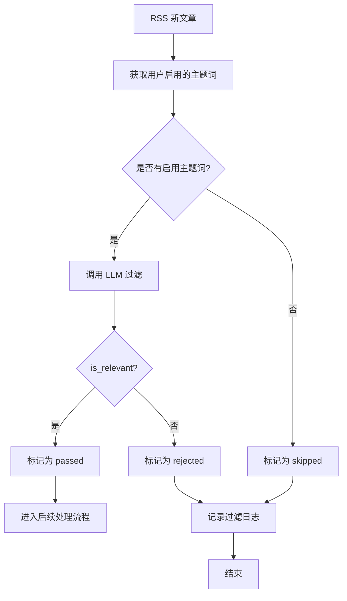

# 主题词过滤功能设计文档

## 📋 功能概述

在 RSS 文献追踪系统中增加主题词过滤机制，系统定时检测到 RSS 新文章后，先根据用户关注的主题领域（主题词）调用大模型进行过滤，只有通过的文章才进入后续的总结、QMD 关联等流程。

## 🎯 核心需求

1. **主题词管理**：用户可以添加、编辑、删除关注的主题领域和主题词
2. **大模型过滤**：使用 LLM 判断文章是否与主题词相关
3. **管理页面**：提供 Web 界面管理主题词
4. **过滤流程**：在 RSS 抓取后、处理前进行过滤

## 🗄️ 数据库设计

### 1. 主题领域表 (topic_domains)

```sql
CREATE TABLE topic_domains (
  id INTEGER PRIMARY KEY AUTOINCREMENT,
  user_id INTEGER NOT NULL REFERENCES users(id),
  name VARCHAR(255) NOT NULL,           -- 主题领域名称，如"人工智能"、"机器学习"
  description TEXT,                     -- 主题领域描述
  is_active BOOLEAN DEFAULT 1,          -- 是否启用
  priority INTEGER DEFAULT 0,           -- 优先级，数字越大优先级越高
  created_at TIMESTAMP DEFAULT CURRENT_TIMESTAMP,
  updated_at TIMESTAMP DEFAULT CURRENT_TIMESTAMP,
  UNIQUE(user_id, name)
);

CREATE INDEX idx_topic_domains_user ON topic_domains(user_id);
CREATE INDEX idx_topic_domains_active ON topic_domains(is_active);
```

### 2. 主题词表 (topic_keywords)

```sql
CREATE TABLE topic_keywords (
  id INTEGER PRIMARY KEY AUTOINCREMENT,
  domain_id INTEGER NOT NULL REFERENCES topic_domains(id) ON DELETE CASCADE,
  keyword VARCHAR(255) NOT NULL,        -- 主题词，如"深度学习"、"神经网络"
  description TEXT,                     -- 主题词描述
  weight DECIMAL(3,2) DEFAULT 1.0,     -- 权重，0.0-1.0，用于计算相关性
  is_active BOOLEAN DEFAULT 1,          -- 是否启用
  created_at TIMESTAMP DEFAULT CURRENT_TIMESTAMP,
  updated_at TIMESTAMP DEFAULT CURRENT_TIMESTAMP,
  UNIQUE(domain_id, keyword)
);

CREATE INDEX idx_topic_keywords_domain ON topic_keywords(domain_id);
CREATE INDEX idx_topic_keywords_active ON topic_keywords(is_active);
```

### 3. 文章过滤记录表 (article_filter_logs)

```sql
CREATE TABLE article_filter_logs (
  id INTEGER PRIMARY KEY AUTOINCREMENT,
  article_id INTEGER NOT NULL REFERENCES articles(id) ON DELETE CASCADE,
  domain_id INTEGER REFERENCES topic_domains(id),
  is_passed BOOLEAN NOT NULL,          -- 是否通过过滤
  relevance_score DECIMAL(5,4),         -- 相关性评分 0.0-1.0
  matched_keywords TEXT,                -- 匹配的主题词（JSON 数组）
  filter_reason TEXT,                   -- 过滤原因
  llm_response TEXT,                    -- LLM 原始响应
  created_at TIMESTAMP DEFAULT CURRENT_TIMESTAMP
);

CREATE INDEX idx_article_filter_logs_article ON article_filter_logs(article_id);
CREATE INDEX idx_article_filter_logs_passed ON article_filter_logs(is_passed);
CREATE INDEX idx_article_filter_logs_domain ON article_filter_logs(domain_id);
```

### 4. 修改 articles 表

```sql
-- 添加过滤状态字段
ALTER TABLE articles ADD COLUMN filter_status VARCHAR(20) DEFAULT 'pending';
-- filter_status: pending(待过滤), passed(通过), rejected(拒绝), skipped(跳过)

ALTER TABLE articles ADD COLUMN filtered_at TIMESTAMP;
ALTER TABLE articles ADD COLUMN filter_score DECIMAL(5,4);  -- 最高相关性评分
```

## 🤖 大模型过滤逻辑

### 过滤提示词设计

```typescript
const FILTER_PROMPT = `你是一个专业的文献内容分析助手。请判断以下文章是否与用户关注的主题相关。

## 用户关注的主题领域和主题词：

${topicDomains.map(domain => `
### ${domain.name}
${domain.keywords.map(kw => `- ${kw.keyword} (权重: ${kw.weight})`).join('\n')}
`).join('\n')}

## 待分析文章信息：

标题：${article.title}
链接：${article.url}
摘要：${article.summary || '无'}
内容片段：${article.contentSnippet || '无'}

## 分析要求：

1. 评估文章与上述主题词的相关性（0.0-1.0）
2. 列出匹配的主题词（至少一个才通过）
3. 提供简短的判断理由

## 输出格式（JSON）：

{
  "is_relevant": true/false,
  "relevance_score": 0.85,
  "matched_keywords": ["深度学习", "神经网络"],
  "reason": "文章详细介绍了深度学习在图像识别中的应用，与主题高度相关"
}

请严格按照 JSON 格式输出，不要包含其他内容。`;
```

### 过滤流程



### 过滤策略

| 场景 | 处理方式 |
|------|---------|
| **无启用主题词** | 所有文章通过（skipped） |
| **relevance_score >= 0.6** | 通过（passed） |
| **relevance_score < 0.6** | 拒绝（rejected） |
| **LLM 调用失败** | 降级为关键词匹配（passed 如果匹配） |
| **匹配关键词数 >= 1** | 通过（passed） |
| **匹配关键词数 = 0** | 拒绝（rejected） |

## 🌐 API 接口设计

### 1. 主题领域管理

#### 获取主题领域列表
```
GET /api/topic-domains
Query: ?user_id=1&include_keywords=true
Response: {
  "success": true,
  "data": [
    {
      "id": 1,
      "name": "人工智能",
      "description": "AI 相关技术",
      "is_active": true,
      "priority": 10,
      "keywords": [
        {
          "id": 1,
          "keyword": "深度学习",
          "weight": 1.0
        }
      ]
    }
  ]
}
```

#### 创建主题领域
```
POST /api/topic-domains
Body: {
  "name": "人工智能",
  "description": "AI 相关技术",
  "priority": 10
}
Response: {
  "success": true,
  "data": { "id": 1, ... }
}
```

#### 更新主题领域
```
PUT /api/topic-domains/:id
Body: {
  "name": "人工智能",
  "description": "AI 相关技术",
  "is_active": true,
  "priority": 10
}
```

#### 删除主题领域
```
DELETE /api/topic-domains/:id
Response: { "success": true }
```

### 2. 主题词管理

#### 获取主题词列表
```
GET /api/topic-domains/:domain_id/keywords
Response: {
  "success": true,
  "data": [
    {
      "id": 1,
      "keyword": "深度学习",
      "description": "神经网络相关",
      "weight": 1.0,
      "is_active": true
    }
  ]
}
```

#### 创建主题词
```
POST /api/topic-domains/:domain_id/keywords
Body: {
  "keyword": "深度学习",
  "description": "神经网络相关",
  "weight": 1.0
}
```

#### 更新主题词
```
PUT /api/topic-keywords/:id
Body: {
  "keyword": "深度学习",
  "weight": 0.8,
  "is_active": true
}
```

#### 删除主题词
```
DELETE /api/topic-keywords/:id
```

### 3. 过滤日志查询

#### 获取过滤日志
```
GET /api/article-filter-logs
Query: ?article_id=1&domain_id=1&is_passed=true&page=1&limit=20
Response: {
  "success": true,
  "data": [...],
  "pagination": { "total": 100, "page": 1, "limit": 20 }
}
```

#### 获取文章过滤统计
```
GET /api/article-filter-stats
Query: ?start_date=2024-01-01&end_date=2024-01-31
Response: {
  "success": true,
  "data": {
    "total": 1000,
    "passed": 600,
    "rejected": 300,
    "skipped": 100,
    "pass_rate": 0.6
  }
}
```

## 🎨 前端页面设计

### 1. 主题词管理页面 (`/topic-domains`)

#### 页面布局
```
┌─────────────────────────────────────────────────────────┐
│  主题词管理                                    [+ 新建领域] │
├─────────────────────────────────────────────────────────┤
│                                                         │
│  ┌───────────────────────────────────────────────────┐ │
│  │ 📁 人工智能 (10 个主题词)  [✓ 启用]  [编辑] [删除] │ │
│  │    深度学习、神经网络、机器学习...                 │ │
│  └───────────────────────────────────────────────────┘ │
│                                                         │
│  ┌───────────────────────────────────────────────────┐ │
│  │ 📁 自然语言处理 (5 个主题词)  [✓ 启用]  [编辑] [删除] │ │
│  │    NLP、文本分析、语言模型...                      │ │
│  └───────────────────────────────────────────────────┘ │
│                                                         │
└─────────────────────────────────────────────────────────┘
```

#### 新建/编辑主题领域模态框
```
┌─────────────────────────────────────┐
│  新建主题领域              [×]       │
├─────────────────────────────────────┤
│  名称: [________________________]   │
│  描述: [________________________]   │
│       [________________________]   │
│  优先级: [10]                      │
│  [✓] 启用                          │
│                                     │
│  [取消]              [保存]        │
└─────────────────────────────────────┘
```

### 2. 主题词详情页面 (`/topic-domains/:id`)

#### 页面布局
```
┌─────────────────────────────────────────────────────────┐
│  ← 返回  人工智能                          [+ 添加主题词] │
├─────────────────────────────────────────────────────────┤
│  描述: AI 相关技术                                      │
│  优先级: 10  [✓ 启用                                   │
├─────────────────────────────────────────────────────────┤
│                                                         │
│  主题词列表:                                            │
│  ┌───────────────────────────────────────────────────┐ │
│  │ 深度学习  权重: 1.0  [✓]  [编辑] [删除]          │ │
│  │ 神经网络  权重: 0.9  [✓]  [编辑] [删除]          │ │
│  │ 机器学习  权重: 0.8  [✗]  [编辑] [删除]          │ │
│  └───────────────────────────────────────────────────┘ │
│                                                         │
└─────────────────────────────────────────────────────────┘
```

#### 添加/编辑主题词模态框
```
┌─────────────────────────────────────┐
│  添加主题词                [×]       │
├─────────────────────────────────────┤
│  主题词: [________________________]  │
│  描述: [________________________]   │
│  权重: [1.0] (0.0 - 1.0)           │
│  [✓] 启用                          │
│                                     │
│  [取消]              [保存]        │
└─────────────────────────────────────┘
```

### 3. 过滤日志页面 (`/filter-logs`)

#### 页面布局
```
┌─────────────────────────────────────────────────────────┐
│  过滤日志                                    [导出 CSV] │
├─────────────────────────────────────────────────────────┤
│  筛选: [全部 ▼]  [日期范围: 2024-01-01 ~ 2024-01-31]   │
│                                                         │
│  ┌───────────────────────────────────────────────────┐ │
│  │ 2024-01-15 10:30  ✓ 通过  0.85                   │ │
│  │ 文章: 深度学习在图像识别中的应用                  │ │
│  │ 匹配: 深度学习、神经网络                          │ │
│  │ 原因: 文章详细介绍了深度学习...                   │ │
│  └───────────────────────────────────────────────────┘ │
│                                                         │
│  ┌───────────────────────────────────────────────────┐ │
│  │ 2024-01-15 10:25  ✗ 拒绝  0.30                   │ │
│  │ 文章: 如何种植有机蔬菜                            │ │
│  │ 匹配: 无                                          │ │
│  │ 原因: 文章内容与主题无关                          │ │
│  └───────────────────────────────────────────────────┘ │
│                                                         │
└─────────────────────────────────────────────────────────┘
```

### 4. 过滤统计页面 (`/filter-stats`)

#### 页面布局
```
┌─────────────────────────────────────────────────────────┐
│  过滤统计                                    [刷新]       │
├─────────────────────────────────────────────────────────┤
│  时间范围: [2024-01-01] ~ [2024-01-31]  [查询]         │
│                                                         │
│  总体统计:                                              │
│  ┌───────────────────────────────────────────────────┐ │
│  │  总文章数: 1,000                                  │ │
│  │  通过: 600 (60%)  ████████████████████░░░░░░░░░   │ │
│  │  拒绝: 300 (30%)  ████████████░░░░░░░░░░░░░░░░   │ │
│  │  跳过: 100 (10%)  ██████░░░░░░░░░░░░░░░░░░░░░░   │ │
│  └───────────────────────────────────────────────────┘ │
│                                                         │
│  按主题领域统计:                                        │
│  ┌───────────────────────────────────────────────────┐ │
│  │  人工智能: 500 篇, 通过率 70%                     │ │
│  │  自然语言处理: 300 篇, 通过率 50%                 │ │
│  │  计算机视觉: 200 篇, 通过率 65%                   │ │
│  └───────────────────────────────────────────────────┘ │
│                                                         │
└─────────────────────────────────────────────────────────┘
```

## 🔧 实现细节

### 1. 过滤服务模块 (`src/filter.ts`)

```typescript
interface FilterOptions {
  minRelevanceScore?: number;  // 最小相关性评分，默认 0.6
  requireKeywordMatch?: boolean;  // 是否要求至少匹配一个关键词
  fallbackToKeywordMatch?: boolean;  // LLM 失败时是否降级到关键词匹配
}

class ArticleFilter {
  async filterArticle(
    article: Article,
    topicDomains: TopicDomain[],
    options: FilterOptions = {}
  ): Promise<FilterResult> {
    // 1. 检查是否有启用的主题词
    const activeDomains = topicDomains.filter(d => d.is_active);
    if (activeDomains.length === 0) {
      return { is_passed: true, status: 'skipped', reason: '无启用主题词' };
    }

    // 2. 调用 LLM 过滤
    try {
      const llmResult = await this.callLLM(article, activeDomains);
      
      // 3. 判断是否通过
      const minScore = options.minRelevanceScore ?? 0.6;
      const isPassed = llmResult.is_relevant && 
                       llmResult.relevance_score >= minScore &&
                       llmResult.matched_keywords.length > 0;

      // 4. 记录过滤日志
      await this.logFilterResult(article, llmResult, isPassed);

      return {
        is_passed: isPassed,
        status: isPassed ? 'passed' : 'rejected',
        relevance_score: llmResult.relevance_score,
        matched_keywords: llmResult.matched_keywords,
        reason: llmResult.reason
      };
    } catch (error) {
      // 5. LLM 失败，降级到关键词匹配
      if (options.fallbackToKeywordMatch) {
        const keywordResult = await this.keywordMatch(article, activeDomains);
        return keywordResult;
      }
      
      // 6. 失败处理
      return {
        is_passed: false,
        status: 'rejected',
        reason: 'LLM 调用失败'
      };
    }
  }

  private async callLLM(
    article: Article,
    domains: TopicDomain[]
  ): Promise<LLMFilterResult> {
    const prompt = this.buildFilterPrompt(article, domains);
    const response = await llm.chat(prompt, { jsonMode: true });
    return JSON.parse(response);
  }

  private async keywordMatch(
    article: Article,
    domains: TopicDomain[]
  ): Promise<FilterResult> {
    const text = `${article.title} ${article.summary} ${article.contentSnippet}`.toLowerCase();
    const matchedKeywords: string[] = [];
    let maxScore = 0;

    for (const domain of domains) {
      for (const keyword of domain.keywords.filter(k => k.is_active)) {
        if (text.includes(keyword.keyword.toLowerCase())) {
          matchedKeywords.push(keyword.keyword);
          maxScore = Math.max(maxScore, keyword.weight);
        }
      }
    }

    const isPassed = matchedKeywords.length > 0;
    return {
      is_passed: isPassed,
      status: isPassed ? 'passed' : 'rejected',
      relevance_score: maxScore,
      matched_keywords: matchedKeywords,
      reason: isPassed ? '关键词匹配' : '无匹配关键词'
    };
  }
}
```

### 2. 集成到 RSS 处理流程

```typescript
// 在 pipeline.ts 中集成
async function processRSSArticle(article: RSSArticle) {
  // 1. 保存文章到数据库（状态: pending）
  const savedArticle = await db.insertInto('articles')
    .values({
      title: article.title,
      url: article.link,
      summary: article.description,
      content: article.content,
      filter_status: 'pending',
      created_at: new Date()
    })
    .returningAll()
    .executeTakeFirst();

  // 2. 获取用户的主题词配置
  const topicDomains = await getActiveTopicDomains(userId);

  // 3. 执行过滤
  const filter = new ArticleFilter();
  const filterResult = await filter.filterArticle(savedArticle, topicDomains);

  // 4. 更新文章过滤状态
  await db.updateTable('articles')
    .set({
      filter_status: filterResult.status,
      filter_score: filterResult.relevance_score,
      filtered_at: new Date()
    })
    .where('id', '=', savedArticle.id)
    .execute();

  // 5. 如果通过，继续后续处理
  if (filterResult.is_passed) {
    await processArticleContent(savedArticle);
  }
}
```

### 3. Web API 路由

```typescript
// 在 web.ts 中添加路由
app.get('/api/topic-domains', async (req, res) => {
  const userId = req.user.id;
  const includeKeywords = req.query.include_keywords === 'true';
  
  const domains = await db.selectFrom('topic_domains')
    .where('user_id', '=', userId)
    .selectAll()
    .execute();

  if (includeKeywords) {
    for (const domain of domains) {
      domain.keywords = await db.selectFrom('topic_keywords')
        .where('domain_id', '=', domain.id)
        .selectAll()
        .execute();
    }
  }

  res.json({ success: true, data: domains });
});

app.post('/api/topic-domains', async (req, res) => {
  const userId = req.user.id;
  const { name, description, priority } = req.body;

  const domain = await db.insertInto('topic_domains')
    .values({
      user_id: userId,
      name,
      description,
      priority: priority ?? 0
    })
    .returningAll()
    .executeTakeFirst();

  res.json({ success: true, data: domain });
});

// ... 其他路由
```

## 📊 性能优化

1. **批量过滤**：一次 LLM 调用可以过滤多篇文章
2. **缓存机制**：缓存 LLM 响应，避免重复调用
3. **异步处理**：过滤操作异步执行，不阻塞 RSS 抓取
4. **降级策略**：LLM 失败时降级到关键词匹配
5. **索引优化**：为过滤日志表添加合适的索引

## 🔄 更新 PRD 文档

需要在 [`docs/prd/初始讨论.md`](docs/prd/初始讨论.md:1) 中添加以下内容：

1. 在"需要新增的功能"部分添加主题词过滤功能
2. 在数据库设计部分添加主题词相关表
3. 在实现路线图中添加主题词过滤阶段
4. 更新技术栈说明

## 📝 总结

主题词过滤功能通过以下方式增强 RSS 文献追踪系统：

1. **智能过滤**：使用 LLM 判断文章相关性，提高过滤准确性
2. **灵活配置**：用户可以自定义主题领域和主题词
3. **可视化管理**：提供完整的管理界面和统计功能
4. **降级保障**：LLM 失败时降级到关键词匹配，确保系统稳定性
5. **可追溯性**：记录所有过滤日志，便于分析和优化
