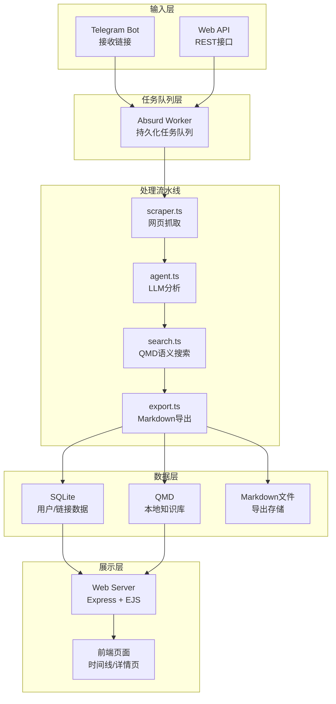
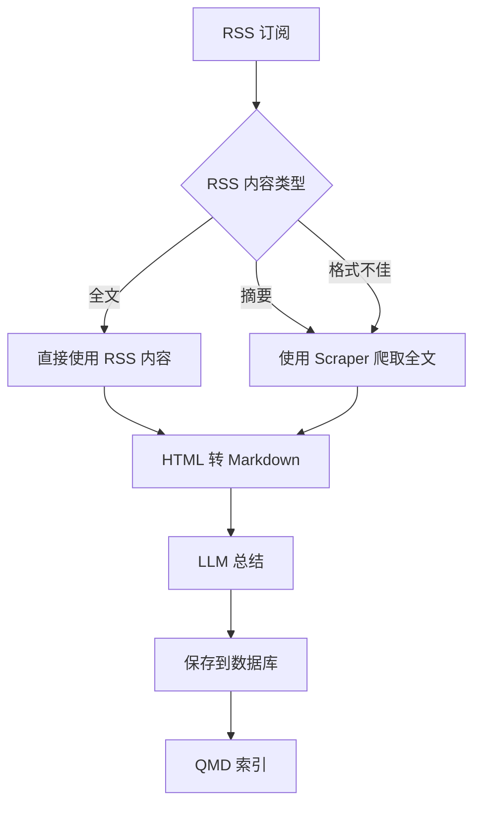
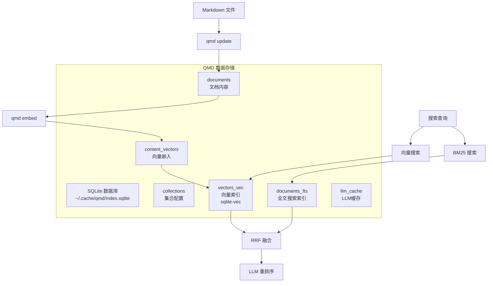
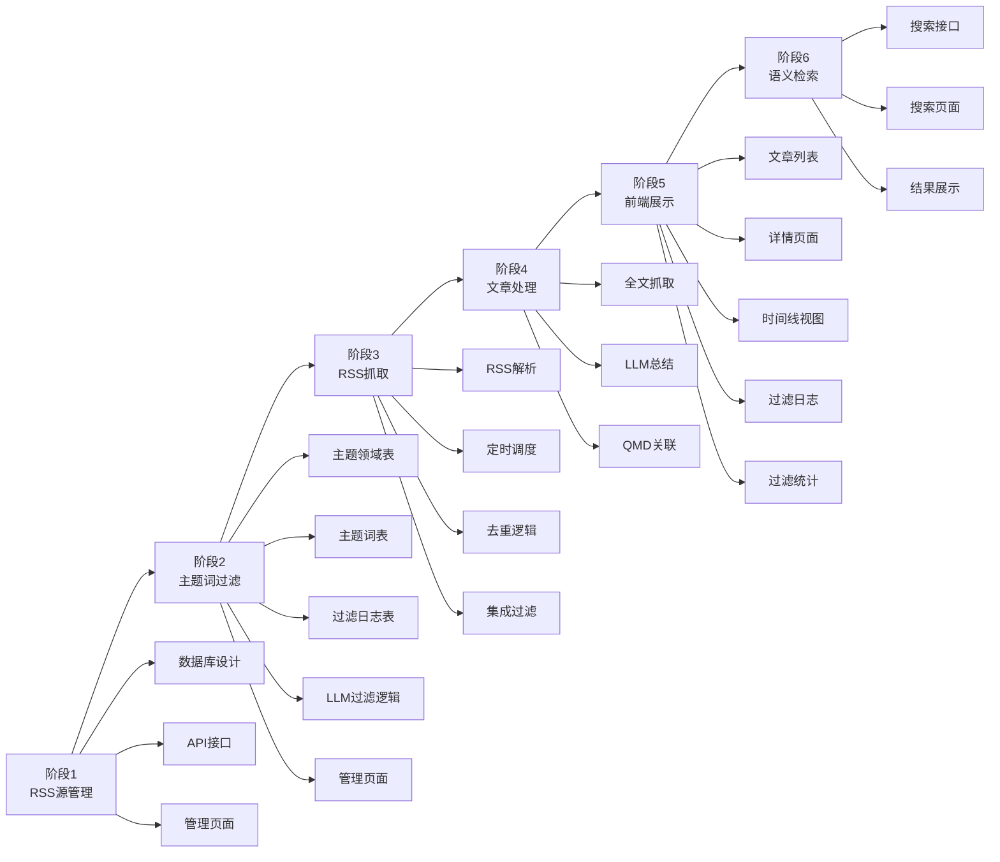

根据对 linkmind-master 项目的深入分析，这是一个非常完善的智能链接收藏和分析系统。下面我将详细分析其架构和可复用模块。

## 📊 LinkMind 项目架构概览



## 🔧 核心模块分析

### 1. **scraper.ts** - 网页抓取模块 ⭐⭐⭐⭐⭐
**功能**：使用 Playwright + Defuddle 抓取网页内容并转换为 Markdown

**可复用性**：极高
- 支持普通网页抓取
- 支持 Twitter/X 推文抓取（通过 bird CLI）
- 提取 OG 元数据（标题、描述、图片等）
- HTML 转 Markdown 转换
- 去除导航、广告等无关内容

**适用于你的项目**：RSS 文章全文获取

### 2. **agent.ts** - LLM 分析模块 ⭐⭐⭐⭐⭐
**功能**：调用大模型生成摘要、标签、insight

**可复用性**：极高
- 生成中文摘要（3-5句话）
- 提取关键词标签
- 结合相关内容生成个性化 insight
- 支持 OpenAI 兼容 API 和 Google Gemini

**适用于你的项目**：RSS 文章大模型总结

### 3. **search.ts** - QMD 语义搜索模块 ⭐⭐⭐⭐⭐
**功能**：通过 QMD 进行语义搜索，查找相关笔记和历史链接

**可复用性**：极高
- 搜索笔记库（目前被禁用，但代码完整）
- 搜索历史链接
- 支持重试机制（SQLITE_BUSY）
- 降级到 SQLite LIKE 搜索

**适用于你的项目**：RSS 文章关联已有文档

### 4. **export.ts** - Markdown 导出模块 ⭐⭐⭐⭐
**功能**：将链接记录导出为 Markdown 文件供 QMD 索引

**可复用性**：高
- 生成带 YAML front matter 的 Markdown
- QMD 索引队列（避免并发冲突）
- 自动触发 `qmd update` 和 `qmd embed`

**适用于你的项目**：RSS 文章保存为 Markdown 并建立索引

### 5. **pipeline.ts** - 处理流水线模块 ⭐⭐⭐⭐⭐
**功能**：协调抓取、分析、导出三个阶段

**可复用性**：极高
- 完整的流程编排
- 支持去重（重复 URL 重新处理）
- 支持重试失败的链接
- 支持刷新相关内容

**适用于你的项目**：RSS 文章处理流程

### 6. **web.ts** - Web 服务器模块 ⭐⭐⭐⭐
**功能**：提供 Web 界面和 REST API

**可复用性**：高
- JWT 认证
- 分页列表
- 详情页展示
- API 接口完整

**适用于你的项目**：前端页面展示

### 7. **db.ts** - 数据库模块 ⭐⭐⭐⭐
**功能**：PostgreSQL 数据库操作（使用 Kysely）

**可复用性**：高
- 用户管理
- 链接 CRUD
- 分页查询
- 搜索功能

**适用于你的项目**：RSS 源和文章数据存储

### 8. **llm.ts** - LLM 抽象层 ⭐⭐⭐⭐⭐
**功能**：统一的 LLM 接口，支持多提供商

**可复用性**：极高
- OpenAI 兼容 API
- Google Gemini
- JSON 模式支持
- 统一的日志记录

**适用于你的项目**：大模型调用

### 9. **worker.ts** - 任务队列模块 ⭐⭐⭐
**功能**：使用 Absurd SDK 实现持久化任务队列

**可复用性**：中
- 检查点机制（崩溃恢复）
- 重试策略
- 并发控制

**适用于你的项目**：RSS 定时抓取任务

### 10. **bot.ts** - Telegram Bot 模块 ⭐⭐
**功能**：Telegram Bot 交互

**可复用性**：低
- 邀请码系统
- 用户注册
- 消息处理

**适用于你的项目**：不适用（除非你想用 Telegram 通知）

## 🎯 针对你的 RSS 文献追踪项目的建议

### 可直接复用的模块

| 模块 | 复用程度 | 修改建议 |
|------|---------|---------|
| [`scraper.ts`](docs/linkmind-master/src/scraper.ts:1) | ⭐⭐⭐⭐⭐ | 直接使用，RSS 文章 URL 抓取 |
| [`agent.ts`](docs/linkmind-master/src/agent.ts:1) | ⭐⭐⭐⭐⭐ | 直接使用，生成摘要和标签 |
| [`search.ts`](docs/linkmind-master/src/search.ts:1) | ⭐⭐⭐⭐⭐ | 直接使用，关联已有文档 |
| [`export.ts`](docs/linkmind-master/src/export.ts:1) | ⭐⭐⭐⭐ | 直接使用，保存为 Markdown |
| [`pipeline.ts`](docs/linkmind-master/src/pipeline.ts:1) | ⭐⭐⭐⭐⭐ | 直接使用，处理流程 |
| [`llm.ts`](docs/linkmind-master/src/llm.ts:1) | ⭐⭐⭐⭐⭐ | 直接使用，LLM 调用 |
| [`web.ts`](docs/linkmind-master/src/web.ts:1) | ⭐⭐⭐⭐ | 需要添加 RSS 源管理页面 |
| [`db.ts`](docs/linkmind-master/src/db.ts:1) | ⭐⭐⭐⭐ | 需要添加 RSS 源表 |

### 需要新增的功能

1. **RSS 源管理模块**
   - RSS 源的增删改查
   - RSS 源列表页面
   - RSS 源编辑页面

2. **RSS 抓取调度器**
   - 定时检查 RSS 更新
   - 增量抓取新文章
   - 去重处理

3. **主题词过滤模块** ⭐ 新增
   - 主题领域管理（增删改查）
   - 主题词管理（增删改查）
   - 大模型智能过滤
   - 过滤日志记录和统计
   - 主题词管理页面

4. **前端页面扩展**
    - 统一设置页面（大模型配置、RSS源管理、主题词管理）
    - 文章列表页面（按日期分组）
    - 语义搜索页面
    - 过滤日志页面
    - 过滤统计页面

### 🎨 统一设置页面设计

#### 设计理念

采用**统一的设置页面**，使用标签页（Tabs）或分组的方式组织不同的配置项，而不是多个独立的设置页面。这样的设计有以下优势：

1. **用户体验更好** - 所有配置在一个地方，不需要跳转多个页面
2. **更符合现代应用的设计模式** - 大多数应用都有统一的设置页面（如 GitHub、VS Code、Notion 等）
3. **更容易理解系统配置** - 用户可以一目了然地看到所有配置项
4. **减少导航复杂度** - 不需要在多个页面之间切换
5. **便于扩展** - 未来添加新的配置项时，只需要在设置页面添加新的标签页或分组即可
6. **配置项逻辑关联** - 大模型配置、关键词和 RSS 源之间存在紧密的依赖关系，统一管理可以更好地展示这些关联性

#### 页面结构

```
┌─────────────────────────────────────────────────────────┐
│  设置                                          [保存]    │
├─────────────────────────────────────────────────────────┤
│  [大模型配置] [RSS源管理] [主题词管理] [其他设置]       │
├─────────────────────────────────────────────────────────┤
│                                                         │
│  大模型配置                                              │
│  ┌───────────────────────────────────────────────────┐ │
│  │ Base URL: [https://api.openai.com/v1]            │ │
│  │ API Key:  [sk-...••••••••••••••••••••••••••••••]  │ │
│  │ Model:    [gpt-4o ▼]                              │ │
│  │ [测试连接]                                         │ │
│  └───────────────────────────────────────────────────┘ │
│                                                         │
└─────────────────────────────────────────────────────────┘
```

#### 标签页详细设计

##### 1. 大模型配置标签页

```
┌─────────────────────────────────────────────────────────┐
│  大模型配置                                              │
├─────────────────────────────────────────────────────────┤
│                                                         │
│  提供商配置                                              │
│  ┌───────────────────────────────────────────────────┐ │
│  │ 提供商: [OpenAI ▼]                                │ │
│  │                                                   │ │
│  │ Base URL:                                         │ │
│  │ [https://api.openai.com/v1____________________]  │ │
│  │                                                   │ │
│  │ API Key:                                          │ │
│  │ [sk-...••••••••••••••••••••••••••••••__________]  │ │
│  │ [显示/隐藏]                                       │ │
│  │                                                   │ │
│  │ Model:                                            │ │
│  │ [gpt-4o ▼]                                        │ │
│  │                                                   │ │
│  │ [测试连接]                                         │ │
│  └───────────────────────────────────────────────────┘ │
│                                                         │
│  高级设置 (展开/收起)                                    │
│  ┌───────────────────────────────────────────────────┐ │
│  │ 超时时间: [30] 秒                                 │ │
│  │ 重试次数: [3] 次                                  │ │
│  │ 最大并发: [5] 个请求                              │ │
│  └───────────────────────────────────────────────────┘ │
│                                                         │
│  已保存的配置                                            │
│  ┌───────────────────────────────────────────────────┐ │
│  │ ✓ OpenAI (gpt-4o)  [编辑] [删除]                 │ │
│  │ ✓ Gemini (gemini-pro)  [编辑] [删除]              │ │
│  │ [添加新提供商]                                     │ │
│  └───────────────────────────────────────────────────┘ │
│                                                         │
└─────────────────────────────────────────────────────────┘
```

##### 2. RSS源管理标签页

```
┌─────────────────────────────────────────────────────────┐
│  RSS源管理                                    [+ 添加RSS源]│
├─────────────────────────────────────────────────────────┤
│                                                         │
│  RSS源列表                                              │
│  ┌───────────────────────────────────────────────────┐ │
│  │ 名称: arXiv AI                                    │ │
│  │ URL: https://arxiv.org/rss/cs.AI                  │ │
│  │ 状态: ✓ 启用  最后抓取: 2024-01-15 10:30          │ │
│  │ 抓取间隔: 3600 秒 (1小时)                         │ │
│  │ [编辑] [删除] [立即抓取]                           │ │
│  └───────────────────────────────────────────────────┘ │
│                                                         │
│  ┌───────────────────────────────────────────────────┐ │
│  │ 名称: Hacker News                                 │ │
│  │ URL: https://hnrss.org/frontpage                 │ │
│  │ 状态: ✓ 启用  最后抓取: 2024-01-15 10:25          │ │
│  │ 抓取间隔: 1800 秒 (30分钟)                        │ │
│  │ [编辑] [删除] [立即抓取]                           │ │
│  └───────────────────────────────────────────────────┘ │
│                                                         │
│  ┌───────────────────────────────────────────────────┐ │
│  │ 名称: Medium - AI                                 │ │
│  │ URL: https://medium.com/feed/tag/artificial-intelligence│ │
│  │ 状态: ✗ 禁用  最后抓取: 2024-01-14 15:20          │ │
│  │ 抓取间隔: 7200 秒 (2小时)                         │ │
│  │ [编辑] [删除] [立即抓取]                           │ │
│  └───────────────────────────────────────────────────┘ │
│                                                         │
└─────────────────────────────────────────────────────────┘
```

##### 3. 主题词管理标签页

```
┌─────────────────────────────────────────────────────────┐
│  主题词管理                                  [+ 新建领域] │
├─────────────────────────────────────────────────────────┤
│                                                         │
│  主题领域列表                                            │
│  ┌───────────────────────────────────────────────────┐ │
│  │ 📁 人工智能 (10 个主题词)  [✓ 启用]  [编辑] [删除] │ │
│  │    深度学习、神经网络、机器学习...                 │ │
│  └───────────────────────────────────────────────────┘ │
│                                                         │
│  ┌───────────────────────────────────────────────────┐ │
│  │ 📁 自然语言处理 (5 个主题词)  [✓ 启用]  [编辑] [删除] │ │
│  │    NLP、文本分析、语言模型...                      │ │
│  └───────────────────────────────────────────────────┘ │
│                                                         │
│  ┌───────────────────────────────────────────────────┐ │
│  │ 📁 计算机视觉 (8 个主题词)  [✗ 禁用]  [编辑] [删除] │ │
│  │    图像识别、目标检测、图像分割...                 │ │
│  └───────────────────────────────────────────────────┘ │
│                                                         │
│  点击主题领域查看和管理主题词                            │
│                                                         │
└─────────────────────────────────────────────────────────┘
```

##### 4. 其他设置标签页

```
┌─────────────────────────────────────────────────────────┐
│  其他设置                                                │
├─────────────────────────────────────────────────────────┤
│                                                         │
│  系统设置                                                │
│  ┌───────────────────────────────────────────────────┐ │
│  │ 时区: [Asia/Shanghai ▼]                           │ │
│  │ 语言: [简体中文 ▼]                                 │ │
│  │ 日期格式: [YYYY-MM-DD ▼]                           │ │
│  └───────────────────────────────────────────────────┘ │
│                                                         │
│  通知设置                                                │
│  ┌───────────────────────────────────────────────────┐ │
│  │ [✓] 启用邮件通知                                  │ │
│  │ 邮箱: [user@example.com_______________________]  │ │
│  │ [✓] 启用 Telegram 通知                            │ │
│  │ Bot Token: [••••••••••••••••••••••••••••••____]  │ │
│  │ Chat ID: [123456789____________________________]  │ │
│  └───────────────────────────────────────────────────┘ │
│                                                         │
│  数据管理                                                │
│  ┌───────────────────────────────────────────────────┐ │
│  │ [备份数据] [恢复数据] [清空缓存]                   │ │
│  │                                                   │ │
│  │ 数据库大小: 125 MB                                 │ │
│  │ 文章数量: 1,234 篇                                 │ │
│  │ RSS源数量: 5 个                                    │ │
│  └───────────────────────────────────────────────────┘ │
│                                                         │
│  关于                                                    │
│  ┌───────────────────────────────────────────────────┐ │
│  │ RSS 文献追踪系统 v1.0.0                           │ │
│  │ 基于 linkmind-master 项目开发                     │ │
│  │                                                   │ │
│  │ [查看文档] [提交问题] [GitHub]                    │ │
│  └───────────────────────────────────────────────────┘ │
│                                                         │
└─────────────────────────────────────────────────────────┘
```

#### API 接口设计

##### 大模型配置 API

```typescript
// 获取大模型配置列表
GET /api/llm-configs
Response: {
  "success": true,
  "data": [
    {
      "id": 1,
      "provider": "openai",
      "base_url": "https://api.openai.com/v1",
      "model": "gpt-4o",
      "is_default": true
    }
  ]
}

// 创建大模型配置
POST /api/llm-configs
Body: {
  "provider": "openai",
  "base_url": "https://api.openai.com/v1",
  "api_key": "sk-...",
  "model": "gpt-4o",
  "is_default": true
}

// 更新大模型配置
PUT /api/llm-configs/:id
Body: {
  "base_url": "https://api.openai.com/v1",
  "api_key": "sk-...",
  "model": "gpt-4o"
}

// 删除大模型配置
DELETE /api/llm-configs/:id

// 测试大模型连接
POST /api/llm-configs/:id/test
Response: {
  "success": true,
  "message": "连接成功"
}
```

##### RSS源管理 API

```typescript
// 获取 RSS 源列表
GET /api/rss-sources
Response: {
  "success": true,
  "data": [
    {
      "id": 1,
      "name": "arXiv AI",
      "url": "https://arxiv.org/rss/cs.AI",
      "status": "active",
      "last_fetched_at": "2024-01-15T10:30:00Z",
      "fetch_interval": 3600
    }
  ]
}

// 创建 RSS 源
POST /api/rss-sources
Body: {
  "name": "arXiv AI",
  "url": "https://arxiv.org/rss/cs.AI",
  "fetch_interval": 3600
}

// 更新 RSS 源
PUT /api/rss-sources/:id
Body: {
  "name": "arXiv AI",
  "url": "https://arxiv.org/rss/cs.AI",
  "status": "active",
  "fetch_interval": 3600
}

// 删除 RSS 源
DELETE /api/rss-sources/:id

// 立即抓取 RSS 源
POST /api/rss-sources/:id/fetch
Response: {
  "success": true,
  "message": "抓取任务已启动"
}
```

##### 主题词管理 API

```typescript
// 获取主题领域列表
GET /api/topic-domains
Query: ?include_keywords=true
Response: {
  "success": true,
  "data": [
    {
      "id": 1,
      "name": "人工智能",
      "description": "AI 相关技术",
      "is_active": true,
      "priority": 10,
      "keywords": [
        {
          "id": 1,
          "keyword": "深度学习",
          "weight": 1.0
        }
      ]
    }
  ]
}

// 创建主题领域
POST /api/topic-domains
Body: {
  "name": "人工智能",
  "description": "AI 相关技术",
  "priority": 10
}

// 更新主题领域
PUT /api/topic-domains/:id
Body: {
  "name": "人工智能",
  "description": "AI 相关技术",
  "is_active": true,
  "priority": 10
}

// 删除主题领域
DELETE /api/topic-domains/:id

// 获取主题词列表
GET /api/topic-domains/:domain_id/keywords
Response: {
  "success": true,
  "data": [
    {
      "id": 1,
      "keyword": "深度学习",
      "description": "神经网络相关",
      "weight": 1.0,
      "is_active": true
    }
  ]
}

// 创建主题词
POST /api/topic-domains/:domain_id/keywords
Body: {
  "keyword": "深度学习",
  "description": "神经网络相关",
  "weight": 1.0
}

// 更新主题词
PUT /api/topic-keywords/:id
Body: {
  "keyword": "深度学习",
  "weight": 0.8,
  "is_active": true
}

// 删除主题词
DELETE /api/topic-keywords/:id
```

##### 系统设置 API

```typescript
// 获取系统设置
GET /api/settings
Response: {
  "success": true,
  "data": {
    "timezone": "Asia/Shanghai",
    "language": "zh-CN",
    "date_format": "YYYY-MM-DD",
    "email_notifications": {
      "enabled": true,
      "email": "user@example.com"
    },
    "telegram_notifications": {
      "enabled": true,
      "bot_token": "...",
      "chat_id": "123456789"
    }
  }
}

// 更新系统设置
PUT /api/settings
Body: {
  "timezone": "Asia/Shanghai",
  "language": "zh-CN",
  "date_format": "YYYY-MM-DD",
  "email_notifications": {
    "enabled": true,
    "email": "user@example.com"
  },
  "telegram_notifications": {
    "enabled": true,
    "bot_token": "...",
    "chat_id": "123456789"
  }
}

// 备份数据
POST /api/settings/backup
Response: {
  "success": true,
  "data": {
    "backup_url": "/downloads/backup-20240115.zip"
  }
}

// 恢复数据
POST /api/settings/restore
Body: {
  "backup_file": "backup-20240115.zip"
}

// 清空缓存
POST /api/settings/clear-cache
Response: {
  "success": true,
  "message": "缓存已清空"
}

// 获取系统统计
GET /api/settings/stats
Response: {
  "success": true,
  "data": {
    "database_size": "125 MB",
    "article_count": 1234,
    "rss_source_count": 5,
    "topic_domain_count": 3,
    "topic_keyword_count": 23
  }
}
```

#### 数据库设计补充

```sql
-- 大模型配置表
CREATE TABLE llm_configs (
  id INTEGER PRIMARY KEY AUTOINCREMENT,
  user_id INTEGER NOT NULL REFERENCES users(id),
  provider VARCHAR(50) NOT NULL,  -- openai, gemini, etc.
  base_url VARCHAR(512) NOT NULL,
  api_key_encrypted TEXT NOT NULL,  -- 加密存储
  model VARCHAR(100) NOT NULL,
  is_default BOOLEAN DEFAULT 0,
  timeout INTEGER DEFAULT 30,  -- 秒
  max_retries INTEGER DEFAULT 3,
  max_concurrent INTEGER DEFAULT 5,
  created_at TIMESTAMP DEFAULT CURRENT_TIMESTAMP,
  updated_at TIMESTAMP DEFAULT CURRENT_TIMESTAMP
);

CREATE INDEX idx_llm_configs_user ON llm_configs(user_id);
CREATE INDEX idx_llm_configs_default ON llm_configs(is_default);

-- 系统设置表
CREATE TABLE settings (
  id INTEGER PRIMARY KEY AUTOINCREMENT,
  user_id INTEGER NOT NULL REFERENCES users(id),
  key VARCHAR(100) NOT NULL UNIQUE,
  value TEXT NOT NULL,
  updated_at TIMESTAMP DEFAULT CURRENT_TIMESTAMP,
  UNIQUE(user_id, key)
);

CREATE INDEX idx_settings_user ON settings(user_id);
```

#### 实现建议

1. **前端框架选择**
   - 推荐使用 React + TypeScript + Tailwind CSS
   - 或使用 Vue 3 + TypeScript + Element Plus
   - 组件库：Ant Design、Material-UI 或 shadcn/ui

2. **状态管理**
   - 使用 Zustand 或 Redux Toolkit 管理设置状态
   - 使用 React Query 或 SWR 处理 API 请求

3. **表单验证**
   - 使用 Zod 或 Yup 进行表单验证
   - 实时验证和错误提示

4. **用户体验优化**
   - 保存按钮状态（保存中、保存成功、保存失败）
   - 自动保存或手动保存选项
   - 配置导入/导出功能
   - 配置预设模板

5. **安全性**
   - API Key 加密存储
   - 敏感信息脱敏显示
   - 权限控制（只允许用户管理自己的配置）

### 数据库设计建议

```sql
-- 新增 RSS 源表
CREATE TABLE rss_sources (
  id INTEGER PRIMARY KEY AUTOINCREMENT,
  user_id INTEGER NOT NULL REFERENCES users(id),
  name VARCHAR(255) NOT NULL,
  url VARCHAR(1024) NOT NULL UNIQUE,
  last_fetched_at TIMESTAMP,
  fetch_interval INTEGER DEFAULT 3600, -- 秒
  status VARCHAR(20) DEFAULT 'active',
  created_at TIMESTAMP DEFAULT CURRENT_TIMESTAMP,
  updated_at TIMESTAMP DEFAULT CURRENT_TIMESTAMP
);

-- 修改 links 表，添加 rss_source_id
ALTER TABLE links ADD COLUMN rss_source_id INTEGER REFERENCES rss_sources(id);
ALTER TABLE links ADD COLUMN published_at TIMESTAMP; -- RSS 文章发布时间

-- ========== 主题词过滤相关表 ==========

-- 主题领域表
CREATE TABLE topic_domains (
  id INTEGER PRIMARY KEY AUTOINCREMENT,
  user_id INTEGER NOT NULL REFERENCES users(id),
  name VARCHAR(255) NOT NULL,
  description TEXT,
  is_active BOOLEAN DEFAULT 1,
  priority INTEGER DEFAULT 0,
  created_at TIMESTAMP DEFAULT CURRENT_TIMESTAMP,
  updated_at TIMESTAMP DEFAULT CURRENT_TIMESTAMP,
  UNIQUE(user_id, name)
);

-- 主题词表
CREATE TABLE topic_keywords (
  id INTEGER PRIMARY KEY AUTOINCREMENT,
  domain_id INTEGER NOT NULL REFERENCES topic_domains(id) ON DELETE CASCADE,
  keyword VARCHAR(255) NOT NULL,
  description TEXT,
  weight DECIMAL(3,2) DEFAULT 1.0,
  is_active BOOLEAN DEFAULT 1,
  created_at TIMESTAMP DEFAULT CURRENT_TIMESTAMP,
  updated_at TIMESTAMP DEFAULT CURRENT_TIMESTAMP,
  UNIQUE(domain_id, keyword)
);

-- 文章过滤记录表
CREATE TABLE article_filter_logs (
  id INTEGER PRIMARY KEY AUTOINCREMENT,
  article_id INTEGER NOT NULL REFERENCES articles(id) ON DELETE CASCADE,
  domain_id INTEGER REFERENCES topic_domains(id),
  is_passed BOOLEAN NOT NULL,
  relevance_score DECIMAL(5,4),
  matched_keywords TEXT,
  filter_reason TEXT,
  llm_response TEXT,
  created_at TIMESTAMP DEFAULT CURRENT_TIMESTAMP
);

-- 修改 articles 表，添加过滤状态字段
ALTER TABLE articles ADD COLUMN filter_status VARCHAR(20) DEFAULT 'pending';
-- filter_status: pending(待过滤), passed(通过), rejected(拒绝), skipped(跳过)
ALTER TABLE articles ADD COLUMN filtered_at TIMESTAMP;
ALTER TABLE articles ADD COLUMN filter_score DECIMAL(5,4);
```

### 技术栈建议

基于 linkmind-master，你的项目可以使用：

- **后端**：Node.js + TypeScript + Express
- **数据库**：SQLite（更适合个人项目）
- **任务队列**：Absurd SDK（或改用 node-cron）
- **网页抓取**：Playwright + Defuddle
- **LLM**：OpenAI 兼容 API / Gemini
- **语义搜索**：QMD
- **前端**：EJS 模板（或改用 React/Vue）

### 🔄 RSS 内容获取策略

#### RSS vs Scraper 对比分析

虽然 RSS 可以返回全文或摘要，但存在以下局限性：

| 问题 | 说明 | 影响 |
|------|------|------|
| **摘要型 RSS** | 很多 RSS 源只返回摘要（100-300字） | 无法进行深度分析和总结 |
| **格式不统一** | RSS 内容可能是 HTML、纯文本或混合格式 | 难以统一处理和存储 |
| **包含无关内容** | 可能包含广告、导航、版权声明等 | 影响 LLM 分析质量 |
| **图片缺失** | RSS 通常不包含文章中的图片 | 影响内容完整性 |
| **动态内容** | 某些网站内容是 JS 动态加载的 | RSS 无法获取 |

#### Scraper 的优势

[`scraper.ts`](docs/ref/linkmind-master/src/scraper.ts:129) 提供了更可靠的内容获取：

- 使用 Playwright 渲染完整页面（支持 JS 动态内容）
- 提取 OG 元数据（标题、描述、图片等）
- 使用 Defuddle 提取主要内容
- 去除导航、广告、cookie banner 等无关内容
- HTML 转 Markdown 转换
- 支持 Twitter/X 推文抓取

#### 推荐方案：混合策略



#### 实现示例

```typescript
async function processRSSItem(item: RSSItem) {
  // 1. 检查 RSS 内容是否足够
  const content = item.content || item.description || "";
  const isFullContent = content.length > 1000; // 阈值可调整
  
  let markdown: string;
  
  if (isFullContent) {
    // RSS 提供了足够的内容，直接使用
    markdown = htmlToSimpleMarkdown(content);
  } else {
    // RSS 只有摘要，使用 Scraper 爬取全文
    const scrapeResult = await scrapeUrl(item.link);
    markdown = scrapeResult.markdown;
  }
  
  // 2. 继续后续处理（LLM 总结、保存等）
  await processArticle(markdown, item);
}
```

#### 不同场景的 Scraper 使用建议

| 场景 | 是否需要 Scraper | 原因 |
|------|-----------------|------|
| **学术期刊 RSS** | ✅ 需要 | 通常只返回摘要 |
| **技术博客 RSS** | ⚠️ 可选 | 部分提供全文，部分只摘要 |
| **新闻网站 RSS** | ✅ 需要 | 大多只返回摘要 |
| **Medium/Substack** | ❌ 不需要 | 通常提供完整内容 |
| **Twitter/X** | ✅ 需要 | RSS 不支持或内容不完整 |

#### 配置化策略

```typescript
interface RSSConfig {
  url: string;
  preferScraper: boolean; // 是否优先使用 Scraper
  contentThreshold: number; // 内容长度阈值（默认 1000）
  enableTwitter: boolean; // 是否启用 Twitter 抓取
}

// 示例配置
const rssConfigs: RSSConfig[] = [
  {
    url: "https://arxiv.org/rss/cs.AI",
    preferScraper: true, // 学术期刊优先使用 Scraper
    contentThreshold: 500,
    enableTwitter: false
  },
  {
    url: "https://medium.com/feed/@username",
    preferScraper: false, // Medium 通常提供完整内容
    contentThreshold: 1000,
    enableTwitter: false
  }
];
```

#### 性能优化建议

1. **优先使用 RSS 内容**：更快、更省资源
2. **异步处理 Scraper**：Scraper 较慢（需要启动浏览器），可以异步处理
3. **批量处理**：对于高频更新的 RSS，可以批量处理
4. **缓存机制**：缓存已抓取的内容，避免重复抓取

#### 总结

对于 RSS 每日日报项目，**不完全需要** Scraper，但**强烈建议保留**作为补充方案：

✅ **保留 Scraper 的理由**：
- 很多 RSS 源只返回摘要
- 确保获取完整、干净的内容
- 支持 Twitter/X 等特殊来源
- 提供统一的 Markdown 格式

⚠️ **可以优化的地方**：
- 优先使用 RSS 内容（更快、更省资源）
- 只在必要时使用 Scraper
- 添加配置选项，让用户选择策略

这样既能保证内容质量，又能提高处理效率。

### 💡 数据库选择讨论

#### SQLite vs PostgreSQL 对比

| 特性 | PostgreSQL | SQLite |
|------|-----------|--------|
| **部署复杂度** | 需要独立服务，配置复杂 | 零配置，单文件 |
| **并发性能** | 优秀，支持高并发 | 适合低并发场景 |
| **数据规模** | 适合大规模数据 | 适合中小规模（TB级以下） |
| **备份迁移** | 需要导出/导入 | 直接复制文件 |
| **适用场景** | 多用户、生产环境 | 个人项目、原型开发 |

#### 推荐使用 SQLite 的理由

1. **个人项目特性**：你的项目是个人文献追踪，数据量不会特别大
2. **性能充足**：SQLite 可以轻松处理数百万条记录
3. **零配置**：开发效率更高，无需安装和配置数据库服务
4. **易于备份**：备份和迁移非常简单（复制一个 `.db` 文件即可）
5. **代码适配简单**：linkmind-master 使用 Kysely ORM，切换数据库只需修改配置

#### 代码适配示例

```typescript
// PostgreSQL 配置（原配置）
const db = new Kysely<Database>({
  dialect: new PostgresDialect({
    connectionString: process.env.DATABASE_URL
  })
});

// SQLite 配置（你的项目）
const db = new Kysely<Database>({
  dialect: new SqliteDialect({
    database: new Database('data/rss-tracker.db')
  })
});
```

### 🔍 QMD 向量化方案讨论

#### QMD 的向量存储架构

根据 [`qmd/Readme.md`](qmd/Readme.md:438)，QMD 使用 **SQLite + sqlite-vec 扩展**：



#### 关键技术点

1. **sqlite-vec 扩展**：SQLite 的向量索引扩展，支持高效的向量相似度搜索
2. **本地存储**：所有数据存储在本地 SQLite 文件中
3. **无需外部服务**：不需要 Pinecone、Milvus、Chroma 等向量数据库

#### 数据库 Schema

```sql
-- 文档表
documents       -- Markdown 内容和元数据

-- 全文搜索索引（BM25）
documents_fts   -- FTS5 全文索引

-- 向量存储
content_vectors -- 嵌入向量（800 tokens/chunk，15% 重叠）
vectors_vec     -- sqlite-vec 向量索引

-- 其他表
collections     -- 索引目录配置
path_contexts   -- 路径上下文描述
llm_cache       -- LLM 响应缓存
```

#### QMD vs 外部向量数据库对比

| 特性 | QMD (SQLite + sqlite-vec) | 外部向量数据库 |
|------|--------------------------|---------------|
| **部署** | 零配置，本地运行 | 需要独立服务 |
| **成本** | 免费 | 通常付费 |
| **隐私** | 完全本地 | 数据上传云端 |
| **性能** | 适合中小规模 | 适合大规模 |
| **网络** | 无需网络 | 需要网络连接 |

#### 使用示例

```bash
# 1. 安装 QMD
bun install -g github:tobi/qmd

# 2. 创建集合
qmd collection add ./articles --name rss-articles

# 3. 生成向量嵌入
qmd embed

# 4. 语义搜索
qmd vsearch "机器学习最新进展"
```

### 实现路线图



## 📝 总结

linkmind-master 是一个架构清晰、模块化程度高的项目，其核心模块（抓取、分析、搜索、导出）可以直接复用到你的 RSS 文献追踪项目中。你主要需要：

1. **新增 RSS 源管理功能**（数据库 + API + 前端）
2. **新增主题词过滤功能**（数据库 + LLM + API + 前端）
3. **新增 RSS 抓取调度器**（定时检查更新）
4. **复用 linkmind 的处理流水线**（抓取 → 分析 → 关联 → 导出）
5. **扩展前端页面**（RSS 源管理、主题词管理、文章列表、语义搜索）

## 🎯 主题词过滤功能说明

### 功能概述

主题词过滤功能允许用户定义关注的主题领域和主题词，系统在 RSS 抓取到新文章后，会先调用大模型判断文章是否与主题相关，只有通过的文章才会进入后续的总结、QMD 关联等流程。

### 核心特性

1. **智能过滤**：使用 LLM 判断文章相关性，提高过滤准确性
2. **灵活配置**：用户可以自定义主题领域和主题词，支持权重设置
3. **可视化管理**：提供完整的管理界面和统计功能
4. **降级保障**：LLM 失败时降级到关键词匹配，确保系统稳定性
5. **可追溯性**：记录所有过滤日志，便于分析和优化

### 过滤流程

```
RSS 新文章 → 获取主题词配置 → LLM 智能过滤 → 记录日志 → 通过/拒绝
                                                              ↓
                                                    通过 → 继续后续处理
                                                    拒绝 → 结束
```

### 详细设计

完整的主题词过滤功能设计文档请参考：[`docs/prd/主题词过滤设计.md`](docs/prd/主题词过滤设计.md:1)

该文档包含：
- 完整的数据库表结构设计
- 大模型过滤逻辑和提示词设计
- API 接口详细说明
- 前端页面设计（主题词管理、过滤日志、统计）
- 实现代码示例
- 性能优化建议

### 技术栈最终建议

```typescript
// 数据库层
- 主数据库：SQLite（RSS 源、文章数据、主题词数据）
- 向量搜索：QMD（内置 SQLite + sqlite-vec）

// 后端
- Node.js + TypeScript
- Kysely ORM（支持 SQLite）
- Express/Fastify

// RSS 处理
- rss-parser（RSS 解析）
- node-cron（定时任务）

// 主题词过滤（新增）
- LLM（OpenAI 兼容 API / Gemini）
- 自定义过滤逻辑（降级到关键词匹配）

// 文章处理（复用 linkmind）
- Playwright + Defuddle（网页抓取）
- LLM（摘要生成）

// 语义搜索
- QMD（本地向量搜索）
```