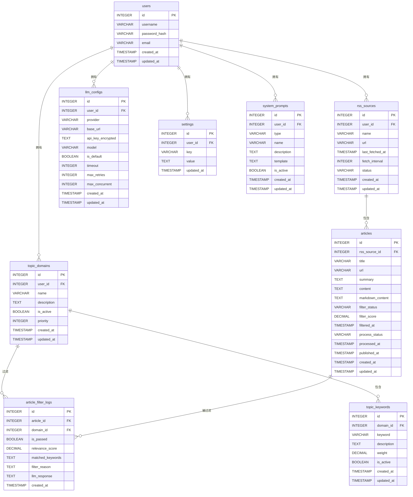

# 数据库 Schema 设计文档

## 📋 概述

本文档详细描述 RSS 文献追踪系统的数据库表结构设计。系统使用 SQLite 作为主数据库，QMD 作为向量搜索数据库。

## 🗄️ 数据库选择

### SQLite vs PostgreSQL

| 特性 | PostgreSQL | SQLite |
|------|-----------|--------|
| **部署复杂度** | 需要独立服务，配置复杂 | 零配置，单文件 |
| **并发性能** | 优秀，支持高并发 | 适合低并发场景 |
| **数据规模** | 适合大规模数据 | 适合中小规模（TB级以下） |
| **备份迁移** | 需要导出/导入 | 直接复制文件 |
| **适用场景** | 多用户、生产环境 | 个人项目、原型开发 |

### 选择 SQLite 的理由

1. **个人项目特性**：项目是个人文献追踪，数据量不会特别大
2. **性能充足**：SQLite 可以轻松处理数百万条记录
3. **零配置**：开发效率更高，无需安装和配置数据库服务
4. **易于备份**：备份和迁移非常简单（复制一个 `.db` 文件即可）
5. **代码适配简单**：使用 Kysely ORM，切换数据库只需修改配置

## 📊 表结构设计

### 1. 用户表 (users)

存储系统用户信息。

```sql
CREATE TABLE users (
  id INTEGER PRIMARY KEY AUTOINCREMENT,
  username VARCHAR(255) NOT NULL UNIQUE,
  password_hash VARCHAR(255) NOT NULL,
  email VARCHAR(255),
  created_at TIMESTAMP DEFAULT CURRENT_TIMESTAMP,
  updated_at TIMESTAMP DEFAULT CURRENT_TIMESTAMP
);

CREATE INDEX idx_users_username ON users(username);
CREATE INDEX idx_users_email ON users(email);
```

#### 字段说明

| 字段 | 类型 | 说明 | 约束 |
|------|------|------|------|
| id | INTEGER | 用户 ID，主键 | PRIMARY KEY, AUTOINCREMENT |
| username | VARCHAR(255) | 用户名 | NOT NULL, UNIQUE |
| password_hash | VARCHAR(255) | 密码哈希值 | NOT NULL |
| email | VARCHAR(255) | 邮箱地址 | - |
| created_at | TIMESTAMP | 创建时间 | DEFAULT CURRENT_TIMESTAMP |
| updated_at | TIMESTAMP | 更新时间 | DEFAULT CURRENT_TIMESTAMP |

---

### 2. RSS 源表 (rss_sources)

存储 RSS 订阅源信息。

```sql
CREATE TABLE rss_sources (
  id INTEGER PRIMARY KEY AUTOINCREMENT,
  user_id INTEGER NOT NULL REFERENCES users(id),
  name VARCHAR(255) NOT NULL,
  url VARCHAR(1024) NOT NULL UNIQUE,
  last_fetched_at TIMESTAMP,
  fetch_interval INTEGER DEFAULT 3600,
  status VARCHAR(20) DEFAULT 'active',
  created_at TIMESTAMP DEFAULT CURRENT_TIMESTAMP,
  updated_at TIMESTAMP DEFAULT CURRENT_TIMESTAMP
);

CREATE INDEX idx_rss_sources_user ON rss_sources(user_id);
CREATE INDEX idx_rss_sources_status ON rss_sources(status);
```

#### 字段说明

| 字段 | 类型 | 说明 | 约束 |
|------|------|------|------|
| id | INTEGER | RSS 源 ID，主键 | PRIMARY KEY, AUTOINCREMENT |
| user_id | INTEGER | 所属用户 ID | NOT NULL, FOREIGN KEY |
| name | VARCHAR(255) | RSS 源名称 | NOT NULL |
| url | VARCHAR(1024) | RSS 源 URL | NOT NULL, UNIQUE |
| last_fetched_at | TIMESTAMP | 最后抓取时间 | - |
| fetch_interval | INTEGER | 抓取间隔（秒） | DEFAULT 3600 |
| status | VARCHAR(20) | 状态（active/inactive） | DEFAULT 'active' |
| created_at | TIMESTAMP | 创建时间 | DEFAULT CURRENT_TIMESTAMP |
| updated_at | TIMESTAMP | 更新时间 | DEFAULT CURRENT_TIMESTAMP |

#### status 字段枚举值

| 值 | 说明 |
|------|------|
| active | 启用 |
| inactive | 禁用 |

---

### 3. 文章表 (articles)

存储从 RSS 抓取的文章信息。

```sql
CREATE TABLE articles (
  id INTEGER PRIMARY KEY AUTOINCREMENT,
  rss_source_id INTEGER REFERENCES rss_sources(id),
  title VARCHAR(512) NOT NULL,
  url VARCHAR(1024) NOT NULL UNIQUE,
  summary TEXT,
  content TEXT,
  markdown_content TEXT,
  filter_status VARCHAR(20) DEFAULT 'pending',
  filter_score DECIMAL(5,4),
  filtered_at TIMESTAMP,
  process_status VARCHAR(20) DEFAULT 'pending',
  processed_at TIMESTAMP,
  published_at TIMESTAMP,
  created_at TIMESTAMP DEFAULT CURRENT_TIMESTAMP,
  updated_at TIMESTAMP DEFAULT CURRENT_TIMESTAMP
);

CREATE INDEX idx_articles_rss_source ON articles(rss_source_id);
CREATE INDEX idx_articles_filter_status ON articles(filter_status);
CREATE INDEX idx_articles_process_status ON articles(process_status);
CREATE INDEX idx_articles_published_at ON articles(published_at);
CREATE INDEX idx_articles_created_at ON articles(created_at);
```

#### 字段说明

| 字段 | 类型 | 说明 | 约束 |
|------|------|------|------|
| id | INTEGER | 文章 ID，主键 | PRIMARY KEY, AUTOINCREMENT |
| rss_source_id | INTEGER | RSS 源 ID | FOREIGN KEY |
| title | VARCHAR(512) | 文章标题 | NOT NULL |
| url | VARCHAR(1024) | 文章 URL | NOT NULL, UNIQUE |
| summary | TEXT | 文章摘要 | - |
| content | TEXT | 文章原始内容（HTML） | - |
| markdown_content | TEXT | 文章 Markdown 内容 | - |
| filter_status | VARCHAR(20) | 过滤状态 | DEFAULT 'pending' |
| filter_score | DECIMAL(5,4) | 过滤评分（0.0-1.0） | - |
| filtered_at | TIMESTAMP | 过滤时间 | - |
| process_status | VARCHAR(20) | 处理状态 | DEFAULT 'pending' |
| processed_at | TIMESTAMP | 处理完成时间 | - |
| published_at | TIMESTAMP | 文章发布时间 | - |
| created_at | TIMESTAMP | 创建时间 | DEFAULT CURRENT_TIMESTAMP |
| updated_at | TIMESTAMP | 更新时间 | DEFAULT CURRENT_TIMESTAMP |

#### filter_status 字段枚举值

| 值 | 说明 |
|------|------|
| pending | 待过滤 |
| passed | 通过过滤 |
| rejected | 被拒绝 |
| skipped | 跳过（无启用主题词） |

#### process_status 字段枚举值

| 值 | 说明 |
|------|------|
| pending | 待处理 |
| processing | 处理中 |
| completed | 处理完成 |
| failed | 处理失败 |

---

### 4. 主题领域表 (topic_domains)

存储用户关注的主题领域。

```sql
CREATE TABLE topic_domains (
  id INTEGER PRIMARY KEY AUTOINCREMENT,
  user_id INTEGER NOT NULL REFERENCES users(id),
  name VARCHAR(255) NOT NULL,
  description TEXT,
  is_active BOOLEAN DEFAULT 1,
  priority INTEGER DEFAULT 0,
  created_at TIMESTAMP DEFAULT CURRENT_TIMESTAMP,
  updated_at TIMESTAMP DEFAULT CURRENT_TIMESTAMP,
  UNIQUE(user_id, name)
);

CREATE INDEX idx_topic_domains_user ON topic_domains(user_id);
CREATE INDEX idx_topic_domains_active ON topic_domains(is_active);
CREATE INDEX idx_topic_domains_priority ON topic_domains(priority);
```

#### 字段说明

| 字段 | 类型 | 说明 | 约束 |
|------|------|------|------|
| id | INTEGER | 主题领域 ID，主键 | PRIMARY KEY, AUTOINCREMENT |
| user_id | INTEGER | 所属用户 ID | NOT NULL, FOREIGN KEY |
| name | VARCHAR(255) | 主题领域名称 | NOT NULL |
| description | TEXT | 主题领域描述 | - |
| is_active | BOOLEAN | 是否启用 | DEFAULT 1 |
| priority | INTEGER | 优先级（数字越大优先级越高） | DEFAULT 0 |
| created_at | TIMESTAMP | 创建时间 | DEFAULT CURRENT_TIMESTAMP |
| updated_at | TIMESTAMP | 更新时间 | DEFAULT CURRENT_TIMESTAMP |

---

### 5. 主题词表 (topic_keywords)

存储主题领域下的主题词。

```sql
CREATE TABLE topic_keywords (
  id INTEGER PRIMARY KEY AUTOINCREMENT,
  domain_id INTEGER NOT NULL REFERENCES topic_domains(id) ON DELETE CASCADE,
  keyword VARCHAR(255) NOT NULL,
  description TEXT,
  weight DECIMAL(3,2) DEFAULT 1.0,
  is_active BOOLEAN DEFAULT 1,
  created_at TIMESTAMP DEFAULT CURRENT_TIMESTAMP,
  updated_at TIMESTAMP DEFAULT CURRENT_TIMESTAMP,
  UNIQUE(domain_id, keyword)
);

CREATE INDEX idx_topic_keywords_domain ON topic_keywords(domain_id);
CREATE INDEX idx_topic_keywords_active ON topic_keywords(is_active);
```

#### 字段说明

| 字段 | 类型 | 说明 | 约束 |
|------|------|------|------|
| id | INTEGER | 主题词 ID，主键 | PRIMARY KEY, AUTOINCREMENT |
| domain_id | INTEGER | 所属主题领域 ID | NOT NULL, FOREIGN KEY, ON DELETE CASCADE |
| keyword | VARCHAR(255) | 主题词 | NOT NULL |
| description | TEXT | 主题词描述 | - |
| weight | DECIMAL(3,2) | 权重（0.0-1.0） | DEFAULT 1.0 |
| is_active | BOOLEAN | 是否启用 | DEFAULT 1 |
| created_at | TIMESTAMP | 创建时间 | DEFAULT CURRENT_TIMESTAMP |
| updated_at | TIMESTAMP | 更新时间 | DEFAULT CURRENT_TIMESTAMP |

---

### 6. 文章过滤记录表 (article_filter_logs)

存储文章过滤的详细记录。

```sql
CREATE TABLE article_filter_logs (
  id INTEGER PRIMARY KEY AUTOINCREMENT,
  article_id INTEGER NOT NULL REFERENCES articles(id) ON DELETE CASCADE,
  domain_id INTEGER REFERENCES topic_domains(id),
  is_passed BOOLEAN NOT NULL,
  relevance_score DECIMAL(5,4),
  matched_keywords TEXT,
  filter_reason TEXT,
  llm_response TEXT,
  created_at TIMESTAMP DEFAULT CURRENT_TIMESTAMP
);

CREATE INDEX idx_article_filter_logs_article ON article_filter_logs(article_id);
CREATE INDEX idx_article_filter_logs_passed ON article_filter_logs(is_passed);
CREATE INDEX idx_article_filter_logs_domain ON article_filter_logs(domain_id);
CREATE INDEX idx_article_filter_logs_created_at ON article_filter_logs(created_at);
```

#### 字段说明

| 字段 | 类型 | 说明 | 约束 |
|------|------|------|------|
| id | INTEGER | 过滤记录 ID，主键 | PRIMARY KEY, AUTOINCREMENT |
| article_id | INTEGER | 文章 ID | NOT NULL, FOREIGN KEY, ON DELETE CASCADE |
| domain_id | INTEGER | 主题领域 ID | FOREIGN KEY |
| is_passed | BOOLEAN | 是否通过过滤 | NOT NULL |
| relevance_score | DECIMAL(5,4) | 相关性评分（0.0-1.0） | - |
| matched_keywords | TEXT | 匹配的主题词（JSON 数组） | - |
| filter_reason | TEXT | 过滤原因 | - |
| llm_response | TEXT | LLM 原始响应 | - |
| created_at | TIMESTAMP | 创建时间 | DEFAULT CURRENT_TIMESTAMP |

---

### 7. 大模型配置表 (llm_configs)

存储用户的大模型配置。

```sql
CREATE TABLE llm_configs (
  id INTEGER PRIMARY KEY AUTOINCREMENT,
  user_id INTEGER NOT NULL REFERENCES users(id),
  provider VARCHAR(50) NOT NULL,
  base_url VARCHAR(512) NOT NULL,
  api_key_encrypted TEXT NOT NULL,
  model VARCHAR(100) NOT NULL,
  is_default BOOLEAN DEFAULT 0,
  timeout INTEGER DEFAULT 30,
  max_retries INTEGER DEFAULT 3,
  max_concurrent INTEGER DEFAULT 5,
  created_at TIMESTAMP DEFAULT CURRENT_TIMESTAMP,
  updated_at TIMESTAMP DEFAULT CURRENT_TIMESTAMP
);

CREATE INDEX idx_llm_configs_user ON llm_configs(user_id);
CREATE INDEX idx_llm_configs_default ON llm_configs(is_default);
```

#### 字段说明

| 字段 | 类型 | 说明 | 约束 |
|------|------|------|------|
| id | INTEGER | 配置 ID，主键 | PRIMARY KEY, AUTOINCREMENT |
| user_id | INTEGER | 所属用户 ID | NOT NULL, FOREIGN KEY |
| provider | VARCHAR(50) | 提供商（openai, gemini 等） | NOT NULL |
| base_url | VARCHAR(512) | API Base URL | NOT NULL |
| api_key_encrypted | TEXT | 加密的 API Key | NOT NULL |
| model | VARCHAR(100) | 模型名称 | NOT NULL |
| is_default | BOOLEAN | 是否为默认配置 | DEFAULT 0 |
| timeout | INTEGER | 超时时间（秒） | DEFAULT 30 |
| max_retries | INTEGER | 最大重试次数 | DEFAULT 3 |
| max_concurrent | INTEGER | 最大并发数 | DEFAULT 5 |
| created_at | TIMESTAMP | 创建时间 | DEFAULT CURRENT_TIMESTAMP |
| updated_at | TIMESTAMP | 更新时间 | DEFAULT CURRENT_TIMESTAMP |

#### provider 字段枚举值

| 值 | 说明 |
|------|------|
| openai | OpenAI 兼容 API |
| gemini | Google Gemini |
| anthropic | Anthropic Claude |

---

### 8. 系统设置表 (settings)

存储系统设置。

```sql
CREATE TABLE settings (
  id INTEGER PRIMARY KEY AUTOINCREMENT,
  user_id INTEGER NOT NULL REFERENCES users(id),
  key VARCHAR(100) NOT NULL UNIQUE,
  value TEXT NOT NULL,
  updated_at TIMESTAMP DEFAULT CURRENT_TIMESTAMP,
  UNIQUE(user_id, key)
);

CREATE INDEX idx_settings_user ON settings(user_id);
CREATE INDEX idx_settings_key ON settings(key);
```

#### 字段说明

| 字段 | 类型 | 说明 | 约束 |
|------|------|------|------|
| id | INTEGER | 设置 ID，主键 | PRIMARY KEY, AUTOINCREMENT |
| user_id | INTEGER | 所属用户 ID | NOT NULL, FOREIGN KEY |
| key | VARCHAR(100) | 设置键 | NOT NULL |
| value | TEXT | 设置值 | NOT NULL |
| updated_at | TIMESTAMP | 更新时间 | DEFAULT CURRENT_TIMESTAMP |

#### 常用设置键

| 键 | 说明 | 示例值 |
|------|------|--------|
| timezone | 时区 | Asia/Shanghai |
| language | 语言 | zh-CN |
| date_format | 日期格式 | YYYY-MM-DD |
| email_notifications_enabled | 是否启用邮件通知 | true |
| email_notifications_address | 邮件通知地址 | user@example.com |
| telegram_notifications_enabled | 是否启用 Telegram 通知 | true |
| telegram_bot_token | Telegram Bot Token | xxxxx:xxxxx |
| telegram_chat_id | Telegram Chat ID | 123456789 |

---

### 9. 系统提示词表 (system_prompts)

存储用户自定义的系统提示词模板。

```sql
CREATE TABLE system_prompts (
  id INTEGER PRIMARY KEY AUTOINCREMENT,
  user_id INTEGER NOT NULL REFERENCES users(id),
  type VARCHAR(50) NOT NULL,
  name VARCHAR(255) NOT NULL,
  description TEXT,
  template TEXT NOT NULL,
  is_active BOOLEAN DEFAULT 1,
  created_at TIMESTAMP DEFAULT CURRENT_TIMESTAMP,
  updated_at TIMESTAMP DEFAULT CURRENT_TIMESTAMP,
  UNIQUE(user_id, type)
);

CREATE INDEX idx_system_prompts_user ON system_prompts(user_id);
CREATE INDEX idx_system_prompts_type ON system_prompts(type);
CREATE INDEX idx_system_prompts_active ON system_prompts(is_active);
```

#### 字段说明

| 字段 | 类型 | 说明 | 约束 |
|------|------|------|------|
| id | INTEGER | 提示词 ID，主键 | PRIMARY KEY, AUTOINCREMENT |
| user_id | INTEGER | 所属用户 ID | NOT NULL, FOREIGN KEY |
| type | VARCHAR(50) | 提示词类型 | NOT NULL |
| name | VARCHAR(255) | 提示词名称 | NOT NULL |
| description | TEXT | 提示词描述 | - |
| template | TEXT | 提示词模板（支持占位符） | NOT NULL |
| is_active | BOOLEAN | 是否启用 | DEFAULT 1 |
| created_at | TIMESTAMP | 创建时间 | DEFAULT CURRENT_TIMESTAMP |
| updated_at | TIMESTAMP | 更新时间 | DEFAULT CURRENT_TIMESTAMP |

#### type 字段枚举值

| 值 | 说明 |
|------|------|
| filter | 文章过滤提示词 |
| summary | 文章总结提示词 |

#### template 占位符

| 占位符 | 说明 | 适用类型 |
|--------|------|----------|
| {title} | 文章标题 | filter, summary |
| {summary} | 文章摘要 | filter |
| {content} | 文章内容 | summary |
| {topic_domains} | 主题领域列表 | filter |
| {topic_keywords} | 主题词列表 | filter |

---

## 🔗 表关系图



---

## 📈 索引优化

### 索引设计原则

1. **主键索引**：所有表都有主键索引
2. **外键索引**：所有外键字段都创建索引
3. **查询字段索引**：频繁查询的字段创建索引
4. **复合索引**：多字段联合查询时创建复合索引

### 索引列表

| 表名 | 索引名 | 字段 | 类型 | 说明 |
|------|--------|------|------|------|
| users | idx_users_username | username | 单字段 | 用户名查询 |
| users | idx_users_email | email | 单字段 | 邮箱查询 |
| rss_sources | idx_rss_sources_user | user_id | 单字段 | 按用户查询 RSS 源 |
| rss_sources | idx_rss_sources_status | status | 单字段 | 按状态查询 RSS 源 |
| articles | idx_articles_rss_source | rss_source_id | 单字段 | 按 RSS 源查询文章 |
| articles | idx_articles_filter_status | filter_status | 单字段 | 按过滤状态查询文章 |
| articles | idx_articles_process_status | process_status | 单字段 | 按处理状态查询文章 |
| articles | idx_articles_published_at | published_at | 单字段 | 按发布时间排序 |
| articles | idx_articles_created_at | created_at | 单字段 | 按创建时间排序 |
| topic_domains | idx_topic_domains_user | user_id | 单字段 | 按用户查询主题领域 |
| topic_domains | idx_topic_domains_active | is_active | 单字段 | 按启用状态查询 |
| topic_domains | idx_topic_domains_priority | priority | 单字段 | 按优先级排序 |
| topic_keywords | idx_topic_keywords_domain | domain_id | 单字段 | 按主题领域查询主题词 |
| topic_keywords | idx_topic_keywords_active | is_active | 单字段 | 按启用状态查询 |
| article_filter_logs | idx_article_filter_logs_article | article_id | 单字段 | 按文章查询过滤记录 |
| article_filter_logs | idx_article_filter_logs_passed | is_passed | 单字段 | 按通过状态查询 |
| article_filter_logs | idx_article_filter_logs_domain | domain_id | 单字段 | 按主题领域查询 |
| article_filter_logs | idx_article_filter_logs_created_at | created_at | 单字段 | 按时间排序 |
| llm_configs | idx_llm_configs_user | user_id | 单字段 | 按用户查询配置 |
| llm_configs | idx_llm_configs_default | is_default | 单字段 | 查询默认配置 |
| settings | idx_settings_user | user_id | 单字段 | 按用户查询设置 |
| settings | idx_settings_key | key | 单字段 | 按键查询设置 |
| system_prompts | idx_system_prompts_user | user_id | 单字段 | 按用户查询系统提示词 |
| system_prompts | idx_system_prompts_type | type | 单字段 | 按类型查询系统提示词 |
| system_prompts | idx_system_prompts_active | is_active | 单字段 | 按启用状态查询 |

---

## 🔐 数据安全

### 敏感数据加密

1. **密码哈希**：使用 bcrypt 或 argon2 进行密码哈希
2. **API Key 加密**：使用 AES-256 加密存储 API Key
3. **会话管理**：使用 JWT 进行会话管理

### 数据备份

1. **定期备份**：每天自动备份数据库文件
2. **备份保留**：保留最近 7 天的备份
3. **备份验证**：定期验证备份文件的完整性

---

## 📊 数据迁移

### 迁移脚本命名规范

```
sql/
├── 001_init.sql              # 初始化数据库
├── 002_add_system_prompts.sql # 添加系统提示词表
└── ...
```

### 迁移执行顺序

1. 执行 `001_init.sql` 创建基础表结构
2. 按顺序执行后续迁移脚本
3. 记录已执行的迁移版本

---

## 📝 数据库配置

### SQLite 配置

```typescript
import Database from 'better-sqlite3';
import { Kysely, SqliteDialect } from 'kysely';

const db = new Kysely<Database>({
  dialect: new SqliteDialect({
    database: new Database('data/rss-tracker.db', {
      // 启用 WAL 模式，提高并发性能
      verbose: process.env.NODE_ENV === 'development'
    })
  })
});

// 启用 WAL 模式
db.executeQuery({
  sql: 'PRAGMA journal_mode = WAL;'
});

// 设置同步模式
db.executeQuery({
  sql: 'PRAGMA synchronous = NORMAL;'
});

// 设置缓存大小
db.executeQuery({
  sql: 'PRAGMA cache_size = -64000;' // 64MB
});
```

---

## 🎯 性能优化建议

### 1. 查询优化

- 使用索引字段进行查询
- 避免 SELECT *，只查询需要的字段
- 使用 LIMIT 限制返回结果数量
- 使用 EXPLAIN QUERY PLAN 分析查询计划

### 2. 批量操作

- 使用批量插入代替单条插入
- 使用事务保证数据一致性
- 批量更新时使用 CASE WHEN

### 3. 连接池

- 使用连接池管理数据库连接
- 设置合理的连接池大小
- 及时释放连接

### 4. 缓存

- 缓存频繁查询的数据
- 使用 Redis 或内存缓存
- 设置合理的缓存过期时间

---

## 📚 参考资料

- [SQLite 官方文档](https://www.sqlite.org/docs.html)
- [Kysely ORM 文档](https://kysely.dev/)
- [better-sqlite3 文档](https://github.com/WiseLibs/better-sqlite3)

---

**文档版本**：v1.0  
**创建日期**：2024-01-15  
**最后更新**：2024-01-15
