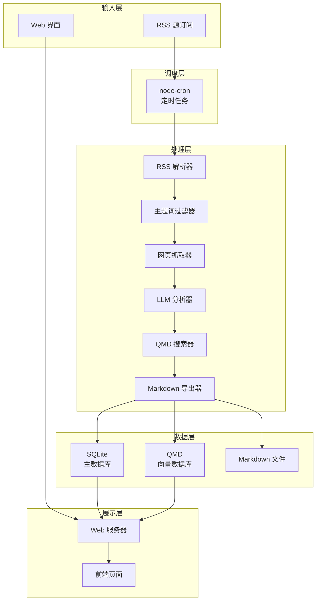

# RSS 文献追踪系统 - 项目计划书

## 📋 项目概述

### 项目名称
RSS 文献追踪系统 (LIS-RSS Literature Tracker)

### 项目目标
基于 linkmind-master 项目，开发一个智能 RSS 文献追踪系统，实现以下核心功能：
1. RSS 源管理：订阅、管理多个 RSS 源
2. 主题词过滤：使用大模型智能过滤不相关的文章
3. 文章处理：自动抓取全文、生成摘要、关联已有文档
4. 语义搜索：基于 QMD 实现本地语义搜索
5. Web 界面：提供友好的管理界面

### 技术栈
- **后端**：Node.js + TypeScript + Express
- **数据库**：SQLite（主数据库）+ QMD（向量搜索）
- **ORM**：Kysely
- **网页抓取**：Playwright + Defuddle
- **LLM**：OpenAI 兼容 API
- **任务调度**：node-cron
- **前端**：EJS 模板引擎
- **包管理器**：pnpm

## 🎯 项目架构

### 系统架构图



### 模块划分

| 模块 | 功能 | 复用来源 |
|------|------|---------|
| **scraper.ts** | 网页抓取、HTML 转 Markdown | linkmind-master |
| **llm.ts** | LLM 抽象层、统一接口 | linkmind-master |
| **agent.ts** | LLM 分析、摘要生成 | linkmind-master |
| **search.ts** | QMD 语义搜索 | linkmind-master |
| **export.ts** | Markdown 导出 | linkmind-master |
| **pipeline.ts** | 处理流水线编排 | linkmind-master |
| **filter.ts** | 主题词过滤 | 新增 |
| **rss-scheduler.ts** | RSS 抓取调度 | 新增 |
| **web.ts** | Web 服务器 | linkmind-master（需扩展） |
| **db.ts** | 数据库操作 | linkmind-master（需适配 SQLite） |

## 📊 数据库设计

### 核心表结构

#### 2. RSS 源表 (rss_sources)
```sql
CREATE TABLE rss_sources (
  id INTEGER PRIMARY KEY AUTOINCREMENT,
  user_id INTEGER NOT NULL REFERENCES users(id),
  name VARCHAR(255) NOT NULL,
  url VARCHAR(1024) NOT NULL UNIQUE,
  last_fetched_at TIMESTAMP,
  fetch_interval INTEGER DEFAULT 3600,
  status VARCHAR(20) DEFAULT 'active',
  created_at TIMESTAMP DEFAULT CURRENT_TIMESTAMP,
  updated_at TIMESTAMP DEFAULT CURRENT_TIMESTAMP
);
```

#### 3. 文章表 (articles)
```sql
CREATE TABLE articles (
  id INTEGER PRIMARY KEY AUTOINCREMENT,
  rss_source_id INTEGER REFERENCES rss_sources(id),
  title VARCHAR(512) NOT NULL,
  url VARCHAR(1024) NOT NULL UNIQUE,
  summary TEXT,
  content TEXT,
  markdown_content TEXT,
  filter_status VARCHAR(20) DEFAULT 'pending',
  filter_score DECIMAL(5,4),
  filtered_at TIMESTAMP,
  process_status VARCHAR(20) DEFAULT 'pending',
  processed_at TIMESTAMP,
  published_at TIMESTAMP,
  created_at TIMESTAMP DEFAULT CURRENT_TIMESTAMP,
  updated_at TIMESTAMP DEFAULT CURRENT_TIMESTAMP
);
```

#### 4. 主题领域表 (topic_domains)
```sql
CREATE TABLE topic_domains (
  id INTEGER PRIMARY KEY AUTOINCREMENT,
  user_id INTEGER NOT NULL REFERENCES users(id),
  name VARCHAR(255) NOT NULL,
  description TEXT,
  is_active BOOLEAN DEFAULT 1,
  priority INTEGER DEFAULT 0,
  created_at TIMESTAMP DEFAULT CURRENT_TIMESTAMP,
  updated_at TIMESTAMP DEFAULT CURRENT_TIMESTAMP,
  UNIQUE(user_id, name)
);
```

#### 5. 主题词表 (topic_keywords)
```sql
CREATE TABLE topic_keywords (
  id INTEGER PRIMARY KEY AUTOINCREMENT,
  domain_id INTEGER NOT NULL REFERENCES topic_domains(id) ON DELETE CASCADE,
  keyword VARCHAR(255) NOT NULL,
  description TEXT,
  weight DECIMAL(3,2) DEFAULT 1.0,
  is_active BOOLEAN DEFAULT 1,
  created_at TIMESTAMP DEFAULT CURRENT_TIMESTAMP,
  updated_at TIMESTAMP DEFAULT CURRENT_TIMESTAMP,
  UNIQUE(domain_id, keyword)
);
```

#### 6. 文章过滤记录表 (article_filter_logs)
```sql
CREATE TABLE article_filter_logs (
  id INTEGER PRIMARY KEY AUTOINCREMENT,
  article_id INTEGER NOT NULL REFERENCES articles(id) ON DELETE CASCADE,
  domain_id INTEGER REFERENCES topic_domains(id),
  is_passed BOOLEAN NOT NULL,
  relevance_score DECIMAL(5,4),
  matched_keywords TEXT,
  filter_reason TEXT,
  llm_response TEXT,
  created_at TIMESTAMP DEFAULT CURRENT_TIMESTAMP
);
```

#### 7. 大模型配置表 (llm_configs)
```sql
CREATE TABLE llm_configs (
  id INTEGER PRIMARY KEY AUTOINCREMENT,
  user_id INTEGER NOT NULL REFERENCES users(id),
  provider VARCHAR(50) NOT NULL,
  base_url VARCHAR(512) NOT NULL,
  api_key_encrypted TEXT NOT NULL,
  model VARCHAR(100) NOT NULL,
  is_default BOOLEAN DEFAULT 0,
  timeout INTEGER DEFAULT 30,
  max_retries INTEGER DEFAULT 3,
  max_concurrent INTEGER DEFAULT 5,
  created_at TIMESTAMP DEFAULT CURRENT_TIMESTAMP,
  updated_at TIMESTAMP DEFAULT CURRENT_TIMESTAMP
);
```

#### 8. 系统设置表 (settings)
```sql
CREATE TABLE settings (
  id INTEGER PRIMARY KEY AUTOINCREMENT,
  user_id INTEGER NOT NULL REFERENCES users(id),
  key VARCHAR(100) NOT NULL UNIQUE,
  value TEXT NOT NULL,
  updated_at TIMESTAMP DEFAULT CURRENT_TIMESTAMP,
  UNIQUE(user_id, key)
);
```

**常用配置项示例**：

| key | value | 说明 |
|-----|-------|------|
| `rss_fetch_schedule` | `0 9 * * *` | RSS 抓取调度时间（cron 表达式） |
| `rss_fetch_enabled` | `true` | 是否启用 RSS 自动抓取 |
| `llm_filter_enabled` | `true` | 是否启用 LLM 智能过滤 |
| `max_concurrent_fetch` | `5` | 最大并发抓取数 |
| `qmd_collection_path` | `./data/qmd` | QMD 集合路径 |

**cron 表达式格式**：`分 时 日 月 周`
- `0 9 * * *` - 每天早上 9 点
- `0 */6 * * *` - 每 6 小时执行一次
- `0 0 * * *` - 每天午夜执行
- `0 9,18 * * *` - 每天 9 点和 18 点执行

## 🔄 开发阶段规划

### 阶段 0：项目初始化与架构设计
**目标**：搭建项目基础架构
**时间**：1-2 天

- [ ] 创建项目基础结构（package.json, tsconfig.json, .gitignore）
- [ ] 配置开发环境（Node.js, TypeScript, pnpm）
- [ ] 设计项目目录结构
- [ ] 创建数据库 Schema 设计文档
- [ ] 创建 API 接口设计文档

### 阶段 1：数据库层开发
**目标**：实现数据库操作层
**时间**：2-3 天

- [ ] 配置 SQLite 数据库
- [ ] 创建数据库迁移脚本
- [ ] 实现所有数据表
- [ ] 创建数据库索引优化查询性能

### 阶段 2：核心模块复用与适配
**目标**：复用 linkmind-master 的核心模块
**时间**：3-4 天

- [ ] 复用并适配 scraper.ts（网页抓取模块）
- [ ] 复用并适配 llm.ts（LLM 抽象层）
- [ ] 复用并适配 agent.ts（LLM 分析模块）
- [ ] 复用并适配 search.ts（QMD 语义搜索模块）
- [ ] 复用并适配 export.ts（Markdown 导出模块）
- [ ] 复用并适配 pipeline.ts（处理流水线模块）
- [ ] 创建 logger.ts（日志模块）
- [ ] 创建 db.ts（数据库操作模块，使用 Kysely + SQLite）

### 阶段 3：RSS 源管理功能
**目标**：实现 RSS 源的增删改查
**时间**：2-3 天

- [ ] 实现 RSS 源 CRUD 操作（数据库层）
- [ ] 实现 RSS 源管理 API 接口
- [ ] 实现 RSS 解析功能（使用 rss-parser）
- [ ] 实现 RSS 源管理前端页面
- [ ] 实现 RSS 源编辑/删除/启用/禁用功能
- [ ] 实现 RSS 源立即抓取功能

### 阶段 4：主题词过滤功能
**目标**：实现智能主题词过滤
**时间**：3-4 天

- [ ] 实现主题领域 CRUD 操作（数据库层）
- [ ] 实现主题词 CRUD 操作（数据库层）
- [ ] 实现主题领域管理 API 接口
- [ ] 实现主题词管理 API 接口
- [ ] 实现 LLM 过滤逻辑（filter.ts）
- [ ] 实现关键词匹配降级逻辑
- [ ] 实现过滤日志记录功能
- [ ] 实现过滤统计功能
- [ ] 实现主题词管理前端页面
- [ ] 实现过滤日志前端页面
- [ ] 实现过滤统计前端页面

### 阶段 5：RSS 抓取调度器
**目标**：实现定时 RSS 抓取
**时间**：2-3 天

- [ ] 实现 RSS 抓取调度器（使用 node-cron）
- [ ] 实现从数据库读取调度配置（settings 表）
- [ ] 实现增量抓取逻辑（去重）
- [ ] 实现抓取失败重试机制
- [ ] 集成主题词过滤到抓取流程
- [ ] 实现抓取任务队列（可选）
- [ ] 实现抓取日志记录
- [ ] 实现调度时间动态修改功能（通过 Web 界面）

**调度配置说明**：
- 使用 node-cron 的 cron 表达式定义抓取时间
- 配置存储在 [`settings`](#8-系统设置表-settings) 表中，key 为 `rss_fetch_schedule`
- 默认配置：`0 9 * * *`（每天早上 9 点）
- 支持通过 Web 界面动态修改，无需重启服务
- 常用 cron 表达式示例：
  - `0 9 * * *` - 每天早上 9 点
  - `0 */6 * * *` - 每 6 小时执行一次
  - `0 0 * * *` - 每天午夜执行
  - `0 9,18 * * *` - 每天 9 点和 18 点执行

### 阶段 6：文章处理流程
**目标**：实现文章的完整处理流程
**时间**：3-4 天

- [ ] 实现文章全文抓取（集成 scraper）
- [ ] 实现文章内容过滤（集成 filter）
- [ ] 实现文章 LLM 总结（集成 agent）
- [ ] 实现文章 QMD 关联（集成 search）
- [ ] 实现文章 Markdown 导出（集成 export）
- [ ] 实现文章处理状态跟踪
- [ ] 实现文章处理失败重试

### 阶段 7：Web 服务器与 API
**目标**：实现完整的 Web API
**时间**：2-3 天

- [ ] 配置 Express 服务器
- [ ] 实现 JWT 认证中间件
- [ ] 实现文章列表 API（分页、筛选）
- [ ] 实现文章详情 API
- [ ] 实现语义搜索 API
- [ ] 实现系统设置 API（包括 RSS 抓取调度配置）
- [ ] 实现数据备份/恢复 API

**系统设置 API 说明**：
- `GET /api/settings` - 获取所有系统设置
- `PUT /api/settings/:key` - 更新指定配置项
- `GET /api/settings/rss_fetch_schedule` - 获取 RSS 抓取调度配置
- `PUT /api/settings/rss_fetch_schedule` - 更新 RSS 抓取调度配置（支持动态修改 cron 表达式）

### 阶段 8：前端页面开发
**目标**：实现友好的 Web 界面
**时间**：4-5 天

- [ ] 创建前端基础模板（layout.ejs）
- [ ] 实现统一设置页面（大模型配置、RSS源管理、主题词管理，系统提示词管理）
- [ ] 实现首页，每日摘要页面（展示每日处理的文章摘要）
- [ ] 实现文章列表页面（按日期分组）
- [ ] 实现语义搜索页面
- [ ] 实现过滤日志页面
- [ ] 实现过滤统计页面
- [ ] 实现系统设置页面（包括 RSS 抓取调度配置）
- [ ] 优化前端样式和用户体验

**系统设置页面功能**：
- RSS 抓取调度配置（cron 表达式输入框）
- 常用 cron 表达式快捷选择（每天早上 9 点、每 6 小时、每天午夜等）
- 启用/禁用 RSS 自动抓取开关
- 最大并发抓取数配置
- LLM 过滤开关
- 配置实时保存，无需重启服务

### 阶段 9：QMD 集成与语义搜索
**目标**：集成 QMD 实现语义搜索
**时间**：2-3 天

- [ ] 安装和配置 QMD
- [ ] 创建 QMD 集合配置
- [ ] 实现文章 Markdown 文件生成
- [ ] 实现 QMD 索引更新（qmd update）
- [ ] 实现 QMD 向量嵌入（qmd embed）
- [ ] 实现语义搜索接口
- [ ] 集成语义搜索到前端

### 阶段 10：测试与优化
**目标**：确保系统稳定性和性能
**时间**：3-4 天

- [ ] 编写单元测试（核心模块）
- [ ] 编写集成测试（API 接口）
- [ ] 性能测试和优化
- [ ] 数据库查询优化
- [ ] LLM 调用优化（批量处理、缓存）
- [ ] 错误处理和日志完善

### 阶段 11：部署与文档
**目标**：准备项目发布
**时间**：2-3 天

- [ ] 编写部署文档
- [ ] 编写用户使用手册
- [ ] 编写开发者文档
- [ ] 配置环境变量（.env.example）
- [ ] 创建 Docker 配置（可选）
- [ ] 创建启动脚本

### 阶段 12：项目收尾
**目标**：完善项目，准备发布
**时间**：1-2 天

- [ ] 代码审查和重构
- [ ] 添加代码注释
- [ ] 更新 README.md
- [ ] 创建 CHANGELOG.md
- [ ] 准备项目发布

## 📁 项目目录结构

```
lis-rss-daily/
├── src/
│   ├── index.ts              # 入口文件
│   ├── db.ts                # 数据库操作模块
│   ├── logger.ts            # 日志模块
│   ├── llm.ts              # LLM 抽象层
│   ├── scraper.ts           # 网页抓取模块
│   ├── agent.ts            # LLM 分析模块
│   ├── search.ts           # QMD 语义搜索模块
│   ├── export.ts           # Markdown 导出模块
│   ├── pipeline.ts         # 处理流水线模块
│   ├── filter.ts           # 主题词过滤模块（新增）
│   ├── rss-scheduler.ts    # RSS 抓取调度器（新增）
│   ├── web.ts             # Web 服务器
│   ├── views/             # 前端模板
│   │   ├── layout.ejs
│   │   ├── login.ejs
│   │   ├── settings.ejs
│   │   ├── articles.ejs
│   │   ├── article-detail.ejs
│   │   ├── search.ejs
│   │   ├── filter-logs.ejs
│   │   └── filter-stats.ejs
│   └── api/               # API 路由
│       ├── auth.ts
│       ├── rss-sources.ts
│       ├── topic-domains.ts
│       ├── articles.ts
│       └── settings.ts
├── sql/                   # 数据库迁移脚本
│   ├── 001_init.sql
│   ├── 002_add_rss_sources.sql
│   └── ...
├── scripts/               # 工具脚本
│   ├── migrate.ts
│   └── seed.ts
├── data/                 # 数据目录
│   ├── rss-tracker.db    # SQLite 数据库
│   └── articles/        # Markdown 文件
├── docs/                # 文档
│   ├── prd/            # 产品需求文档
│   ├── api/            # API 文档
│   └── architecture/   # 架构文档
├── tests/              # 测试文件
├── package.json
├── tsconfig.json
├── .gitignore
├── .env.example
└── README.md
```

## 🎯 关键技术决策

### 1. 数据库选择：SQLite vs PostgreSQL
**决策**：使用 SQLite

**理由**：
- 个人项目，数据量不会特别大
- 零配置，开发效率更高
- 易于备份和迁移（复制 .db 文件即可）
- SQLite 性能足以处理数百万条记录

### 2. 任务队列：node-cron vs Absurd SDK
**决策**：使用 node-cron

**理由**：
- RSS 抓取是定时任务，不需要复杂的任务队列
- node-cron 更简单、更轻量
- Absurd SDK 需要 PostgreSQL，与 SQLite 不兼容

**调度配置方案**：
- 使用 cron 表达式定义抓取时间（如 `0 9 * * *` 表示每天早上 9 点）
- 配置存储在数据库 [`settings`](#8-系统设置表-settings) 表中，支持动态修改
- 通过 Web 界面可实时调整抓取时间，无需重启服务
- 默认配置示例：
  ```json
  {
    "key": "rss_fetch_schedule",
    "value": "0 9 * * *"
  }
  ```

### 3. 前端框架：EJS vs React/Vue
**决策**：使用 EJS

**理由**：
- 与 linkmind-master 保持一致
- 服务端渲染，SEO 友好
- 开发简单，适合个人项目
- 不需要构建步骤

### 4. 向量搜索：QMD vs Pinecone/Chroma
**决策**：使用 QMD

**理由**：
- 完全本地运行，数据隐私更好
- 零配置，无需外部服务
- 免费，无成本
- 性能足以应对个人项目

## 📊 预估工作量

| 阶段 | 预估时间 | 优先级 |
|------|---------|--------|
| 阶段 0：项目初始化 | 1-2 天 | P0 |
| 阶段 1：数据库层 | 2-3 天 | P0 |
| 阶段 2：核心模块复用 | 3-4 天 | P0 |
| 阶段 3：RSS 源管理 | 2-3 天 | P0 |
| 阶段 4：主题词过滤 | 3-4 天 | P0 |
| 阶段 5：RSS 抓取调度 | 2-3 天 | P0 |
| 阶段 6：文章处理流程 | 3-4 天 | P0 |
| 阶段 7：Web 服务器与 API | 2-3 天 | P0 |
| 阶段 8：前端页面开发 | 4-5 天 | P1 |
| 阶段 9：QMD 集成 | 2-3 天 | P1 |
| 阶段 10：测试与优化 | 3-4 天 | P1 |
| 阶段 11：部署与文档 | 2-3 天 | P2 |
| 阶段 12：项目收尾 | 1-2 天 | P2 |
| **总计** | **30-45 天** | |

## 🚀 开发建议

### 对于非编程背景的开发者

1. **从阶段 0 开始**：先搭建项目基础，理解项目结构
2. **按顺序开发**：严格按照阶段顺序，不要跳过
3. **复用优先**：优先复用 linkmind-master 的代码，减少开发量
4. **小步快跑**：每个阶段完成后测试，确保功能正常
5. **文档先行**：先理解 PRD 文档，再开始编码

### 代码复用策略

1. **直接复用的模块**：
   - [`scraper.ts`](docs/ref/linkmind-master/src/scraper.ts:1) - 网页抓取
   - [`llm.ts`](docs/ref/linkmind-master/src/llm.ts:1) - LLM 抽象层
   - [`agent.ts`](docs/ref/linkmind-master/src/agent.ts:1) - LLM 分析
   - [`search.ts`](docs/ref/linkmind-master/src/search.ts:1) - QMD 搜索
   - [`export.ts`](docs/ref/linkmind-master/src/export.ts:1) - Markdown 导出
   - [`pipeline.ts`](docs/ref/linkmind-master/src/pipeline.ts:1) - 处理流水线

2. **需要适配的模块**：
   - [`db.ts`](docs/ref/linkmind-master/src/db.ts:1) - 从 PostgreSQL 改为 SQLite
   - [`web.ts`](docs/ref/linkmind-master/src/web.ts:1) - 添加新的 API 路由

3. **不需要的模块**：
   - [`bot.ts`](docs/ref/linkmind-master/src/bot.ts:1) - Telegram Bot
   - [`worker.ts`](docs/ref/linkmind-master/src/worker.ts:1) - Absurd Worker

4. **新增的模块**：
   - `filter.ts` - 主题词过滤
   - `rss-scheduler.ts` - RSS 抓取调度（使用 node-cron，支持从数据库读取配置）

## 📝 风险与挑战

### 技术风险

1. **LLM API 成本**
   - 风险：频繁调用 LLM API 可能产生较高成本
   - 缓解：实现缓存机制，批量处理，使用更便宜的模型

2. **QMD 学习曲线**
   - 风险：QMD 是新工具，需要学习
   - 缓解：参考 QMD 文档，先做简单示例

3. **SQLite 并发限制**
   - 风险：SQLite 并发写入性能有限
   - 缓解：使用 WAL 模式，优化查询

### 项目风险

1. **开发周期过长**
   - 风险：30-45 天的开发周期可能超出预期
   - 缓解：分阶段交付，优先实现核心功能

2. **需求变更**
   - 风险：开发过程中可能发现新的需求
   - 缓解：保持架构灵活，预留扩展空间

## 🎓 学习资源

### 必学技术

1. **TypeScript**
   - 官方文档：https://www.typescriptlang.org/docs/
   - 推荐教程：TypeScript Deep Dive

2. **Node.js**
   - 官方文档：https://nodejs.org/docs/
   - 推荐教程：Node.js Best Practices

3. **Express**
   - 官方文档：https://expressjs.com/
   - 推荐教程：Express Guide

4. **Kysely ORM**
   - 官方文档：https://kysely.dev/
   - 推荐教程：Kysely Getting Started

5. **SQLite**
   - 官方文档：https://www.sqlite.org/docs.html
   - 推荐教程：SQLite Tutorial

6. **QMD**
   - 官方文档：[`docs/ref/qmd/Readme.md`](docs/ref/qmd/Readme.md:1)
   - GitHub：https://github.com/tobi/qmd

7. **node-cron**
   - 官方文档：https://www.npmjs.com/package/node-cron
   - Cron 表达式参考：https://crontab.guru/

## 📞 支持与反馈

如有问题，请参考：
- PRD 文档：[`docs/prd/初始讨论.md`](docs/prd/初始讨论.md:1)
- 主题词过滤设计：[`docs/prd/主题词过滤设计.md`](docs/prd/主题词过滤设计.md:1)
- linkmind-master 源码：[`docs/ref/linkmind-master/`](docs/ref/linkmind-master/)

---

**文档版本**：v1.1  
**创建日期**：2024-01-15  
**最后更新**：2026-02-03
