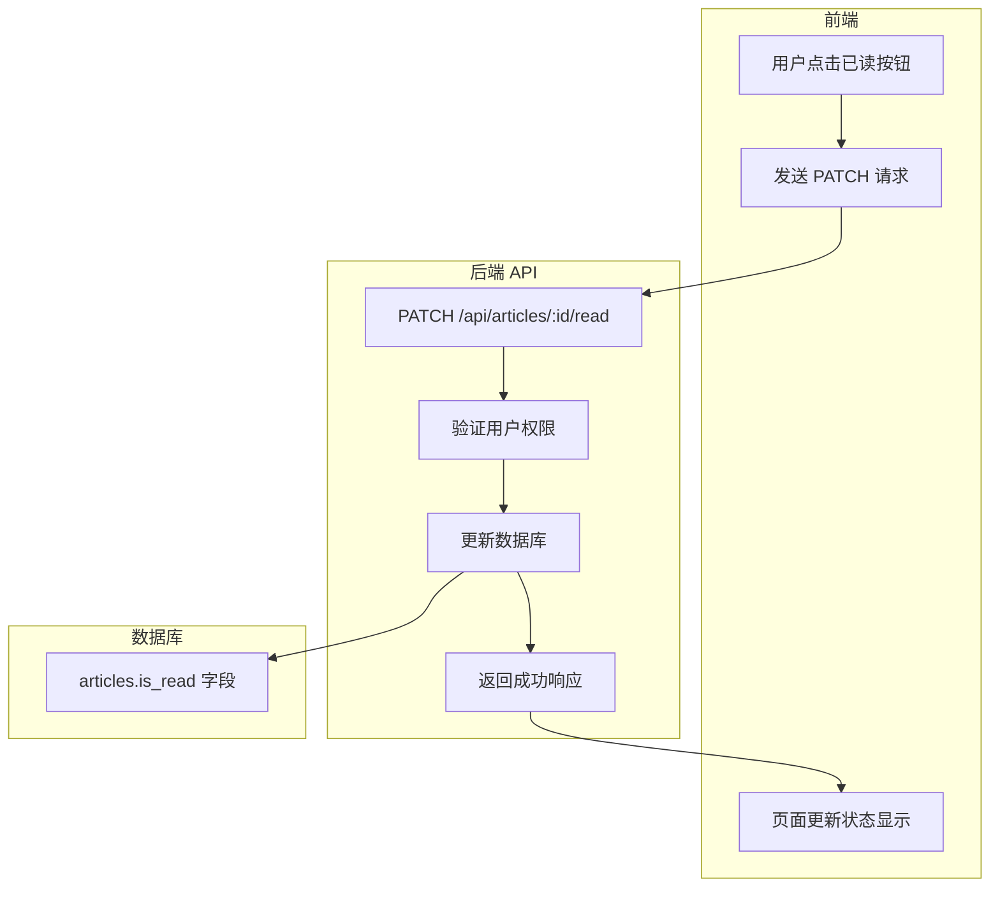

# 文章已读状态功能实施计划

## 需求概述

在首页的"通过"文章列表中增加"已读"标记功能，用户可以：
1. 标记文章为已读/未读
2. 按已读/未读状态过滤文章
3. 在首页、文章列表页、文章详情页都能进行已读标记操作

## 现有架构分析

### 页面结构
- **首页 (`src/views/index.ejs`)**: 显示"通过"状态的文章，目前无操作按钮
- **文章列表页 (`src/views/articles.ejs`)**: 显示所有文章，有"处理"和"删除"按钮
- **文章详情页 (`src/views/article-detail.ejs`)**: 显示单篇文章，有操作按钮

### 数据库表结构
- **articles 表**: 当前没有已读状态字段
- 使用 SQLite 数据库，通过 Kysely ORM 操作
- 迁移脚本位于 `sql/` 目录，通过 `scripts/migrate.ts` 执行

### API 结构
- 文章相关 API 位于 `src/api/routes/articles.routes.ts`
- 文章服务位于 `src/api/articles.ts`

---

## 实施方案

### 1. 数据库迁移（安全添加字段）

**文件**: `sql/008_add_is_read.sql`

```sql
-- 添加已读状态字段
-- 使用 DEFAULT 0 确保现有数据默认为未读
ALTER TABLE articles ADD COLUMN is_read INTEGER DEFAULT 0;

-- 添加索引以优化过滤查询
CREATE INDEX IF NOT EXISTS idx_articles_is_read ON articles(is_read);
```

**迁移脚本更新**: `scripts/migrate.ts`

在迁移脚本中添加对 `008_add_is_read.sql` 的处理，确保：
- 先检查字段是否已存在
- 如果不存在才添加
- 现有数据自动设置为未读状态（默认值 0）

**类型定义更新**: `src/db.ts`

在 `ArticlesTable` 接口中添加：
```typescript
is_read: number;  // 0 = 未读, 1 = 已读
```

---

### 2. 后端 API 实现

#### 2.1 新增标记已读接口

**路由**: `PATCH /api/articles/:id/read`

**请求体**:
```json
{
  "is_read": true  // true = 已读, false = 未读
}
```

**响应**:
```json
{
  "success": true,
  "is_read": true
}
```

#### 2.2 修改文章查询接口

**路由**: `GET /api/articles`

新增查询参数:
- `isRead`: 过滤已读状态 (true/false/all)

#### 2.3 修改文章服务

**文件**: `src/api/articles.ts`

新增函数:
```typescript
// 更新文章已读状态
export async function updateArticleReadStatus(
  articleId: number,
  userId: number,
  isRead: boolean
): Promise<void>

// 修改 getUserArticles 函数，支持 isRead 过滤
```

---

### 3. 前端实现

#### 3.1 首页 (`src/views/index.ejs`)

**修改内容**:
1. 统计卡片区域：新增"未读"统计卡片（5个卡片同行显示）
2. 在文章卡片中添加已读标记按钮
3. 添加已读状态的视觉标识
4. 实现标记已读的 JavaScript 函数
5. 默认过滤逻辑：在原有基础上只显示未读文章

**UI 设计**:
- 统计卡片：今日新增 | 待处理 | 已完成 | 通过率 | 未读
- 已读文章：标题前显示 ✅ 图标，标题颜色变灰色
- 拒绝文章：标题颜色变灰色（无图标）
- 文章卡片底部添加"标记已读/未读"按钮
- 添加"全部标记已读"批量操作按钮

#### 3.2 文章列表页 (`src/views/articles.ejs`)

**修改内容**:
1. 在筛选栏添加已读状态过滤
2. 在文章操作按钮区域添加已读标记按钮
3. 显示已读状态标识

#### 3.3 文章详情页 (`src/views/article-detail.ejs`)

**修改内容**:
1. 在侧边栏操作区域添加已读标记按钮
2. 显示当前已读状态

---

## 数据流程图



---

## 生产环境安全迁移策略

由于项目已在生产环境部署，数据库迁移需要特别注意：

### 安全措施

1. **向后兼容**: 新字段使用默认值，现有数据不受影响
2. **幂等迁移**: 迁移脚本可重复执行，不会重复添加字段
3. **先检查后添加**: 使用 `hasColumn()` 检查字段是否存在
4. **索引创建使用 IF NOT EXISTS**: 避免重复创建索引

### 迁移执行步骤

1. 备份数据库文件（建议）
2. 执行迁移脚本: `pnpm run db:migrate`
3. 验证迁移结果
4. 部署新版本代码

### 验证 SQL

```sql
-- 检查字段是否添加成功
PRAGMA table_info(articles);

-- 检查索引是否创建
SELECT name FROM sqlite_master WHERE type='index' AND tbl_name='articles';

-- 验证现有数据
SELECT id, title, is_read FROM articles LIMIT 5;
```

---

## 文件修改清单

| 文件路径 | 修改类型 | 说明 |
|---------|---------|------|
| `sql/008_add_is_read.sql` | 新增 | 数据库迁移脚本 |
| `scripts/migrate.ts` | 修改 | 添加迁移处理逻辑 |
| `src/db.ts` | 修改 | 更新类型定义 |
| `src/api/articles.ts` | 修改 | 添加已读状态服务函数 |
| `src/api/routes/articles.routes.ts` | 修改 | 添加已读状态 API 路由 |
| `src/views/index.ejs` | 修改 | 首页添加已读功能、统计卡片、批量操作 |
| `src/views/articles.ejs` | 修改 | 文章列表页添加已读功能 |
| `src/views/article-detail.ejs` | 修改 | 文章详情页添加已读功能 |
| `src/public/js/article-detail.js` | 修改 | 详情页 JS 逻辑 |
| `src/public/css/main.bundle.css` | 修改 | 添加已读状态样式（可选）|

---

## 实施顺序

1. **数据库迁移** - 添加 `is_read` 字段
2. **后端 API** - 实现标记已读接口和查询过滤
3. **前端首页** - 添加已读标记按钮和过滤功能
4. **前端文章列表页** - 添加已读标记按钮
5. **前端文章详情页** - 添加已读标记按钮
6. **测试验证** - 确保功能完整且不影响现有数据

---

## 需求确认结果

1. **已读文章的视觉样式**: 
   - 已读文章标题变灰色
   - 在文章标题前增加 ✅ 图标标识
   - "拒绝"状态的文章也显示灰色标题，但不需要图标

2. **首页默认过滤**: 
   - 在原有过滤逻辑基础上（通过状态 + 7天内）
   - 默认只显示未读文章

3. **批量操作**: 支持批量标记已读功能

4. **统计卡片**: 
   - 在现有4个统计卡片基础上增加"未读"统计
   - 5个卡片显示在同一行中
