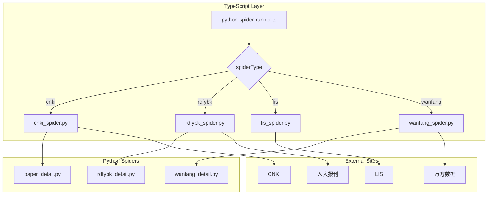

# 万方期刊爬虫实现计划

## 概述

在现有爬虫模块基础上，新增万方（Wanfang）期刊爬虫支持。万方爬虫的配置类似人大报刊，使用期刊代码构成网址。

## 需求分析

### 万方网址格式

```
https://c.wanfangdata.com.cn/magazine/{code}?publishYear={publish_year}&issueNum={issue_num}&page=1&isSync=0
```

参数说明：
- `{code}` - 期刊代码，如 `zgtsgxb`（中国图书馆学报）
- `{publish_year}` - 年份，如 `2025`
- `{issue_num}` - 期号，如 `2`

示例：中国图书馆学报 2025年第2期
```
https://c.wanfangdata.com.cn/magazine/zgtsgxb?publishYear=2025&issueNum=2&page=1&isSync=0
```

### 与现有爬虫对比

| 特性 | CNKI | 人大报刊 | LIS | 万方 |
|------|------|----------|-----|------|
| URL构建 | 期刊导航页 | 期刊代码+年期 | 年卷期公式 | 期刊代码+年期 |
| 代码参数 | URL | journal_code | - | journal_code |
| 详情获取 | 需跳转 | 需跳转 | 列表页直接获取 | 需跳转 |
| 分页支持 | 单页 | 单页 | 单页 | 多页 |

## 实现步骤

### 1. 创建万方爬虫主文件 `src/spiders/wanfang_spider.py`

参考 `rdfybk_spider.py` 结构，主要功能：

```python
class WanfangSpider:
    """万方期刊爬虫类"""
    
    BASE_URL = "https://c.wanfangdata.com.cn/magazine"
    
    # 期号范围（通常月刊为1-12，但万方可能有多期）
    MIN_ISSUE = 1
    MAX_ISSUE = 24  # 半月刊最大24期
    
    def __init__(self, journal_code: str, year: int, issues: Union[int, str, List[int]], 
                 get_details: bool = False, headless: bool = True, timeout: int = 30000):
        # 初始化参数
        pass
    
    def _build_url(self, issue: int, page: int = 1) -> str:
        """构建URL"""
        return f"{self.BASE_URL}/{self.journal_code}?publishYear={self.year}&issueNum={issue}&page={page}&isSync=0"
    
    def crawl(self, issue: Optional[int] = None) -> list:
        """爬取单期论文"""
        pass
    
    def _extract_papers(self, page, issue: int) -> list:
        """提取论文列表"""
        # 选择器：.magazine-paper-box .periodical-list-item
        pass
    
    def _get_paper_details(self, page, papers: list) -> list:
        """获取论文详情（可选）"""
        pass
```

**关键选择器（从参考示例分析）：**

| 元素 | 选择器 |
|------|--------|
| 文章容器 | `.magazine-paper-box` |
| 文章项 | `.periodical-list-item` |
| 标题 | `.title .periotitle` |
| 作者 | `.author span` |
| 页码 | `.page` |
| 栏目 | `.magazine-paper-column span` |
| 详情链接 | `.title a` (href属性) |

### 2. 创建万方详情爬取模块 `src/spiders/wanfang_detail.py`

参考 `rdfybk_detail.py` 结构：

```python
class WanfangDetailSpider:
    """万方论文详情爬取类"""
    
    # 摘要元素选择器
    ABSTRACT_SELECTORS = [
        '.summary.list .text-overflow span span',
        '.summary.list',
        '.abstract',
    ]
    
    def fetch_detail(self, page, url: str) -> Optional[Dict[str, Any]]:
        """获取论文详情"""
        pass
    
    def _extract_abstract(self, page) -> str:
        """提取摘要"""
        pass
```

**详情页选择器：**

| 元素 | 选择器 |
|------|--------|
| 标题 | `.detailTitle .detailTitleCN span` |
| 摘要 | `.summary.list .text-overflow span span` |
| 发表日期 | `.publish.list .itemUrl` |

### 3. 修改类型定义 `src/spiders/types.ts`

```typescript
// 添加 wanfang 到 JournalSourceType
export type JournalSourceType = 'cnki' | 'rdfybk' | 'lis' | 'wanfang';
```

### 4. 修改 Python 爬虫运行器 `src/spiders/python-spider-runner.ts`

在 `scriptMap` 中添加万方：

```typescript
const scriptMap: Record<JournalSourceType, string> = {
  cnki: 'cnki_spider.py',
  rdfybk: 'rdfybk_spider.py',
  lis: 'lis_spider.py',
  wanfang: 'wanfang_spider.py',  // 新增
};
```

在 `buildArgs` 方法中添加万方参数构建：

```typescript
case 'wanfang':
  // 万方爬虫参数
  // python wanfang_spider.py -j CODE -y YEAR -i ISSUE
  if (params.code) {
    args.push('-j', params.code);
  }
  args.push('-y', String(params.year));
  args.push('-i', String(params.issue));
  // 获取详情
  args.push('-d');
  break;
```

## 文件变更清单

| 文件 | 操作 | 说明 |
|------|------|------|
| `src/spiders/wanfang_spider.py` | 新建 | 万方期刊爬虫主文件 |
| `src/spiders/wanfang_detail.py` | 新建 | 万方论文详情爬取模块 |
| `src/spiders/types.ts` | 修改 | 添加 `wanfang` 类型 |
| `src/spiders/python-spider-runner.ts` | 修改 | 添加万方爬虫支持 |

## 命令行接口设计

```bash
# 爬取中国图书馆学报 2025 年第 2 期
python wanfang_spider.py -j zgtsgxb -y 2025 -i 2

# 爬取并获取论文摘要
python wanfang_spider.py -j zgtsgxb -y 2025 -i 2 -d

# 输出到 stdout
python wanfang_spider.py -j zgtsgxb -y 2025 -i 2 -o -

# 非无头模式（调试用）
python wanfang_spider.py -j zgtsgxb -y 2025 -i 2 --no-headless
```

## 输出数据格式

根据 articles 表结构，爬虫需要提取以下字段：

| 数据库字段 | 说明 | 万方页面来源 |
|-----------|------|-------------|
| `title` | 题名 | 列表页 `.title .periotitle` |
| `url` | 文章链接 | 列表页 `.title a` 的 href |
| `content` | 摘要 | 详情页 `.summary.list` |
| `published_year` | 年份 | URL 参数 `publishYear` |
| `published_issue` | 期号 | URL 参数 `issueNum` |
| `published_at` | 出版时间 | 详情页 `.publish.list .itemUrl` |

**可选字段：**
| 数据库字段 | 说明 | 万方页面来源 |
|-----------|------|-------------|
| `published_volume` | 卷号 | 需要根据期刊计算 |

```json
[
  {
    "year": 2025,
    "issue": 2,
    "title": "论文标题",
    "url": "https://d.wanfangdata.com.cn/periodical/xxxx",
    "abstract": "论文摘要内容...",
    "publish_date": "2025-02-15"
  }
]
```

**注意：** 作者、页码、DOI 等信息虽然爬虫会提取，但不会存入 articles 表。

## 注意事项

1. **使用 Camoufox**：与现有爬虫保持一致，使用 Camoufox 而非原生 Playwright
2. **分页处理**：万方期刊列表可能有多页，需要处理翻页逻辑
3. **反爬策略**：万方可能有反爬机制，需要适当设置请求间隔
4. **期号范围**：不同期刊的发行周期不同，期号范围需要灵活处理

## 架构图



## 测试计划

1. **单元测试**：测试 URL 构建、期号解析等功能
2. **集成测试**：使用中国图书馆学报（zgtsgxb）进行实际爬取测试
3. **边界测试**：测试期号范围、空结果等边界情况
