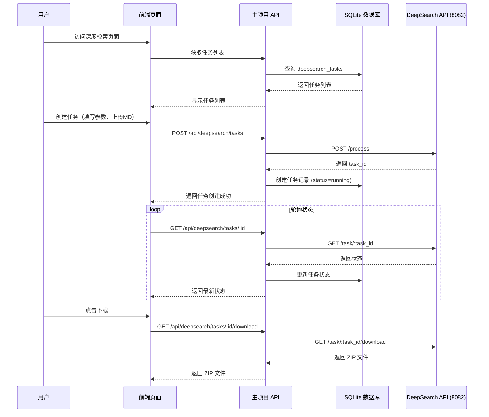

# 深度检索页面集成实施计划

## 1. 需求概述

在主项目中新增「深度检索」页面，功能包括：
- 任务创建：填写任务名、上传 MD 文件、设置参数（迭代轮次、相关文献数量、最大保留文章数）
- 任务管理：显示任务列表及状态（pending/running/completed/failed）
- 结果下载：打包下载 API 生成的报告 MD 和日志 MD
- MD 模板下载：提供输入文件模板

## 2. 系统架构



## 3. 数据库设计

### 3.1 新建表：deepsearch_tasks

```sql
-- 深度检索任务表
CREATE TABLE IF NOT EXISTS deepsearch_tasks (
    id INTEGER PRIMARY KEY AUTOINCREMENT,
    user_id INTEGER NOT NULL,                    -- 创建任务的用户
    task_name TEXT NOT NULL,                     -- 任务名称（用于显示和检索）
    input_md TEXT NOT NULL,                      -- 输入的 MD 内容
    rounds INTEGER DEFAULT 1,                     -- 迭代轮次 (0-3)
    semantic_limit INTEGER DEFAULT 5,             -- 相关文献数量
    score_threshold REAL DEFAULT 0.65,            -- 相关性分数阈值
    max_final_articles INTEGER DEFAULT 10,        -- 最大保留文章数 (5-50)
    external_task_id TEXT,                        -- DeepSearch API 返回的任务 ID
    status TEXT DEFAULT 'pending' CHECK(status IN ('pending', 'running', 'completed', 'failed')),
    result_report_path TEXT,                     -- 报告文件路径（可选，存储相对于 output 目录）
    result_articles_dir TEXT,                    -- 文章目录路径（可选）
    article_count INTEGER DEFAULT 0,              -- 相关文章数量
    pdf_summary_success INTEGER DEFAULT 0,       -- PDF 总结成功数量
    pdf_summary_failed INTEGER DEFAULT 0,        -- PDF 总结失败数量
    error_message TEXT,                          -- 错误信息
    created_at DATETIME DEFAULT CURRENT_TIMESTAMP,
    updated_at DATETIME DEFAULT CURRENT_TIMESTAMP,
    completed_at DATETIME,                       -- 完成时间
    FOREIGN KEY (user_id) REFERENCES users(id) ON DELETE CASCADE
);

CREATE INDEX IF NOT EXISTS idx_deepsearch_tasks_user_id ON deepsearch_tasks(user_id);
CREATE INDEX IF NOT EXISTS idx_deepsearch_tasks_status ON deepsearch_tasks(status);
CREATE INDEX IF NOT EXISTS idx_deepsearch_tasks_created_at ON deepsearch_tasks(created_at);
```

### 3.2 字段说明

| 字段 | 说明 |
|------|------|
| id | 主键 |
| user_id | 创建任务的用户（用于权限控制） |
| task_name | 任务名称，支持显示和搜索 |
| input_md | 用户上传的 MD 文件内容（存储原始内容） |
| rounds | 迭代轮次 (0-3)，对应 API 的 rounds 参数 |
| semantic_limit | 相关文献数量，对应 API 的 semantic_limit 参数 |
| score_threshold | 相关性分数阈值，对应 API 的 score_threshold 参数 |
| max_final_articles | 最大保留文章数 (5-50)，对应 API 的 max_final_articles 参数 |
| external_task_id | DeepSearch API 返回的任务 ID，用于查询状态和下载 |
| status | 任务状态：pending/running/completed/failed |
| result_report_path | 报告文件路径（从 API result 获取） |
| result_articles_dir | 文章目录路径（从 API result 获取） |
| article_count | 相关文章数量（从 API result 获取） |
| pdf_summary_success | PDF 总结成功数量 |
| pdf_summary_failed | PDF 总结失败数量 |
| error_message | 错误信息 |
| created_at | 创建时间 |
| updated_at | 更新时间 |
| completed_at | 完成时间 |

## 4. API 设计

### 4.1 主项目 API（新增）

#### GET /api/deepsearch/tasks
获取当前用户的任务列表

**响应：**
```json
{
  "tasks": [
    {
      "id": 1,
      "task_name": "测试任务",
      "rounds": 1,
      "semantic_limit": 5,
      "status": "completed",
      "article_count": 10,
      "created_at": "2026-03-24T10:00:00Z",
      "completed_at": "2026-03-24T10:30:00Z"
    }
  ]
}
```

#### POST /api/deepsearch/tasks
创建新任务

**请求体：**
```json
{
  "task_name": "测试任务",
  "input_md": "- 题名：1234\n- 深度学习研究进展",
  "rounds": 1,
  "semantic_limit": 5,
  "score_threshold": 0.65,
  "max_final_articles": 10
}
```

> **注意**：内部调用 DeepSearch API 时，`input_type` 固定为 `"content"`

**响应：**
```json
{
  "id": 1,
  "task_name": "测试任务",
  "status": "running",
  "external_task_id": "uuid-from-deepsearch-api",
  "created_at": "2026-03-24T10:00:00Z"
}
```

#### GET /api/deepsearch/tasks/:id
获取单个任务详情（包括最新状态）

**响应：**
```json
{
  "id": 1,
  "taskName": "测试任务",
  "inputMd": "- 题名：1234\n- 深度学习研究进展",
  "rounds": 1,
  "semanticLimit": 5,
  "scoreThreshold": 0.65,
  "maxFinalArticles": 10,
  "status": "running",
  "externalTaskId": "uuid-from-deepsearch-api",
  "progress": {
    "step": "searching",
    "current": 50,
    "total": 100
  },
  "result": {
    "reportPath": "/opt/lis-rss-daily/output/deepsearch/report_20260324.md",
    "articlesDir": "/opt/lis-rss-daily/output/deepsearch/articles",
    "outputDir": "/opt/lis-rss-daily/output/deepsearch",
    "articleCount": 10,
    "pdfSummarySuccess": 8,
    "pdfSummaryFailed": 2,
    "pdfSummarySkipped": 0
  },
  "errorMessage": null,
  "createdAt": "2026-03-24T10:00:00Z",
  "updatedAt": "2026-03-24T10:05:00Z",
  "completedAt": null
}
```

#### GET /api/deepsearch/tasks/:id/download
下载任务结果（ZIP 文件）

**响应：** 直接返回 ZIP 文件流

#### DELETE /api/deepsearch/tasks/:id
删除任务

**响应：**
```json
{
  "success": true
}
```

### 4.2 DeepSearch API（已有）

详情见 `scripts/deepsearch/api.py`：

| 端点 | 方法 | 说明 |
|------|------|------|
| /process | POST | 创建任务 |
| /task/{task_id} | GET | 查询状态 |
| /task/{task_id}/download | GET | 下载结果 ZIP |

## 5. 实施步骤

### Step 1: 数据库迁移
- 创建 `sql/028_add_deepsearch_tasks.sql`
- 包含表结构和索引

### Step 2: 后端 API
- 创建 `src/api/routes/deepsearch.routes.ts`
- 实现任务 CRUD 接口
- 实现与 DeepSearch API 的集成
- 实现文件下载代理

### Step 3: 前端页面
- 创建 `src/views/deepsearch.ejs`
- 任务创建表单（任务名、MD 上传、参数设置）
- 任务列表展示（状态、创建时间、完成时间）
- 状态轮询逻辑
- 下载按钮

### Step 4: 页面路由
- 修改 `src/api/web.ts`
- 添加 GET /deepsearch 路由

### Step 5: 导航栏
- 修改 `src/views/layout.ejs`
- 在导航栏添加"深度检索"链接

### Step 6: MD 模板
- 创建 `public/templates/deepsearch-input.md`
- 包含输入文件格式说明和示例

### Step 7: 配置
- 在 `config.yaml` 中添加 DeepSearch API 地址配置
- 或使用环境变量 DEEPSEARCH_API_URL

## 6. 文件修改清单

| 文件 | 操作 | 说明 |
|------|------|------|
| sql/028_add_deepsearch_tasks.sql | 新建 | 数据库迁移脚本 |
| src/api/routes/deepsearch.routes.ts | 新建 | API 路由 |
| src/api/routes.ts | 修改 | 导入 deepsearch 路由 |
| src/views/deepsearch.ejs | 新建 | 前端页面 |
| src/api/web.ts | 修改 | 添加页面路由 |
| src/views/layout.ejs | 修改 | 添加导航链接 |
| public/templates/deepsearch-input.md | 新建 | MD 模板 |
| src/config.ts | 修改 | 添加 DeepSearch API 配置 |

## 7. 页面设计

### 7.1 布局结构
```
┌─────────────────────────────────────────────┐
│ 深度检索                                    │
├─────────────────────────────────────────────┤
│ ┌─────────────────────────────────────────┐ │
│ │ 创建新任务                               │ │
│ │ ┌─────────────────────────────────────┐ │ │
│ │ │ 任务名称: [________________]        │ │ │
│ │ └─────────────────────────────────────┘ │ │
│ │ ┌─────────────────────────────────────┐ │ │
│ │ │ 输入文件: [选择文件] [下载模板]     │ │ │
│ │ │ (支持 .md 格式)                     │ │ │
│ │ └─────────────────────────────────────┘ │ │
│ │ 迭代轮次: [1▼] 相关文献数量: [5▼] 最大保留: [10▼] │ │
│ │ [生成]                                  │ │
│ └─────────────────────────────────────────┘ │
│                                             │
│ 任务列表                                     │
│ ┌─────────────────────────────────────────┐ │
│ │ 任务名    │ 状态    │ 创建时间 │ 操作   │ │
│ │ 测试任务1 │ ✅完成  │ 10:00   │ 下载   │ │
│ │ 测试任务2 │ 🔄运行中│ 10:05   │ -      │ │
│ │ 测试任务3 │ ❌失败  │ 10:10   │ -      │ │
│ └─────────────────────────────────────────┘ │
└─────────────────────────────────────────────┘
```

### 7.2 交互流程
1. 用户填写任务名
2. 用户上传 MD 文件或粘贴内容
3. 用户设置迭代轮次和相关文献数量
4. 点击"生成"按钮
5. 前端 POST 到后端
6. 后端调用 DeepSearch API 获取 external_task_id
7. 后端保存任务到数据库，状态设为 running
8. 前端开始轮询任务状态
9. 任务完成后，显示"下载"按钮
10. 用户点击下载，获取 ZIP 文件

## 8. 关键实现细节

### 8.1 MD 文件上传
```typescript
// 前端使用 FormData 上传
const formData = new FormData();
formData.append('file', mdFile);
formData.append('task_name', taskName);
formData.append('rounds', rounds);
formData.append('semantic_limit', semanticLimit);
formData.append('max_final_articles', maxFinalArticles);

// 或直接传递 MD 内容（推荐）
const response = await fetch('/api/deepsearch/tasks', {
  method: 'POST',
  headers: { 'Content-Type': 'application/json' },
  body: JSON.stringify({
    task_name: 'xxx',
    input_md: '内容',
    rounds: 1,
    semantic_limit: 5,
    score_threshold: 0.65,
    max_final_articles: 10
  })
});
```

### 8.2 状态轮询
```typescript
// 前端轮询逻辑（智能间隔）
async function pollStatus(taskId, onProgress) {
  let interval = 3000;
  let maxInterval = 10000;
  
  while (true) {
    const res = await fetch(`/api/deepsearch/tasks/${taskId}`);
    const data = await res.json();
    
    // 回调进度信息供 UI 展示
    if (onProgress && data.progress) {
      onProgress(data.progress);
    }
    
    if (data.status === 'completed' || data.status === 'failed') {
      return data;
    }
    
    // 逐步增加轮询间隔，减少服务器压力
    await sleep(interval);
    interval = Math.min(interval + 1000, maxInterval);
  }
}

// 使用示例
pollStatus(taskId, (progress) => {
  console.log(`进度: ${progress.step} - ${progress.current}/${progress.total}`);
});
```

### 8.3 文件下载
```typescript
// 后端代理下载
router.get('/tasks/:id/download', async (req, res) => {
  const task = await getTaskById(req.params.id);
  const externalTaskId = task.external_task_id;
  
  // 调用 DeepSearch API 下载
  const apiResponse = await fetch(`http://localhost:8082/task/${externalTaskId}/download`);
  
  // 转发文件流
  res.setHeader('Content-Type', 'application/zip');
  res.setHeader('Content-Disposition', `attachment; filename="deepsearch-${task.task_name}.zip"`);
  apiResponse.body.pipe(res);
});
```

## 9. 配置说明

### 9.1 环境变量
```
# DeepSearch API 地址
DEEPSEARCH_API_URL=http://localhost:8082
```

### 9.2 默认参数
- 迭代轮次：1（范围 0-3）
- 相关文献数量：5
- 相关性阈值：0.65
- 最大保留文章数：10（范围 5-50）

## 10. 风险和注意事项

1. **DeepSearch API 依赖** - 需要确保 `python api.py` 服务运行在 8082 端口
2. **文件存储** - 输入的 MD 内容直接存储在数据库中，较大的文件可能影响性能
3. **任务清理** - 定期清理已完成任务或提供手动删除功能
4. **权限控制** - 仅创建任务的用户可查看和下载自己的任务
5. **错误处理** - DeepSearch API 调用失败时需要正确处理并记录错误

## 11. 实施顺序

1. 创建数据库迁移脚本
2. 创建后端 API 路由
3. 创建前端页面
4. 添加页面路由
5. 添加导航栏链接
6. 创建 MD 模板
7. 测试完整流程
