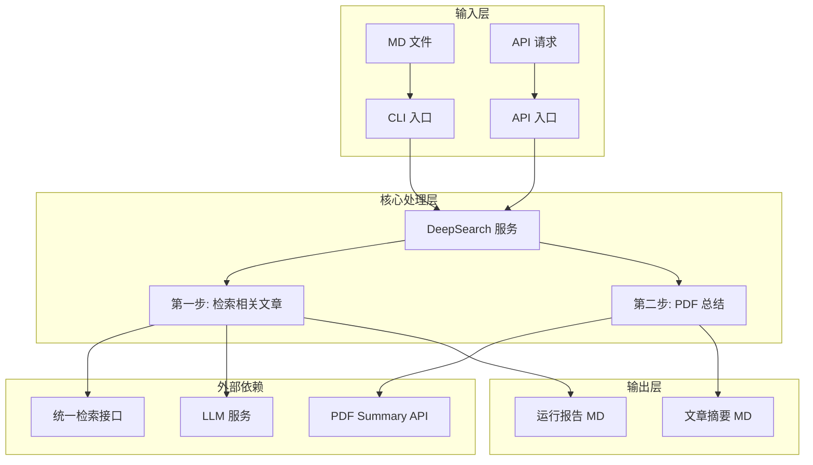

# DeepSearch 深度检索工具实施计划

## 1. 需求概述

开发一个独立的深度检索工具，实现以下功能：
1. **第一步：检索相关文章** - 根据用户提供的 MD 文件，检索相关文章
2. **第二步：PDF 总结** - 对候选文章进行 PDF 总结并生成摘要

### 关键特性
- 支持命令行和 API 两种调用方式
- 独立工具，无需用户认证
- 错误容忍：PDF 总结失败时跳过并记录，继续处理后续数据
- 报告输出：每一步执行结果追加写入同一个 MD 文档
- API 设计支持后期集成到主项目页面

---

## 2. 系统架构



---

## 3. 配置文件设计

### 3.1 config.yaml

位置：`scripts/deepsearch/config/config.yaml`

```yaml
# DeepSearch 配置文件

# 用户配置（用于数据库查询和检索服务权限验证）
user:
  # 用户 ID（用于检索服务的数据权限验证）
  userId: 1

# 数据库配置
database:
  # SQLite 数据库文件路径
  path: "/opt/lis-rss-daily/data/rss-tracker.db"

# LLM 配置
llm:
  # 任务类型（可选，用于选择对应任务的 LLM 配置）
  # - 如果不配置或为 null：使用该用户所有启用的 LLM 配置，按 is_default、priority、created_at 排序
  # - 如果指定具体值（如 "deepsearch"）：优先使用匹配该任务类型的配置，失败后自动切换到默认配置
  task_type: null
  # 温度参数
  temperature: 0.3
  # 最大 token 数
  max_tokens: 2000
  # 重试间隔（毫秒，用于 PDF API 指数退避）
  retry_delay_ms: 1000

# 注意：LLM 的 API Key、Base URL、模型名称从数据库 llm_configs 表获取
# - 多个配置支持故障转移（failover）
# - 配置排序：is_default > priority > created_at

# 检索相关配置
search:
  # 迭代检索轮次（1-3轮）
  iteration_rounds: 1
  # 相关性分数阈值（0-1）
  score_threshold: 0.65
  # 语义检索返回的文章数量
  semantic_limit: 5
  # 语义权重
  semantic_weight: 0.7
  # 关键词权重
  keyword_weight: 0.3

# PDF 总结配置
pdf_summary:
  # API 地址
  api_url: "http://localhost:8081"
  # 超时时间（秒）
  timeout: 300
  # 调用失败时的重试次数
  max_retries: 2

# 输出配置
output:
  # 报告输出目录
  report_dir: "./output"
  # 文章摘要输出目录
  articles_dir: "./output/articles"
```

### 3.2 提示词文件

位置：`scripts/deepsearch/prompts/`

```
prompts/
├── default.md        # 默认提示词
├── research.md       # 研究主题提示词
└── ...
```

---

## 4. 实施步骤

### 4.1 创建配置文件和提示词目录

- [ ] 创建 `scripts/deepsearch/config/config.yaml`
- [ ] 创建 `scripts/deepsearch/prompts/` 目录结构
- [ ] 创建默认提示词文件 `prompts/default.md`

### 4.2 实现核心服务

- [ ] 创建 `scripts/deepsearch/types.ts` - 定义 TypeScript 类型
- [ ] 创建 `scripts/deepsearch/config.ts` - 配置加载模块
- [ ] 创建 `scripts/deepsearch/llm.ts` - LLM 调用封装（复用主项目 `src/llm.ts` 中的 `getLLM()` 函数）
- [ ] 创建 `scripts/deepsearch/search.ts` - 检索服务封装
- [ ] 创建 `scripts/deepsearch/pdf-api.ts` - PDF Summary API 客户端
- [ ] 创建 `scripts/deepsearch/report.ts` - 报告生成模块


### 4.3 实现第一步：检索相关文章

- [ ] 实现 MD 文件解析器 - 解析输入的 MD 文件，提取文章 ID 和题名
- [ ] 实现迭代检索逻辑
  - [ ] 根据 ID 检索相关文章（使用 article_related 表）
  - [ ] 根据题名生成检索词（调用 LLM）
  - [ ] 执行语义检索
  - [ ] 多轮迭代检索
- [ ] 实现运行报告生成

### 4.4 实现第二步：PDF 总结

- [ ] 实现候选文章筛选逻辑 - 筛选 ai_summary 为空的文章
- [ ] 实现 PDF 总结调用 - 调用 paper-pdf-summary API
- [ ] 实现错误处理 - 失败跳过并记录
- [ ] 实现文章摘要 MD 生成 - 每篇文章一个 MD 文件

### 4.5 实现 CLI 入口

- [ ] 创建 `scripts/deepsearch/cli.ts`
- [ ] 支持的命令行参数：
  - `--input, -i` - 输入 MD 文件路径（必填）
  - `--config, -c` - 配置文件路径（可选）
  - `--rounds, -r` - 迭代检索轮次（可选，覆盖配置）
  - `--threshold, -t` - 相关性分数阈值（可选，覆盖配置）
  - `--limit, -l` - 语义检索返回数量（可选，覆盖配置）
  - `--output, -o` - 输出目录（可选，覆盖配置）

### 4.6 实现 API 服务

- [ ] 创建 `scripts/deepsearch/api.ts` - FastAPI 服务入口
- [ ] 实现 API 端点：
  - `POST /process` - 处理请求
  - `GET /health` - 健康检查
- [ ] 支持异步处理和任务状态查询
- [ ] 支持结果压缩包下载（便于主项目集成）

### 4.7 测试和文档

- [ ] 编写单元测试
- [ ] 编写使用文档
- [ ] 创建部署脚本

---

## 5. API 接口设计

### 5.1 POST /process

**请求体：**

```json
{
  "input_md": "base64编码的MD内容或文件路径",
  "input_type": "content | file",
  "rounds": 1,
  "score_threshold": 0.65,
  "semantic_limit": 5,
  "output_dir": "./output"
}
```

**响应：**

```json
{
  "task_id": "uuid",
  "status": "running | completed | failed",
  "progress": {
    "step": "searching | pdf_summary | generating_report",
    "current": 5,
    "total": 10
  },
  "result": {
    "report_path": "/path/to/report.md",
    "articles_dir": "/path/to/articles",
    "article_count": 10,
    "pdf_summary_success": 8,
    "pdf_summary_failed": 2
  }
}
```

### 5.2 GET /task/{task_id}

查询任务状态和获取结果。

### 5.3 GET /task/{task_id}/download

下载结果压缩包（便于主项目集成）。

---

## 6. 输入 MD 文件格式

```markdown
- 题名：1234
- 题名：5678
- 题名：深度学习研究进展
```

说明：
- **有 ID 的行**（如 `题名：1234`）：
  1. 先根据 ID 检索相关文章（使用 article_related 表）
  2. 题名 + 优先级摘要（ai_summary > markdown_content > content）调用 LLM 生成检索词
  3. 执行语义检索
- **无 ID 的行**（如 `题名：深度学习研究进展`）：
  1. 直接使用题名调用 LLM 生成检索词
  2. 执行语义检索

---

## 7. 输出文件结构

```
output/
├── report.md                    # 运行报告（追加写入）
├── articles/
│   ├── 1234_深度学习研究进展.md  # 文章摘要 MD
│   ├── 5678_机器学习综述.md
│   └── ...
└── deepsearch_20260323_123456.zip  # 压缩包（API 返回）
```

---

## 8. 关键实现细节

### 8.1 迭代检索逻辑

```typescript
async function iterativeSearch(
  seedArticles: SeedArticle[],
  config: DeepSearchConfig
): Promise<number[]> {
  const allCandidateIds = new Set<number>();
  
  for (let round = 0; round < config.rounds; round++) {
    // 1. 根据 ID 检索相关文章（使用 article_related 表）
    const relatedFromIds = await searchRelatedByIds(seedArticles, config);
    
    // 2. 根据题名生成检索词（调用 LLM）并执行语义检索
    const searchTerms = await generateSearchTerms(seedArticles, config);
    const relatedFromSemantic = await semanticSearch(searchTerms, config);
    
    // 3. 合并结果并去重
    const candidates = mergeResults(relatedFromIds, relatedFromSemantic);
    
    // 4. 过滤低相关性文章
    const filtered = filterByScore(candidates, config.scoreThreshold);
    
    // 5. 添加到候选集
    filtered.forEach(id => allCandidateIds.add(id));
    
    // 6. 更新种子文章（用于下一轮检索）
    seedArticles = await getArticlesByIds(filtered);
  }
  
  return Array.from(allCandidateIds);
}
```

### 8.2 LLM 检索词生成

**自动轮询（Failover）机制**：
- DeepSearch 通过 `getUserLLMProvider(userId, taskType)` 从数据库获取 LLM Provider
- 主项目的 failover 逻辑：当一个 LLM 配置调用失败时，自动尝试下一个配置
- 详情见 `src/llm.ts:449-484` 的 `createFailoverProvider` 函数

```typescript
// DeepSearch 的 LLM 调用方式
import { getUserLLMProvider } from '../../src/llm.js';

async function generateSearchTerms(
  article: Article,
  promptTemplate: string,
  config: DeepSearchConfig
): Promise<string[]> {
  // 获取 LLM Provider（已包含 failover 机制）
  // 从数据库 llm_configs 表按 task_type 优先级获取
  const llm = await getUserLLMProvider(config.user.userId, config.llm.task_type);
  
  // 优先级：ai_summary > markdown_content > content
  const content = article.ai_summary 
    || article.markdown_content 
    || article.content;
  
  const userPrompt = `${promptTemplate}\n\n文章信息：\n题名：${article.title}\n摘要：${content}`;
  
  const response = await llm.chat([
    { role: 'system', content: '你是一个专业的学术检索助手。' },
    { role: 'user', content: userPrompt }
  ], { 
    jsonMode: true,
    temperature: config.llm.temperature,
    maxTokens: config.llm.max_tokens,
    label: 'generate-search-terms'  // 用于日志记录
  });
  
  return parseSearchTerms(response);
}
```

### 8.3 PDF 总结调用（带重试）

**重试机制**：
- DeepSearch 在调用 PDF API 时实现自动重试
- 支持指数退避策略：间隔时间 = `retry_delay_ms * 2^retryCount`
- 重试次数在 `config.yaml` 的 `pdf_summary.max_retries` 中配置

```typescript
async function callPdfApiWithRetry(
  title: string,
  articleId: number | null,
  apiUrl: string,
  config: DeepSearchConfig
): Promise<PdfApiResult> {
  const maxRetries = config.pdf_summary.max_retries ?? 3;
  const baseDelay = config.llm.retry_delay_ms ?? 1000;
  
  for (let i = 0; i < maxRetries; i++) {
    try {
      const result = await callPdfApi(title, articleId, apiUrl);
      if (result.success) return result;
      
      // 如果返回失败（非异常），也进行重试
      console.warn(`[重试] PDF API 返回失败: ${result.reason}，剩余重试次数: ${maxRetries - i - 1}`);
    } catch (error) {
      console.warn(`[重试] PDF API 调用异常: ${error.message}，剩余重试次数: ${maxRetries - i - 1}`);
    }
    
    // 指数退避等待
    if (i < maxRetries - 1) {
      await sleep(baseDelay * Math.pow(2, i));
    }
  }
  
  return { success: false, reason: 'max retries exceeded' };
}
```

### 8.4 文章摘要 MD 生成

```typescript
/**
 * 生成文章摘要 MD 文件内容
 * - 有 ID：从 articles 表按优先级获取（ai_summary > markdown_content > content）
 * - 无 ID：从 PDF API 返回的 md_path 读取内容（需确保 MD 文件未被删除）
 */
async function generateArticleMD(
  articleId: number | null,
  title: string,
  pdfResult: PdfApiResult | null
): Promise<string> {
  let content: string = '';
  
  if (articleId) {
    // 有 ID：从 articles 表按优先级获取摘要
    const article = await getArticleById(articleId);
    content = article.ai_summary 
      || article.markdown_content 
      || article.content 
      || '';
  } else if (pdfResult?.md_path) {
    // 无 MD 文件已删除，则无法获取内容
    const mdPath = pdfResult.md_path;
    if (exists(mdPath)) {
      content = await readFile(mdPath);
    } else {
      console.warn(`[警告] MD 文件已被删除: ${mdPath}`);
    }
  }
  
  // 生成 MD 文件内容
  const mdContent = `---\ntitle: ${title}\narticle_id: ${articleId || 'N/A'}\n---\n\n# ${title}\n\n${content}\n`;
  
  return mdContent;
}

/**
 * 处理 PDF 总结并生成文章摘要 MD
 */
async function processPdfSummaryAndGenerateMD(
  candidates: CandidateArticle[],
  apiUrl: string,
  outputDir: string
): Promise<{
  success: number;
  failed: number;
  skipped: number;
  results: ArticleMDResult[];
}> {
  const results: ArticleMDResult[] = [];
  let success = 0;
  let failed = 0;
  let skipped = 0;
  
  for (const candidate of candidates) {
    try {
      let pdfResult: PdfApiResult | null = null;
      
      // 只有有 ID 的文章才需要检查 ai_summary 和调用 PDF API
      if (candidate.articleId) {
        const article = await getArticleById(candidate.articleId);
        
        if (article.ai_summary) {
          // 已有摘要，跳过 PDF 总结
          skipped++;
          results.push({
            articleId: candidate.articleId,
            title: candidate.title,
            mdPath: null,
            skipped: true
          });
          continue;
        }
        
        // 调用 PDF 总结 API（带重试）
        pdfResult = await callPdfApiWithRetry(article.title, article.id, apiUrl, config);
      } else {
        // 无 ID：直接调用 PDF 总结 API（结果写入临时文件，不写入数据库）
        pdfResult = await callPdfApiWithRetry(candidate.title, null, apiUrl, config);
      }
      
      if (pdfResult.success) {
        success++;
      } else {
        failed++;
      }
      
      // 生成文章摘要 MD
      const mdContent = await generateArticleMD(
        candidate.articleId,
        candidate.title,
        pdfResult
      );
      
      const mdPath = await saveArticleMD(
        candidate.articleId,
        candidate.title,
        mdContent,
        outputDir
      );
      
      results.push({
        articleId: candidate.articleId,
        title: candidate.title,
        mdPath,
        pdfSuccess: pdfResult?.success ?? false,
        reason: pdfResult?.reason
      });
      
    } catch (error) {
      // 失败跳过，记录日志
      failed++;
      results.push({
        articleId: candidate.articleId,
        title: candidate.title,
        mdPath: null,
        pdfSuccess: false,
        reason: error.message
      });
    }
  }
  
  return { success, failed, skipped, results };
}
```

---

## 9. 依赖关系

| 模块 | 依赖 | 说明 |
|------|------|------|
| config.ts | js-yaml | 配置文件解析 |
| llm.ts | src/llm.ts | 复用主项目 `getUserLLMProvider()` 函数，从数据库获取配置，支持多配置 failover |
| search.ts | src/vector/search-service.ts | 复用统一检索接口（需配置 userId） |
| pdf-api.ts | 无 | HTTP 请求，支持重试 |
| report.ts | 无 | 文件系统操作 |
| database.ts | better-sqlite3 | 数据库访问（路径从 config.yaml 读取） |

### 9.1 LLM 调用说明

**复用主项目 LLM 逻辑**：
- 使用 `src/llm.ts` 中的 `getUserLLMProvider(userId, taskType)` 从数据库获取 LLM Provider
- 主项目已有完整的 failover 机制：当一个配置失败时自动尝试下一个
- DeepSearch 无需额外实现重试逻辑

**配置**：
- LLM 的 API Key、Base URL、模型等从数据库 `llm_configs` 表获取（与主项目共享）
- 配置获取方式：`getActiveConfigListByTypeAndTask(userId, 'llm', taskType)`
- DeepSearch 的 `config.yaml` 中可配置温度、max_tokens 等调用参数

---

## 10. 实施顺序

1. **基础设施** - 配置文件、类型定义、配置加载模块
2. **核心服务** - LLM 封装、检索服务、PDF API 客户端
3. **第一步实现** - MD 解析、迭代检索、报告生成
4. **第二步实现** - PDF 总结调用、文章摘要生成
5. **CLI 入口** - 命令行工具
6. **API 服务** - FastAPI 服务
7. **测试和文档** - 单元测试、使用文档

---

## 11. 后续集成考虑

为便于后期集成到主项目页面，API 设计预留以下能力：

1. **任务追踪** - 使用 UUID 追踪任务进度
2. **状态查询** - 支持轮询任务状态
3. **结果压缩** - 支持打包下载所有结果
4. **进度推送** - 支持 WebSocket 实时推送进度（可选）

---

## 12. 风险和注意事项

1. **配置文件初始化** - 首次使用需确保 `config.yaml` 正确配置 `user.userId`、`database.path` 等参数
2. **PDF API MD 文件删除** - paper-pdf-summary 的 `config.yaml` 中需设置 `delete_md: false`（需手动修改）
3. **LLM 调用** - 复用主项目逻辑，已有 failover 支持多配置自动轮询
4. **PDF API 依赖** - 需要确保 paper-pdf-summary 服务（端口 8081）正常运行
5. **数据库连接** - 数据库路径在 `config.yaml` 中配置，需确保文件存在且可访问
6. **Chroma 服务** - 检索功能依赖向量检索服务，需确保服务正常运行
7. **文件清理** - 需要定期清理输出目录和临时文件

---

## 13. 常见问题 FAQ

### Q1: DeepSearch 与主项目的 LLM 配置是否共享？

**是的**。DeepSearch 从数据库 `llm_configs` 表获取 LLM 配置：
- API Key、Base URL、模型等与主项目共享同一数据库配置
- 配置获取方式：`getActiveConfigListByTypeAndTask(userId, 'llm', taskType)`
- 主项目的多配置 failover 机制对 DeepSearch 同样生效
- DeepSearch 的 `config.yaml` 中只需配置 `temperature`、`max_tokens` 等调用参数

### Q2: 如何指定使用的 LLM 配置？

在 `config.yaml` 中配置 `llm.task_type`：
- **不配置或为 null**：使用该用户所有启用的 LLM 配置，按 is_default、priority、created_at 排序，多配置自动 failover
- **指定具体值（如 "deepsearch"）**：优先使用匹配该任务类型的配置，失败后自动切换到默认配置

### Q3: 如何启用 LLM 多配置 failover？

在主项目的 LLM 配置页面中添加多个配置并启用，DeepSearch 会自动按顺序尝试：
- 当前一个配置失败（如 API 限流、服务不可用）时，自动尝试下一个
- 详情见 `src/llm.ts:449-484` 的 `createFailoverProvider` 实现

### Q4: PDF API 调用失败时会重试多少次？

由 `config.yaml` 中的 `pdf_summary.max_retries` 控制：
- 默认值为 2
- 使用指数退避策略：间隔时间为 `llm.retry_delay_ms * 2^retryCount` 毫秒
- 全部重试失败后，记录错误并继续处理下一篇文章

### Q5: 如何修改 MD 文件删除配置？

手动修改 `scripts/paper-pdf-summary/config/config.yaml`：
```yaml
summary_upload:
  hiagent_rag:
    delete_md: false  # 改为 false 禁用删除
```

### Q6: 检索时使用的用户 ID 是什么？

由 `config.yaml` 中的 `user.userId` 配置：
- 用于数据库查询和检索服务的数据权限验证
- 用于获取该用户的 LLM 配置
- 建议使用管理员账户（userId=1）或具有完整数据访问权限的账户
