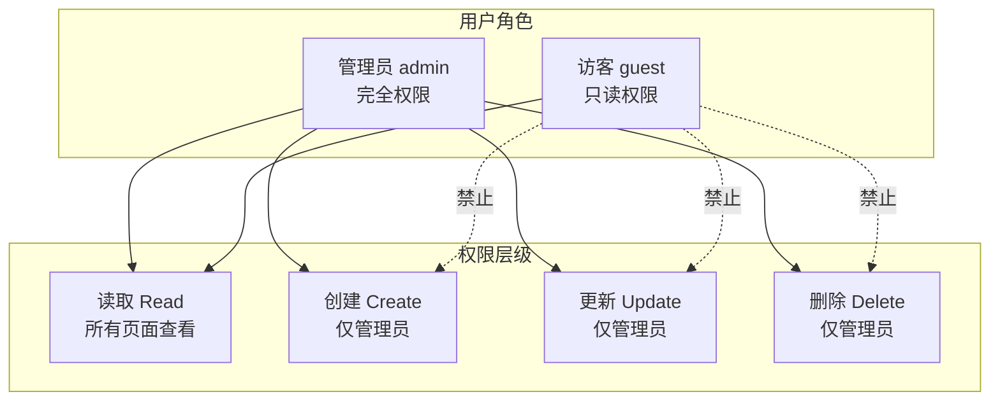
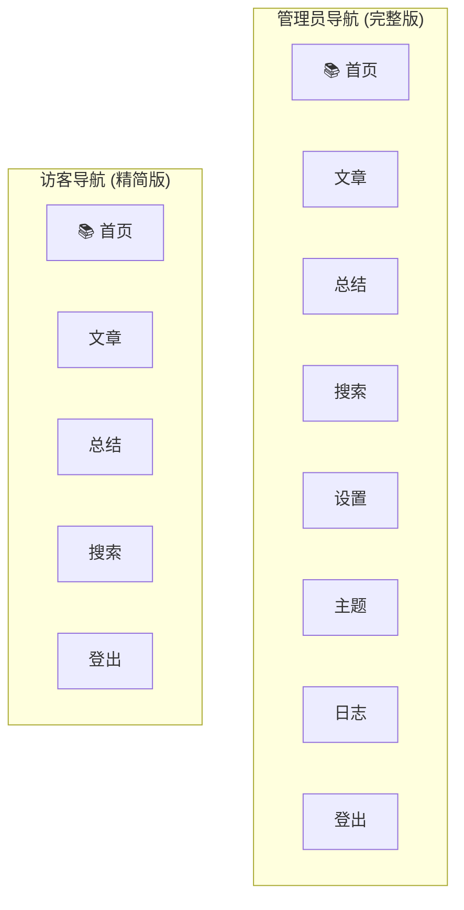

# 访客只读模式实施计划

## 1. 需求分析

### 1.1 当前状态
- 系统有默认管理员账号 `admin`，拥有完整的 CRUD 权限
- 所有页面都需要登录后才能访问
- 使用 JWT Token 进行身份验证

### 1.2 目标
新增一个"访客"（guest）账号，具备以下权限：
- ✅ **读取权限（R）**：所有页面都可以查看和检索
- ❌ **禁止操作**：
  - 每日总结生成
  - 已读/未读标记
  - 文章处理、删除

### 1.3 访客可见页面（精简版导航）
- 首页 `/`
- 文章列表 `/articles`
- 文章详情 `/articles/:id`
- 历史总结 `/history`
- 搜索 `/search`
- 登出 `/logout`

### 1.4 访客不可见页面（仅管理员可见）
- 设置 `/settings`
- 主题 `/topics`
- 日志 `/filter-logs`

---

## 2. 设计方案

### 2.1 架构概览



### 2.2 数据库设计

在 `users` 表中添加 `role` 字段：

```sql
-- 添加角色字段
ALTER TABLE users ADD COLUMN role TEXT DEFAULT 'admin' CHECK(role IN ('admin', 'guest'));
```

角色说明：
| 角色 | 说明 | 权限 |
|------|------|------|
| admin | 管理员 | 完全控制 |
| guest | 访客 | 只读 |

### 2.3 导航栏设计



### 2.4 API 权限控制

| 端点 | 方法 | 限制角色 |
|------|------|----------|
| `/api/articles/:id/process` | POST | 非 guest |
| `/api/articles/process-batch` | POST | 非 guest |
| `/api/articles/:id` | DELETE | 非 guest |
| `/api/articles/:id/read` | PATCH | 非 guest |
| `/api/articles/mark-all-read` | POST | 非 guest |
| `/api/daily-summary/generate` | POST | 非 guest |
| `/api/settings/*` | POST/PUT/DELETE | admin |
| `/api/topic-domains/*` | POST/PUT/DELETE | admin |
| `/api/topic-keywords/*` | POST/PUT/DELETE | admin |
| `/api/journals/*` | POST/PUT/DELETE | admin |
| `/api/rss-sources/*` | POST/PUT/DELETE | admin |
| `/api/llm-configs/*` | POST/PUT/DELETE | admin |
| `/api/system-prompts/*` | POST/PUT/DELETE | admin |

---

## 3. 实施步骤

### 步骤 1：数据库迁移 ✅

已创建迁移脚本 `sql/018_add_user_role.sql`：
- 添加 `role` 字段到 users 表
- 创建 guest 账号（密码：`cc@7007`）
- 更新 admin 账号角色为 `admin`

### 步骤 2：修改认证中间件 ✅

修改 `src/middleware/auth.ts`：
- 添加 `UserRole` 类型定义
- 添加 `ROLE_HIERARCHY` 权限层级
- 添加 `effectiveUserId` 支持（让 guest 用户可以读取 admin 的数据）
- 添加 `requireAdmin` 中间件
- 添加 `requireWriteAccess` 中间件
- 修改 `handleLogin` 使用 bcrypt 验证密码
- 修改 `optionalAuth` 设置 `effectiveUserId`

### 步骤 3：修改后端 API 路由 ✅

已完成的修改：
- `src/api/routes/articles.routes.ts` - 使用 effectiveUserId 查询数据，添加 requireWriteAccess
- `src/api/routes/daily-summary.routes.ts` - 添加 requireWriteAccess
- `src/api/routes/settings.routes.ts` - 添加 requireAdmin
- `src/api/routes/topic-domains.routes.ts` - 添加 requireAdmin
- `src/api/routes/topic-keywords.routes.ts` - 添加 requireAdmin
- `src/api/routes/journals.routes.ts` - 添加 requireAdmin
- `src/api/routes/rss-sources.routes.ts` - 添加 requireAdmin
- `src/api/routes/llm-configs.routes.ts` - 添加 requireAdmin
- `src/api/routes/system-prompts.routes.ts` - 添加 requireAdmin
- `src/api/routes/article-process.routes.ts` - 添加 requireWriteAccess
- `src/api/routes/filter.routes.ts` - 添加 requireWriteAccess
- `src/api/web.ts` - 添加页面访问控制

### 步骤 4：修改前端页面 ✅

已完成的修改：
- `src/views/layout.ejs` - 根据角色显示不同导航（设置、主题、日志仅管理员可见）

---

## 4. 密码说明

- **admin**: `admin123`（默认）
- **guest**: `cc@7007`（用户指定）

### 密码哈希（SHA256 格式）

由于 bcryptjs 在 ESM 环境中的兼容性问题，系统已改用 SHA256 哈希：

| 用户 | 密码 | SHA256 哈希 |
|------|------|-------------|
| admin | admin123 | `240be518fabd2724ddb6f04eeb1da5967448d7e831c08c8fa822809f74c720a9` |
| guest | cc@7007 | `369a85abf5be438e8d598ede77a8efabff97669c483efaa2ca0a29f749d83f22` |

---

## 5. 实施清单

### 5.1 后端修改

| # | 文件 | 修改内容 | 状态 |
|---|------|----------|------|
| 1 | `sql/018_add_user_role.sql` | 新建迁移脚本 | ✅ |
| 2 | `src/middleware/auth.ts` | 添加角色检查功能 | ✅ |
| 3 | `src/api/routes/articles.routes.ts` | 添加权限检查 | ✅ |
| 4 | `src/api/routes/daily-summary.routes.ts` | 添加权限检查 | ✅ |
| 5 | `src/api/routes/settings.routes.ts` | 添加 admin 权限检查 | ✅ |
| 6 | `src/api/routes/topic-domains.routes.ts` | 添加 admin 权限检查 | ✅ |
| 7 | `src/api/routes/topic-keywords.routes.ts` | 添加 admin 权限检查 | ✅ |
| 8 | `src/api/routes/journals.routes.ts` | 添加 admin 权限检查 | ✅ |
| 9 | `src/api/routes/rss-sources.routes.ts` | 添加 admin 权限检查 | ✅ |
| 10 | `src/api/routes/llm-configs.routes.ts` | 添加 admin 权限检查 | ✅ |
| 11 | `src/api/routes/system-prompts.routes.ts` | 添加 admin 权限检查 | ✅ |
| 12 | `src/api/routes/article-process.routes.ts` | 添加 requireWriteAccess | ✅ |
| 13 | `src/api/routes/filter.routes.ts` | 添加 requireWriteAccess | ✅ |
| 14 | `src/api/web.ts` | 页面访问控制 | ✅ |

### 5.2 前端修改

| # | 文件 | 修改内容 | 状态 |
|---|------|----------|------|
| 1 | `src/views/layout.ejs` | 根据角色显示导航 | ✅ |

---

## 6. 使用说明

### 运行数据库迁移
```bash
cd d:/GITHUB/lis-rss-daily && npm run db:migrate

```

### 登录测试
- 管理员账号：`admin` / `admin123`（或你设置的密码）
- 访客账号：`guest` / `cc@7007`

### 验证
- 使用 guest 账号登录后，只能看到首页、文章、总结、搜索四个页面
- 尝试访问 `/settings`、`/topics`、`/filter-logs` 会被重定向到首页
- 点击操作按钮会收到 403 权限不足的错误提示

---

## 7. 注意事项

1. **向后兼容**：现有 admin 用户将自动获得 `admin` 角色
2. **数据共享**：访客用户通过 `effectiveUserId` 读取管理员的数据
3. **安全考虑**：前端隐藏按钮不足以保证安全，后端 API 必须进行权限检查（已完成）
4. **密码安全**：生产环境应使用强密码

## 迁移后常见错误排查与解决

### 问题 1: `bcrypt.compareSync is not a function`

**症状：**
```json
{"error":"Login failed","details":"bcrypt.compareSync is not a function"}
```

**原因：**
bcryptjs 是 CommonJS 模块，在 ESM (ES Modules) 环境中动态加载时可能出现兼容性问题。使用 `createRequire` 或动态 `import` 加载时，模块导出的函数可能无法正确绑定。

**解决方案：**
系统已改用 SHA256 哈希作为主要密码验证方式，同时保留对 bcrypt 格式哈希的兼容支持。

修改 [`src/middleware/auth.ts`](src/middleware/auth.ts:189)：
```typescript
// 使用 SHA256 哈希密码
export function hashPassword(password: string): string {
  return crypto.createHash('sha256').update(password).digest('hex');
}

// 验证密码 - 支持 bcrypt 和 SHA256 两种格式
async function verifyPassword(password: string, storedHash: string): Promise<boolean> {
  if (storedHash.startsWith('$2a$') || storedHash.startsWith('$2b$')) {
    // bcrypt 格式：尝试使用 bcryptjs 验证
    // 如果失败，回退到 SHA256 比较
  }
  // SHA256 格式：直接比较
  const sha256Hash = hashPassword(password);
  return sha256Hash === storedHash;
}
```

**数据库密码更新：**
需要将数据库中的密码哈希更新为 SHA256 格式：
- admin 密码 `admin123` → `240be518fabd2724ddb6f04eeb1da5967448d7e831c08c8fa822809f74c720a9`
- guest 密码 `cc@7007` → `369a85abf5be438e8d598ede77a8efabff97669c483efaa2ca0a29f749d83f22`

---

### 问题 2: EJS 模板解析错误

**症状：**
```
Could not find matching close tag for "<%-"
```

**原因：**
在 EJS 模板中使用 JavaScript 模板字符串（反引号 \`）时，EJS 解析器可能无法正确识别 `<%- %>` 标签的边界。例如：
```ejs
<%- include('layout', { body: `
  <div>内容</div>
` }) %>
```

**解决方案：**
1. 避免在 EJS 标签内使用反引号模板字符串
2. 将 JavaScript 逻辑提取到独立的 `.js` 文件
3. 使用传统的 EJS 语法和字符串拼接

修改后的 [`src/views/index.ejs`](src/views/index.ejs:1) 示例：
```ejs
<%- include('layout', { 
  pageTitle: '首页',
  bodyClass: 'page-home'
}) %>

<div id="articlesContainer"></div>
<script src="/js/home.js"></script>
```

---

### 问题 3: 密码哈希被截断

**症状：**
登录失败，数据库中的密码哈希长度不正确。

**原因：**
SQL 迁移脚本中的密码哈希字符串过长，可能在复制或执行时被截断。

**解决方案：**
确保 SQL 文件中的密码哈希完整：
- SHA256 哈希长度：64 个十六进制字符
- bcrypt 哈希长度：60 个字符

检查 [`sql/001_init.sql`](sql/001_init.sql:393) 和 [`sql/018_add_user_role.sql`](sql/018_add_user_role.sql:14) 中的密码哈希是否完整。

---

### 快速修复脚本

如果遇到登录问题，可以运行以下脚本重置密码：

```bash
# 重置 admin 密码为 admin123 (SHA256)
sqlite3 data/rss.db "UPDATE users SET password_hash='240be518fabd2724ddb6f04eeb1da5967448d7e831c08c8fa822809f74c720a9' WHERE username='admin';"

# 重置 guest 密码为 cc@7007 (SHA256)
sqlite3 data/rss.db "UPDATE users SET password_hash='369a85abf5be438e8d598ede77a8efabff97669c483efaa2ca0a29f749d83f22' WHERE username='guest';"
```

---

### 验证登录

```bash
# 测试 admin 登录
curl -s -X POST http://localhost:8007/login \
  -H "Content-Type: application/json" \
  -d '{"username":"admin","password":"admin123"}'

# 测试 guest 登录
curl -s -X POST http://localhost:8007/login \
  -H "Content-Type: application/json" \
  -d '{"username":"guest","password":"cc@7007"}'
```

成功响应：
```json
{"success":true,"role":"admin"}
```

