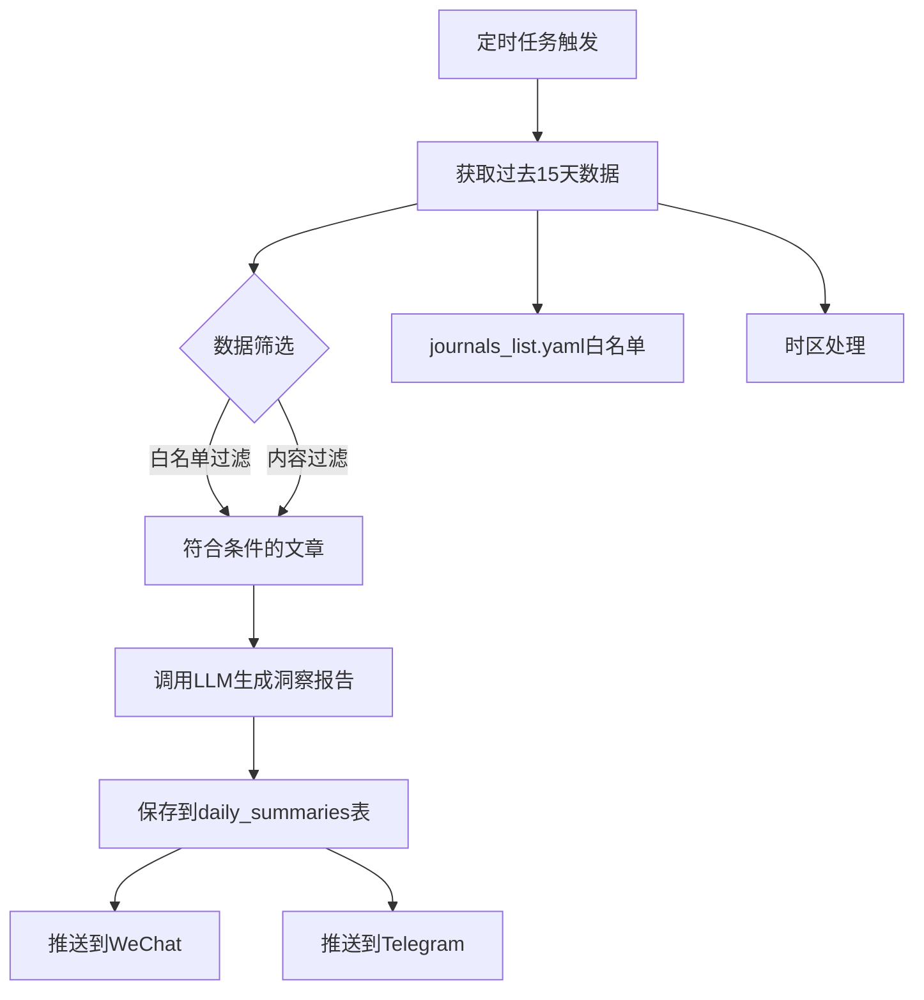

# 洞察功能开发计划

## 功能概述

开发一个新的"洞察"功能，每15天运行一次，汇总过去15天内通过过滤的文章，调用大模型生成研究趋势洞察报告。

## 需求分析

### 核心需求
1. **定时运行**：默认15天周期，凌晨1点运行（不包含当天数据，即从昨天开始往前推15天）
2. **数据提取条件**：
   - `created_at` 过去15天（注意时区，从昨天开始往前推15天，不含今天）
   - `filter_status = 'passed'`
   - `rss_source_id` 或 `journal_id` 对应的名称在白名单中（journals_list.yaml）
   - `markdown_content` 或 `content` 有值，且不是 `<正>~` 或 `. <br/>` 或仅包含空白
3. **数据提取**：id, title, markdown_content/content（优先级），上限60条
4. **生成报告**：调用大模型，**summary_type = 'insights'**（新增独立类型），存入 daily_summaries 表
5. **推送支持**：推送到 WeChat 和 Telegram（页面按需启用）

### 复用现有逻辑
- 复用 `daily_summary` 的 LLM 调用逻辑
- 复用 `generateJournalAllSummary` 的数据库保存逻辑
- 复用现有的推送系统（Telegram + WeChat）
- 复用现有的定时调度框架

---

## 详细开发计划

### 1. 配置层

#### 1.1 添加任务类型 `insights`
- 文件：`config/types.yaml`
- 在 `task_types` 中添加：
```yaml
insights:
  code: "insights"
  label: "洞察总结"
  label_en: "Insights"
  description: "每15天汇总通过的文章，生成研究趋势洞察报告"
  priority: 7
  enabled: true
```

#### 1.2 添加推送类型常量
- 文件：`src/constants/push-types.ts`
- 添加：
```typescript
export type PushType = 'daily_summary' | 'journal_all' | 'new_articles' | 'insights';
export const PUSH_TYPES = {
  // ... existing
  INSIGHTS: 'insights' as const,
};
export const PUSH_TYPE_LABELS: Record<PushType, string> = {
  // ... existing
  insights: '洞察总结（15天周期）',
};
```

#### 1.3 添加系统提示词变量
- 文件：`src/config/system-prompt-variables.ts`
- 在 `PROMPT_VARIABLES` 中添加 `insights` 类型：
```typescript
insights: {
  ARTICLES_LIST: { description: '文章列表', required: true },
  DATE_RANGE: { description: '日期范围', required: true },
  SUMMARY_GUIDE: { description: '总结指南', required: false },
}
```

#### 1.4 创建默认提示词模板
- 文件：`src/config/default-prompts/insights.md`
- 内容要点：
  - 按照洞察研究趋势
  - 给出研究选题建议
  - 同一类文章放在一起分组总结
  - 每组：一段总结 + 选题建议 + 文章列表（id+题名）

### 2. 核心逻辑

#### 2.1 添加数据查询函数
- 文件：`src/api/daily-summary.ts`
- 新增函数：
```typescript
/**
 * 获取过去N天内通过的文章（用于洞察）
 * - created_at 过去15天
 * - filter_status = 'passed'
 * - rss_source_id 或 journal_id 对应的名称在白名单中
 * - markdown_content 或 content 有值（且不是特定值）
 */
export async function getInsightsArticles(
  userId: number,
  days: number = 15,
  limit: number = 60
): Promise<DailySummaryArticle[]>
```

#### 2.2 添加洞察报告生成函数
- 文件：`src/api/daily-summary.ts`
- 新增函数：
```typescript
/**
 * 生成洞察报告
 * - 调用 getInsightsArticles 获取数据
 * - 调用大模型生成报告
 * - 保存到数据库（summary_type = 'insights'）
 * - 推送到 WeChat/Telegram
 */
export async function generateInsightsSummary(
  input: { userId: number; days?: number }
): Promise<DailySummaryResult>
```

### 3. 定时调度

#### 3.1 更新调度器配置
- 文件：`src/daily-summary-scheduler.ts`
- 新增配置：
```typescript
export interface InsightsSchedulerConfig {
  enabled: boolean;
  schedule: string;  // 默认: "0 1 */15 * *"
  days: number;     // 默认: 15
  userId: number;
}
```

#### 3.2 更新主配置
- 文件：`src/config.ts`
- 添加：
```typescript
insightsEnabled: boolean;
insightsSchedule: string;
insightsDays: number;
insightsUserId: number;
```

#### 3.3 添加环境变量
- `.env` 示例：
```
INSIGHTS_ENABLED=true
INSIGHTS_SCHEDULE=0 1 */15 * *
INSIGHTS_DAYS=15
INSIGHTS_USER_ID=1
```

### 4. 推送支持

#### 4.1 WeChat 推送
- 文件：`src/wechat/index.ts`
- 添加 `sendInsightsSummary` 方法
- 复用现有推送逻辑

- 文件：`src/config/wechat-config.ts`
- 添加 `insights` 到 `WeChatPushTypes`

#### 4.2 Telegram 推送
- 文件：`src/telegram/index.ts`
- 添加 `sendInsightsSummary` 方法

- 文件：`src/api/telegram-chats.ts`
- 添加 `insights` 字段到表结构和查询函数

### 5. 数据库

#### 5.1 检查现有表结构
- `daily_summaries.summary_type` 已支持 `'search'` 类型
- 无需修改表结构

#### 5.2 迁移脚本（如需要）
- 可能需要为 telegram_chats 添加 insights 字段
- 可能需要为 wechat.yaml 添加 insights 推送类型

---

## 代码复用策略

| 功能模块 | 复用方式 |
|---------|---------|
| LLM 调用 | 直接调用 `getUserLLMProvider(userId, 'insights')` |
| 系统提示词 | 使用 `resolveSystemPrompt(userId, 'insights', ...)` |
| 数据保存 | 复用 `saveDailySummary({ ..., type: 'search' })` |
| WeChat 推送 | 复用 `WeChatNotifier` 框架 |
| Telegram 推送 | 复用 `TelegramNotifier` 框架 |
| 定时调度 | 复用 `DailySummaryScheduler` 模式 |
| 时区处理 | 复用 `buildUtcRangeFromLocalDate` |

---

## 文件修改清单

| 序号 | 文件路径 | 修改类型 |
|-----|---------|---------|
| 0 | src/utils/journals-whitelist.ts | 新增（加载白名单） |
| 1 | config/types.yaml | 新增任务类型 |
| 2 | src/constants/push-types.ts | 新增推送类型 |
| 3 | src/config/system-prompt-variables.ts | 新增变量定义 |
| 4 | src/config/default-prompts/insights.md | 新增文件 |
| 5 | src/api/daily-summary.ts | 新增函数 + 更新 SummaryType |
| 6 | src/db.ts | 更新 SummaryType 类型 |
| 7 | src/insights-scheduler.ts | 新增（独立调度器） |
| 8 | src/config.ts | 新增配置项 |
| 9 | src/config/wechat-config.ts | 支持新推送类型 |
| 10 | src/api/telegram-chats.ts | 支持新推送类型 |
| 11 | src/telegram/index.ts | 新增推送方法 |
| 12 | src/wechat/index.ts | 新增推送方法 |
| 13 | .env.example | 新增环境变量 |

---

## 架构图



---

## 注意事项

### 已识别问题及解决方案

#### 1. journals_list.yaml 白名单加载（重要）
- **问题**：当前后端代码（Node.js）没有读取 journals_list.yaml 的逻辑，该文件仅被 Python 脚本使用
- **解决方案**：新增 `src/utils/journals-whitelist.ts`
  ```typescript
  import fs from 'fs';
  import path from 'path';
  
  let cachedWhitelist: string[] | null = null;
  
  export function getJournalsWhitelist(): string[] {
    if (cachedWhitelist) return cachedWhitelist;
    const configPath = path.join(process.cwd(), 'config', 'journals_list.yaml');
    const content = fs.readFileSync(configPath, 'utf-8');
    // 解析 YAML 列表（简单处理：按行分割，去除空行和注释）
    cachedWhitelist = content
      .split('\n')
      .map(line => line.trim())
      .filter(line => line && !line.startsWith('#'));
    return cachedWhitelist;
  }
  ```

#### 2. summary_type 类型冲突（重要）
- **问题**：使用 'search' 会与用户手动搜索生成的总结冲突
- **解决方案**：使用新类型 `'insights'`，需要更新：
  - `src/api/daily-summary.ts` 的 `SummaryType` 添加 `'insights'`
  - `src/db.ts` 的 `DailySummariesTable.summary_type` 类型添加 `'insights'`

#### 3. 日期范围查询差异（重要）
- **问题**：现有 `getDailyPassedArticles` 按单日查询，洞察需要 15 天范围
- **解决方案**：新增专门的查询函数 `getInsightsArticles`，使用自定义日期范围计算：
  ```typescript
  // 计算过去N天的日期范围（不含今天）
  const startDate = new Date();
  startDate.setDate(startDate.getDate() - days);
  startDate.setHours(0, 0, 0, 0);
  const endDate = new Date();  // 今天
  endDate.setHours(0, 0, 0, 0);  // 不包含今天的数据
  ```

#### 4. 内容过滤逻辑（重要）
- **问题**：需要在 SQL 查询中过滤无意义内容
- **解决方案**：在查询条件中添加：
  ```typescript
  .where((eb) => eb.and([
    eb.or([
      eb('articles.markdown_content', 'is not', null),
      eb('articles.content', 'is not', null),
    ]),
    eb('articles.markdown_content', 'not like', '%<正>%'),
    eb('articles.content', 'not like', '%<正>%'),
  ]))
  ```

#### 5. 白名单匹配逻辑
- **问题**：需要在查询时 JOIN rss_sources 或 journals 表，并匹配 name 字段
- **解决方案**：在 getInsightsArticles 中添加：
  ```typescript
  .where((eb) => eb.or([
    eb('rss_sources.name', 'in', whitelist),
    eb('journals.name', 'in', whitelist),
  ]))
  ```

#### 6. 时区处理边界
- **问题**：需要确保"不包含当天数据"，且时区转换正确
- **解决方案**：使用用户时区，计算日期范围时 endDate 设为当天 00:00:00（不包含当天）

#### 7. types.yaml 配置说明
- **说明**：config/types.yaml 中的 task_types 仅用于文档和前端展示，代码中已实现的功能实际不依赖此配置
- **建议**：可以添加 insights 类型以保持配置一致性，但不影响实际功能

#### 8. 调度器扩展方式
- **方案 A**：扩展现有 `DailySummaryScheduler`，在 types 数组中添加 'insights'
- **方案 B**：创建新的 `InsightsScheduler` 实例（推荐，职责分离）
- **推荐**：方案 B，创建独立调度器

#### 9. 系统提示词变量
- **说明**：insights 类型的变量可复用 `daily_summary` 的 ARTICLES_LIST 和 DATE_RANGE
- **建议**：在 `system-prompt-variables.ts` 中添加 SUMMARY_GUIDE 变量即可
