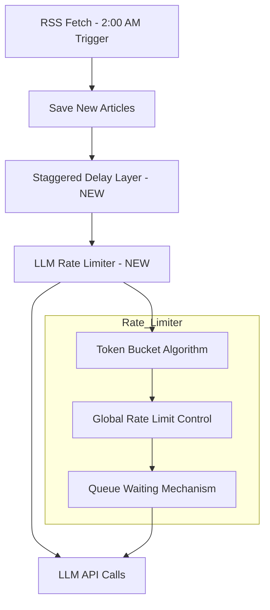

# LLM API  calls Rate Limiting Design

## 1. Background

### Current Problem
- All RSS sources are fetched at the same time (2:00 AM daily via `RSS_FETCH_SCHEDULE=0 2 * * *`)
- After fetching, LLM is immediately called for filtering and translation
- Multiple sources with new articles create concentrated LLM API call pressure
- May trigger API rate limits or cause service degradation

### Current Architecture
```
RSS Fetch (2:00 AM)
    down
Save New Articles
    down
triggerAutoFilter() [Background, Non-blocking]
    down
filterArticle() [LLM API Call]
    down
processArticle() [Translation + Vectorization, More LLM Calls]
```

## 2. Solution: LLM Rate Limiting + Staggered Delay

### Why This is Best Practice
1. **Minimal Changes**: Only add rate limiting logic at LLM call layer, no changes to existing scheduling architecture
2. **Good Scalability**: Rate limit parameters can be dynamically adjusted via environment variables
3. **Industry Standard**: OpenAI, Anthropic, etc. all recommend using rate limiting to control API calls
4. **Backward Compatible**: Does not affect existing features, can be progressively enabled

### Architecture Diagram



## 3. Implementation Plan

### 3.1 Add Configuration Items

Add in `.env`:
```bash
# LLM Rate Limiting Configuration
LLM_RATE_LIMIT_ENABLED=true
# Maximum LLM calls per minute
LLM_RATE_LIMIT_PER_MINUTE=10
# Burst capacity (allows short-term excess)
LLM_RATE_LIMIT_BURST=5
# Staggered delay maximum value (minutes)
STAGGER_DELAY_MAX_MINUTES=30
```

### 3.2 Implement Rate Limiter

Create new file `src/rate-limiter.ts`:

```typescript
/**
 * LLM Rate Limiter
 * 
 * Uses Token Bucket algorithm to control LLM API call rate.
 * Supports:
 * - Global rate limiting
 * - Burst handling
 * - Automatic queue waiting
 */

export class LLMRateLimiter {
  private static instance: LLMRateLimiter | null = null;
  
  private tokens: number;
  private maxTokens: number;
  private refillRate: number; // tokens per second
  private lastRefill: number;
  private queue: Array<() => void> = [];
  
  private constructor(config: RateLimiterConfig) {
    this.maxTokens = config.burstSize;
    this.tokens = config.burstSize;
    this.refillRate = config.ratePerMinute / 60;
    this.lastRefill = Date.now();
  }
  
  /**
   * Acquire a token, wait if necessary
   */
  async acquire(): Promise<void> {
    this.refillTokens();
    
    if (this.tokens >= 1) {
      this.tokens--;
      return;
    }
    
    // Need to wait
    return new Promise((resolve) => {
      this.queue.push(resolve);
    });
  }
  
  private refillTokens(): void {
    const now = Date.now();
    const elapsed = (now - this.lastRefill) / 1000;
    const tokensToAdd = elapsed * this.refillRate;
    
    this.tokens = Math.min(this.maxTokens, this.tokens + tokensToAdd);
    this.lastRefill = now;
    
    // Process queue
    while (this.queue.length > 0 && this.tokens >= 1) {
      this.tokens--;
      const resolve = this.queue.shift()!;
      resolve();
    }
  }
}
```

### 3.3 Modify LLM Call Layer

Modify `src/llm.ts`, add rate limiting in `chat()` method:

```typescript
async chat(messages: ChatMessage[], options?: ChatOptions): Promise<string> {
  // Apply rate limiting
  if (rateLimiterEnabled) {
    await llmRateLimiter.acquire();
  }
  
  // Existing API call logic...
}
```

### 3.4 Add Staggered Delay

Modify `src/rss-scheduler.ts` `triggerAutoFilter()` method:

```typescript
private async triggerAutoFilter(
  userId: number,
  articleIds: number[],
  items: RSSFeedItem[]
): Promise<void> {
  // Add random stagger delay
  const staggerDelay = Math.random() * staggerDelayMaxMs;
  await sleep(staggerDelay);
  
  // Existing filter logic...
}
```

## 4. Configuration Parameter Description

| Parameter | Default | Description |
|-----------|---------|-------------|
| `LLM_RATE_LIMIT_ENABLED` | `true` | Enable rate limiting |
| `LLM_RATE_LIMIT_PER_MINUTE` | `10` | Maximum LLM calls per minute |
| `LLM_RATE_LIMIT_BURST` | `5` | Burst capacity, allows short-term excess |
| `STAGGER_DELAY_MAX_MINUTES` | `30` | Maximum random delay (minutes) |

## 5. Expected Effects

### Before
```
2:00 AM - All sources start fetching
2:05 AM - 50 articles, 50 concurrent LLM calls
         - API pressure peak
         - Possible rate limit errors
```

### After
```
2:00 AM - All sources start fetching
2:05 AM - Articles distributed over 30 minutes
         - Rate limiter controls to 10 calls/minute
         - Smooth API call curve
         - No rate limit errors
```

## 6. Impact on Manual Operations

### Random Delay - No Impact on Manual Operations

Random delay is only added in `triggerAutoFilter()` (automatic post-fetch background processing).

Manual "Process" button calls `processArticle()` directly, bypassing the random delay.

### LLM Rate Limiting - Affects All LLM Calls

Rate limiting in `llm.ts chat()` affects all LLM calls including:
- Automatic post-fetch filter/translate
- Manual "Process" button
- Batch process

**This is expected behavior** to protect API from overload.

### Optimized Strategy: Differentiate Auto/Manual Scenarios

```typescript
// In llm.ts chat() method
async chat(messages: ChatMessage[], options?: ChatOptions): Promise<string> {
  // Skip rate limiting for manual operations (optional)
  const skipRateLimit = options?.skipRateLimit ?? false;
  
  if (rateLimiterEnabled && !skipRateLimit) {
    await llmRateLimiter.acquire();
  }
  
  // Existing API call logic...
}
```

Configuration:
```bash
# Skip rate limiting for manual operations (faster response)
LLM_RATE_LIMIT_SKIP_MANUAL=false
```

## 7. Implementation Steps

1. [ ] Create `src/rate-limiter.ts` - Token bucket rate limiter
2. [ ] Modify `src/llm.ts` - Add rate limiting in chat method
3. [ ] Modify `src/rss-scheduler.ts` - Add staggered delay
4. [ ] Update `.env.example` - Add new configuration items
5. [ ] Update `src/config.ts` - Add configuration parsing
6. [ ] Add unit tests

## 7. Risk Assessment

| Risk | Impact | Mitigation |
|------|--------|------------|
| Increased processing time | Medium | Reasonable parameter configuration, can be adjusted dynamically |
| Queue overflow | Low | Add queue size limit and alert mechanism |
| Rate limiter failure | Low | Add fallback mechanism, allow direct call on failure |

## 8. Monitoring and Observability

Recommended to add the following logging:
- Rate limiter wait time
- Current queue length
- Token consumption rate
- API call success/failure rate

```typescript
log.info({
  queueLength: this.queue.length,
  tokens: this.tokens,
  waitTime: avgWaitTime
}, 'Rate limiter status');