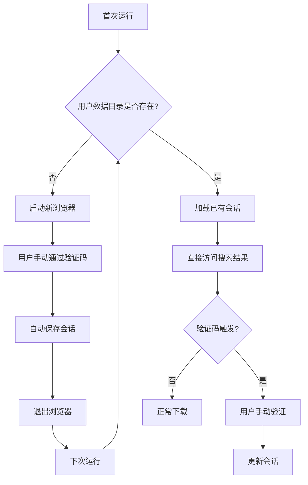

# CNKI PDF 下载验证码解决方案

## 问题分析

### 当前问题
- CNKI 网站在搜索结果页面会触发验证码
- 打开首页和输入检索词正常，但检索结果新页面会触发验证码
- Camoufox 虽然有反检测能力，但仍被 CNKI 识别

### 根本原因
CNKI 通过以下方式检测自动化工具：
1. **浏览器指纹** - WebGL、Canvas、字体等特征
2. **行为分析** - 鼠标移动模式、键盘输入节奏
3. **IP 风险评估** - 同一 IP 的频繁请求
4. **Cookie/Session** - 缺少登录态或历史访问记录

---

## 解决方案

### 方案1：会话保存和复用（推荐）

**核心思路**：利用 Camoufox 的持久化用户数据目录功能，保存已验证的浏览器环境。

#### 实现步骤



#### 关键技术点

1. **Camoufox 持久化配置**
   ```python
   # 使用 user_data_dir 参数
   with Camoufox(
       headless=False,
       user_data_dir="./cnki_user_data",  # 持久化目录
       geoip=True,
       humanize=True,
   ) as browser:
       # 浏览器配置...
   ```

2. **会话保存触发时机**
   - 脚本启动时检查用户数据目录
   - 检测到验证码页面时，提示用户手动验证
   - 验证成功后自动保存会话状态

3. **会话过期处理**
   - 设置会话有效期
   - 过期后提示用户重新验证

#### 优点
- ✅ 保留 Camoufox 的反检测能力
- ✅ 用户只需首次手动验证
- ✅ 会话可跨次使用
- ✅ 无需额外依赖

#### 缺点
- ⚠️ 需要用户首次配合验证
- ⚠️ 会话可能过期
- ⚠️ 不同机器的会话不通用

---

### 方案2：使用系统真实浏览器

**核心思路**：直接调用用户系统上已登录的 Chrome/Edge 浏览器。

#### 实现步骤

1. **启动带调试端口的浏览器**
   ```bash
   # Chrome
   "C:\Program Files\Google\Chrome\Application\chrome.exe" --remote-debugging-port=9222 --user-data-dir="C:\temp\cnki_profile"
   
   # Edge
   "C:\Program Files (x86)\Microsoft\Edge\Application\msedge.exe" --remote-debugging-port=9222 --user-data-dir="C:\temp\cnki_profile"
   ```

2. **Playwright 连接已有浏览器**
   ```python
   from playwright.sync_api import sync_playwright
   
   with sync_playwright() as p:
       browser = p.chromium.connect_over_cdp("http://localhost:9222")
       # 继续操作...
   ```

#### 优点
- ✅ 完全使用真实浏览器环境
- ✅ 绕过大部分自动化检测
- ✅ 无需再次登录（如果浏览器已保存凭据）

#### 缺点
- ⚠️ 需要手动启动浏览器
- ⚠️ Playwright 和 Camoufox 端口可能冲突
- ⚠️ Windows 系统浏览器路径不统一
- ⚠️ 连接不稳定，容易断连

---

## 推荐方案

### 首选方案1：会话保存和复用

理由：
1. **最小改动** - 只需修改 cnki_pdf_download.py 的浏览器初始化部分
2. **可靠性高** - Camoufox 本身就是为反检测设计的
3. **用户体验好** - 首次验证后即可长期使用
4. **可复用** - 同一目录可被多个脚本使用（cnki/wanfang/zhesheke）

### 实施计划

1. **修改 cnki_pdf_download.py**
   - 添加用户数据目录配置
   - 实现会话检测和保存逻辑
   - 添加验证码检测和用户提示

2. **创建会话管理模块**
   - 参考 session_manager.py 设计
   - 支持导出/导入功能

3. **更新其他下载脚本**
   - wanfang_pdf_download.py
   - zhesheke_pdf_download.py

---

## 代码修改要点

### 修改 cnki_pdf_download.py

```python
# 添加用户数据目录
USER_DATA_DIR = Path(__file__).parent / "cnki_user_data"

def cnki_download(keyword: str, reuse_session: bool = True):
    """从 CNKI 检索并下载 PDF"""
    
    # 确定是否使用持久化上下文
    if reuse_session and USER_DATA_DIR.exists():
        # 使用已有会话
        user_data = str(USER_DATA_DIR)
    else:
        # 新建会话
        user_data = None
    
    with Camoufox(
        headless=False,
        geoip=True,
        humanize=True,
        user_data_dir=user_data,  # 关键参数
    ) as browser:
        # 原有逻辑...
        
        # 添加验证码检测
        if is_captcha_page(page):
            print("⚠️ 检测到验证码，请手动完成验证...")
            input("验证完成后按回车继续...")
            # 保存会话
            USER_DATA_DIR.mkdir(parents=True, exist_ok=True)
```

---

## 总结

| 方案 | 改动量 | 可靠性 | 用户体验 | 推荐度 |
|------|--------|--------|----------|--------|
| 方案1：会话复用 | 中 | 高 | 好 | ⭐⭐⭐⭐⭐ |
| 方案2：系统浏览器 | 大 | 中 | 差 | ⭐⭐⭐ |

**建议先实施方案1**，它利用了现有的 Camoufox 能力，改动最小且效果显著。
