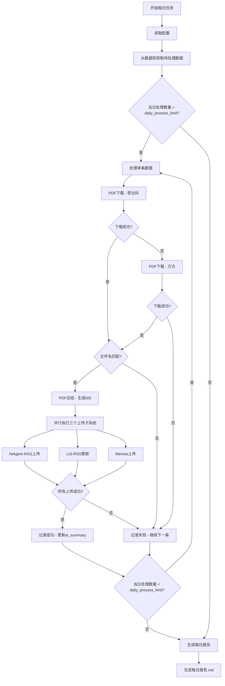

# 论文PDF摘要工作流 - 实施计划

## 1. 系统架构概览



## 2. 配置文件结构

### config/config.yaml
```yaml
# 数据库配置
database:
  path: "F:/Github/lis-rss-daily/data/rss-tracker.db"  # SQLite数据库路径

# 每日处理限制
daily_process_limit: 5

# 文件存储配置
storage:
  # PDF和MD文件下载保存根目录
  download_root: "download"
  # 每日日志文件保存根目录
  logs_root: "logs"

# PDF下载配置
pdf_download:
  # 下载脚本优先级顺序
  priority_scripts:
    - "pdf-download/zhesheke_pdf_download.py"
    - "pdf-download/wanfang_pdf_download.py"
  # 每个脚本最大重试次数
  max_retries: 1
  # PDF文件名匹配验证：允许的误差字符数
  match_threshold: 0

# 数据源配置
data_sources:
  # 期刊名称列表配置文件
  journals_list: "config/journals_list.yaml"
```

## 3. 模块设计

### 3.1 工具模块 utils/

#### utils/__init__.py
- 模块初始化文件

#### utils/keyword_normalizer.py
- **功能**：将标题/文件名标准化，用于匹配验证
- **函数**：
  - `normalize_text(text: str) -> str`：移除所有空格、标点符号、特殊字符
  - `calculate_similarity(text1: str, text2: str) -> float`：计算两个文本的相似度
  - `is_match(title: str, filename: str, threshold: float = 0) -> bool`：判断是否匹配

#### utils/database.py
- **功能**：数据库操作封装
- **函数**：
  - `get_connection() -> sqlite3.Connection`：获取数据库连接
  - `load_journals_list(config_path: str) -> List[str]`：加载期刊白名单
  - `fetch_pending_articles(limit: int, db_path: str, journals: List[str]) -> List[dict]`：获取待处理数据
  - `get_source_name(article: dict, conn) -> str`：获取来源名称（rss_source或journal）
  - `update_ai_summary(article_id: int, summary: str, db_path: str) -> bool`：更新ai_summary字段

#### utils/pdf_downloader.py
- **功能**：PDF下载调度器，按优先级调用下载脚本
- **函数**：
  - `download_pdf(title: str, output_dir: str, config: dict) -> Optional[str]`：下载PDF主函数
  - `_call_download_script(script_path: str, keyword: str, output_dir: str) -> Optional[str]`：调用下载脚本
  - `get_download_scripts_priority() -> List[str]`：获取下载脚本优先级列表

#### utils/pdf_validator.py
- **功能**：验证下载的PDF是否与检索条件匹配
- **函数**：
  - `validate_pdf(pdf_path: str, original_title: str, threshold: int = 0) -> Tuple[bool, str]`：验证PDF
  - `extract_filename_info(filename: str) -> str`：从文件名提取关键信息
  - `delete_pdf(pdf_path: str) -> bool`：删除不匹配的PDF

#### utils/summary_uploader.py
- **功能**：并行上传MD到三个子系统
- **函数**：
  - `async upload_all(md_path: str, article_id: int, article_info: dict) -> Dict[str, bool]`：并行上传
  - `async upload_to_hiagent(md_path: str) -> bool`：上传到HiAgent RAG
  - `upload_to_lis_rss(article_id: int, md_content: str) -> bool`：更新LIS-RSS
  - `upload_to_memos(title: str, md_content: str) -> bool`：创建Memos

#### utils/logger.py
- **功能**：生成每日处理报告
- **函数**：
  - `init_daily_log(date: str, logs_root: str) -> Path`：初始化当日日志
  - `log_success(article_info: dict)`：记录成功处理
  - `log_failure(article_info: dict, reason: str)`：记录失败处理
  - `generate_daily_report(date: str, logs_root: str)`：生成最终报告

### 3.2 主入口 main.py

```python
def main():
    """主入口函数"""
    # 1. 加载配置
    config = load_config()
    
    # 2. 获取当日日期
    today = datetime.now().strftime("%Y-%m-%d")
    
    # 3. 创建当日工作目录
    daily_dir = create_daily_directory(config, today)
    
    # 4. 加载期刊白名单
    journals = load_journals_list(config)
    
    # 5. 连接数据库获取待处理数据
    articles = fetch_pending_articles(
        limit=config['daily_process_limit'],
        db_path=config['database']['path'],
        journals=journals
    )
    
    # 6. 初始化日志
    log_file = init_daily_log(today, config['storage']['logs_root'])
    
    # 7. 逐条处理数据
    success_count = 0
    failure_count = 0
    
    for article in articles:
        result = process_article(article, config, daily_dir)
        if result['success']:
            success_count += 1
            log_success(article, log_file)
        else:
            failure_count += 1
            log_failure(article, result['reason'], log_file)
    
    # 8. 生成每日报告
    generate_daily_report(today, success_count, failure_count, log_file)
```

## 4. 数据处理流程

### 4.1 数据获取条件（优先级顺序）

**必备条件**：
1. `ai_summary` IS NULL 或 `ai_summary` = ''
2. `rss_source_id` 在 rss_sources 表的 name 字段匹配 journals_list.yaml
   或者 `journal_id` 在 journals 表的 name 字段匹配 journals_list.yaml

**优先级排序**：
1. `filter_status` = 'passed' AND `is_read` = 0 （最高优先级）
2. `filter_status` = 'passed' OR `is_read` = 0
3. 其他（当优先数据量不足时补充）

### 4.2 PDF文件名匹配验证

```python
def validate_filename_match(title: str, pdf_filename: str) -> bool:
    """
    验证逻辑：
    1. 标题和文件名都进行标准化处理
    2. 移除所有空格、换行符、标点符号
    3. 进行完全匹配
    """
    normalized_title = normalize_text(title)
    normalized_filename = normalize_text(extract_filename(pdf_filename))
    
    return normalized_title == normalized_filename
```

## 5. 错误处理

| 错误类型 | 处理方式 | 是否继续处理下一条 |
|---------|---------|------------------|
| PDF下载失败（所有脚本） | 记录失败原因 | 是 |
| PDF文件名不匹配 | 删除PDF，记录原因 | 是 |
| PDF总结失败 | 记录失败原因 | 是 |
| 上传子系统失败 | 记录失败原因（但不阻塞其他子系统） | 是 |
| 数据库连接失败 | 终止当日任务 | 否 |

## 6. 文件结构

```
paper-pdf-summary/
├── config/
│   ├── config.yaml          # 主配置文件
│   └── journals_list.yaml   # 期刊白名单
├── utils/
│   ├── __init__.py
│   ├── keyword_normalizer.py    # 文本标准化工具
│   ├── database.py              # 数据库操作
│   ├── pdf_downloader.py        # PDF下载调度
│   ├── pdf_validator.py         # PDF验证
│   ├── summary_uploader.py      # 并行上传
│   └── logger.py                # 日志生成
├── pdf-download/
│   ├── zhesheke_pdf_download.py     # 哲社科下载
│   ├── wanfang_pdf_download.py      # 万方下载
│   └── keyword_processor.py         # 关键词处理
├── pdf-summary/
│   └── hiagent_upload.py        # PDF总结
├── summary-update/
│   ├── hiagent-rag-upload/     # HiAgent RAG上传
│   ├── lis-rss-summary-update/ # LIS-RSS更新
│   └── memos/                  # Memos上传
├── download/                   # PDF/MD下载目录
│   └── 2026-03-18/
│       ├── article_1.pdf
│       ├── article_1.md
│       └── ...
├── logs/                       # 每日日志
│   ├── 2026-03-18.md
│   └── ...
├── main.py                     # 主入口
└── .env                        # 环境变量
```

## 7. 实施步骤

1. **创建配置文件** config/config.yaml
2. **创建工具模块**
   - utils/keyword_normalizer.py
   - utils/database.py
   - utils/pdf_downloader.py
   - utils/pdf_validator.py
   - utils/summary_uploader.py
   - utils/logger.py
3. **创建主入口** main.py
4. **修改PDF下载脚本** - 移除硬编码路径，使用配置
5. **测试工作流**
