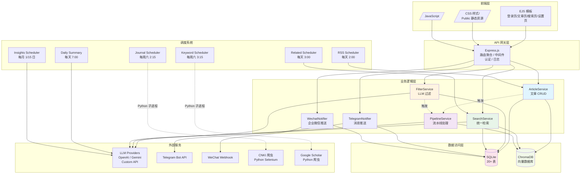
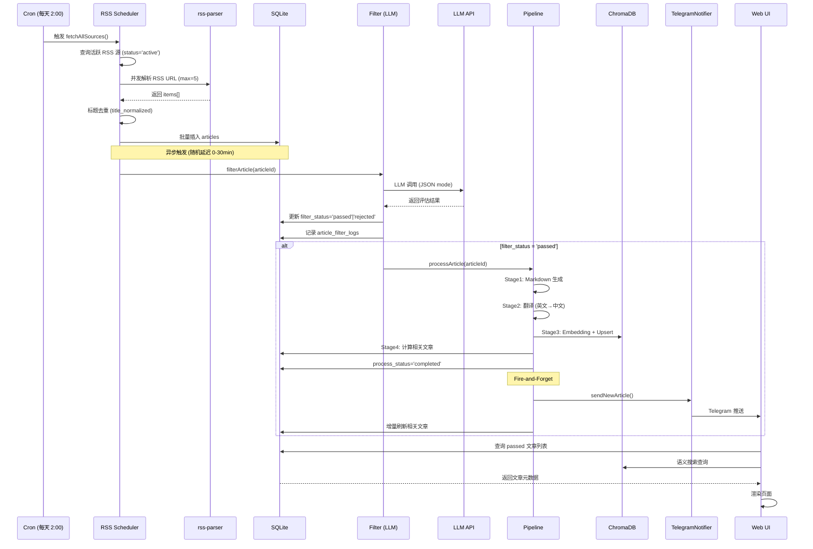
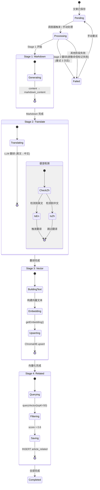
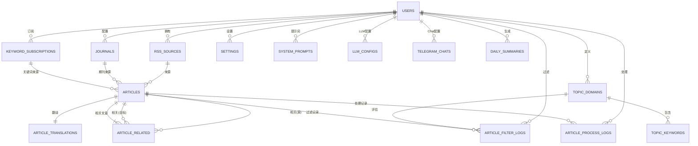
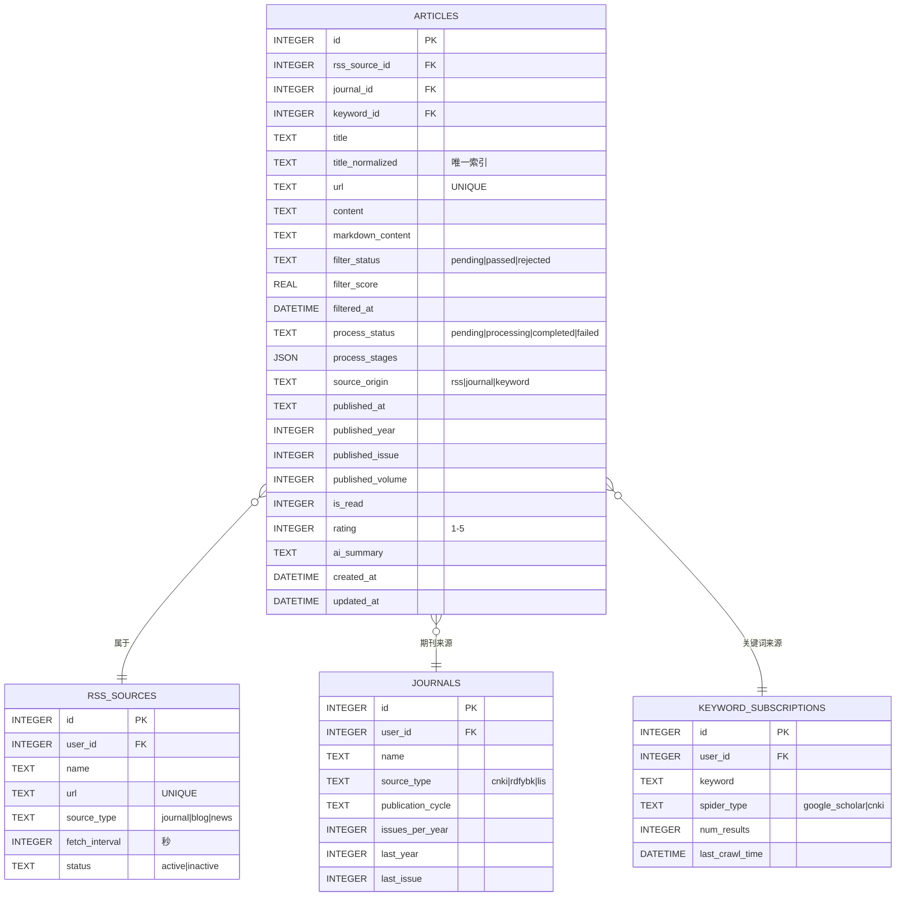
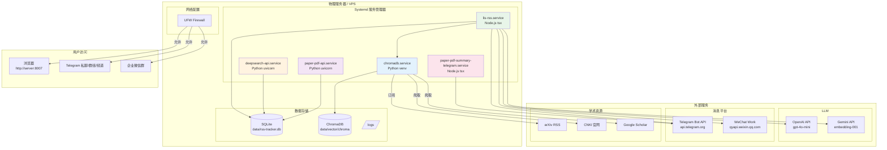
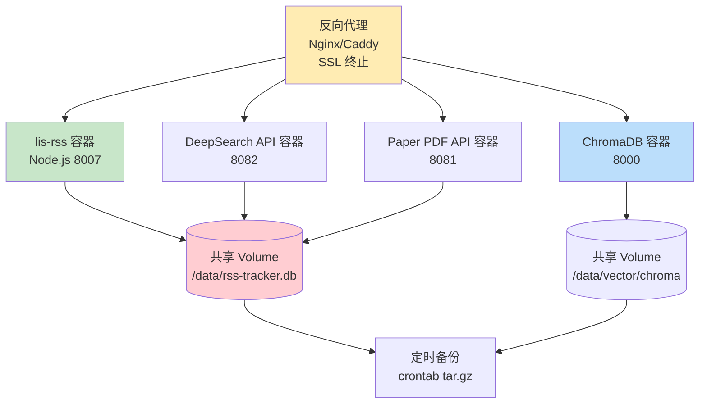
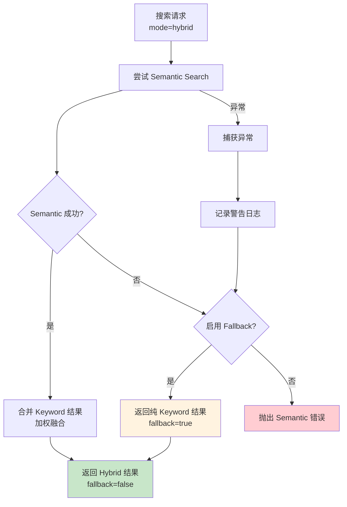
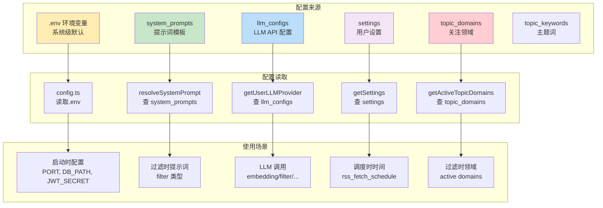
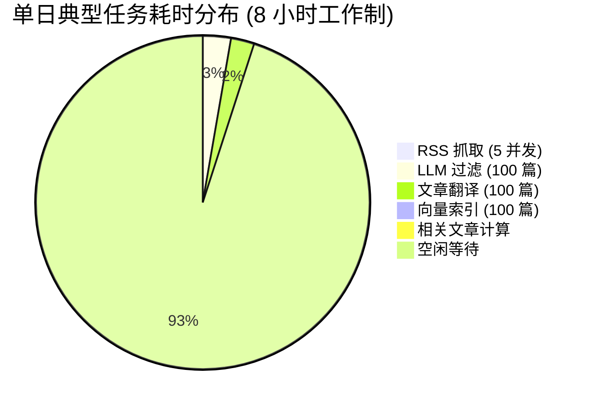

# LIS-RSS 系统架构图集

> 使用 Mermaid.js 绘制的系统架构图、数据流图、部署图  
> 可直接粘贴到支持 Mermaid 的 Markdown 编辑器（GitHub/GitLab/Notion/Obsidian）中渲染

---

## 目录

- [1. 系统总体架构](#1-系统总体架构)
- [2. 数据处理全链路](#2-数据处理全链路)
- [3. 文章处理流水线](#3-文章处理流水线)
- [4. 搜索系统架构](#4-搜索系统架构)
- [5. LLM 调用链](#5-llm-调用链)
- [6. 定时调度系统](#6-定时调度系统)
- [7. 数据库模型](#7-数据库模型)
- [8. 部署架构](#8-部署架构)
- [9. 故障转移机制](#9-故障转移机制)

---

## 1. 系统总体架构

### 1.1 分层架构图



---

## 2. 数据处理全链路

### 2.1 RSS 文章从抓取到展示



---

## 3. 文章处理流水线

### 3.1 四阶段渐进式处理



---

## 4. 搜索系统架构

### 4.1 四种搜索模式

```mermaid
graph TD
    Q[用户查询] --> SR{SearchService<br/>search()}
    
    SR -->|mode=semantic| SS[Semantic Search<br/>向量相似度]
    SR -->|mode=keyword| KS[Keyword Search<br/>SQL LIKE]
    SR -->|mode=hybrid| HS[Hybrid Search<br/>加权融合]
    SR -->|mode=related| RS[Related Articles<br/>基于文章相似]
    
    SS --> E1[getEmbedding<br/>query → vector]
    E1 --> C1[ChromaDB query<br/>topK=100]
    C1 --> R1[Rerank (可选)]
    R1 --> E1M[Enrich Metadata<br/>JOIN articles]
    
    KS --> KQ[SQL 查询<br/>title/content LIKE]
    KQ --> KE[Enrich Metadata]
    
    HS --> SM[Semantic 分支]
    HS --> KM[Keyword 分支]
    SM --> C2[ChromaDB]
    KM --> KQ2[SQL 查询]
    C2 --> MF[Score Fusion<br/>Weighted Sum<br/>0.7 × sem + 0.3 × kw]
    KQ2 --> MF
    MF --> HEM[Enrich Metadata]
    
    RS --> RA[获取源文章向量]
    RA --> RV[查询相似文章<br/>topK=50]
    RV --> RScore[Score 阈值<br/>>0.6 优先 5 篇<br/>否则最多 3 篇]
    RScore --> RC[读取 Cache (可选)]
    RC --> REnrich[Enrich Metadata]
    
    E1M --> OUT[SearchResults<br/>按 score 排序]
    KE --> OUT
    HEM --> OUT
    REnrich --> OUT
    
    style SS fill:#e3f2fd
    style KS fill:#e8f5e9
    style HS fill:#fff3e0
    style RS fill:#f3e5f5
```

---

### 4.2 语义搜索流程图

```mermaid
flowchart TD
    A[用户输入查询<br/>"deep learning libraries"] --> B[getEmbedding<br/>调用 Embedding API]
    B --> C[向量: [0.12, -0.04, ...]<br/>1536 维]
    C --> D[ChromaDB Query<br/>collection: articles_{userId}]
    D --> E[返回 Hits<br/>id, distance, document]
    E --> F[转换分数<br/>score = 1 - distance]
    F --> G{Rerank 配置?}
    
    G -->|是| H[Rerank API<br/>Cohere / BGE]
    H --> I[按 rerank_score 重排序]
    I --> J
    
    G -->|否| J[按原始 score 排序]
    
    J --> K[Filter: filter_status='passed']
    K --> L[Enrich Metadata<br/>JOIN articles + 来源表]
    L --> M[返回 SearchResult[]<br/>score, title, url, ...]
    
    style A fill:#f9f9f9
    style M fill:#e8f5e9
```

---

## 5. LLM 调用链

### 5.1 配置优先级与故障转移

```mermaid
graph LR
    UT[用户请求<br/>filterArticle(userId)] --> FGC{获取 LLM 配置<br/>getUserLLMProvider}
    
    FGC --> C1[优先级 1:<br/>task-specific config<br/>task_type='filter']
    FGC --> C2[优先级 2:<br/>default config<br/>is_default=1]
    FGC --> C3[优先级 3:<br/>env fallback<br/>OPENAI_API_KEY]
    
    C1 -->|成功| P1[创建 Provider<br/>OpenAI / Gemini]
    C1 -->|失败| C2
    
    C2 -->|成功| P2[创建 Provider]
    C2 -->|失败| C3
    
    C3 -->|成功| P3[Fallback Provider]
    C3 -->|失败| ERR[抛出异常<br/>"No LLM config"]
    
    P1 --> LLM[LLM 调用<br/>chat.completions.create]
    P2 --> LLM
    P3 --> LLM
    
    LLM -->|成功| RESP[解析 JSON 响应]
    LLM -->|失败| RETRY[指数退避重试<br/>5s / 10s / 20s]
    RETRY -->|3 次后仍失败| FALLBACK[标记失败<br/>文章 rejected]
    
    RESP --> DECISION[决策:<br/>passed? → filter_status]
    
    DECISION --> DB[(写入数据库<br/>article_filter_logs)]
    
    style C1 fill:#ffebee
    style C2 fill:#fff3e0
    style C3 fill:#e3f2fd
    style ERR fill:#ffcdd2
```

---

### 5.2 提示词变量替换流程

```mermaid
flowchart LR
    SYS[系统提示词模板<br/>从 system_prompts 表查询] --> RESOLVE[resolveSystemPrompt<br/>变量替换]
    
    RESOLVE --> V1[{{TOPIC_DOMAINS}}<br/>查询 topic_domains<br/>格式化为编号列表]
    RESOLVE --> V2[{{ARTICLE_TITLE}}<br/>文章标题]
    RESOLVE --> V3[{{ARTICLE_URL}}<br/>文章链接]
    RESOLVE --> V4[{{ARTICLE_DESCRIPTION}}<br/>文章摘要]
    RESOLVE --> V5[{{ARTICLE_CONTENT}}<br/>内容预览前 2000 字]
    
    V1 & V2 & V3 & V4 & V5 --> FINAL[最终 Prompt]
    
    FINAL --> CHAT[LLM Chat 调用<br/>temperature=0.3<br/>jsonMode=true]
    
    CHAT --> RESP[LLM 响应 JSON]
    RESP --> PARSE[parseLLMJSON<br/>容错解析]
    PARSE --> RESULT[FilterResult<br/>passed / domainMatches]
    
    style RESP fill:#f3e5f5
    style RESULT fill:#e8f5e9
```

---

## 6. 定时调度系统

### 6.1 六个调度器时间轴

```mermaid
gantt
    title LIS-RSS 六大调度器时间表（周一至周日）
    dateFormat HH:mm
    axisFormat %H:%M
    
    section RSS 相关
    RSS 定时抓取 :rss, 02:00, 1h
    相关文章刷新 :rel, 03:00, 1h
    
    section 期刊爬虫
    期刊爬取 (CNKI) :jou, sat 02:15, 2h
    
    section 关键词爬虫
    关键词爬取 (Scholar) :key, sat 03:15, 2h
    
    section 推送调度
    每日总结推送 :dls, 07:00, 30m
    洞察报告检查 :ins, 07:15, 1h
```

---

### 6.2 洞察调度器触发逻辑

```mermaid
flowchart TD
    START[每月 1/15 日 7:15] --> CHECK1{检查间隔天数<br/>last_success_at ?}
    CHECK1 -->|间隔 ≥ 10 天| CHECK2[执行生成]
    CHECK1 -->|间隔 < 10 天| SKIP[跳过本次]
    
    CHECK2 --> Q1[查询最近 15 天<br/>passed 文章]
    Q1 --> GROUP[按 topic_domains<br/>分组统计]
    GROUP --> LLM1[LLM 分析 1:<br/>各领域趋势]
    LLM1 --> LLM2[LLM 分析 2:<br/>热点主题聚类]
    LLM2 --> LLM3[LLM 分析 3:<br/>选题方向建议]
    LLM3 --> SAVE[保存到<br/>daily_summaries<br/>(type='insights')]
    SAVE --> PUSH[Telegram /<br/>WeChat 推送]
    PUSH --> UPDATE[更新 settings<br/>insights_last_success_at]
    
    SKIP --> END[结束]
    UPDATE --> END
    
    style CHECK1 fill:#fff3e0
    style CHECK2 fill:#e3f2fd
    style SAVE fill:#e8f5e9
    style PUSH fill:#f3e5f5
```

---

## 7. 数据库模型

### 7.1 E-R 图（核心表关系）



---

### 7.2 articles 表核心字段



---

## 8. 部署架构

### 8.1 Production 部署图



---

### 8.2 Docker 部署架构（可选）



---

## 9. 故障转移机制

### 9.1 LLM 故障转移流程图

```mermaid
flowchart TD
    A[调用 filterArticle<br/>需要 LLM] --> B[getUserLLMProvider<br/>按优先级查询]
    B --> C{找到配置?}
    
    C -->|是| D[创建 Provider<br/>OpenAI/Gemini]
    D --> E{测试连接}
    
    E -->|成功| F[使用此 Provider<br/>调用 LLM API]
    E -->|失败| G[标记为不可用<br/>继续下一个]
    
    G --> B
    
    C -->|否| H[读取环境变量<br/>OPENAI_API_KEY]
    H --> I{存在?}
    
    I -->|是| J[创建 Default Provider]
    J --> F
    
    I -->|否| K[抛出异常<br/>"No LLM available"]
    
    F --> L{调用成功?}
    L -->|是| M[返回结果]
    L -->|否| N{重试次数<br/>&lt; 3?}
    
    N -->|是| O[等待 exponential<br/>backoff]
    O --> F
    N -->|否| P[返回错误<br/>文章 rejected]
    
    style P fill:#ffcdd2
    style M fill:#c8e6c9
```

---

### 9.2 搜索服务降级策略



---

## 十、数据流图

### 10.1 文章生命周期状态机

```mermaid
stateDiagram-v2
    [*] --> Pending: RSS/期刊/关键词保存
    
    Pending --> Filtering: 触发过滤
    Filtering --> Passed: LLM 评估通过
    Filtering --> Rejected: LLM 评估未通过 / 黑名单
    
    Passed --> Processing: 触发流水线
    Processing --> Markdown_done: Stage 1 完成
    Markdown_done --> Translating: Stage 2
    Translating --> Translated: 翻译完成
    Translating --> Translated: 翻译失败(非致命)
    Translated --> Indexing: Stage 3
    Indexing --> Indexed: 向量化完成
    Indexing --> Indexed: 向量化失败(非致命)
    Indexed --> Computing_related: Stage 4
    Computing_related --> Completed: 相关文章计算完成
    Computing_related --> Completed: 相关文章计算失败(非致命)
    
    Completed --> [*]
    Rejected --> [*]
    
    Processing --> Failed: 严重错误
    Failed --> Pending: 手动重试
    
    state "状态字段" {
        filter_status: pending / passed / rejected
        process_status: pending / processing / completed / failed
        process_stages: {markdown, translate, vector, related}
    }
```

---

## 十一、配置优先级

### 11.1 环境变量与数据库配置



---

## 十二、性能指标

### 12.1 吞吐量参考



**实际测试数据**（v1.0）：
- RSS 抓取 50 篇：~3 分钟（5 并发）
- LLM 过滤 100 篇：~3 分钟（OpenAI GPT-4o-mini，~$0.06）
- 翻译 100 篇：~2.5 分钟（~$0.15）
- 向量索引 100 篇：~1 分钟（Embedding API 批量）
- 相关文章计算 1000 篇：~5 分钟（增量刷新 10 篇/次）

---

## 总结

本图集涵盖了 LIS-RSS 系统的核心架构和数据流程，主要特点：

1. **清晰的分层设计**：前端 → API → 业务逻辑 → 数据访问 → 存储
2. **完整的数据流水线**：采集 → 过滤 → 处理 → 索引 → 搜索 → 推送
3. **健壮的调度系统**：6 个调度器错开执行时间，避免资源竞争
4. **智能的故障转移**：LLM 多配置链式 fallback，搜索自动降级
5. **多租户隔离**：所有数据按 user_id 隔离，向量 Collection 分片

---

**图纸版本**：基于 2026-05 代码版本  
**渲染工具**：Mermaid.js（支持 GitHub、GitLab、Obsidian、Notion 等）
